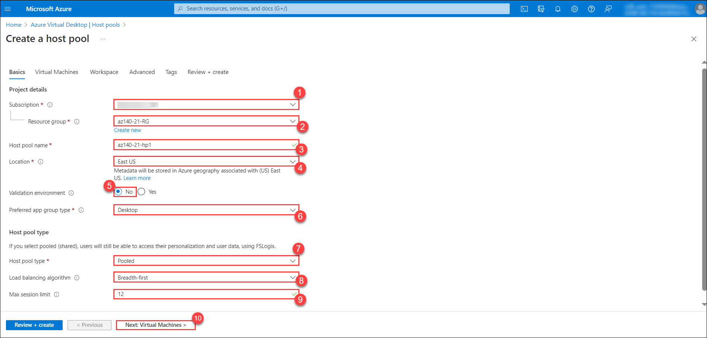
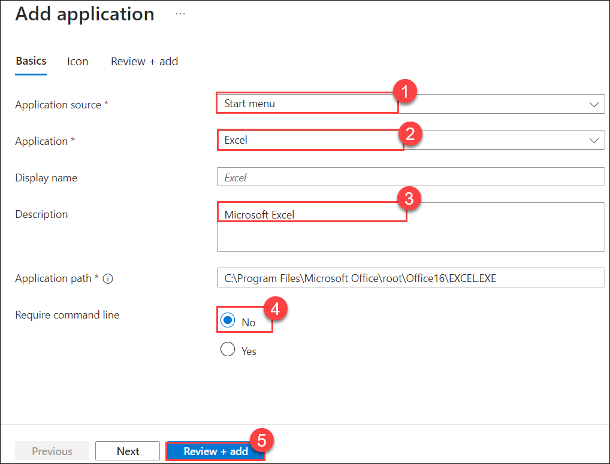

# Module 02 - Deploy host pools and session hosts by using the Azure portal(Microsoft Entra DS)

## Lab scenario

You need to create and configure host pools and session hosts in an Micrrosoft Entra DS (formerly AD DS) environment.

## Lab Objectives
  
After completing this lab, you will be able to:

- Implement an Azure Virtual Desktop environment in an Microsoft Entra DS domain
- Validate an Azure Virtual Desktop environment in an Microsoft Entra DS domain


## Estimated Timing: 60 minutes

## Architecture Diagram
  
  

## Exercise 1: Prerequisite - Setup Azure AD Connect
    
1. In the Azure portal, search for **Virtual machines (1)** and select **Virtual machines (2)** and, from the **Virtual machines** blade, select **az140-dc-vm11**.

   
   
2. On the **az140-dc-vm11** blade, select **Connect (1)**, and then select **Go to Bastion (2)**.

   

3. On the **az140-dc-vm11 | Bastion** tab, provide the following credentials and select **Connect (3)**:

   |Setting|Value|
   |---|---|
   |Username|**Student (1)**|
   |VM Password|**Pa55w.rd1234 (2)**|

   >**Note**: On clicking **Connect**, if you encounter an error **A popup blocker is preventing new window from opening. Please allow popups and retry**, then select the popup blocker icon at the top, select **Always allow pop-ups and redirects from https://portal.azure.com** and click on **Done**, and try connecting to the VM again.
  
   >**Note**: If you are prompted **See text and images copied to the clipboard**, select **Allow**. 

   

4. Once logged in, a logon task will start executing. When prompted **Do you want PowerShell to install and import the Nuget provider now?** enter **Y** and hit enter.

   >**Note**: Wait for the logon task to complete and present you with **Microsoft Azure Active Directory Connect** wizard. This should take about 10 minutes. If the **Microsoft Azure Active Directory Connect** wizard is not presented to you after the logon task completes, then launch it manually by double-clicking the **Azure AD Connect** icon on the desktop.


5. On the **Welcome to Azure AD Connect** page of the **Microsoft Azure Active Directory Connect** wizard, select the checkbox **I agree to the license terms and privacy notice (1)** and select **Continue (2)**.
   
   

6. On the **Express Settings** page of the **Microsoft Azure Active Directory Connect** wizard, select the **Customize** option.
   
   

7. On the **Install required components** page, leave all optional configuration options deselected and select **Install**.
 
   

8. On the **User sign-in** page, ensure that only the **Password Hash Synchronization (1)** is selected and click on **Next (2)**.
 
   

9. On the **Connect to Azure AD** page, authenticate by using the credentials of the **aadsyncuser** user account and select **Next (3)**. 

    >**Note**: Provide the userPrincipalName attribute of the **aadsyncuser (1)** account available in the **LabValues** text file present on desktop and specify the password **Pa55w.rd1234 (2)**.

   

10. On the **Connect your Directories** page, select the **Add Directory** button to the right of the **adatum.com** forest entry.
   
11. In the **AD forest account** window, ensure that the option to **Create new AD account (1)** is selected, specify the following credentials, and select **OK (4)**:

    |Setting|Value|
    |---|---|
    |User Name|**ADATUM\Student (2)**|
    |Password|**Pa55w.rd1234 (3)**|

      

12. Back on the **Connect your directories** page, ensure that the **adatum.com** entry appears as a configured directory and select **Next**.
   
13. On the **Azure AD sign-in configuration** page, note the warning stating **Users will not be able to sign in to Azure AD with on-premises credentials if the UPN suffix does not match a verified domain name**, enable the checkbox **Continue without matching all UPN suffixes to verified domain (1)**, and select **Next (2)**.

    >**Note**: This is expected since the Microsoft Entra ID tenant does not have a verified custom DNS domain matching one of the UPN suffixes of the **adatum.com** Microsoft Entra DS.

      

14. On the **Domain and OU filtering** page, select the option **Sync selected domains and OUs (1)**, expand the adatum.com node, clear all checkboxes, select only the checkbox next to the **ToSync (2)** OU, and select **Next (3)**.

      
   
15. On the **Uniquely identifying your users** page, accept the default settings, and select **Next**.
   
16. On the **Filter users and devices** page, accept the default settings, and select **Next**.
   
17. On the **Optional features** page, accept the default settings, and select **Next**.
   
18. On the **Ready to configure** page, ensure that the **Start the synchronization process when configuration completes** checkbox is selected and select **Install**.

    >**Note**: Installation should take about 2 minutes.

19. Review the information on the **Configuration complete** page and select **Exit** to close the **Microsoft Azure Active Directory Connect** window.

20. Within the Bastion session to **az140-dc-vm11**, double-click on the **Azure Portal** shortcut. If prompted, sign in by using the following Microsoft Entra ID credentials of the user account with the Owner role in the subscription you are using in this lab.

     * Email/Username: <inject key="AzureAdUserEmail"></inject>

     * Password: <inject key="AzureAdUserPassword"></inject>
   
21. In the Azure portal, use the **Search resources, services, and docs** text box at the top of the Azure portal page, search for **Microsoft Entra ID (1)** and select **Microsoft Entra ID (2)** blade. On the Microsoft Entra ID tenant blade, from the left navigation menu, under the **Manage** section, select **Users**.

      
   
22. On the **All users** blade, note that the list of user objects includes the listing of Microsoft Entra DS user accounts you created earlier in this lab, with the **Yes** entry appearing in the **On-premises sync enabled** column.

    >**Note**: You might have to wait a few minutes and refresh the browser page for the Microsoft Entra DS user accounts to appear. Proceed to the next exercise only if you are able to see the listing of Microsoft Entra DS user accounts you created. 

      

## Exercise 2: Implement an Azure Virtual Desktop environment in an Microsoft Entra DS domain
  
The main tasks for this exercise are as follows:

1. Prepare Microsoft Entra DS domain and the Azure subscription for the deployment of an Azure Virtual Desktop host pool

1. Deploy an Azure Virtual Desktop host pool

1. Manage the Azure Virtual Desktop host pool session hosts

1. Configure Azure Virtual Desktop application groups

1. Configure Azure Virtual Desktop workspaces

### Task 1: Prepare Microsoft Entra DS domain and the Azure subscription for deployment of an Azure Virtual Desktop host pool

1. Within the Bastion session to **az140-dc-vm11**, start **Windows PowerShell ISE** as administrator.
   
1. Within the Bastion session to **az140-dc-vm11**, from the **Administrator: Windows PowerShell ISE** console, run the following to create an organizational unit that will host the computer objects of the Azure Virtual Desktop hosts:

   ```powershell
   New-ADOrganizationalUnit 'WVDInfra' –path 'DC=adatum,DC=com' -ProtectedFromAccidentalDeletion $false
   ```

1. From the **Administrator: Windows PowerShell ISE** console, run the following to sign in to your Azure subscription:

   ```powershell
   Connect-AzAccount
   ```
   >**Note**: If you face an issue while connecting to the az account then run: `Connect-AzAccount -devicecode`

1. When prompted, provide the credentials of the user account with the Owner role in the subscription you are using in this lab.

    * Email/Username: <inject key="AzureAdUserEmail"></inject>

     * Password: <inject key="AzureAdUserPassword"></inject>

     >**Note:** On the **Windows Security Warning** pop-up, select **Yes**.
   
1. From the **Administrator: Windows PowerShell ISE** console, run the following to identify the user principal name of the **aduser1** account:

   ```powershell
   (Get-AzADUser -DisplayName 'aduser1').UserPrincipalName
   ```

   >**Note**: Record the user principal name you identified in this step. You will need it later in this lab.

1. From the **Administrator: Windows PowerShell ISE** console, run the following to register the **Microsoft.DesktopVirtualization** resource provider:

   ```powershell
   Register-AzResourceProvider -ProviderNamespace Microsoft.DesktopVirtualization
   ```

1. Within the Remote Desktop session to **az140-dc-vm11**, navigate back to the [Azure portal](https://portal.azure.com) tab. If prompted, sign in by using the Microsoft Entra ID credentials of the user account with the Owner role in the subscription you are using in this lab.

     * Email/Username: <inject key="AzureAdUserEmail"></inject>

     * Password: <inject key="AzureAdUserPassword"></inject>
   
1. Within the Remote Desktop session to **az140-dc-vm11**, in the **Azure portal**, use the **Search resources, services, and docs** text box at the top of the Azure portal page to search for **Virtual networks (1)** and select **Virtual networks (2)** and, on the **Virtual networks** blade, select **az140-adds-vnet11**.
   
1. On the **az140-adds-vnet11** blade, from the left navigation menu, under **Settings** section, select **Subnets (1)**, on the **Subnets** blade, select **+ Subnet (2)**, on the **Add subnet** blade, specify the following settings (leave all other settings with their default values) and click **Save (5)**:

   |Setting|Value|
   |---|---|
   |Name|**hp1-Subnet (3)**|
   |Subnet address range|**10.0.1.0/24 (4)**|

      

### Task 2: Deploy an Azure Virtual Desktop host pool

1. Within the Remote Desktop session to **az140-dc-vm11**, in the **Azure portal**, search for and select **Resource group**, Click on **+ Create** and enter the name of resource group as **az140-21-RG** and select the **Region** in which the lab was deployed, then select **Review + Create** and select **Create**.

2. In the Azure portal, search for **Azure Virtual Desktop (1)** and select **Azure Virtual Desktop (2)**, on the **Azure Virtual Desktop** blade, from the left navigation menu, under **Manage** section, select **Host pools** and, on the **Azure Virtual Desktop \| Host pools** blade, select **+ Create**.

   
  
3. On the **Basics** tab of the **Create a host pool** blade, specify the following settings and select **Next: Virtual Machines > (10)** (leave other settings with their default values):

   |Setting|Value|
   |---|---|
   |Subscription|the name of the Azure subscription you are using in this lab (1)|
   |Resource group|**az140-21-RG (2)**|
   |Host pool name|**az140-21-hp1 (3)**|
   |Location|the name of the Azure region into which you deployed resources in the first exercise of this lab or a region close to it (4)|
   |Validation environment|**No (5)**|
   |Preferred app group type|**Desktop (6)**|
   |Host pool type|**Pooled (7)**|
   |Load balancing algorithm|**Breadth-first (8)**|
   |Max session limit|**12 (9)**|

      
  
4. On the **Virtual machines** tab of the **Create a host pool** blade, specify the following settings and select **Next: Workspace > (25)** (leave other settings with their default values):

   |Setting|Value|
   |---|---|
   |Add Azure virtual machines|**Yes (1)**|
   |Resource group|**Defaulted to same as host pool (2)**|
   |Name prefix|**az140-21-p1 (3)**|
   |Virtual machine location|the name of the Azure region into which you deployed resources in the first exercise of this lab (4)|
   |Availability options|**No infrastructure redundancy required (5)**|
   |Security type|**Standard (6)**|
   |Image|**See all images** > **Windows multi-session + Microsoft 365 Apps** > **Select** > **Windows 11 Enterprise multi-session + Microsoft 365 Apps, version 22H2 (7)**|
   |Virtual machine size|**Standard D2s v3 (8)**|
   |Number of VMs|**2 (9)**|
   |OS disk type|**Standard SSD (10)**|
   |Boot Diagnostics|**Enable with managed storage account (recommended) (11)**|
   |Virtual network|**az140-adds-vnet11 (12)**|
   |Subnet|**hp1-Subnet (10.0.1.0/24) (13)**|
   |Network security group|**Basic (14)**|
   |Public inbound ports|**No (15)**|
   |Select which directory you would like to join|**Active Directory (16)**|
   |AD domain join UPN|**student@adatum.com (17)**|
   |Password|**Pa55w.rd1234 (18)**|
   |Specify domain or unit|**Yes (19)**|
   |Domain to join|**adatum.com (20)**|
   |Organizational Unit path|**OU=WVDInfra,DC=adatum,DC=com (21)**|
   |User name|**Student (22)**|
   |Password|**Pa55w.rd1234 (23)**|
   |Confirm password|**Pa55w.rd1234 (24)**|

      

      

      

5. On the **Workspace** tab of the **Create a host pool** blade, specify the following settings and select **Review + create**:

   |Setting|Value|
   |---|---|
   |Register desktop app group|**No**|

   

6. On the **Review + create** tab of the **Create a host pool** blade, select **Create**.

   >**Note**: Wait for the deployment to complete. This might take about 10 minutes.

### Task 3: Manage the Azure Virtual Desktop host pool session hosts

1. Within the Remote Desktop session to **az140-dc-vm11**, in the web browser window displaying the Azure portal, search for **Azure Virtual Desktop (1)** and select **Azure Virtual Desktop (2)** and, on the **Azure Virtual Desktop** blade, from the left navigation menu, under the **Manage** section, select **Host pools**.

   
   
2. On the **Azure Virtual Desktop \| Host pools** blade, in the list of host pools, select **az140-21-hp1**.
   
3. On the **az140-21-hp1** blade, from the left navigation menu, under the **Manage** section, select **Session hosts (1)** and verify that the pool consists of **two hosts (2)**.

   
   
4. On the **az140-21-hp1 \| Session hosts** blade, select **+ Add**.
   
5. On the **Basics** tab of the **Add virtual machines to a host pool** blade, review the preconfigured settings and select **Next: Virtual Machines >**.
  
   
 
6. On the **Virtual Machines** tab of the **Add virtual machines to a host pool** blade, specify the following settings and select **Review + create (24)** (leave others with their default settings):

   |Setting|Value|
   |---|---|
   |Resource group|**az140-21-RG (1)**|
   |Name prefix|**az140-21-p1 (2)**|
   |Virtual machine location|the name of the Azure region into which you deployed the first two session host VMs (3)|
   |Availability options|**No infrastructure redundancy required (4)**|
   |Security type|**Standard (5)**|
   |Image|**Windows 11 Enterprise multi-session + Microsoft 365 Apps, version 22H2 (6)**|
   |Virtual machine size|**Standard D2s v3 (7)**|
   |Number of VMs|**1 (8)**|
   |OS disk type|**Standard SSD (9)**|
   |Boot Diagnostics|**Enable with managed storage account (recommended) (10)**|
   |Virtual network|**az140-adds-vnet11 (11)**|
   |Subnet|**hp1-Subnet (10.0.1.0/24) (12)**|
   |Network security group|**Basic (13)**|
   |Public inbound ports|**No (14)**|
   |Select which directory you would like to join|**Active Directory (15)**|
   |AD domain join UPN|**student@adatum.com (16)**|
   |Password|**Pa55w.rd1234 (17)**|
   |Specify domain or unit|**Yes (18)**|
   |Domain to join|**adatum.com (19)**|
   |Organizational Unit path|**OU=WVDInfra,DC=adatum,DC=com (20)**|   
   |User name|**Student (21)**|
   |Password|**Pa55w.rd1234 (22)**|
   |Confirm password|**Pa55w.rd1234 (23)**|

   >**Note**: As you likely noticed, it's possible to change the image and prefix of the VMs as you add session hosts to the existing pool. In general, this is not recommended unless you plan to replace all VMs in the pool. 

   

   

   

7. On the **Review + create** tab of the **Add virtual machines to a host pool** blade, select **Create**

   >**Note**: Wait for the deployment to complete before you proceed to the next task. The deployment might take about 10 minutes. 

### Task 4: Configure Azure Virtual Desktop application groups

1. Within the Remote Desktop session to **az140-dc-vm11**, in the web browser window displaying the Azure portal, search for **Azure Virtual Desktop (1)** and select **Azure Virtual Desktop (2)**. On the **Azure Virtual Desktop** blade, from the left navigation menu, under **Manage** section, select **Application groups**.

   
   
1. On the **Azure Virtual Desktop \| Application groups** blade, note the existing, auto-generated **az140-21-hp1-DAG** desktop application group, and select it.
   
1. On the **az140-21-hp1-DAG** blade, from the left navigation menu, under **Manage** section, select **Assignments**.
   
1. On the **az140-21-hp1-DAG \| Assignments** blade, select **+ Add**.
   
1. On the **Select Microsoft Entra users or user groups** blade, search for **az140-wvd-pooled (1)** select **az140-wvd-pooled (2)** and click **Select (3)**.

   
   
1. Navigate back to the **Azure Virtual Desktop \| Application groups** blade, select **+ Create**.
   
1. On the **Basics** tab of the **Create an application group** blade, specify the following settings and select **Next: Applications > (5)**:

   |Setting|Value|
   |---|---|
   |Subscription|the name of the Azure subscription you are using in this lab|
   |Resource group|**az140-21-RG (1)**|
   |Host pool|**az140-21-hp1 (2)**|
   |Application group type|**Remote App (3)**|
   |Application group name|**az140-21-hp1-Office365-RAG (4)**|

   

1. On the **Applications** tab of the **Create an application group** blade, select **+ Add applications**.
   
1. On the **Add application** blade, specify the following settings and select **Review + add (5)**:

   |Setting|Value|
   |---|---|
   |Application source|**Start menu (1)**|
   |Application|**Word (2)**|
   |Description|**Microsoft Word (3)**|
   |Require command line|**No (4)**|

      

1. On the **Review + add** tab, select **Add**.

1. Back on the **Applications** tab of the **Create an application group** blade, select **+ Add applications**.
   
1. On the **Add application** blade, specify the following settings and select **Review + add (5)**:

      |Setting|Value|
      |---|---|
      |Application source|**Start menu (1)**|
      |Application|**Excel (2)**|
      |Description|**Microsoft Excel (3)**|
      |Require command line|**No (4)**|

      

1. On the **Review + add** tab, select **Add**.

1. Back on the **Applications** tab of the **Create an application group** blade, select **+ Add applications**.
   
1. On the **Add application** blade, specify the following settings and select **Review + add (5)**:

      |Setting|Value|
      |---|---|
      |Application source|**Start menu (1)**|
      |Application|**PowerPoint (2)**|
      |Description|**Microsoft PowerPoint (3)**|
      |Require command line|**No (4)**|

      

1. On the **Review + add** tab, select **Add**.

1. Back on the **Applications** tab of the **Create an application group** blade, select **Next: Assignments >**.
   
1. On the **Assignments** tab of the **Create an application group** blade, select **+ Add Microsoft Entra users or user groups**.
   
1. On the **Select Microsoft Entra users or user groups** blade, search for **az140-wvd-remote-app (1)** and select **az140-wvd-remote-app (2)** and click **Select (3)**.
  
      
 
1. Back on the **Assignments** tab of the **Create an application group** blade, select **Next: Workspace >**.
   
1. On the **Workspace** tab of the **Create an application group** blade, specify the following setting and select **Review + create**:

      |Setting|Value|
      |---|---|
      |Register application group|**No**|

1. On the **Review + create** tab of the **Create an application group** blade, select **Create**.

      >**Note**: Wait for the Application Group to be created. This should take less than 1 minute. 

      >**Note**: Next you will create an application group based on file path as the application source.

1. Within the Remote Desktop session to **az140-dc-vm11**, search for and select **Azure Virtual Desktop** and, on the **Azure Virtual Desktop** blade, from the left navigation menu, under **Manage** section, select **Application groups**.
   
1. On the **Azure Virtual Desktop \| Application groups** blade, select **+ Create**.
   
1. On the **Basics** tab of the **Create an application group** blade, specify the following settings and select **Next: Applications > (6)**:

      |Setting|Value|
      |---|---|
      |Subscription|the name of the Azure subscription you are using in this lab (1)|
      |Resource group|**az140-21-RG (2)**|
      |Host pool|**az140-21-hp1 (3)**|
      |Application group type|**RemoteApp (4)**|
      |Application group name|**az140-21-hp1-Utilities-RAG (5)**|

      

1. On the **Applications** tab of the **Create an application group** blade, select **+ Add applications**.
   
1. On the **Add application** blade, specify the following settings and select **Next (7)**:

      |Setting|Value|
      |---|---|
      |Application source|**File path (1)**|
      |Application path|**C:\Windows\system32\cmd.exe (2)**|
      |Application name|**Command Prompt (3)**|
      |Display name|**Command Prompt (4)**|
      |Description|**Windows Command Prompt (5)**|
      |Require command line|**No (6)**|

      

1. On the **Icon** tab, specify the following settings and select **Review + add (3)**:

      |Setting|Value|
      |---|---|
      |Icon path|**C:\Windows\system32\cmd.exe (1)**|
      |Application path|**0 (2)**|

      

1. On the **Review + add** tab, select **Add**.

1. Back on the **Applications** tab of the **Create an application group** blade, select **Next: Assignments >**.
   
26. On the **Assignments** tab of the **Create an application group** blade, select **+ Add Microsoft Entra users or user groups**.
   
27. On the **Select Microsoft Entra users or user groups** blade, search for and select **az140-wvd-remote-app** and **az140-wvd-admins** and click **Select**.
   
28. Back on the **Assignments** tab of the **Create an application group** blade, select **Next: Workspace >**.
   
29. On the **Workspace** tab of the **Create a workspace** blade, specify the following setting and select **Review + create**:

      |Setting|Value|
      |---|---|
      |Register application group|**No**|

30. On the **Review + create** tab of the **Create an application group** blade, select **Create**.

### Task 5: Configure Azure Virtual Desktop workspaces

1. Within the Remote Desktop session to **az140-dc-vm11**, in the Microsoft Edge window displaying the Azure portal, search for and select **Azure Virtual Desktop** and, on the **Azure Virtual Desktop** blade, from the left navigation menu, under **Manage** section, select **Workspaces**.
   
2. On the **Azure Virtual Desktop \| Workspaces** blade, select **+ Create**.
   
3. On the **Basics** tab of the **Create a workspace** blade, specify the following settings and select **Next: Application groups > (6)**:

   |Setting|Value|
   |---|---|
   |Subscription|the name of the Azure subscription you are using in this lab (1)|
   |Resource group|**az140-21-RG (2)**|
   |Workspace name|**az140-21-ws1 (3)**|
   |Friendly name|**az140-21-ws1 (4)**|
   |Location|the name of the Azure region into which you deployed resources in the first exercise of this lab or a region close to it (5)|

   

4. On the **Application groups** tab of the **Create a workspace** blade, specify the following settings:

   |Setting|Value|
   |---|---|
   |Register application groups|**Yes**|

5. On the **Application groups** tab of the **Create a workspace** blade, select **+ Register application groups**.
   
6. On the **Add application groups** blade, select the plus sign next to the **az140-21-hp1-DAG**, **az140-21-hp1-Office365-RAG**, and **az140-21-hp1-Utilities-RAG** entries and click **Select**.
   
7. Back on the **Application groups** tab of the **Create a workspace** blade, select **Review + create**.
 
8. On the **Review + create** tab of the **Create a workspace** blade, select **Create**.

## Exercise 3: Validate Azure Virtual Desktop environment
  
The main tasks for this exercise are as follows:

1. Install Microsoft Remote Desktop client (MSRDC) on a Windows 10 computer

1. Subscribe to an Azure Virtual Desktop workspace

1. Test Azure Virtual Desktop apps

### Task 1: Install Microsoft Remote Desktop client (MSRDC) on a Windows 10 computer

1. Within the Remote Desktop session to **az140-dc-vm11**, in the browser window displaying the Azure portal, search for and select **Virtual machines** and, on the **Virtual machines** blade, select the **az140-cl-vm11** entry.
   
2. On the **az140-cl-vm11** blade, on the left navigation menu, scroll down to the **Operations** section and select **Run Command**.
   
3. On the **az140-cl-vm11 \| Run command** blade, select **EnableRemotePS** and select **Run**. 

   >**Note**: Wait for the command to complete before you proceed to the next step. This might take about 1 minute. You may get red text errors addressing the Public profile being used and not the Domain profile, if so, you can ignore and go to the next step.

   

4. Within the Remote Desktop session to **az140-dc-vm11**, open **Administrator: Windows PowerShell ISE** script pane, run the following to add all members of the **ADATUM\\az140-wvd-users** to the local **Remote Desktop Users** group on the Azure VM **az140-cl-vm11** running Windows 10 which you deployed in the lab **Prepare for deployment of Azure Virtual Desktop (Microsoft Entra DS)**.

   ```powershell
   $computerName = 'az140-cl-vm11'
   Invoke-Command -ComputerName $computerName -ScriptBlock {Add-LocalGroupMember -Group 'Remote Desktop Users' -Member 'ADATUM\az140-wvd-users'}
   ```

5. Switch back to the Lab-VM, in the browser window displaying the Azure portal, search for and select **Virtual machines** and, on the **Virtual machines** blade, select the **az140-cl-vm11** entry.
  
6. On the **az140-cl-vm11** blade, select **Connect**, and then select **Connect via Bastion**.
   
7. When prompted, provide the following credentials and select **Connect**:

   |Setting|Value|
   |---|---|
   |User Name|**Student@adatum.com**|
   |Password|**Pa55w.rd1234**|

    >**Note**: If you are prompted **See text and images copied to the clipboard**, select **Allow**. 
  
    >**Note**: If the VM stays in the loading state in the Welcome page for more than 2 minutes, then close the VM bastion tab, restart the VM by navigating to the **Overview** blade in the Virtual Machine vertical menu on the left side, and try logging in again by providing the credentials.


8. Within the Remote Desktop session to **az140-cl-vm11**, start Microsoft Edge and navigate to [Windows Desktop client download page](https://go.microsoft.com/fwlink/?linkid=2068602) which will download the Remote Desktop client program. Once downloaded, open the file to start its installation. In the **Welcome** page select **Next**. If prompted, accept the agreement and select **Next**, and on the **Installation Scope** page of the **Remote Desktop Setup** wizard, select the option **Install for all users of this machine** and click **Install**. If prompted by User Account Control for administrative credentials, authenticate by using the **ADATUM\\Student** username with **Pa55w.rd1234** as its password.

9. Once the installation completes, ensure that the **Launch Remote Desktop when setup exits** checkbox is selected and click **Finish** to start the Remote Desktop client.

### Task 2: Subscribe to an Azure Virtual Desktop workspace

1. In the **Remote Desktop** client window, select **Subscribe** and, when prompted, sign in with the **aduser1** credentials, by providing its userPrincipalName available in the **LabValues** text file present on the **az140-dc-vm11** desktop and the password **Pa55w.rd1234**.

   >**Note**: Alternatively, in the **Remote Desktop** client window, select **Subscribe with URL**, in the **Subscribe to a Workspace** pane, in the **Email or Workspace URL**, type **https://rdweb.wvd.microsoft.com/api/arm/feeddiscovery**, select **Next**, and, once prompted, sign in with the **aduser1** credentials (using its userPrincipalName attribute as the user name and the password **Pa55w.rd1234**). 

1. If you get the **Stay signed in to all your apps** window, clear the checkbox for **Allow my organization to manage my device** and select **No, sign in to this app only**.
   
1. Ensure that the **Remote Desktop** page displays the listing of applications that are included in the application groups published to the workspace and associated with the user account **aduser1** via its group membership. 

   

### Task 3: Test Azure Virtual Desktop apps

1. Within the Remote Desktop session to **az140-cl-vm11**, in the **Remote Desktop** client window, in the list of applications, double-click **Command Prompt** and verify that it launches a **Command Prompt** window. When prompted to authenticate, type the password **Pa55w.rd1234** for the **aduser1** user account, select the checkbox **Remember me**, and select **OK**.

   >**Note**: Initially, it might take a few minutes for the application to start, but subsequently, the application startup should be much faster.

1. At the Command Prompt, type **hostname** and press the **Enter** key to display the name of the computer on which the Command Prompt is running.

   >**Note**: Verify that the displayed name is **az140-21-p1-0**, or **az140-21-p1-1** or **az140-21-p1-2**, rather than **az140-cl-vm11**.

1. At the Command Prompt, type **logoff** and press the **Enter** key to log off from the current Remote App session.
   
1. Within the Remote Desktop session to **az140-cl-vm11**, in the **Remote Desktop** client window, in the list of applications, double-click **SessionDesktop** and verify that it launches a Remote Desktop session. 

   >**Note**: If you get a display message **The Group Policy Client service failed the sign-in - Access is denied**, search and select **Virtual Machines** in the Azure portal. In the **Virtual Machines** page, select the checkbox next to the VMs **az140-21-p1-0**, **az140-21-p1-1** and **az140-21-p1-2**, and select **Restart** in the above toolbar. Monitor the notification for VM restart. When restarted, in the **az140-cl-vm11**, in the **Remote Desktop** client window, double-click **SessionDesktop** again and verify that it launches a Remote Desktop session.

1. Within the **Default Desktop** session, in the search box, type **cmd** and select **Command prompt**.
   
1. Within the **Default Desktop** session, at the Command Prompt, type **hostname** and press the **Enter** key to display the name of the computer on which the Remote Desktop session is running.
   
1. Verify that the displayed name is either **az140-21-p1-0**, **az140-21-p1-1** or **az140-21-p1-2**.

   

   >**Congratulations** on completing the task! Now, it's time to validate it. Here are the steps:
   > - Navigate to the Lab Validation tab, from the upper right corner in the lab guide section.
   > - Hit the Validate button for the corresponding task. If you receive a success message, you can proceed to the next task. 
   > - If not, carefully read the error message and retry the step, following the instructions in the lab guide.
   > - If you need any assistance, please contact us at labs-support@spektrasystems.com.

### Review
In this lab, you have completed the following:
- Implementation of an Azure Virtual Desktop environment in an Microsoft Entra DS domain
- Validation of an Azure Virtual Desktop environment in an Microsoft Entra DS domain

 
## You have successfully completed the lab
