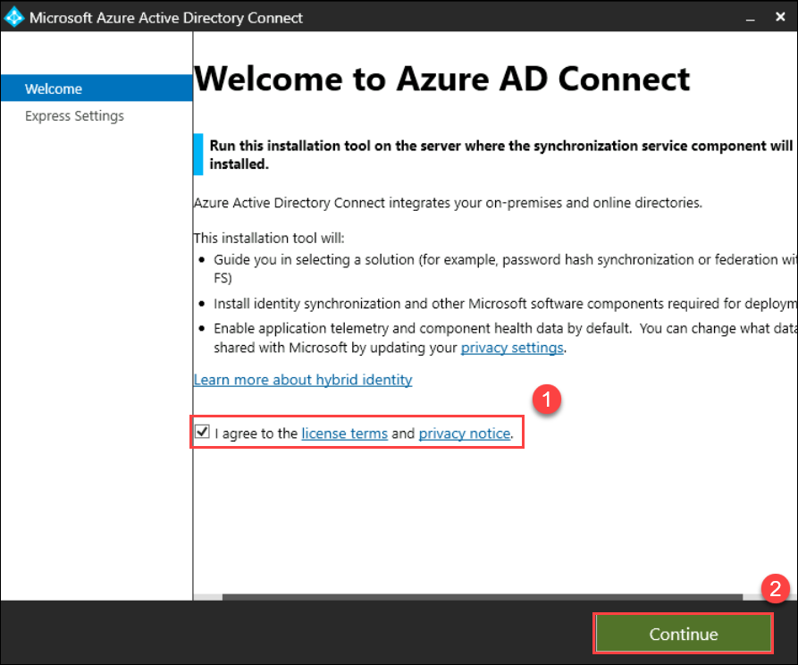
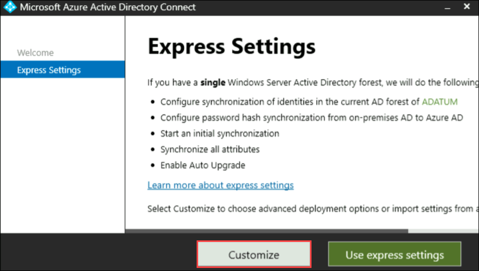
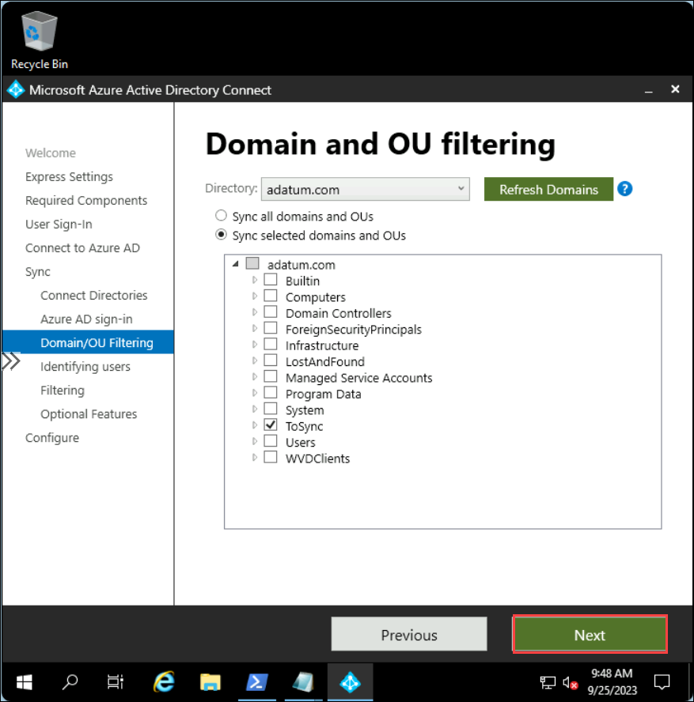
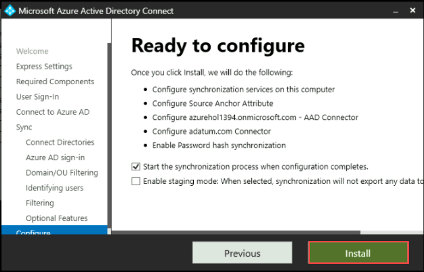
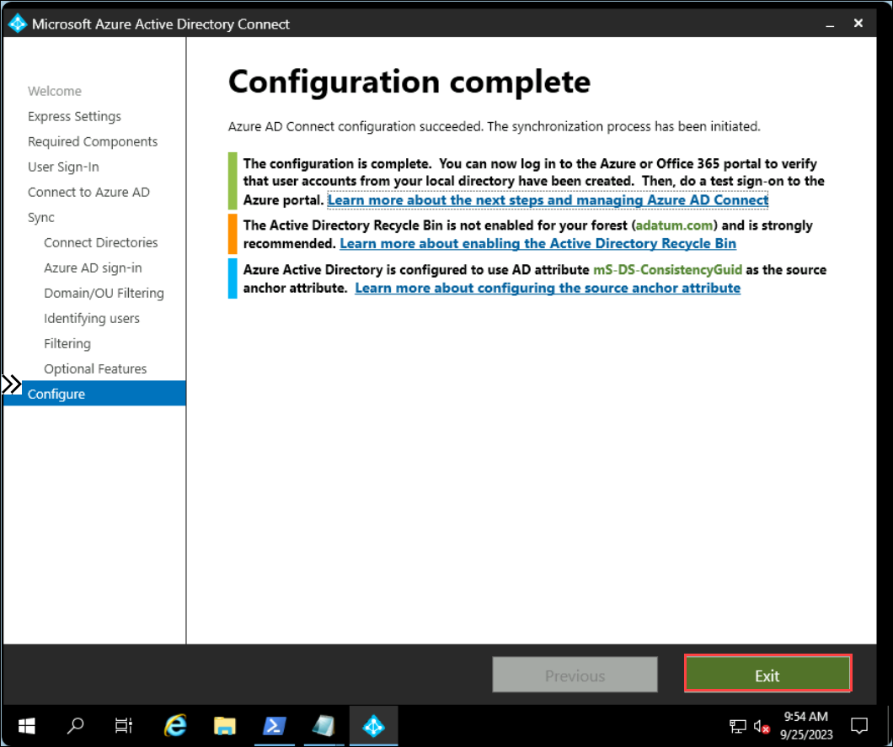
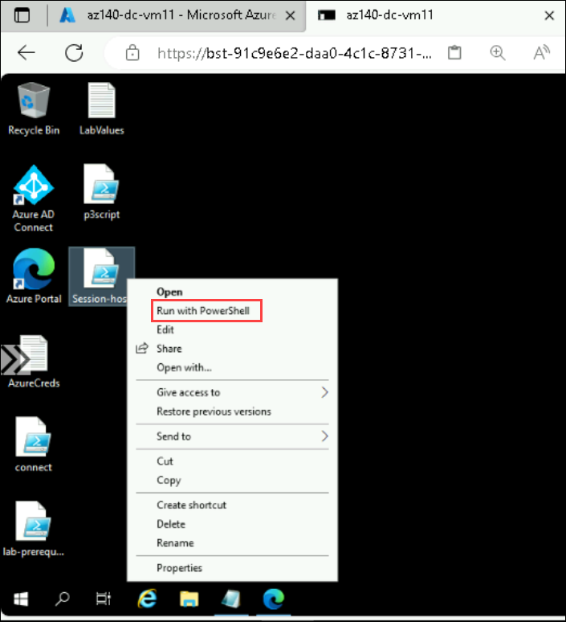
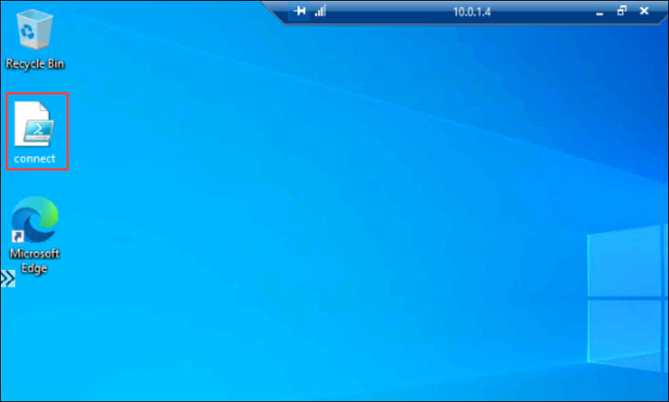
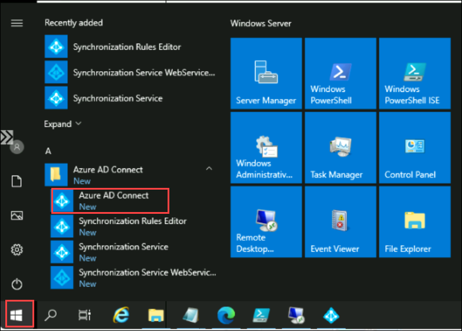
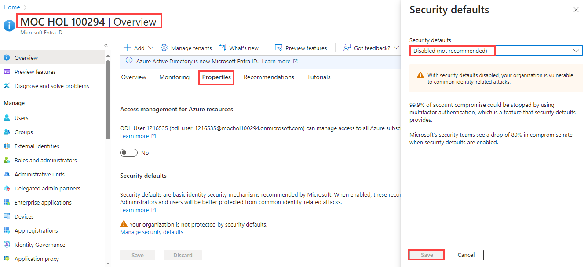
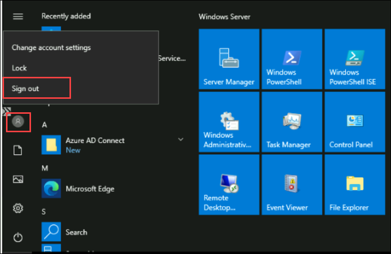

# Module 07 - Configure Conditional Access policies for AVD (AD DS)

## Lab scenario

You need to control access to a deployment of Azure Virtual Desktop in an Active Directory Domain Services ( Microsoft Entra ID DS) environment by using  Microsoft Entra ID join ( Microsoft Entra ID) conditional access.

## Lab Objectives
  
After completing this lab, you will be able to:

- Prepare for Microsoft Entra ID join-based Conditional Access for Azure Virtual Desktop
- Implement  Microsoft Entra ID-based Conditional Access for Azure Virtual Desktop


## Estimated Timing: 60 minutes

## Architecture Diagram
  
  

## Exercise 1: Prerequisite - Setup  Microsoft Entra ID Connect

1. In the Azure portal, search for and select **Virtual machines** and, from the **Virtual machines** blade, select **az140-dc-vm11**.

1. On the **az140-dc-vm11** blade, select **Connect**.

1. On the **az140-dc-vm11| Connect** blade, select **Go to Bastion**.

   

1. On the **Bastion** tab of the **az140-dc-vm11**, provide the following credentials for the **Connection Settings** and select **Connect (4)**:

   |Setting|Value|
   |---|---|
   |Username|**Student (1)**|
   |Authentication Type|**VM Password (2)**|    
   |Password|**Pa55w.rd1234 (3)**|

    

   >**Note**: On clicking **Connect**, if you encounter an error **A popup blocker is preventing new window from opening. Please allow popups and retry**, then select the popup blocker icon at the top, select **Always allow pop-ups and redirects from https://portal.azure.com** and click on **Done**, and try connecting to the VM again.
  
   >**Note**: If you are prompted **See text and images copied to the clipboard**, select **Allow**. 

4. Once logged in, a logon task will start executing. When prompted **Do you want PowerShell to install and import the Nuget provider now?** enter **Y** and hit enter.
   
   >**Note**: Wait for the logon task to complete and present you with **Microsoft Azure Active Directory Connect** wizard. This should take about 10 minutes. If the **Microsoft Azure Active Directory Connect** wizard is not presented to you after the logon task completes, then launch it manually by double clicking the **Microsoft Entra ID Connect** icon on the desktop.

5. On the **Welcome to Azure AD Connect** page of the **Microsoft Azure Active Directory Connect** wizard, select the checkbox **I agree to the license terms and privacy notice** and select **Continue**.

   
 
6. On the **Express Settings** page of the **Microsoft Azure Active Directory Connect** wizard, select the **Customize** option.

   
 
7. On the **Install required components** page, leave all optional configuration options deselected and select **Install**.

    
 
8. On the **User sign-in** page, ensure that only the **Password Hash Synchronization(1)** is selected and click on **Next(2)**.

    
 
9. On the **Connect to Azure AD** page, authenticate by using the credentials of the **aadsyncuser** user account and select **Next**. 

   

    >**Note**: Provide the userPrincipalName attribute of the **aadsyncuser** account available in the **LabValues** text file present on desktop and specify the password **Pa55w.rd1234**.

    

10. On the **Connect your directories** page, select the **Add Directory** button to the right of the **adatum.com** forest entry.

11. In the **AD forest account** window, ensure that the option to **Create new AD account** is selected, specify the following credentials, and select **OK**:

     |Setting|Value|
     |---|---|
     |User Name|**ADATUM\Student**|
     |Password|**Pa55w.rd1234**|

12. Back on the **Connect your directories** page, ensure that the **adatum.com** entry appears as a configured directory and select **Next**
  
13. On the **Azure AD sign-in configuration** page, note the warning stating **Users will not be able to sign-in to Azure AD with on-premises credentials if the UPN suffix does not match a verified domain name**, enable the checkbox **Continue without matching all UPN suffixes to verified domain**, and select **Next**.

    >**Note**: This is expected, since the Azure AD tenant does not have a verified custom DNS domain matching one of the UPN suffixes of the **adatum.com** AD DS.

14. On the **Domain and OU filtering** page, select the option **Sync selected domains and OUs**, expand the adatum.com node, clear all checkboxes, select only the checkbox next to the **ToSync** OU, and select **Next**.

    
 
15. On the **Uniquely identifying your users** page, accept the default settings, and select **Next**.
   
16. On the **Filter users and devices** page, accept the default settings, and select **Next**.
    
17. On the **Optional features** page, accept the default settings, and select **Next**.
    
18. On the **Ready to configure** page, ensure that the **Start the synchronization process when configuration completes** checkbox is selected and select **Install**.

    

    >**Note**: Installation should take about 2 minutes.

19. Review the information on the **Configuration complete** page and select **Exit** to close the **Microsoft Azure Active Directory Connect** window.
 
    

20. Within the Bastion session to **az140-dc-vm11**, open Microsoft Edge browser shortcut for Azure or navigate to the [Azure portal](https://portal.azure.com). If prompted, sign in by using following Microsoft Entra ID credentials of the user account with the Owner role in the subscription you are using in this lab.

     * Email/Username: <inject key="AzureAdUserEmail"></inject>

     * Password: <inject key="AzureAdUserPassword"></inject>
     
21. In the Azure portal, use the **Search resources, services, and docs** text box at the top of the Azure portal page, search for and navigate to the **Microsoft Entra ID** blade and, on your  Microsoft Entra ID tenant blade, in the **Manage** section of the hub menu, select **Users**.
    
22. On the **All users** blade, note that the list of user objects includes the listing of  Microsoft Entra ID DS user accounts you created earlier in this lab, with the **Yes** entry appearing in the **On-premises sync enabled** column.

      > **Note**: You might have to wait a few minutes and refresh the browser page for the AD DS user accounts to appear. Proceed to next step only if you are able to see the listing of AD DS user accounts you created. 

23. Once the users are reflecting in the Microsoft Entra ID, right click on the **lab-prerequisite** PowerShell file present on the desktop and select **Run with PowerShell** in the popup options. This will configure the storage account with the naming convention `storage<inject key="DeploymentID" enableCopy="false"/>` and file share with the name `az140-22-profiles`.

    

      
      > **Note**If you get the popup do you want to change the execution policy? Type **Y**.

      > **Note**: The script execution will take about 5 minutes. Once completed, the PowerShell window will display the text `Lab Pre-requisite Task Completed Successfully` in green color and the Powershell window will automatically close after a few seconds.
  
24. Open the Azure Portal, in Search resources, services, and docs text box at the top of the Azure portal page, search for and navigate to the **Virtual networks** page, select **az140-adds-vnet11**, in the settings section, select **Subnets**, on **az140-adds-vnet11 | Subnets** blade, select **+ Subnet**, then add the following credentials on the **Add Subnet** page to create the subnet, after adding all the credentials select **save** :

       |Setting|Value|
       |---|---|
       |Name|**hp3-subnet**|
       |Subnet address range|**keep this as default**|

25. Now right click on the **Session-host** PowerShell file present on the desktop and select **Run with PowerShell** in the popup options. This will create the Session host.

    
      
      > **Note**: The script execution will take about 5 minutes. 

26. Within the Remote Desktop session to az140-dc-vm11, in the browser window displaying the Azure portal, search for and select Virtual machines and, on the Virtual machines blade, in the list of virtual machines, select az140-24-p3-0  under **operations** section select **Run command (1)** then select **RunPowerShellScript(2)** paste the content of **p3script.ps1 (3)** available on desktop and click on **Run (4)**, then close the script. 

     
   
27. On the **az140-24-p3-0** overview page, select **Connect**, select **RDP**, on the **RDP** tab of the **az140-24-p3-0 | Connect** blade, in the **IP address** drop-down list, select the **Private IP address** entry, and then select **Download RDP File**.

28. If pop-up comes stating that it will harm your device, select **Keep**, then open the file, select **Connect**. 

29. When prompted, sign in with the following credentials, after entering the sign-in credentials, select **Yes**:

      |Setting|Value|
      |---|---|
      |User Name|**Student**|
      |Password|**Pa55w.rd1234**|

      > **Note**: If on the sign-in page you are getting some other credentials then select **More choices**, select **use a different account**, then use the above credentials to log-in.
      
      > **Note**: If you get **Welcome to Microsoft Teams: Get started** page, then close the application.

      > **Note**: if **Teams** tab opened, close the tab.

30. Within the Remote Desktop session to **az140-24-p3-0**, right-click on the **connect** PowerShell file present on the desktop and select **Run with PowerShell** in the popup options. This will connect session host to host pool.

    

31. If you get the popup do you want to change the execution policy? Type **Y**.

32. If you get the popup NutGet provider is required to continue Type **Y**.

33. Provide the credentials from the environment details tab to authenticate the Azure account when the pop up comes, click on **Use a different account**.

34. Wait until the script runs successfully.

35. On the **az140-dc-vm11** lab computer, go to Azure portal, search for Application group and select az140-24-hp3-DAG, then click on **Assignments** under **Manage** section.

36. Click on **+ Add** and search for aduser5 and then click on **Select**.

37. On the Azure portal, search for and select Azure Virtual Desktop and, on the Azure Virtual Desktop blade, select Application groups.

38. On the application groups blade, select **+ Create**.

39. On the Basics tab of the Create an application group blade, specify the following settings and select **Next: Applications >**:

      |Setting|Value|
      |---|---|
      |Subscription|the name of the Azure subscription you are using in this lab|
      |Resource group|**az140-11-RG**|
      |Host pool|**az140-24-hp3**|
      |Application group type|**RemoteApp**|
      |Application group name|**az140-21-hp1-Utilities-RAG**|
   
40. On the **Applications** tab of the **Create an application group** blade, select **+ Add applications**.

    >**Note :** The **Add** option might take a while to appear until the health state of the session hosts is in **Available** state. Navigate to Host pools > Virtual Machines to check the availablity.

    

41. On the **Add application** blade, specify the following settings and select **Review + Add**:

      |Setting|Value|
      |---|---|
      |Application source|**File path**|
      |Application path|**C:\Windows\system32\cmd.exe**|
      |Application Identifier|**Command Prompt**|
      |Display name|**Command Prompt**|
      |Icon path|**C:\Windows\system32\cmd.exe**|
      |Icon index|**0**|
      |Description|**Windows Command Prompt**|
      |Require command line|**No**|

42. Back on the **Applications** tab of the **Create an application group** blade, select **Next: Assignments >**.

43. On the **Assignments** tab of the **Create an application group** blade, select **+ Add Microsoft Entra users or user groups**.
 
44. On the **Select Microsoft Entra ID users or user groups** blade, select **aduser5** and click **Select**.
 
45. Back on the **Assignments** tab of the **Create an application group** blade, select **Next: Workspace >**.
 
46. On the **Workspace** tab of the **Create an application group** blade, specify the following setting and select **Review + create**:

      |Setting|Value|
      |---|---|
      |Register application group|**yes**|

47. On the **Review + create** tab of the **Create an application group** blade, select **Create**.

48. In Azure Portal, search for and select workspaces, and select **az140-24-ws1**, than in the **Manage** section, select **Application groups** and ensure that this **az140-21-hp1-Utilities-RAG** application group is there, if not than select **+ Add**, add the application group with the name **az140-21-hp1-Utilities-RAG** and click on **Select**.

    > **Congratulations** on completing the task! Now, it's time to validate it. Here are the steps:
    > - Navigate to the Lab Validation Page, from the upper right corner in the lab guide section.
    > - Hit the Validate button for the corresponding task. If you receive a success message, you can proceed to the next task. 
    > - If not, carefully read the error message and retry the step, following the instructions in the lab guide.
    > - If you need any assistance, please contact us at labs-support@spektrasystems.com. We are available 24/7 to help.

## Exercise 2: Prepare for  Microsoft Entra ID-based Conditional Access for Azure Virtual Desktop

The main tasks for this exercise are as follows:

1. Configure Microsoft Entra ID Premium P2 licensing
1. Configure  Microsoft Entra ID Multi-Factor Authentication (MFA)
1. Register a user for Microsoft Entra ID MFA
1. Configure hybrid Azure Microsoft Entra ID join
1. Trigger Microsoft Entra ID Connect delta synchronization

### Task 1: Configure Microsoft Entra ID Premium P2 licensing

   > **Note**: Premium P1 or P2 licensing of  Microsoft Entra ID is required in order to implement Microsoft Entra ID Conditional Access. You will use a 30-day trial for this lab.

1. In the Azure portal, search for and select **Microsoft Entra ID** to navigate to the  Microsoft Entra ID tenant associated with the Azure subscription you are using for this lab.

1. On the Azure Active Directory blade, in the vertical menu bar on the left side, in the **Manage** section, click **Users**. 

1. On the **Users | All users** blade, select **aduser5**.

1. On the **aduser5** blade, in the toolbar, click **Edit properties**, in the **Settings** section, in the **Usage location** dropdown list, select **United States**, click **Save**.

1. On the **aduser5** blade, in the **Overview** section, identify the user principal name of the **aduser5** account.

    >**Note**: Record this value. You will need it later in this lab.

1. On the **Users | All users** blade, select the user account you used to sign-in at the beginning of this task and repeat the previous step in case your account does not have the **Usage location** assigned. 

    >**Note**: The **Usage location** property must be set in order to assign an  Microsoft Entra ID Premium P2 licenses to user accounts.

1. On the **Users | All users** blade, select the **aadsyncuser** user account and identify its user principal name.

    >**Note**: Record this value. You will need it later in this lab.

1. In the Azure portal, navigate back to the **Overview** blade of the Microsoft Entra ID tenant and, in the vertical menu bar on the left side, in the **Manage** section, click **Licenses**.

1. On the **Licenses | Overview** blade, in the vertical menu bar on the left side, in the **Manage** section, click **All products**.

1. On the **Licenses | All products** blade, select the **Enterprise Mobility + Security E5** entry and click **+ Assign**.

1. On the **Assign license** blade, click **+ Add users and groups**, on the **Add users and groups** blade, select **aduser5** and your user account, and click **Select**.

1. Back on the **Assign license** blade, click **Assignment options**, select **Next: Assignment options >**, on the **Assignment options** blade, verify that all options are enabled, click **Review + assign**, and click **Assign**.

### Task 2: Configure Microsoft Entra ID Multi-Factor Authentication (MFA)

1. On your lab computer, in the web browser displaying the Azure portal, navigate back to the **Overview** blade of the Microsoft Entra ID tenant and, in the vertical menu on the left side, in the **Manage** section, click **Security**.

1. On the **Security | Getting started** blade, in the vertical menu on the left side, in the **Protect** section, click **Identity Protection**.

1. On the **Identity Protection | Overview** blade, in the vertical menu on the left side, in the **Protect** section, click **Multifactor authentication registration policy** (if necessary, refresh the web browser page).

1. On the **Identity Protection | Multifactor authentication registration policy** blade, in the **Assignments** section of the **Multi-factor authentication registration policy**, click **All users**, on the **Include** tab, click the **Select individuals and groups** option, on the **Select users**, click **aduser5**, click **Select**, at the bottom of the blade, set the **Policy enforcement** switch to **Enabled**, and click **Save**.

### Task 3: Register a user for Microsoft Entra ID MFA

1. On your lab computer, open an **InPrivate** web browser session, navigate to the [Azure portal](https://portal.azure.com), and sign in by providing the **aduser5** user principal name you identified earlier in this exercise, and the password **Pa55w.rd1234** you set when creating this user account.

1. When presented with the message **More information required**, click **Next**. This will automatically redirect your browser to the **Microsoft Authenticator** page.

2. On the **Keep your account secure** page, select your preferred authentication method and follow instructions to complete the registration process. 

   > **Note**: if Stay signed in page prompted, select **Yes**.

3. On the Azure portal page, in the upper right corner, click the icon representing the user avatar, click **Sign out**, and close the **In private** browser window. 

### Task 4: Configure hybrid Microsoft Entra ID join

> **Note**: This functionality can be leveraged to implement additional security when setting up Conditional Access for devices based on their Microsoft Entra ID join status.

1. On the lab computer, in the web browser displaying the Azure portal, search for and select **Virtual machines** and, from the **Virtual machines** blade, select **az140-dc-vm11**.

1. On the **az140-dc-vm11** blade, select **Connect**.

1. On the **az140-dc-vm11| Connect** blade, select **Go to Bastion**.

   

1. On the **Bastion** tab of the **az140-dc-vm11**, provide the following credentials for the **Connection Settings** and select **Connect (4)**:

   |Setting|Value|
   |---|---|
   |Username|**Student (1)**|
   |Authentication Type|**VM Password (2)**|    
   |Password|**Pa55w.rd1234 (3)**|

    

4. Within the Remote Desktop session to **az140-dc-vm11**, in the **Start** menu, expand the **Azure AD Connect** folder, and select **Azure AD Connect**.

      

   > **Note** If you receive a failure error window that the Sync Service is not running, go to PowerShell command window and enter **Start-Service "ADSync"**, and then try the step 4 again.

5. On the **Welcome to Azure AD Connect** page of the **Microsoft Azure Active Directory Connect** window, select **Configure**.

6. On the **Additional tasks** page in the **Microsoft Azure Active Directory Connect** window, select **Configure device options** and select **Next**.

7. On the **Overview** page in the **Microsoft Azure Active Directory Connect** window, review the information regarding **Hybrid Azure AD join** and **Device writeback** and select **Next**.

8. On the **Connect to Azure AD** page in the **Microsoft Azure Active Directory Connect** window, authenticate by using the credentials of the **aadsyncuser** user account you created in the previous exercise and select **Next**.  

   > **Note**: Provide the userPrincipalName attribute of the **aadsyncuser** account you recorded earlier in this lab and use this password **Pa55w.rd1234**.

9. On the **Device options** page in the **Microsoft Azure Active Directory Connect** window, ensure that the **Configure Hybrid Azure AD join** option is selected and select **Next**. 

10. On the **Device operating systems** page in the **Microsoft Azure Active Directory Connect** window, select the **Windows 10 or later domain-joined devices** checkbox and select **Next**. 

11. On the **SCP configuration** page in the **Microsoft Azure Active Directory Connect** window, select the checkbox next to the **adatum.com** entry, in the **Authentication Service** drop-down list, select **Azure Active Directory** entry, and select **Add**. 

12. When prompted, in the **Enterprise Admin Credentials** dialog box, specify the following credentials, and select **OK**:

      |Setting|Value|
      |---|---|
      |User Name|**ADATUM\Student**|
      |Password|**Pa55w.rd1234**|

13. Back on the **SCP configuration** page in the **Microsoft Azure Active Directory Connect** window, select **Next**.

14. On the **Ready to configure** page in the **Microsoft Azure Active Directory Connect** window, select **Configure** and, once the configuration completes, select **Exit**.

15. Within the Remote Desktop session to **az140-dc-vm11**, start **Windows PowerShell ISE** as administrator.

16. Within the Remote Desktop session to **az140-dc-vm11**, from the **Administrator: Windows PowerShell ISE** console, run the following to move the **az140-cl-vm11** computer account to the **WVDClients** organizational unit (OU):

      ```powershell
      Move-ADObject -Identity "CN=az140-cl-vm11,CN=Computers,DC=adatum,DC=com" -TargetPath "OU=WVDClients,DC=adatum,DC=com"
      ```

17. Within the Remote Desktop session to **az140-dc-vm11**, in the **Start** menu, expand the **Azure AD Connect** folder and select **Azure AD Connect**.

18. On the **Welcome to Azure AD Connect** page of the **Microsoft Azure Active Directory Connect** window, select **Configure**.

19. On the **Additional tasks** page in the **Microsoft Azure Active Directory Connect** window, select **Customize synchronization options** and select **Next**.

20. On the **Connect to Azure AD** page in the **Microsoft Azure Active Directory Connect** window, authenticate by using the credentials of the **aadsyncuser** user account you created in the previous exercise and select **Next**. 

      > **Note**: Provide the userPrincipalName attribute of the **aadsyncuser** account you recorded earlier in this lab and use this password **Pa55w.rd1234** for creating the user account. 

21. On the **Connect your directories** page in the **Microsoft Azure Active Directory Connect** window, select **Next**.

22. On the **Domain and OU filtering** page in the **Microsoft Azure Active Directory Connect** window, ensure that the option **Sync selected domains and OUs** is selected, expand the **adatum.com** node, ensure that the checkbox next to the **ToSync** OU is selected, select the checkbox next to the **WVDClients** OU, and select **Next**.

23. On the **Optional features** page in the **Microsoft Azure Active Directory Connect** window, accept the default settings, and select **Next**.

24. On the **Ready to configure** page in the **Microsoft Azure Active Directory Connect** window, ensure that the checkbox **Start the synchronization process when configuration completes** is selected and select **Configure**.

25. Review the information on the **Configuration complete** page and select **Exit** to close the **Microsoft Azure Active Directory Connect** window.

### Task 5: Trigger  Microsoft Entra ID Connect delta synchronization

1. Within the Remote Desktop session to **az140-dc-vm11**, switch to the **Administrator: Windows PowerShell ISE** window.

1. Within the Remote Desktop session to **az140-dc-vm11**, from the **Administrator: Windows PowerShell ISE** console pane, run the following to trigger  Microsoft Entra ID Connect delta synchronization:

   ```powershell
   Import-Module -Name "C:\Program Files\Microsoft Azure AD Sync\Bin\ADSync"
   Start-ADSyncSyncCycle -PolicyType Initial
   ```

1. Within the Remote Desktop session to **az140-dc-vm11**, navigate to the **Azure Portal** shortcut. When prompted, sign in by using the  Microsoft Entra ID credentials of the user account with the Global Administrator role in the  Microsoft Entra ID tenant associated with the Azure subscription you are using in this lab.

1. Within the Remote Desktop session to **az140-dc-vm11**, in the Microsoft Edge window displaying the Azure portal, search for and select **Microsoft Entra ID** to navigate to the  Microsoft Entra ID tenant associated with the Azure subscription you are using for this lab.

1. On the Microsoft Entra ID join blade, in the vertical menu bar on the left side, in the **Manage** section, click **Devices**. 

1. On the **Devices**, select **All devices**, review the list of devices and verify that the **az140-cl-vm11** device is listed with the **Hybrid  Microsoft Entra ID joined** entry in the **Join Type** column.

   > **Note**: It might take an hour for the synchronization to take effect before the device appears in the Azure portal. Please proceed with the next exercise.

## Exercise 3: Implement  Microsoft Entra ID-based Conditional Access for Azure Virtual Desktop

The main tasks for this exercise are as follows:

1. Create an  Microsoft Entra ID-based Conditional Access policy for all Azure Virtual Desktop connections

1. Test the  Microsoft Entra ID-based Conditional Access policy for all Azure Virtual Desktop connections

1. Modify the  Microsoft Entra ID-based Conditional Access policy to exclude hybrid  Microsoft Entra ID joined computers from the MFA requirement

1. Test the modified  Microsoft Entra ID-based Conditional Access policy

### Task 1: Create an  Microsoft Entra ID-based Conditional Access policy for all Azure Virtual Desktop connections

>**Note**: In this task, you will configure an  Microsoft Entra ID-based Conditional Access policy that requires MFA to sign in to a Azure Virtual Desktop session. The policy will also enforce reauthentication after the first 4 hours following a successful authentication.

1. On your lab computer, in the web browser displaying the Azure portal, navigate back to the **Overview** blade of the  Microsoft Entra ID tenant and, in the vertical menu on the left side, in the **Manage** section, click **Security**.

1. On the **Security \| Getting started** blade, in the vertical menu on the left side, in the **Protect** section, click **Conditional Access**.

>**Note:** Before you create a policy, ensure the **Security Default** is disabled. Navigate to Microsoft Entra ID and disable.

  

1. On the **Conditional Access**, select **Policies**, in the toolbar, click **Create New Policy**.

1. On the **New** blade, configure the following settings:

   - In the **Name** text box, type **az140-31-wvdpolicy1**
   
   - In the **Assignments** section, select the **0 user and group selected** option, Select **Select Users and groups**, select the **Users and groups** checkbox, on the **Select users and groups** blade, click **aduser5**, and then click **Select**.
   
   - In the **Target resources** section, click **No target resources selected**, ensure that in the **Select what this policy applies to** the **Cloud apps** option is selected, click the **Select apps** option, on the **Select** blade, select **None**, in the **Search** textbox, enter **9cdead84-a844-4324-93f2-b2e6bb768d07**, in the listing of results, select the checkbox next to the **Azure Virtual Desktop** entry, in the **Search** textbox, enter **a4a365df-50f1-4397-bc59-1a1564b8bb9c**, select the checkbox next to the **Microsoft Remote Desktop** entry, and click **Select**.
   
   - In the **Assignments** section, Under **Condition** section, click **0 conditions selected**, under **Client apps**, select **Not configured**, set the **Configure** switch to **Yes**, ensure that both the **Browser** and **Mobile apps and desktop clients** checkboxes are selected, and click **Done**.
   
   - In the **Access controls** section, Under **Grant** section, select **0 controls selected**, on the **Grant** blade, ensure that the **Grant access** option is selected, select the **Require multi-factor authentication** checkbox and click **Select**.
   
   - In the **Access controls** section, under **Session**, select **0 controls selected** on the **Session** blade, select the **Sign-in frequency** checkbox, in the first textbox, type **4**, in the **Select units** dropdown list, select **Hours**, leave the **Persistent browser session** checkbox cleared, and click **Select**.
   
   - Set the **Enable policy** switch to **On**.

1. On the **New** blade, click **Create**.

### Task 2: Test the  Microsoft Entra ID-based Conditional Access policy for all Azure Virtual Desktop connections

1. On your lab computer, open an **InPrivate** web browser session, navigate to the [Azure portal](https://portal.azure.com), and sign in by providing the **aduser5** user principal name you identified earlier in this exercise and the password you set when creating this user account.

   > **Note**: Verify that you are not prompted to authenticate via MFA.

1. In the **InPrivate** web browser session, navigate to the Azure Virtual Desktop HTML5 web client page at [https://rdweb.wvd.microsoft.com/arm/webclient](https://rdweb.wvd.microsoft.com/arm/webclient).

   > **Note**: Verify that this will automatically trigger authentication via MFA.

1. In the **Enter code** pane, type the code from the text message or authenticator app that you registered and select **Verify**.

1. On the **All Resources** page, click **Command Prompt**, on the **Access local resources** pane, clear the **Printer** checkbox, and click **Allow**.

1. When prompted, in the **Enter your credentials**, in the **User name** textbox type the user principal name of **aduser5** and, in the **Password** textbox, and use this password **Pa55w.rd1234** and click **Submit**.

1. Verify that the **Command Prompt** Remote App was launched successfully.

1. In the **Command Prompt** Remote App window, at the command prompt, type **logoff** and press the **Enter** key.

1. Back on the **All Resources** page, in the upper right corner, click **aduser5**, in the dropdown menu, click **Sign Out**, and close the **InPrivate** web browser window.

### Task 3: Modify the Microsoft Entra ID-based Conditional Access policy to exclude hybrid Microsoft Entra  joined computers from the MFA requirement

>**Note**: In this task, you will modify the  Microsoft Entra ID-based Conditional Access policy that requires MFA to sign in to a Azure Virtual Desktop session such that connections originating from Microsoft Entra ID joined computers will not require MFA.

1. On your lab computer, in the browser window displaying the Azure portal, on the **Conditional Access | Policies** blade, click the entry representing the **az140-31-wvdpolicy1** policy.

1. On the **az140-31-wvdpolicy1** blade, in the **Access controls** section, under **Grant**, select **1 control selected**, on the **Grant** blade, select the **Require multi-factor authentication** and **Require Hybrid Microsoft Entra joined device** checkboxes, ensure that the **Require one of the selected controls** option is enabled, and click **Select**.

1. On the **az140-31-wvdpolicy1** blade, click **Save**.

   >**Note:** It might take a few minutes for the policy to take effect.

### Task 4: Test the modified Microsoft Entra ID-based Conditional Access policy 

1. On your lab computer, in the browser window displaying the Azure portal, search for and select **Virtual machines** and, on the **Virtual machines** blade, select the **az140-cl-vm11** virtual machines, under operations section select **Run command (1)**, select **RunPowerShellScript (2)**.

1. In the Run Command Script under PowerShell Script run the below command, you'll see the message **Script execution complete**, close the powershell.

   ```powershell
   Add-LocalGroupMember -Group "Remote desktop Users" -Member adatum\aduser5
   ```

1. On the **az140-cl-vm11** blade, select **Connect**.

1. On the **az140-cl-vm11| Connect** blade, select **Go to Bastion**.

1. On the **Bastion** tab of the **az140-cl-vm11**, provide the credentials of **aduser5** and and, in the **Password** textbox give **Pa55w.rd1234** for the **Connection Settings** and select **Connect (4)**:

   > **Note:** If it is taking time to connect than refresh the page.

   > **Note:** If the error prompted **A popup blocker is preventing new window from opening. Please allow popups and retry.**, then select **Allow**.

4. Within the Remote Desktop session to **az140-cl-vm11**, start Microsoft Edge and navigate to navigate to the Azure Virtual Desktop HTML5 web client page at [https://rdweb.wvd.microsoft.com/arm/webclient](https://rdweb.wvd.microsoft.com/arm/webclient).

   > **Note**: Verify that this time you will not be prompted to authenticate via MFA. This is because **az140-cl-vm11** is Hybrid Microsoft Entra ID-joined.

5. On the **All Resources** page, double-click **Command Prompt**, on the **Access local resources** pane, clear the **Printer** checkbox, and click **Allow**.

6. When prompted, in the **Enter your credentials**, in the **User name** textbox type the user principal name of **aduser5** and, in the **Password** textbox, type the password **Pa55w.rd1234** and click on **Submit**.

7. Verify that the **Command Prompt** Remote App was launched successfully.

   >**Note:** If you are not able to launch the command prompt, check inside the azure portal, in application group **aduser5** are added, if not than if you to add and perform from the step-5 again.

8. In the **Command Prompt** Remote App window, at the command prompt, type **logoff** and press the **Enter** key.

9. Back on the **All Resources** page, in the upper right corner, click **aduser5**, in the dropdown menu, click **Sign Out**.

10. Within the Remote Desktop session to **az140-cl-vm11**, click **Start**, in the vertical bar directly above the **Start** button, click the icon representing the signed in user account, and, in the pop-up menu, click **Sign out**.

      
 
    > **Congratulations** on completing the task! Now, it's time to validate it. Here are the steps:
    > - Navigate to the Lab Validation Page, from the upper right corner in the lab guide section.
    > - Hit the Validate button for the corresponding task. If you receive a success message, you can proceed to the next task. 
    > - If not, carefully read the error message and retry the step, following the instructions in the lab guide.
    > - If you need any assistance, please contact us at labs-support@spektrasystems.com. We are available 24/7 to help.

### Review
In this lab, you have completed the following:
- Prepare for  Microsoft Entra ID ( Microsoft Entra ID)-based Conditional Access for Azure Virtual Desktop
- Implement  Microsoft Entra ID-based Conditional Access for Azure Virtual Desktop

## You have successfully completed the lab
