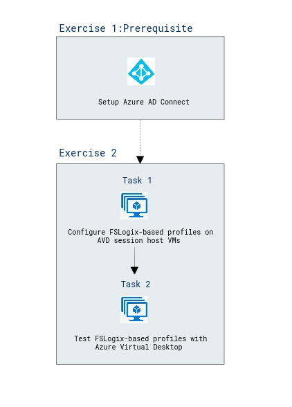
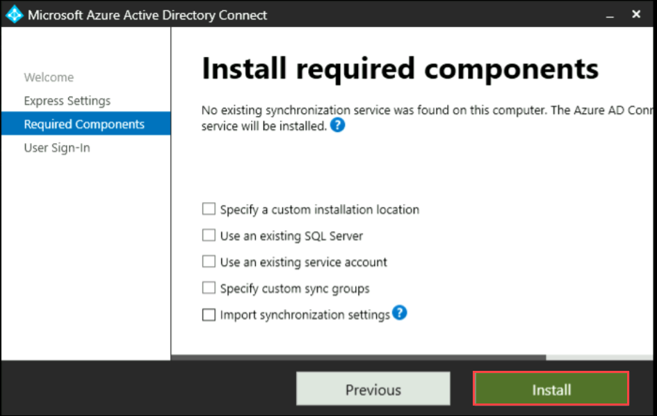
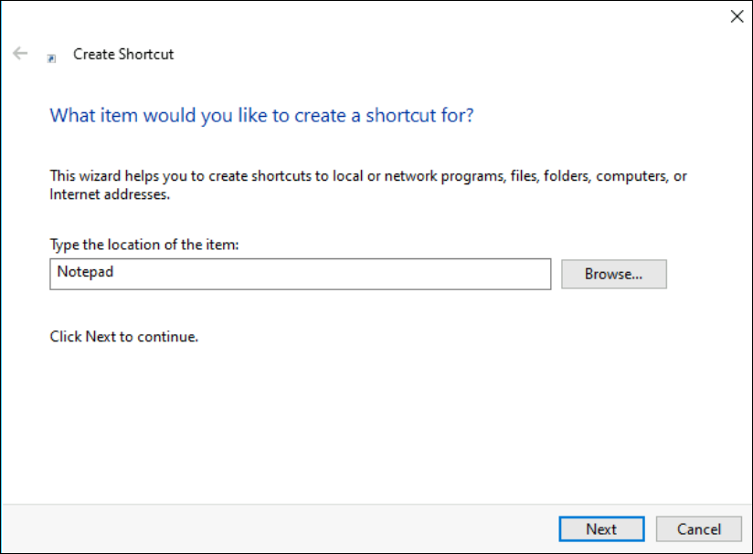
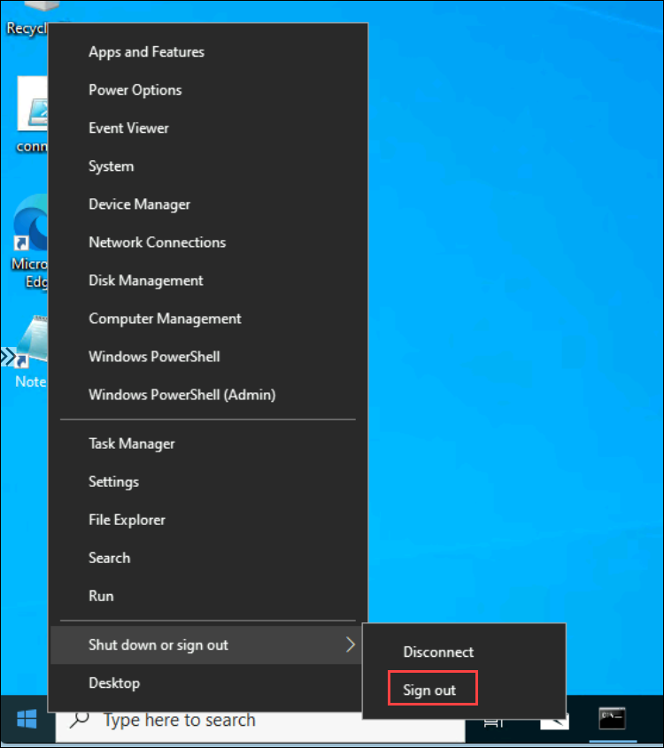
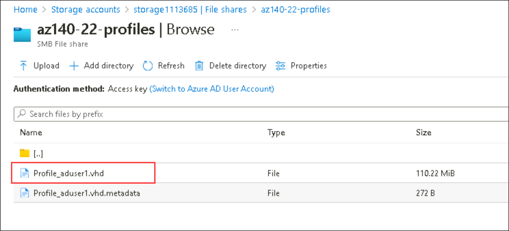

# Module 08A - Implement and manage Azure Virtual Desktop profiles (AD DS)

## Lab scenario

You need to implement Azure Virtual Desktop profile management in an Active Directory Domain Services (AD DS) environment.

## Lab Objectives
  
After completing this lab, you will be able to implement FSLogix based profiles for Azure Virtual Desktop

## Estimated timing: 30 minutes

## Architecture Diagram
  
  


## Exercise 1: Prerequisite - Setup Azure AD Connect

1. In the Azure portal, search for and select **Virtual machines** and, from the **Virtual machines** blade, select **az140-dc-vm11**.

1. On the **az140-dc-vm11** blade, select **Connect**.

1. On the **az140-dc-vm11| Connect** blade, select **Go to Bastion**.

    

1. On the **Bastion** tab of the **az140-dc-vm11**, provide the following credentials for the **Connection Settings** and select **Connect (4)**:

   |Setting|Value|
   |---|---|
   |Username|**Student (1)**|
   |Authentication Type|**VM Password (2)**|    
   |Password|**Pa55w.rd1234 (3)**|

    

   > **Note**: On clicking **Connect**, if you encounter an error **A popup blocker is preventing new window from opening. Please allow popups and retry**, then select the popup blocker icon at the top, select **Always allow pop-ups and redirects from https://portal.azure.com** click on **Done**, and try connecting to the VM again.
  
   > **Note**: If you are prompted **See text and images copied to the clipboard**, select **Allow**. 

5. On the **Welcome to Azure AD Connect** page of the **Microsoft Azure Active Directory Connect** wizard, select the checkbox **I agree to the license terms and privacy notice** and select **Continue**.

   
 
6. On the **Express Settings** page of the **Microsoft Azure Active Directory Connect** wizard, select the **Customize** option.

   
 
7. On the **Install required components** page, leave all optional configuration options deselected and select **Install**.

    
 
8. On the **User sign-in** page, ensure that only the **Password Hash Synchronization(1)** is selected and click on **Next(2)**.

    
 
9. On the **Connect to Azure AD** page, authenticate by using the credentials of the **aadsyncuser** user account and select **Next**. 

   

    >**Note**: Provide the userPrincipalName attribute of the **aadsyncuser** account available in the **LabValues** text file present on desktop and specify the password **Pa55w.rd1234**.

    

10. On the **Connect your directories** page, select the **Add Directory** button to the right of the **adatum.com** forest entry.

11. In the **AD forest account** window, ensure that the option to **Create new AD account** is selected, specify the following credentials, and select **OK**:

     |Setting|Value|
     |---|---|
     |User Name|**ADATUM\Student**|
     |Password|**Pa55w.rd1234**|

12. Back on the **Connect your directories** page, ensure that the **adatum.com** entry appears as a configured directory and select **Next**
  
13. On the **Azure AD sign-in configuration** page, note the warning stating **Users will not be able to sign-in to Azure AD with on-premises credentials if the UPN suffix does not match a verified domain name**, enable the checkbox **Continue without matching all UPN suffixes to verified domain**, and select **Next**.

    >**Note**: This is expected, since the Microsoft entra tenant does not have a verified custom DNS domain matching one of the UPN suffixes of the **adatum.com** AD DS.

14. On the **Domain and OU filtering** page, select the option **Sync selected domains and OUs**, expand the adatum.com node, clear all checkboxes, select only the checkbox next to the **ToSync** OU, and select **Next**.

    
 
15. On the **Uniquely identifying your users** page, accept the default settings, and select **Next**.
   
16. On the **Filter users and devices** page, accept the default settings, and select **Next**.
    
17. On the **Optional features** page, accept the default settings, and select **Next**.
    
18. On the **Ready to configure** page, ensure that the **Start the synchronization process when configuration completes** checkbox is selected and select **Install**.

    

    >**Note**: Installation should take about 2 minutes.

19. Review the information on the **Configuration complete** page and select **Exit** to close the **Microsoft Azure Active Directory Connect** window.
 
    

21. Within the Remote Desktop session to **az140-dc-vm11**, open the Microsoft Edge browser shortcut for Azure or navigate to the [Azure portal](https://portal.azure.com). If prompted, sign in by using the Microsoft Entra ID credentials of the user account with the Owner role in the subscription you are using in this lab, given as follows:
    - E-mail address: <inject key="AzureAdUserEmail"></inject>
    - Password: <inject key="AzureAdUserPassword"></inject>

22. In the Azure portal, use the **Search resources, services, and docs** text box at the top of the Azure portal page, search for and navigate to the **Microsoft Entra ID** blade and, on your Microsoft Entra ID tenant blade, in the **Manage** section of the hub menu, select **Users**.
23. On the **All users** blade, note that the list of user objects includes the listing of AD DS user accounts you created earlier in this lab, with the **Yes** entry appearing in the **On-premises sync enabled** column.

     > **Note**: You might have to wait a few minutes and refresh the browser page for the AD DS user accounts to appear. Proceed to next step only if you are able to see the listing of AD DS user accounts you created. 

24. Once the users are reflected in the Microsoft Entra ID, right-click on the **lab-prerequisite** PowerShell file present on the desktop and select **Run with PowerShell** in the popup options. This will configure the storage account with the naming convention **storage<inject key="DeploymentID" enableCopy="false"/>** and file share with the name **az140-22-profiles**.

    
   
    > **Note**: The script execution will take about 5 minutes. Once completed, the PowerShell window will display the text `Lab Pre-requisite Task Completed Successfully` in green color and the Powershell window will automatically close after a few seconds.
   
25. Now right-click on the **Session-host** PowerShell file present on the desktop and select **Run with PowerShell** in the popup options. This will create the Session host.
    > **Note**: The script execution will take about 5 minutes. Once completed, the PowerShell window will display the text Session-host Task Completed Successfully` in green color and the Powershell window will automatically close after a few seconds.

    

26. Within the Remote Desktop session to **az140-dc-vm11**, in the browser window displaying the Azure portal, search for and select Virtual machines and, on the Virtual machines blade, in the list of virtual machines, select **az140-21-p1-0**  under **Operations** section select **Run command**, select **RunPowerShellScript** and under **Run Command Script** paste the content of p3script.ps1 available on desktop and click on **Run**. 

27. Within the Remote Desktop session to **az140-dc-vm11**, in the browser window displaying the Azure portal, search for and select Virtual machines and, on the Virtual machines blade, in the list of virtual machines, select **az140-21-p1-1**  under **Operations** section select **Run command**, select **RunPowerShellScript** and under **Run Command Script** paste the content of p3script.ps1 available on desktop and click on **Run**. 

28. Within the Remote Desktop session to **az140-dc-vm11**, in the browser window displaying the Azure portal, search for and select Virtual machines and, on the Virtual machines blade, in the list of virtual machines, select **az140-21-p1-2**  under **Operations** section select **Run command**, select **RunPowerShellScript** and under **Run Command Script** paste the content of p3script.ps1 is available on desktop and click on **Run**. 

    

29. On the **az140-21-p1-0** blade, select **Connect**.

1. On the **az140-21-p1-0 \| Connect** blade, select **Go to Bastion**.

1. On the **Bastion** tab of the **az140-21-p1-0**, provide the following credentials for the **Connection Settings** and select **Connect**:

    |Setting|Value|
    |---|---|
    |User Name|**Student**|
    |Authentication Type|**VM Password**| 
    |Password|**Pa55w.rd1234**|
   
30. Now right-click on the **connect** PowerShell file present on the desktop and select **Run with PowerShell** in the popup options. This will join the Session host to host pool.

     

    > **Note**: If they ask for Execution policy change give **Y** and for Nuget provider is required to continue provide **Y**.

31. When prompted, provide the credentials of the user account with the Owner role in the subscription you are using in this lab:
    - E-mail address: <inject key="AzureAdUserEmail"></inject>
    - Password: <inject key="AzureAdUserPassword"></inject>

    > **Note**: Please follow the previous two steps (steps 29 and 30) for Virtual Machines **az140-21-p1-1** and **az140-21-p1-2** .
 
33. In the Azure portal, search for **Application group** and select **az140-21-hp1-DAG**, then click on Assignments under the Manage section.

    

34. Click on **+ Add** and search for **aduser1** and then click on Select.

35. Within the Remote Desktop session to **az140-dc-vm11**, in the web browser window displaying the Azure portal, search for and select **Azure Virtual Desktop** and, on the Azure Virtual Desktop blade, select **Application groups**.

36. On the application groups blade, select **+ Create.**

    

37. On the Basics tab of the Create an application group blade, specify the following settings and select Next: Applications >:

    |Setting|Value|
     |---|---|
     |Subscription|the name of the Azure subscription you are using in this lab|
     |Resource group|**az140-11-RG**|
     |Host pool|**az140-21-hp1**|
     |Application group type|**RemoteApp**|
     |Application group name|**az140-21-hp1-Utilities-RAG**|
     
     

38. On the **Applications** tab of the **Create an application group** blade, select **+ Add applications**.

39. On the **Add application** blade, specify the following settings and select **Save**:

    |Setting|Value|
     |---|---|
     |Application source|**File path**|
     |Application path|**C:\Windows\system32\cmd.exe**|
     |Application name|**Command Prompt**|
     |Display name|**Command Prompt**|
     |Icon path|**C:\Windows\system32\cmd.exe**|
     |Icon index|**0**|
     |Description|**Windows Command Prompt**|
     |Require command line|**No**|

     

40. Back on the **Applications** tab of the **Create an application group** blade, select **Next: Assignments >**.

41. On the **Assignments** tab of the **Create an application group** blade, select **+ Add Microsoft entra users or user groups**.

42. On the **Select Microsoft entra users or user groups** blade, select **aduser1** and click on **Select**.

     

43. Back on the **Assignments** tab of the **Create an application group** blade, select **Next: Workspace >**.

44. On the **Workspace** tab of the **Create a workspace** blade, specify the following setting and select **Review + create**:

    |Setting|Value|
     |---|---|
     |Register application group|**yes**|

     

45. On the **Review + create** tab of the **Create an application group** blade, select **Create**.

   
## Exercise 2: Implement FSLogix based profiles for Azure Virtual Desktop

The main tasks for this exercise are as follows:

1. Configure FSLogix-based profiles on Azure Virtual Desktop session host VMs
2. Test FSLogix-based profiles with Azure Virtual Desktop
3. Remove Azure resources deployed in the lab

### Task 1: Configure FSLogix-based profiles on Azure Virtual Desktop session host VMs

1. Back in your lab Virtual Machine, in the Azure portal, search for and select **Virtual machines** and, from the **Virtual machines** blade, select **az140-21-p1-0**.

    

1. On the **az140-21-p1-0** blade, select **Connect**.

1. On the  **az140-21-p1-0 \| Connect** blade, select **Go to Bastion**.

1. When prompted, sign in with the following credentials:

   |Setting|Value|
   |---|---|
   |User Name|**student@adatum.com**|
   |Authentication Type|**VM Password**| 
   |Password|**Pa55w.rd1234**|
   
4. Within the Remote Desktop session to **az140-21-p1-0**, start Microsoft Edge, browse to [FSLogix download page](https://aka.ms/fslogix_download), download FSLogix compressed installation binaries, extract them into the **C:\\Allfiles\\Labs\\04** folder (create the folder if needed), navigate to the **x64\\Release** subfolder, double-click the **FSLogixAppsSetup.exe** file to launch the **Microsoft FSLogix Apps Setup** wizard, and step through the installation of Microsoft FSLogix Apps with the default settings.

5. Within the Remote Desktop session to **az140-21-p1-0**, start **Windows PowerShell ISE** as administrator and, from the **Administrator: Windows PowerShell ISE** script pane, run the following to install the latest version of the PowerShellGet module (select **Yes** when prompted for confirmation):

   ```powershell
   [Net.ServicePointManager]::SecurityProtocol = [Net.SecurityProtocolType]::Tls12
   Install-Module -Name PowerShellGet -Force -SkipPublisherCheck
   ```
6. From the **Administrator: Windows PowerShell ISE** console, run the following to sign in to your Azure subscription:

   ```powershell
   Connect-AzAccount
   ```

7. When prompted, sign in with the Microsoft Entra ID credentials of the user account with the Owner role in the subscription you are using in this lab:
   - E-mail address: <inject key="AzureAdUserEmail"></inject>
   - Password: <inject key="AzureAdUserPassword"></inject>

8. From the **Administrator: Windows PowerShell ISE** console, run the following to install the latest version of the Az PowerShell module (select **Yes to All** when prompted for confirmation):

    ```powershell
    Install-Module -Name Az -AllowClobber -SkipPublisherCheck
    ```

9. From the **Administrator: Windows PowerShell ISE** console, run the following to modify the execution policy:

    ```powershell
    Set-ExecutionPolicy RemoteSigned -Force
    ```

     > **Note**: If you get the error Windows PowerShell updated your execution policy successfully, but the setting is overridden by a policy defined at a more specific scope. please ignore it.

10. Within the Remote Desktop session to **az140-21-p1-0**, from the **Administrator: Windows PowerShell ISE** script pane, run the following to retrieve the name of the Azure Storage account you configured earlier in this lab (change the **deploymentID** with your lab deployment ID It is under Environmental detail page):

    ```powershell
    $resourceGroupName = 'az140-11-RG'
    $storageAccountName = 'storagedeploymentID'
    ```

11. Within the Remote Desktop session to **az140-21-p1-0**, from the **Administrator: Windows PowerShell ISE** script pane, run the following to configure profile registry settings:

    ```powershell
    $profilesParentKey = 'HKLM:\SOFTWARE\FSLogix'
    $profilesChildKey = 'Profiles'
    $fileShareName = 'az140-22-profiles'
    New-Item -Path $profilesParentKey -Name $profilesChildKey –Force
    New-ItemProperty -Path $profilesParentKey\$profilesChildKey -Name 'Enabled' -PropertyType DWord -Value 1
    New-ItemProperty -Path $profilesParentKey\$profilesChildKey -Name 'VHDLocations' -PropertyType MultiString -Value "\\$storageAccountName.file.core.windows.net\$fileShareName"
    ```

12. Within the Remote Desktop session to **az140-21-p1-0**, right-click **Start**, in the right-click menu, select **Run**, in the **Run** dialog box, in the **Open** text box, type the following and select **OK** to launch the **Local Users and Groups** console:

    ```cmd
    lusrmgr.msc
    ```

13. In the **Local Users and Groups** console, note the four groups which names start with the **FSLogix** string:

     - FSLogix ODFC Exclude List
     - FSLogix ODFC Include List
     - FSLogix Profile Exclude List
     - FSLogix Profile Include List

       

14. In the **Local Users and Groups** console, in the list of groups, double-click the **FSLogix Profile Include List** group, note that it includes the **\\Everyone** group, and select **OK** to close the group **Properties** window. 
15. In the **Local Users and Groups** console, in the list of groups, double-click the **FSLogix Profile Exclude List** group, note that it does not include any group members by default, and select **OK** to close the group **Properties** window. 

     > **Note**: To provide a consistent user experience, you need to install and configure FSLogix components on all Azure Virtual Desktop session hosts. Please repeat all previous steps (step 1 and 15) for Virtual Machines **az140-21-p1-1** and **az140-21-p1-2** .

16. Within the Remote Desktop session to **az140-21-p1-0**, **az140-21-p1-1**, **az140-21-p1-2**, open command prompt and type **WinRM quickconfig**.

17. When it asks **Make these changes [y/n]?**, give **Y**

18. Within the Remote Desktop session to **az140-21-p1-0**, from the **Administrator: Windows PowerShell ISE** script pane, run the following to install FSLogix components on the **az140-21-p1-1** and **az140-21-p1-2** session hosts:

      ```
      $servers = 'az140-21-p1-1', 'az140-21-p1-2'
      foreach ($server in $servers) {
         $localPath = 'C:\AllFiles\Labs\04\FSLogix_Apps_2.9.8612.60056\x64'
         $remotePath = "\\$server\C$\Allfiles\Labs\04\x64\Release"
         Copy-Item -Path $localPath\Release -Destination $remotePath -Filter '*.exe' -Force -Recurse
         Invoke-Command -ComputerName $server -ScriptBlock {
           Start-Process -FilePath $using:localPath\Release\FSLogixAppsSetup.exe -ArgumentList '/quiet' -Wait
         } 
      }
      ```

     > **Note**: Wait for the script execution to complete. This might take about 2 minutes.

19. Within the Remote Desktop session to **az140-21-p1-0**, from the **Administrator: Windows PowerShell ISE** script pane, run the following to configure profile registry settings on the **az140-21-p1-1** and **az140-21-p1-1** session hosts:

    ```
    $profilesParentKey = 'HKLM:\SOFTWARE\FSLogix'
    $profilesChildKey = 'Profiles'
    $fileShareName = 'az140-22-profiles'
    foreach ($server in $servers) {
      Invoke-Command -ComputerName $server -ScriptBlock {
         New-Item -Path $using:profilesParentKey -Name $using:profilesChildKey –Force
         New-ItemProperty -Path $using:profilesParentKey\$using:profilesChildKey -Name 'Enabled' -PropertyType DWord -Value 1
         New-ItemProperty -Path $using:profilesParentKey\$using:profilesChildKey -Name 'VHDLocations' -PropertyType MultiString -Value "\\$using:storageAccountName.file.core.windows.net\$using:fileShareName"
      }
    }
        
    ```
   
    > **Note**: Before you test the FSLogix-based profile functionality, you need to remove the locally cached profile of the **ADATUM\\aduser1** account you will be using for testing from the Azure Virtual Desktop session hosts you used in the previous lab.

20. Within the Remote Desktop session to **az140-21-p1-0**, from the **Administrator: Windows PowerShell ISE** script pane, run the following to remove the locally cached profile of the **ADATUM\\aduser1** account on all Azure VMs serving as session hosts:

    ```powershell
    $userName = 'aduser1'
    $servers = 'az140-21-p1-0','az140-21-p1-1', 'az140-21-p1-2'
    Get-CimInstance -ComputerName $servers -Class Win32_UserProfile | Where-Object { $_.LocalPath.split('\')[-1] -eq $userName } | Remove-CimInstance
    ```

### Task 2: Test FSLogix-based profiles with Azure Virtual Desktop

1. Switch to your lab computer, from the lab computer, in the browser window displaying the Azure portal, search for and select **Virtual machines** and, on the **Virtual machines** blade, select the **az140-cl-vm11** entry.

2. On the **az140-cl-vm11** blade, select **Connect**.

1. On the**az140-cl-vm11 \| Connect** blade, select **Go to Bastion**.

3. When prompted, provide the following credentials and select **Connect**:

   |Setting|Value|
   |---|---|
   |User Name|**Student@adatum.com**|
   |Authentication Type|**VM Password**| 
   |Password|**Pa55w.rd1234**|

4. Within the Remote Desktop session to **az140-cl-vm11**, open edge and go to link  https://go.microsoft.com/fwlink/?linkid=2068602

5. Open the downloaded file and when prompted, select **Run** to start its installation. On the **Installation Scope** page of the **Remote Desktop Setup** wizard, select the option **Install for all users of this machine** and click **Install**. When prompted by User Account Control for administrative credentials, authenticate by using the **ADATUM\\Student** username with **Pa55w.rd1234** as its password.

6. Once the installation completes, ensure that the **Launch Remote Desktop when setup exits** checkbox is selected and click **Finish** to start the Remote Desktop client.

7. Select **Subscribe** and, when prompted, sign in with the **aduser1** credentials:
   - Email: copy and paste **aduser1** email.
   - Password: **Pa55w.rd1234**

     


   > **Note**  If you're not asked to subscribe, you might have to unsubscribe from a previous subscription.
 
8. In the list of applications, double-click **Command Prompt**, when prompted, provide the password of the **aduser1** account, and verify a **Command Prompt** window opens successfully.

9. In the upper left corner of the **Command Prompt** window, right-click the **Command Prompt** icon and, in the drop-down menu, select **Properties**.

10. In the **Command Prompt Properties** dialog box, select the **Font** tab, modify the size and font settings, and select **OK**.

11. From the **Command Prompt** window, type **logoff** and press the **Enter** key to sign out from the Remote Desktop session.
12. Within the Remote Desktop session to **az140-cl-vm11**, provide **Remote Desktop** client window, in the list of applications, double-click **SessionDesktop** under az140-21-ws1 and verify that it launches a Remote Desktop session. 

13. Within the **SessionDesktop** session, right-click **Start**, in the right-click menu, select **Run**, in the **Run** dialog box, in the **Open** text box, type **cmd** and select **OK** to launch a **Command Prompt** window:
14. Verify that the **Command Prompt** window settings match those you configured earlier in this task.

15. Within the **SessionDesktop** session, minimize all windows, right-click the desktop, in the right-click menu, select **New** and, in the cascading menu, select **Shortcut**.

    

16. On the **What item would you like to create a shortcut for?** page of the **Create Shortcut** wizard, in the **Type the location of the item** text box, type **Notepad** and select **Next**.

17. On the **What would you like to name the shortcut** page of the **Create Shortcut** wizard, in the **Type a name for this shortcut** text box, type **Notepad** and select **Finish**.

    

18. Within the **SessionDesktop** session, right-click **Start**, in the right-click menu, select **Shut down or sign out** and then, in the cascading menu, select **Sign out**.

    

19. Back in the Remote Desktop session to **az140-cl-vm11**, in the **Remote Desktop** client window, in the list of applications, and double-click **SessionDesktop** to start a new Remote Desktop session.

20. Within the **SessionDesktop** session, verify that the **Notepad** shortcut appears on the desktop.

21. Within the **SessionDesktop** session, right-click **Start**, in the right-click menu, select **Shut down or sign out** and then, in the cascading menu, select **Sign out**.

22. Switch to your lab computer and, in the Microsoft Edge window displaying the Azure portal, navigate to the **Storage accounts** blade and select the entry representing the storage account you created in the previous exercise.

23. On the storage account blade, in the **File services** section, select **File shares**, and then, in the list of file shares, select **az140-22-profiles**.

24. On the **az140-22-profiles** blade, verify that its content includes a folder whose name consists of a combination of the Security Identifier (SID) of the **ADATUM\\aduser1** account followed by the **_aduser1** suffix.

25. Select the folder you identified in the previous step and note that it contains a single file named **Profile_aduser1.vhd**.

    

### Review
In this lab, you have completed the following:
- Configured FSLogix-based profiles on Azure Virtual Desktop session host VMs
- Tested FSLogix-based profiles with Azure Virtual Desktop

**Please continue to the next exercise.**
