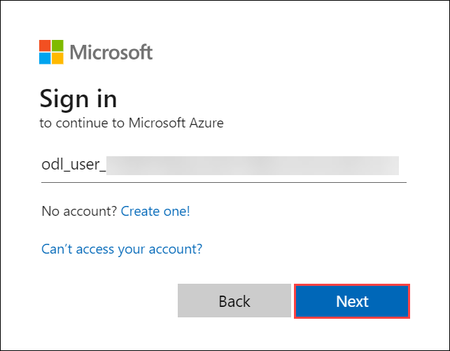

# Getting Started with Your AZ-140: Configuring and Operating Microsoft Azure Virtual Desktop Workshop
 
Welcome to your AZ-140: Configuring and Operating Microsoft Azure Virtual Desktop workshop! We've prepared a seamless environment for you to explore and learn about designing, implementing, managing, and maintaining Microsoft Azure Virtual Desktop experiences and remote apps for any device. Let's begin by making the most of this experience:
 
## Accessing Your Lab Environment
 
Once you're ready to dive in, your virtual machine and lab guide will be right at your fingertips within your web browser.

   

### Virtual Machine & Lab Guide
 
Your virtual machine is your workhorse throughout the workshop. The lab guide is your roadmap to success.
 
## Exploring Your Lab Resources
 
To get a better understanding of your lab resources and credentials, navigate to the **Environment Details** tab.

   
 
## Utilizing the Split Window Feature
 
For convenience, you can open the lab guide in a separate window by selecting the **Split Window** button from the Top right corner.
 

 
## Managing Your Virtual Machine
 
Feel free to start, stop, or restart your virtual machine as needed from the **Resources** tab. Your experience is in your hands!
 

## Let's Get Started with Azure Portal
1. On your virtual machine, click on the Azure Portal icon as shown below:
 
   .png)
 
2. You'll see the **Sign into Microsoft Azure** tab. Here, enter your credentials:
 
   - **Email/Username:** <inject key="AzureAdUserEmail"></inject>
 
      
 
3. Next, provide your password:
 
   - **Password:** <inject key="AzureAdUserPassword"></inject>
 
     
 
4. If prompted to stay signed in, you can click "No."
 
5. If a **Welcome to Microsoft Azure** pop-up window appears, simply click "Maybe Later" to skip the tour.
 
6. Click "Next" from the bottom right corner to embark on your Lab journey!
 
   .png)
 
Now you're all set to explore the powerful world of technology. Feel free to reach out if you have any questions along the way. Enjoy your workshop!

## Use the Clipboard

1. If you are unable to copy and paste content within the bastion session to **az140-dc-vm11** or any other VMs in the  labs, then click the arrows **>>** in the left part, and in the **Clipboard** paste the content in the blank area ***(1)*** and copy it and paste in the bastion session to the respected VM. Then, close the **Clipboard** by selecting the back arrows **<<** ***(2)***.

      .png)

      
 
   
       
