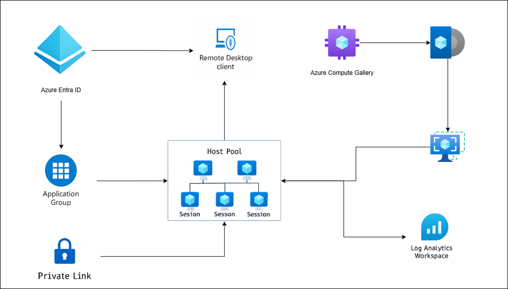
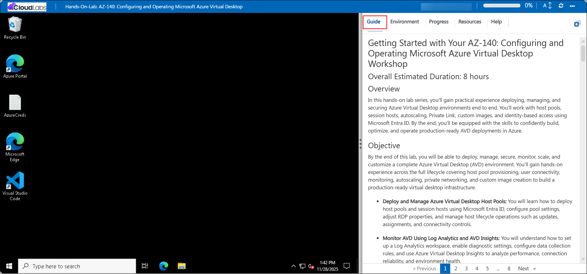
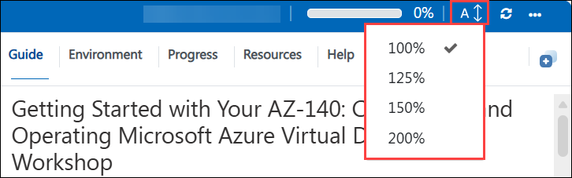
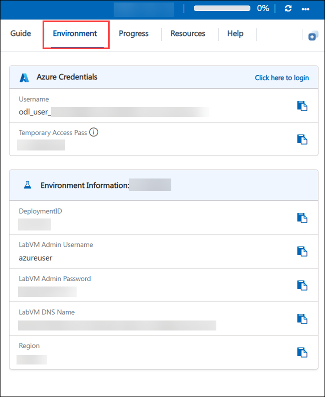
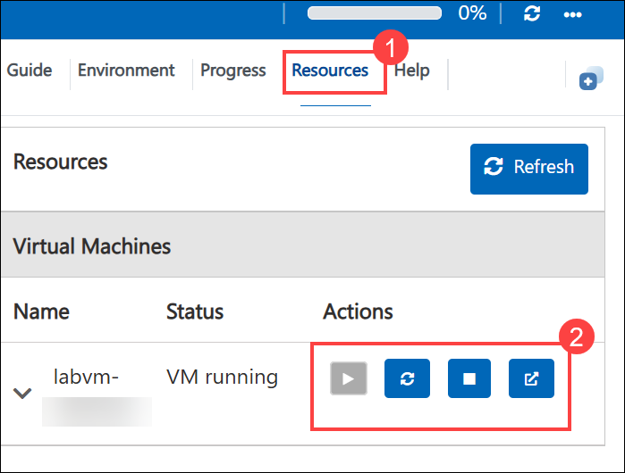
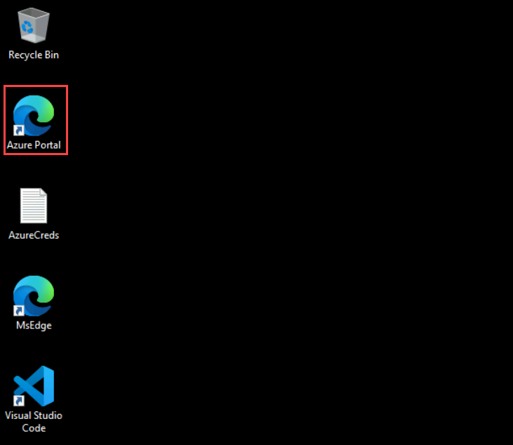
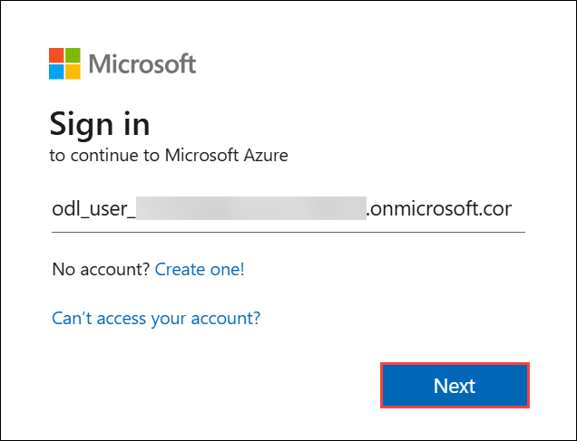
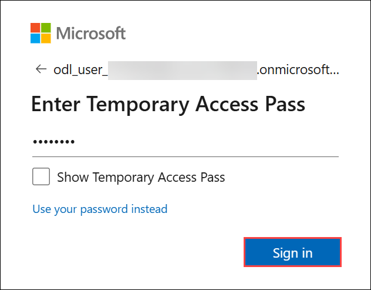
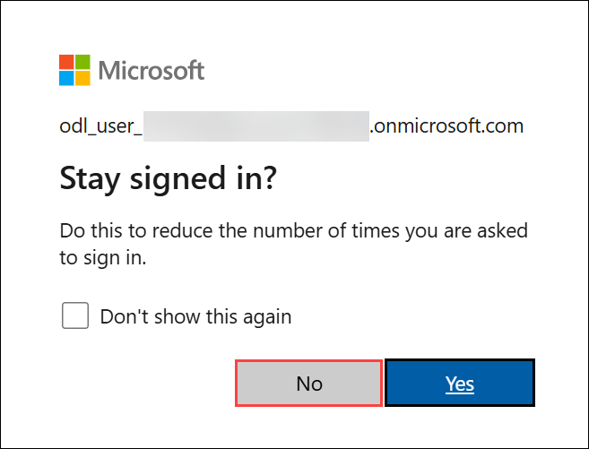

# Getting Started with Your AZ-140: Configuring and Operating Microsoft Azure Virtual Desktop Workshop

## Overall Estimated Duration: 6 Hours

## Overview

In this hands-on lab series, you’ll gain practical experience deploying, managing, and securing Azure Virtual Desktop environments end to end. You’ll work with host pools, session hosts, autoscaling, Private Link, custom images, and identity-based access using Microsoft Entra ID. By the end, you’ll be equipped with the skills to confidently build, optimize, and operate production-ready AVD deployments in Azure.

## Objective

By the end of this lab, you will be able to deploy, manage, secure, monitor, scale, and customize a complete Azure Virtual Desktop (AVD) environment. You’ll gain hands-on experience across the full lifecycle covering host pool provisioning, user connectivity, monitoring, autoscaling, private networking, and custom image creation to build a production-ready virtual desktop infrastructure.

- **Deploy and Manage Azure Virtual Desktop Host Pools:** You will learn how to deploy host pools and session hosts using Microsoft Entra ID, configure pool settings, adjust RDP properties, and manage host lifecycle operations such as updates, assignments, and connectivity controls.

- **Monitor AVD Using Log Analytics and AVD Insights:** You will understand how to set up a Log Analytics workspace, enable diagnostic settings, configure data collection rules, and use Azure Virtual Desktop Insights to analyze performance, connection reliability, and environment health.

- **Connect to Session Hosts Using Microsoft Remote Desktop:** You will learn how to configure client settings, subscribe to workspaces, and validate both desktop sessions and RemoteApp access using multiple Entra ID accounts.

- **Implement and Validate Autoscaling for Session Hosts:** You will configure autoscaling using scaling plans, assign the required RBAC roles, define ramp-up and ramp-down schedules, simulate user load, and observe how AVD automatically powers hosts on or off.

- **Secure AVD Connectivity Using Azure Private Link:** You will learn to create private endpoints for host pools and workspaces, integrate private DNS zones, restrict public access, and validate private-only connectivity from an isolated VM.

- **Build and Deploy Custom Session Host Images:** You will create a managed identity, assign custom RBAC roles, define an Azure Image Builder template, apply customization scripts, publish custom images to an Azure Compute Gallery, and deploy session hosts using your custom image.

### Prerequisites

Participants should have:

- Basic understanding of Azure Virtual Desktop (AVD) components, such as Host Pools, Session Hosts, and Application Groups

- Familiarity with Microsoft Entra ID (formerly Azure AD), including users, groups, and authentication basics.

- Awareness of load balancing methods and auto-scaling concepts in virtual desktop environments.

- Familiarity with monitoring tools like Log Analytics Workspace.

## Architecture

This architecture flow demonstrates how an end-to-end Azure Virtual Desktop environment is deployed and secured, beginning with Entra ID-joined session hosts and pooled host pools for scalable desktop delivery. Centralized monitoring using Log Analytics and AVD Insights provides deep visibility into performance, reliability, and user activity. Autoscaling dynamically adjusts session host capacity based on demand, ensuring cost efficiency and optimal user experience. Private Link is implemented to route AVD workloads through controlled private network paths, and custom images built with Azure Image Builder and Azure Compute Gallery enable consistent, automated provisioning across the environment.

## Architecture Diagram

 

## Explanation of Components

The architecture for this lab involves several key components:

- **Azure Virtual Desktop Host Pools & Session Hosts:** Host pools serve as the compute layer of the environment, providing pooled, multi-session Windows desktops through Entra ID-joined session hosts. These VMs deliver user sessions, follow AVD load-balancing rules, and support autoscaling, custom images, and Private Link-secured connections.

- **Microsoft Entra ID:** Entra ID handles identity and access for all users and session hosts in the environment. It supports secure authentication, group-based assignment for desktop and RemoteApp access, and seamless sign-in to AVD resources without traditional domain controllers.

- **Application Groups (Desktop & RemoteApp):** Application Groups define which desktops or RemoteApps users can access. Desktop groups provide full-session desktops, while RemoteApp groups publish individual apps. You assign these groups to Entra ID users or groups to control access cleanly.

- **Log Analytics Workspace & AVD Insights:** Log Analytics acts as the centralized telemetry pipeline, collecting diagnostics, performance counters, errors, events, and connection data from AVD components. AVD Insights then visualizes all this data, providing dashboards for troubleshooting, performance tuning, and capacity analysis.

- **Autoscaling (Scaling Plans):** Scaling plans automatically power session hosts on or off based on schedules and host pool utilization. This component helps optimize cost while ensuring there are always enough VMs to handle user load.

- **Azure Private Link (Private Endpoints):** Private Link secures all AVD traffic including feed discovery, feed downloads, and session connections by routing it through private endpoints. This eliminates public exposure and enforces private-only access within the virtual network.

- **Private DNS Zones:** Private DNS zones support name resolution for AVD Private Link endpoints, ensuring clients and session hosts can privately resolve AVD service endpoints without relying on public DNS infrastructure.

- **Azure Compute Gallery (ACG):** ACG stores image definitions and versions used to deploy standardized session hosts. It simplifies versioning, replication, and scaling of custom AVD images across regions and deployments.

- **Azure Image Builder (AIB) Templates:** Image Builder automates the creation of custom session host images. It uses a managed identity and RBAC to run build scripts, OS optimizations, AVD tweaks, and security hardening before publishing images into Azure Compute Gallery.

# Getting Started with Lab

Welcome to your AZ-140: Configuring and Operating Microsoft Azure Virtual Desktop workshop! We've prepared a seamless environment for you to explore and learn about designing, implementing, managing, and maintaining Microsoft Azure Virtual Desktop experiences and remote apps for any device. Let's begin by making the most of this experience:

## Accessing Your Lab Environment

Once you're ready to dive in, your virtual machine and **Guide** will be right at your fingertips within your web browser.
 
 

## Lab Guide Zoom In/Zoom Out

To adjust the zoom level for the environment page, click the **A↕ : 100%** icon located next to the timer in the lab environment.

 

## Virtual Machine & Guide
 
Your virtual machine is your workhorse throughout the workshop. The guide is your roadmap to success.
 
## Exploring Your Lab Resources
 
To get a better understanding of your lab resources and credentials, navigate to the **Environment** tab.
 
 
 
## Utilizing the Split Window Feature
 
For convenience, you can open the guide in a separate window by selecting the **Split Window** button from the top right corner.
 
 
 
## Managing Your Virtual Machine
 
Feel free to **Start, Stop, or Restart (2)** your virtual machine as needed from the **Resources (1)** tab. Your experience is in your hands!
 
 

## Lab Progress

You can use the **Progress** tab to track your progress while working on the lab. A score will be provided after successful validation.

## Let's Get Started with Azure Portal
 
1. On your virtual machine, click on the **Azure Portal** icon as shown below:
 
     
 
2. You'll see the **Sign into Microsoft Azure** tab. Here, enter your credentials:
 
   - **Email/Username:** <inject key="AzureAdUserEmail"></inject>
 
      
 
3. Next, provide your password:
 
   - **Temporary Access Pass:** <inject key="AzureAdUserPassword"></inject>
 
      
 
4. If prompted to **Stay signed in**, you can click **No.**

     
 
5. If a **Welcome to Microsoft Azure** pop-up window appears, simply click **Maybe later**.

     
   
Now you're all set to explore the powerful world of technology. Feel free to reach out if you have any questions along the way. Enjoy your workshop!

## Support Contact

The CloudLabs support team is available 24/7, 365 days a year, via email and live chat to ensure seamless assistance at any time. We offer dedicated support channels tailored specifically for both learners and instructors, ensuring that all your needs are promptly and efficiently addressed.

Learner Support Contacts:

* Email Support: cloudlabs-support@spektrasystems.com 
* Live Chat Support: https://cloudlabs.ai/labs-support

Now, click on Next from the lower right corner to move on to the next page.

  

### Happy Learning!!