# Lab 01 - Deploy host pools and session hosts by using the Azure portal (Entra ID)

## Estimated Duration: 60 Minutes

## Overview

In this lab, you will deploy a Azure Virtual Desktop environment using Microsoft Entra joined session hosts. You will create the required virtual network, host pool, session hosts, application groups, and workspace. You will also configure group-based assignments to control access within the environment. By the end, you will have a fully functional AVD deployment ready.

## Lab Objectives
  
In this lab, you will complete the following tasks:

- **Task 1:** Prepare the Azure subscription for deployment of an Azure Virtual Desktop host pool

- **Task 2:** Deploy an Azure Virtual Desktop host pool

- **Task 3:** Create an Azure Virtual Desktop application group

- **Task 4:** Create an Azure Virtual Desktop workspace

- **Task 5:** Grant access to Azure Virtual Desktop host pools
  
### Task 1: Prepare the Azure subscription for deployment of an Azure Virtual Desktop host pool

In this task, you will prepare the Azure subscription for deploying an Azure Virtual Desktop host pool. You'll register the required resource provider, configure Azure Cloud Shell, and create the virtual network and subnet needed for the deployment. You will also verify user group memberships in Microsoft Entra ID to support later configuration steps.

1. In the lab VM, click on the **Azure Portal icon** as shown below:

    
   
    - On the **Sign in to Microsoft Azure** tab, you will see the login screen. Enter your credentials:
      
        * **Email/Username:** <inject key="AzureAdUserEmail"></inject>
    
    - Next, provide your password:

        * **Temporary Access Pass:** <inject key="AzureAdUserPassword"></inject>

1. On the Azure portal homepage, click the **\[>\_] Cloud Shell (1)** button located to the right of the **Copilot** tab at the top. This opens a new Cloud Shell session. In the **Welcome to Azure Cloud Shell** window, choose **PowerShell (2)**.

    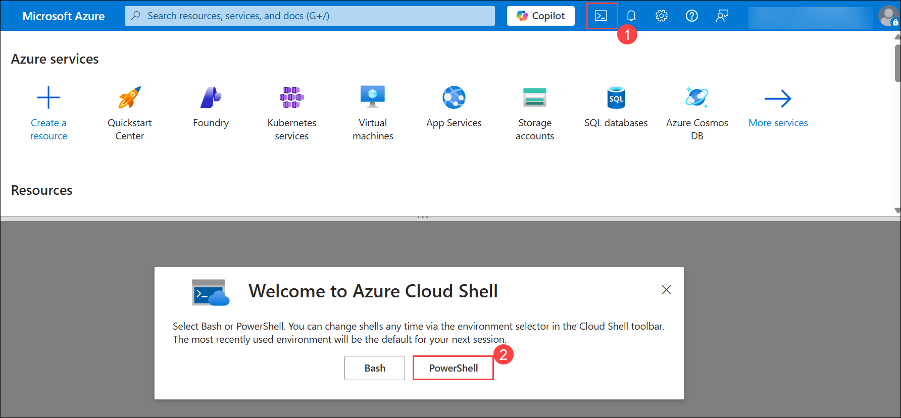

1. In the **Getting started** window, ensure **No storage account required (1)** is selected. From the **Subscription** drop-down, choose **Default subscription (2)**, then click **Apply (3)**.
   
      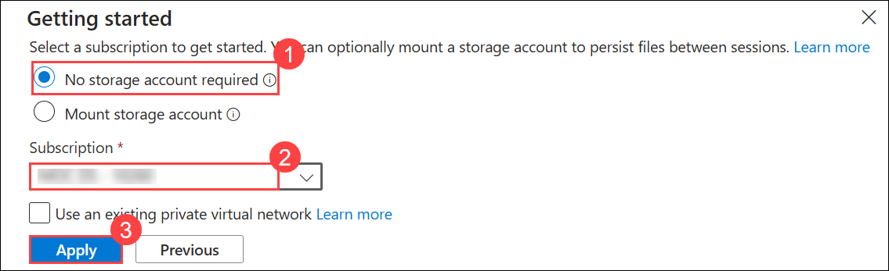

1. In the PowerShell session in the Azure Cloud Shell pane, run the following command to register the **Microsoft.DesktopVirtualization** resource provider:

    ```powershell
    Register-AzResourceProvider -ProviderNamespace Microsoft.DesktopVirtualization
    ```

    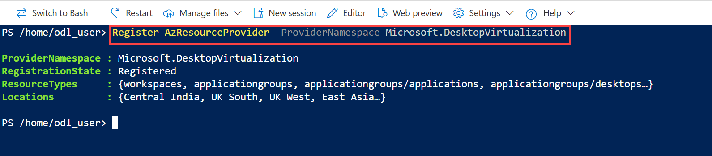
   
    > **Note:** Do not wait for the registration to complete. This might take a couple of minutes.

1. Close the Cloud Shell pane.

1. On the Azure portal, in the **Search resources, services and docs (G+/)** box at the top of the portal, search for **Virtual networks (1)** and select **Virtual networks (2)**.   

     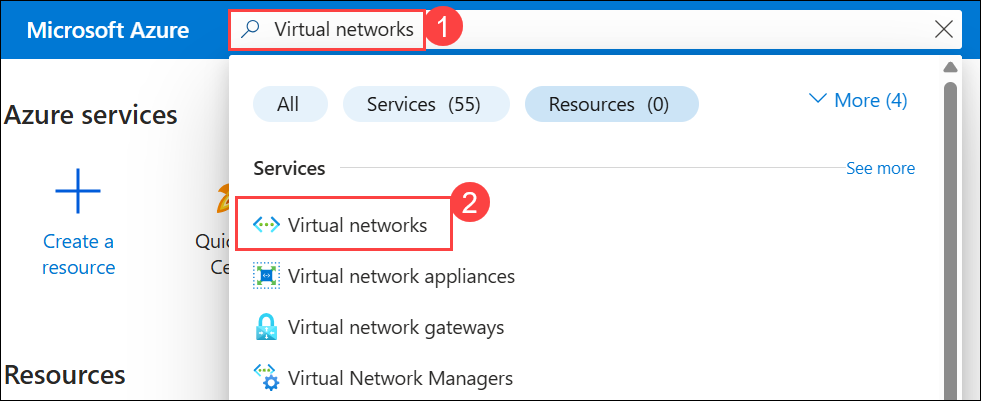

1. Select **+ Create** on the **Network foundation | Virtual networks** page.

     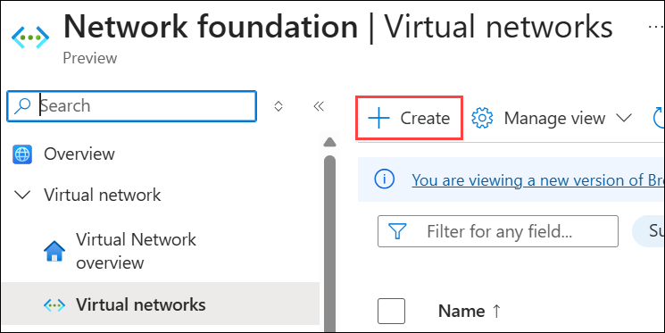

1. On the **Basics** tab of the **Create virtual network** page, specify the following settings and select **Next (7)**:

    |Setting|Value|
    |---|---|
    |Subscription|Choose the default subscription **(1)**|
    |Resource group|Select **Create new (2)**, enter `az140-11e-RG` in the Name field **(3)**, and then select **OK (4)**|
    |Virtual network name|**az140-vnet11e (5)**|
    |Region|**<inject key="Region" enableCopy="false" /> (6)**|

     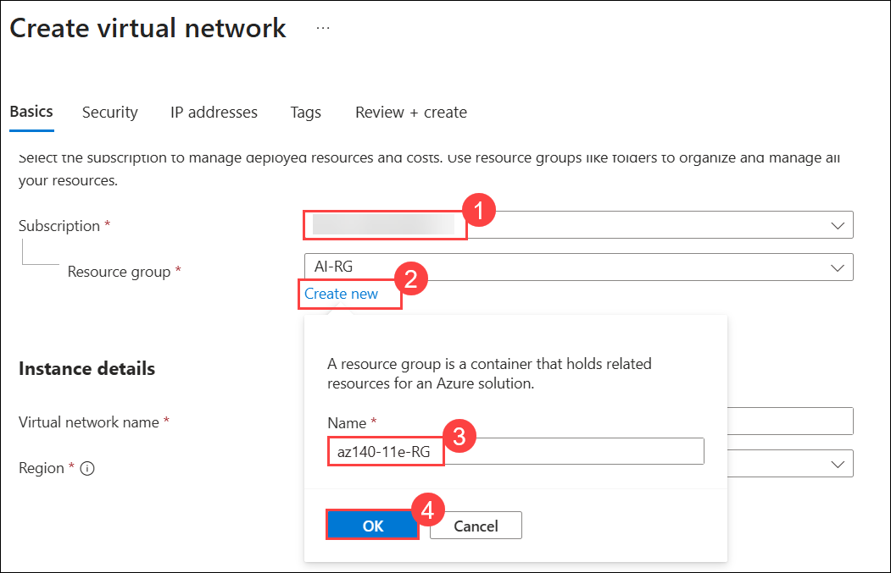

     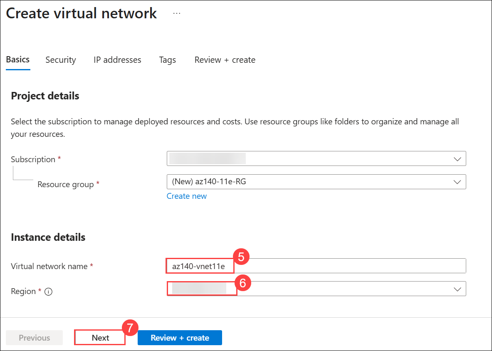

1. On the **Security** tab, accept the default settings and select **Next**.
   
1. On the **IP addresses** tab, apply the following settings (modify the default if needed):

    |Setting|Value|
    |---|---|
    |IP address space|**10.20.0.0/16 (1)**|

    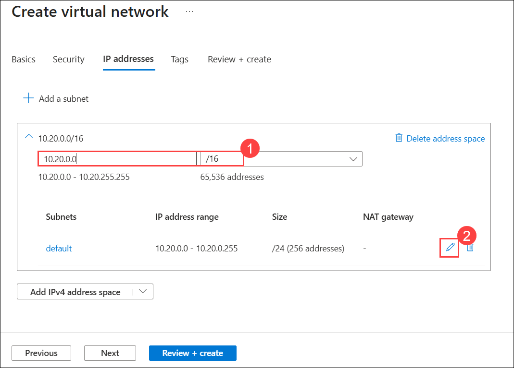

1. Select the **edit (pencil) (2)** icon next to the **default** subnet entry, in the **Edit** pane, specify the following settings (leave others with their existing values) and select **Save (4)**:

    |Setting|Value|
    |---|---|
    |Name|**hp1-Subnet (1)**|
    |Starting address|**10.20.1.0 (2)**|
    |Enable private subnet (no default outbound access)|Disabled **(3)**|

     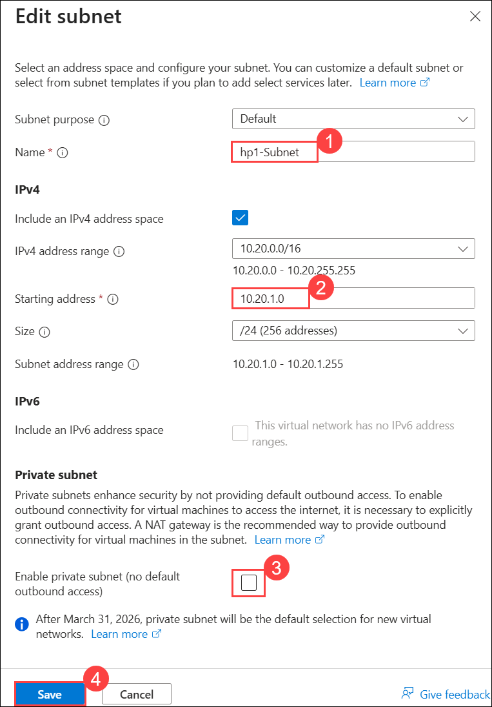

1. Back on the **IP addresses** tab, select **Review + create**.

   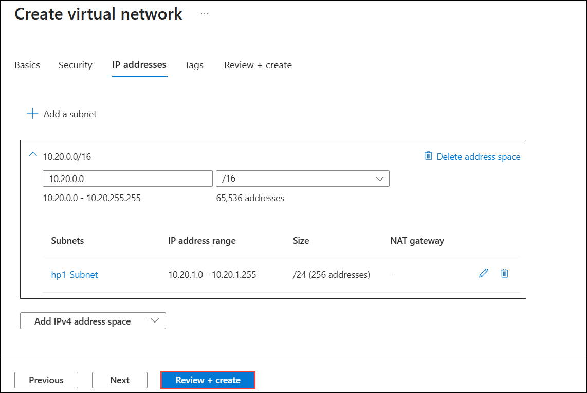

1. On the **Review + create** tab, select **Create**.

    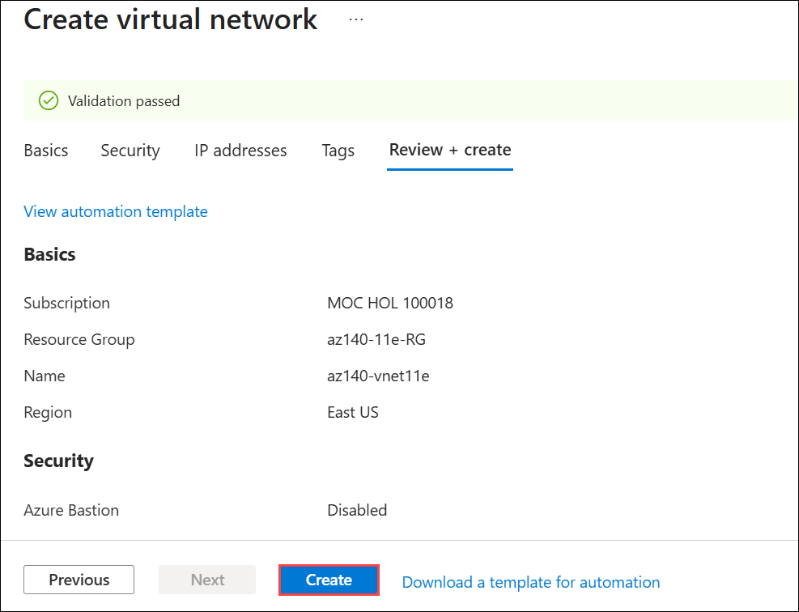

    > **Note:** Do not wait for the provisioning process to complete. This typically takes less than 1 minute.

1. In the Azure portal, search for **Microsoft Entra ID (1)** and select **Microsoft Entra ID (2)**.

    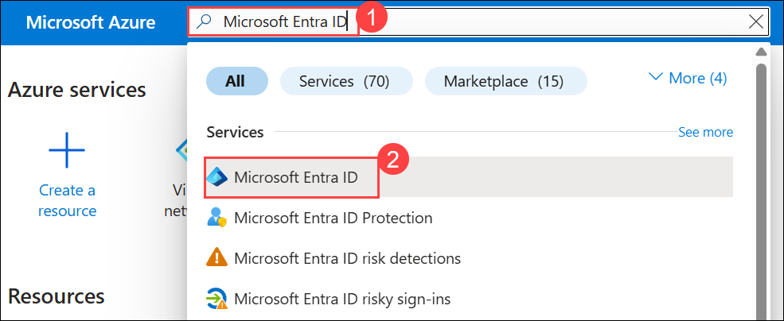

1. On the **Overview** page of the Microsoft Entra tenant associated with your subscription, in the **Manage** section of the vertical navigation menu, select **Users**.

    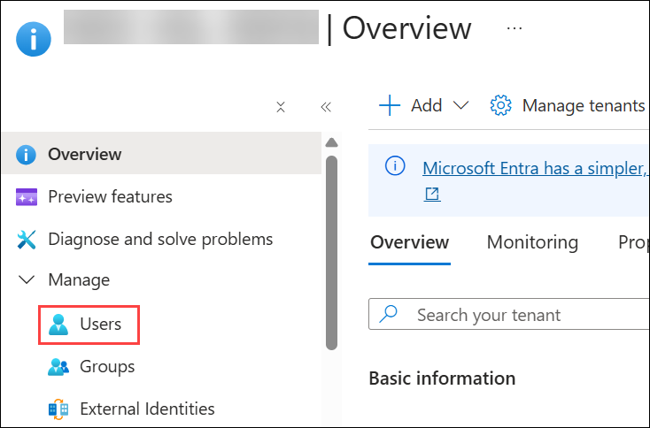

1. On the **Users** page, in the **Search** text box, enter the name of the **ODL_User<inject key="DeploymentID" enableCopy="false"/>** account listed on the Resources tab on the right side of the lab session window.
   
1. In the list of results of the search, select the user account entry with the matching name.
   
1. On the page displaying the properties of the user account, in the **Manage** section of the vertical navigation menu, select **Groups (1)**.
   
1. On the **Groups** page, record the name of the group starting with the **AVD-DAG (2)** prefix (you will need it later in this lab).
   
    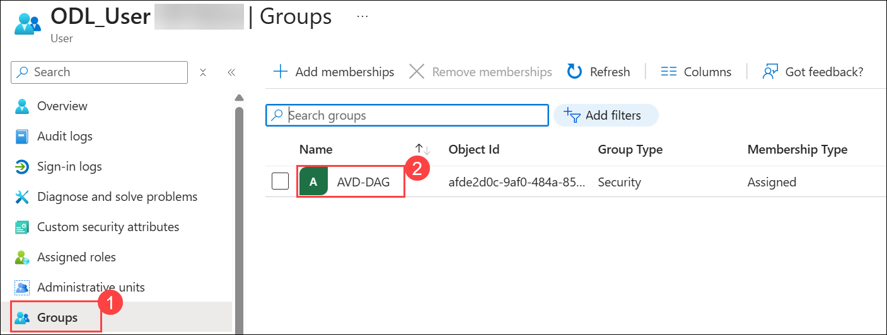
   
1. Navigate back to the **Users** page, in the **Search** text box, enter the name of the `user2_avd` account listed on the Resources tab on the right side of the lab session window.
   
1. In the list of results of the search, select the user account entry with the matching name.
   
1. On the page displaying the properties of the user account, in the **Manage** section of the vertical navigation menu, select **Groups (1)**.
   
1. On the **Groups** page, record the name of the group starting with the **AVD-RemoteApp (2)** prefix (you will need it later in this lab).

     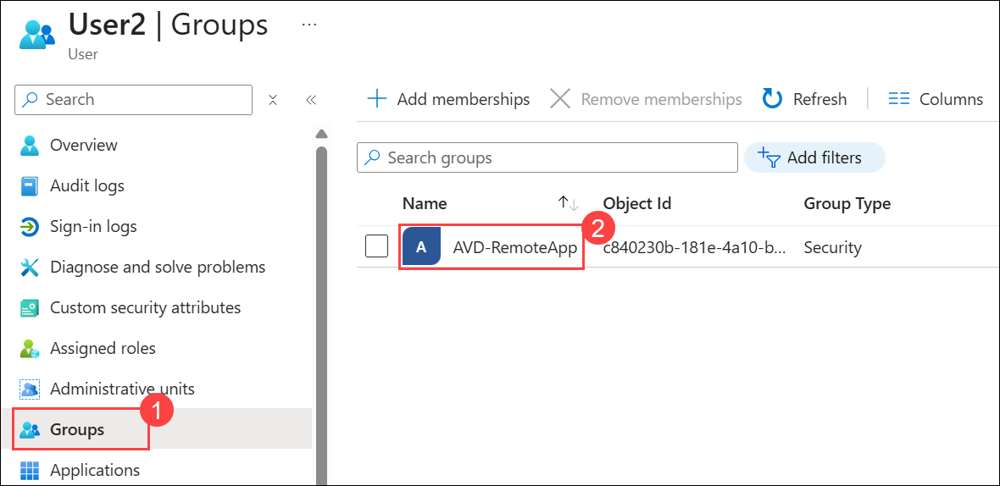

> **Congratulations** on completing the task! Now, it's time to validate it. Here are the steps:
>
> - Hit the Validate button for the corresponding task. If you receive a success message, you can proceed to the next task.
> - If not, carefully read the error message and retry the step, following the instructions in the lab guide.
> - If you need any assistance, please contact us at cloudlabs-support@spektrasystems.com. We are available 24/7 to help.
<validation step="852debdc-bac0-49c9-ad23-ca05d6a48fd8" />

### Task 2: Deploy an Azure Virtual Desktop host pool

In this task, you will deploy an Azure Virtual Desktop host pool and configure its basic properties. You will also provision session host VMs, define their settings, and finalize the host pool deployment.

1. In the Azure portal, search for**Azure Virtual Desktop (1)** and select **Azure Virtual Desktop (2)** from the list.

    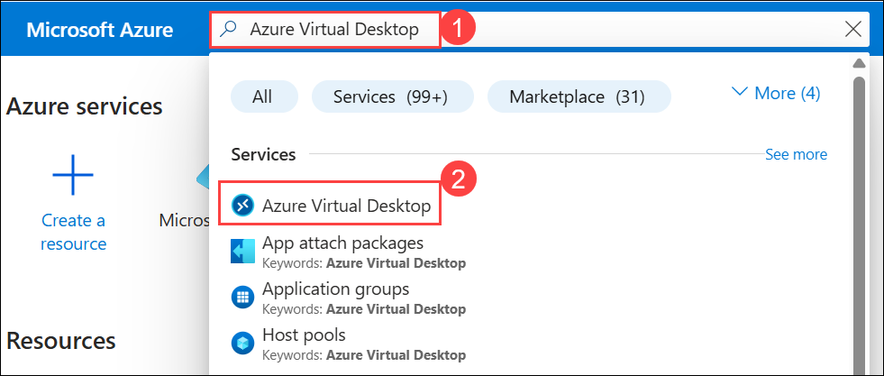

1. On the **Azure Virtual Desktop** page, in the **Manage (1)** section of the vertical navigation menu, select **Host pools (2)** and, on the **Azure Virtual Desktop \| Host pools** page, select **+ Create (3)**.

    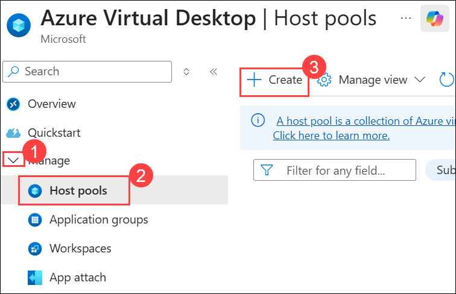
   
1. On the **Basics** tab of the **Create a host pool** page, specify the following settings and select **Next : Session hosts > (10)** (leave other settings with their default values):

    |Setting|Value|
    |---|---|
    |Subscription|Choose the default subscription **(1)**|
    |Resource group|Select **az140-11e-RG (2)**|
    |Host pool name|**az140-21-hp1 (3)**|
    |Location|**<inject key="Region" enableCopy="false" /> (4)**|
    |Validation environment|**No (5)**|
    |Preferred app group type|**Desktop (6)**|
    |Host pool type|**Pooled (7)**|
    |Create Session Host Configuration|**No (8)**|
    |Load balancing algorithm|**Breadth-first (9)**|

    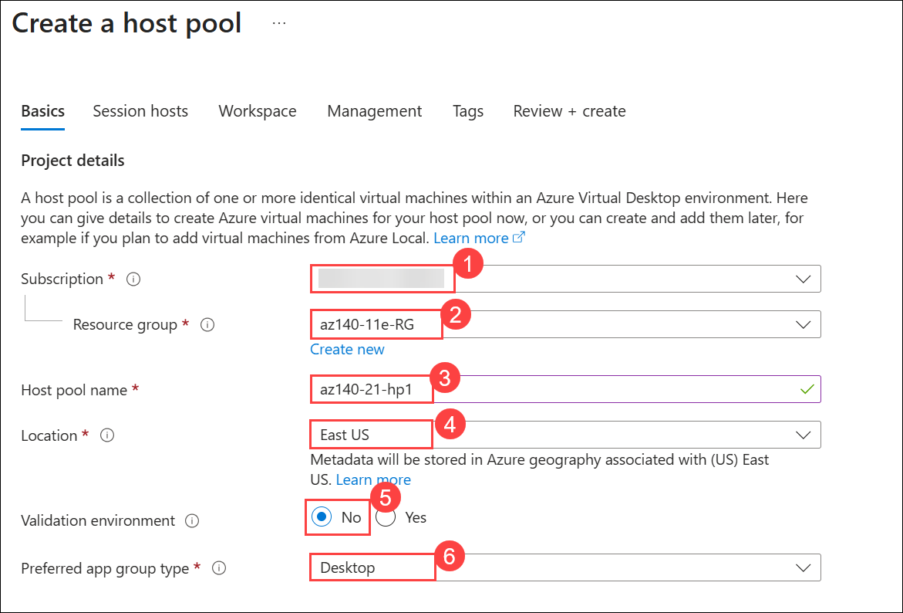

    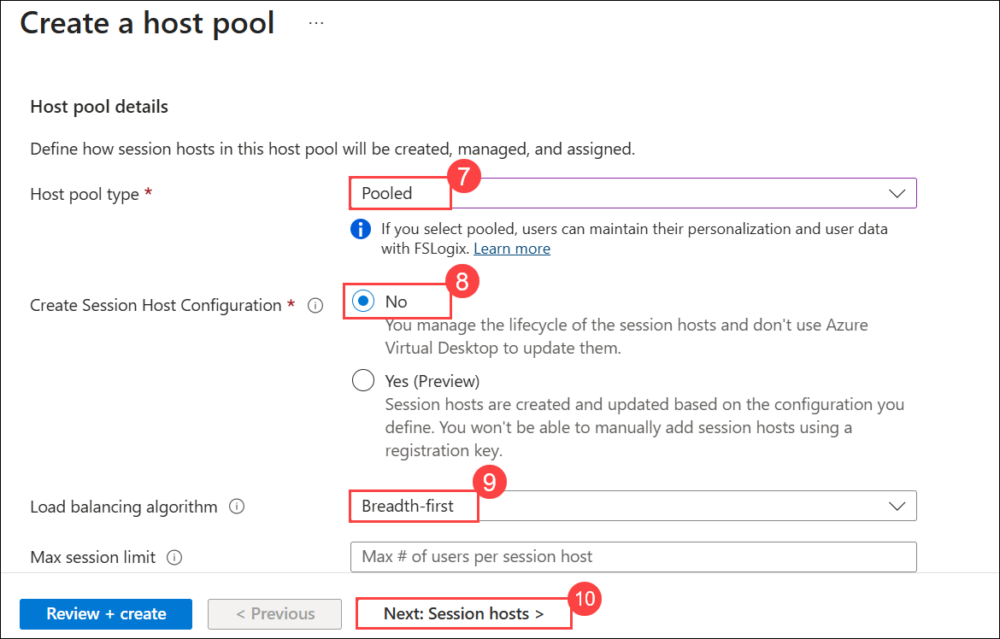

    > **Note:** When using the Breadth-first load balancing algorithm, the max session limit parameter is optional.

1. On the **Session hosts** tab of the **Create a host pool** page, specify the following settings and select **Next : Workspace > (23)** (leave other settings with their default values):

    |Setting|Value|
    |---|---|
    |Add virtual machines|**Yes (1)**|
    |Resource group|**az140-11e-RG (2)**|
    |Name prefix|**sh-<inject key="DeploymentID" enableCopy="false"/> (3)**|
    |Virtual machine type|**Azure virtual machine (4)**|
    |Virtual machine location|**<inject key="Region" enableCopy="false" /> (5)**|
    |Availability options|**No infrastructure redundancy required (6)**|
    |Security type|**Trusted launch virtual machines (7)**|

    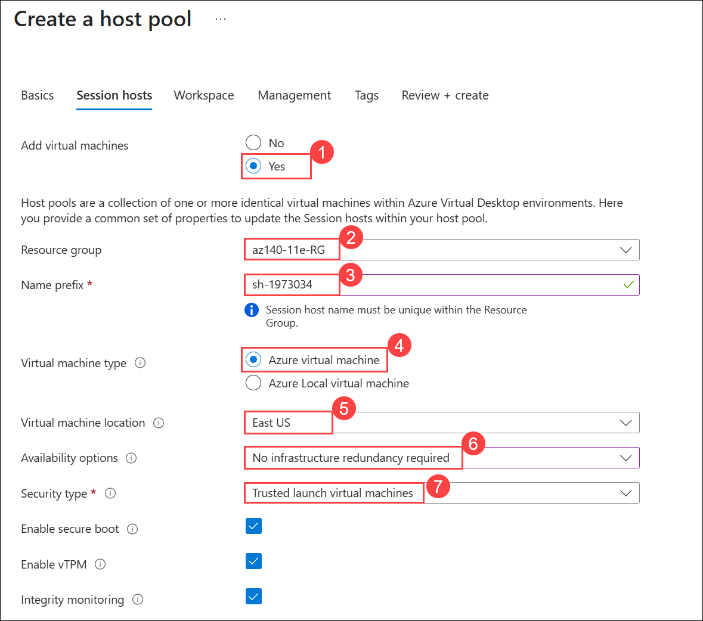
   
    |Setting|Value|
    |---|---|
    |Image|**Windows 11 Enterprise multi-session, Version 23H2 + Microsoft 365 Apps (8)**|
    |Virtual machine size| Click on **Change Size** select **Standard DC2s_v3 (9)**|
    |Number of VMs|**2 (10)**|
    |OS disk type|**Standard SSD (11)**|
    |OS disk size|**Default size (128GiB) (12)**|
    |Boot Diagnostics|**Enable with managed storage account (recommended) (13)**|
    |Virtual network|**az140-vnet11e (14)**|
    |Subnet|**hp1-Subnet (15)**|
    |Network security group|**Basic (16)**|
    |Public inbound ports|**No (17)**|

    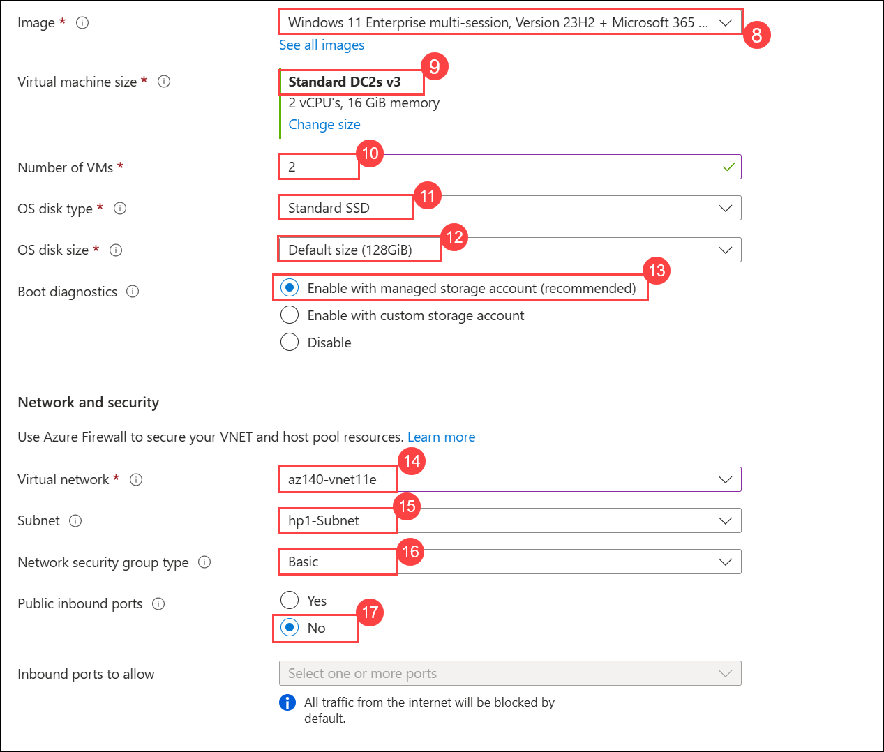

    >**Note:** In the Images section, click **See all images**, scroll down, click **Select (1)** under the Windows multi-session image tile, and choose **Windows 11 Enterprise multi-session, Version 23H2 + Microsoft 365 Apps (2)**.

     

    |Setting|Value|
    |---|---|
    |Select which directory you would like to join|**Microsoft Entra ID (18)**|
    |Enroll VM with Intune|**No (19)**|
    |User name|**Student (20)**|
    |Password|**Password.1!! (21)**|
    |Confirm password|**Password.1!! (22)**|

    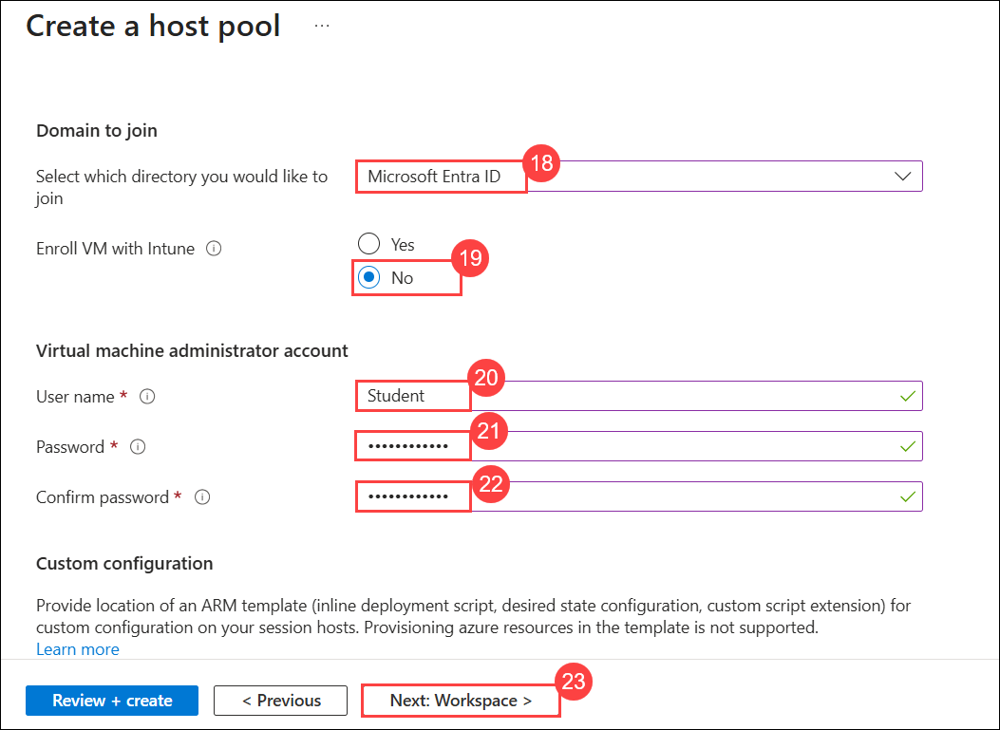

    > **Note:** The password should be at least 12 characters in length and consist of a combination of lower-case characters, upper-case characters, digits, and special characters. For details, refer to the information about [the password requirements when creating an Azure VM](https://learn.microsoft.com/en-us/azure/virtual-machines/windows/faq#what-are-the-password-requirements-when-creating-a-vm-).

1. On the **Workspace** tab of the **Create a host pool** page, confirm the following setting and select **Review + create (2)**:

    |Setting|Value|
    |---|---|
    |Register desktop app group|**No (1)**|

      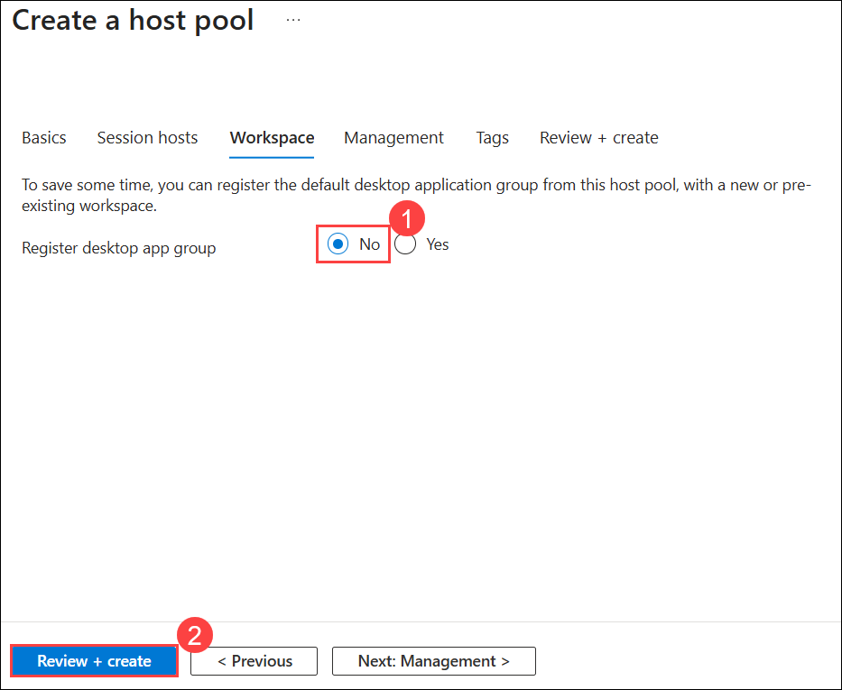

1. On the **Review + create** tab of the **Create a host pool** page, select **Create**.

    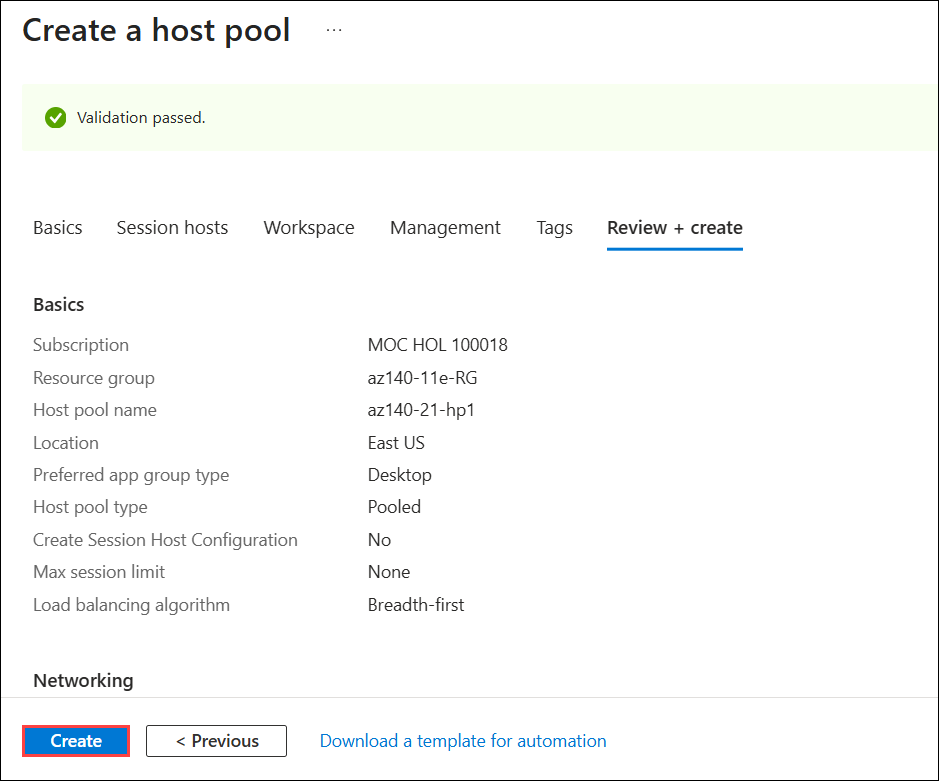
   
    > **Note:** Please wait for the deployment to complete. This may take approximately 20 minutes.

> **Congratulations** on completing the task! Now, it's time to validate it. Here are the steps:
>
> - Hit the Validate button for the corresponding task. If you receive a success message, you can proceed to the next task.
> - If not, carefully read the error message and retry the step, following the instructions in the lab guide.
> - If you need any assistance, please contact us at cloudlabs-support@spektrasystems.com. We are available 24/7 to help.
<validation step="3afdd737-6185-4304-8123-c5368b79a002" />

### Task 3: Create an Azure Virtual Desktop application group

In this task, you will create Azure Virtual Desktop application groups and configure them with the required applications. You will also assign the appropriate Microsoft Entra groups to enable access to these application groups.

1. In the Azure portal, search for and select **Azure Virtual Desktop** and, on the **Azure Virtual Desktop** page, select **Application groups** under the **Manage** section from the left-side menu.

    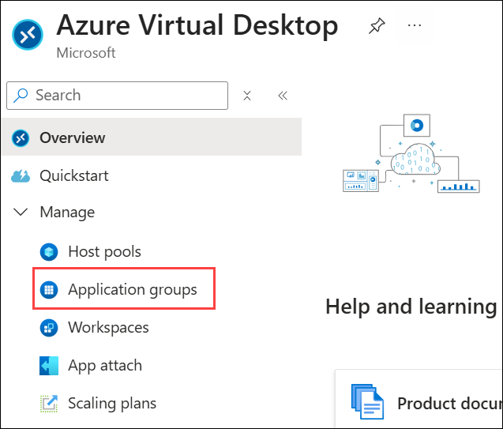
   
1. On the **Azure Virtual Desktop \| Application groups** page, note the existing, auto-generated **az140-21-hp1-DAG** desktop application group, and select it.

    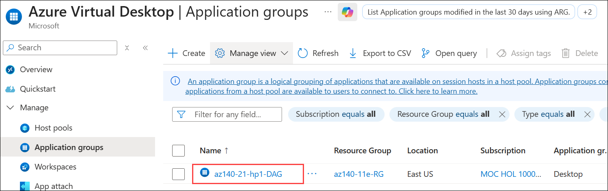
   
1. On the **az140-21-hp1-DAG** page, in the **Manage (1)** section of the vertical navigation menu, select **Assignments (2)**.

1. On the **az140-21-hp1-DAG \| Assignments** page, select **+ Add (3)**.

    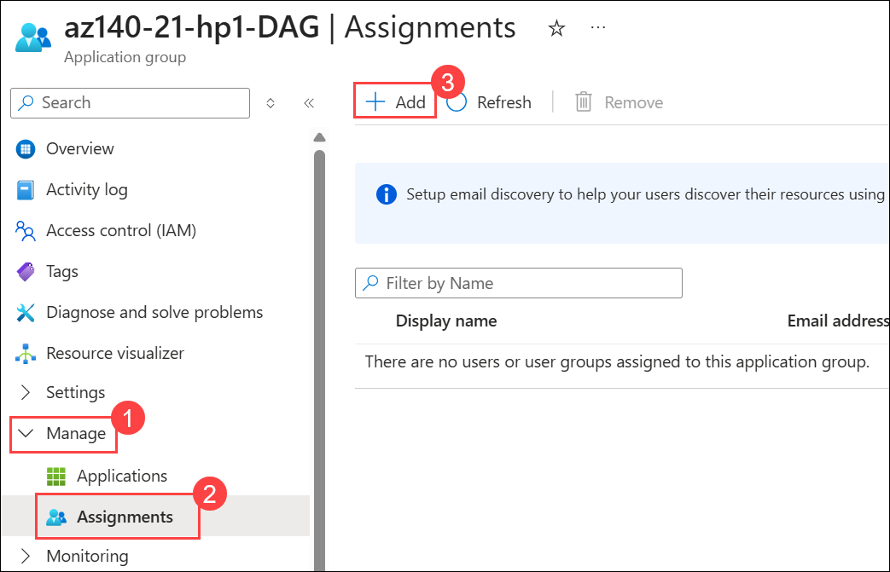

1. On the **Select Microsoft Entra users or user groups** page, select **Groups**, in the search box, type the full name of the **AVD-DAG (1)** group you identified in the first task of this exercise, select the checkbox next to the group name, and click **Select (2)**.

    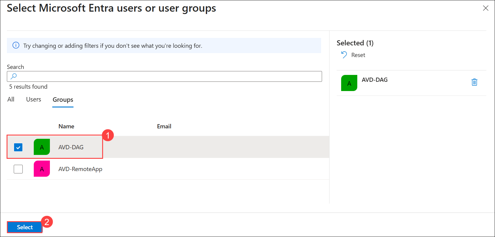

1. Navigate back to the **Azure Virtual Desktop \| Application groups** page, select **+ Create**. 

    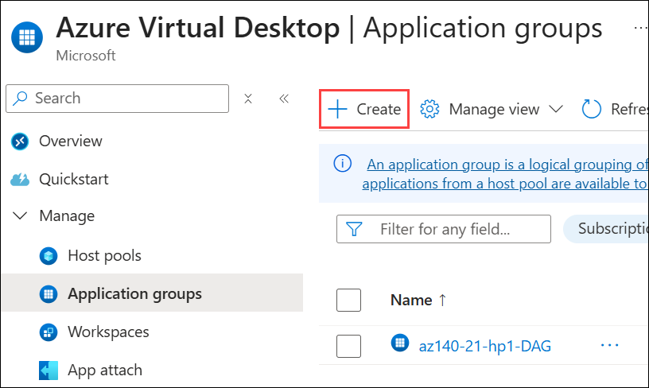

1. On the **Basics** tab of the **Create an application group** page, specify the following settings and select **Next : Applications > (6)**:

    |Setting|Value|
    |---|---|
    |Subscription|Choose the default subscription **(1)**|
    |Resource group|**az140-11e-RG (2)**|
    |Host pool|**az140-21-hp1 (3)**|
    |Application group type|**Remote App (4)**|
    |Application group name|**az140-21-hp1-Office365-RAG (5)**|

     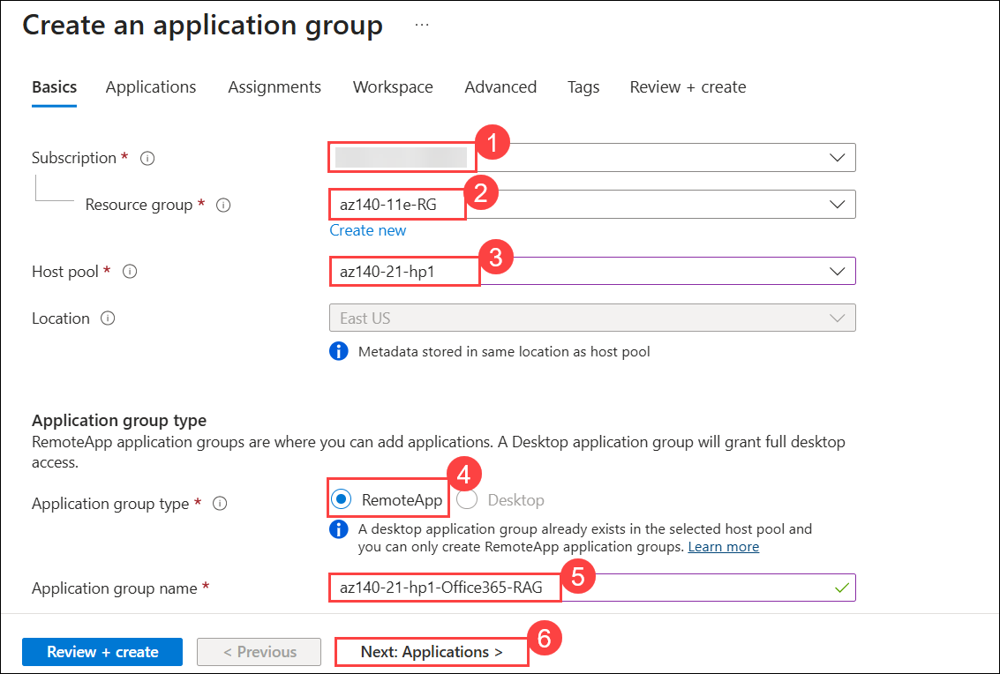

1. On the **Applications** tab of the **Create an application group** page, select **+ Add applications**.

1. On the **Add application** page, specify the following settings and select **Review + add (6)**, then select **Add**:

    |Setting|Value|
    |---|---|
    |Application source|**Start menu (1)**|
    |Application|**Word (2)**|
    |Display name|**Microsoft Word (3)**|
    |Description|**Microsoft Word (4)**|
    |Require command line|**No (5)**|

     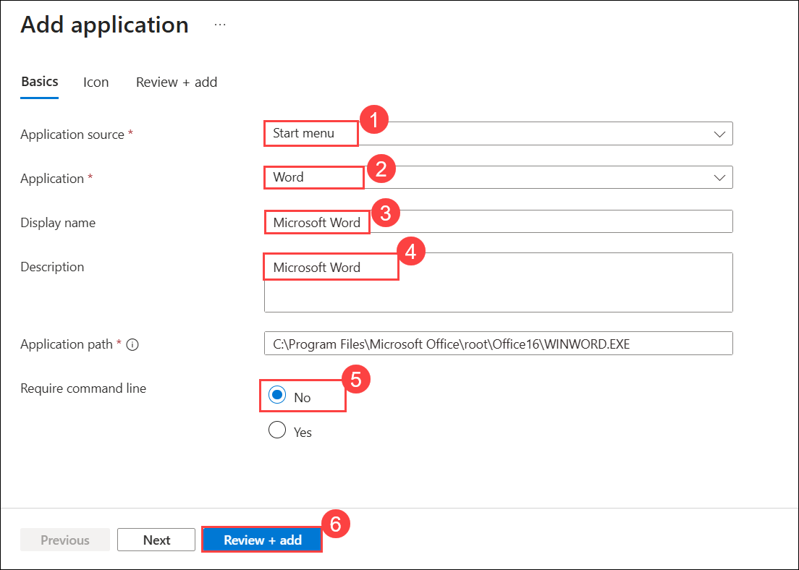

     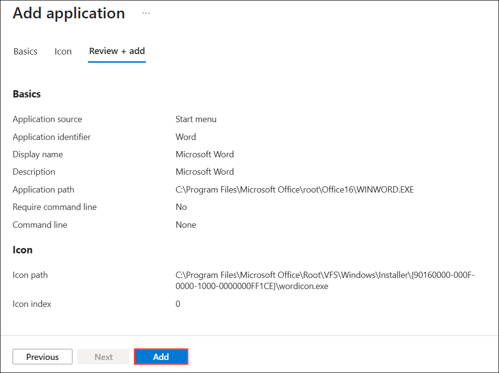

1. Back on the **Applications** tab of the **Create an application group** page, select **+ Add applications**.

    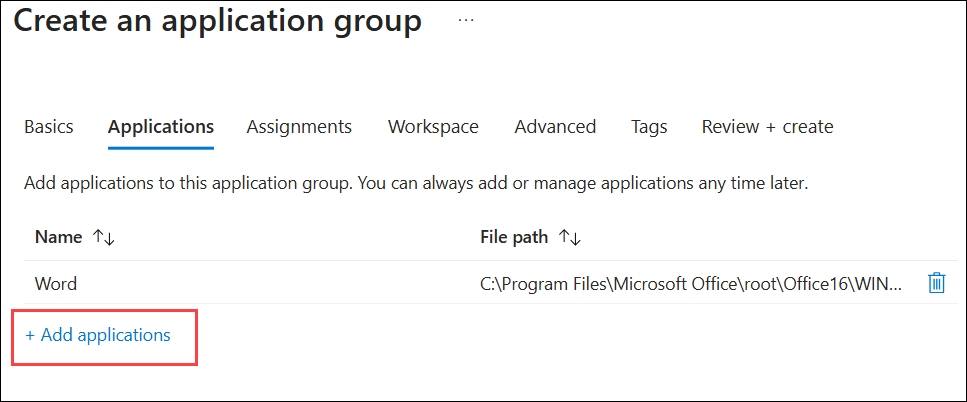

1. On the **Add application** page, specify the following settings and select **Review + add (6)**, then select **Add**:

    |Setting|Value|
    |---|---|
    |Application source|**Start menu (1)**|
    |Application|**Excel (2)**|
    |Display name|**Microsoft Excel (3)**|
    |Description|**Microsoft Excel (4)**|
    |Require command line|**No (5)**|

     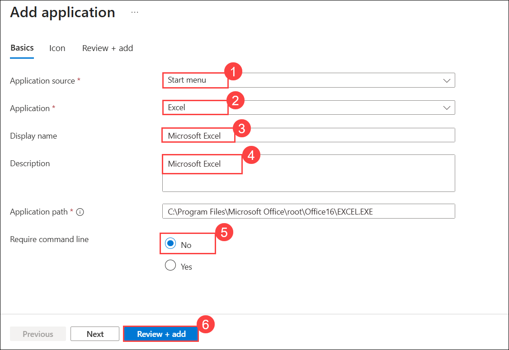

1. Back on the **Applications** tab of the **Create an application group** page, select **+ Add applications**.

1. On the **Add application** page, specify the following settings and select **Review + add (6)**, then select **Add**:

    |Setting|Value|
    |---|---|
    |Application source|**Start menu (1)**|
    |Application|**PowerPoint (2)**|
    |Display name|**Microsoft PowerPoint (3)**|
    |Description|**Microsoft PowerPoint (4)**|
    |Require command line|**No (5)**|

     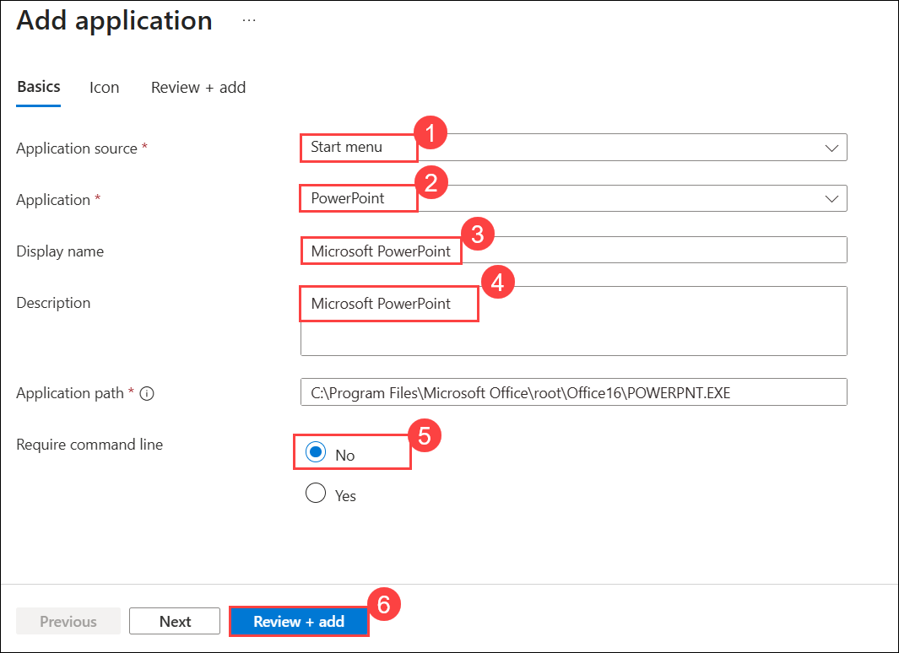

1. Back on the **Applications** tab of the **Create an application group** page, select **Next : Assignments >**.

    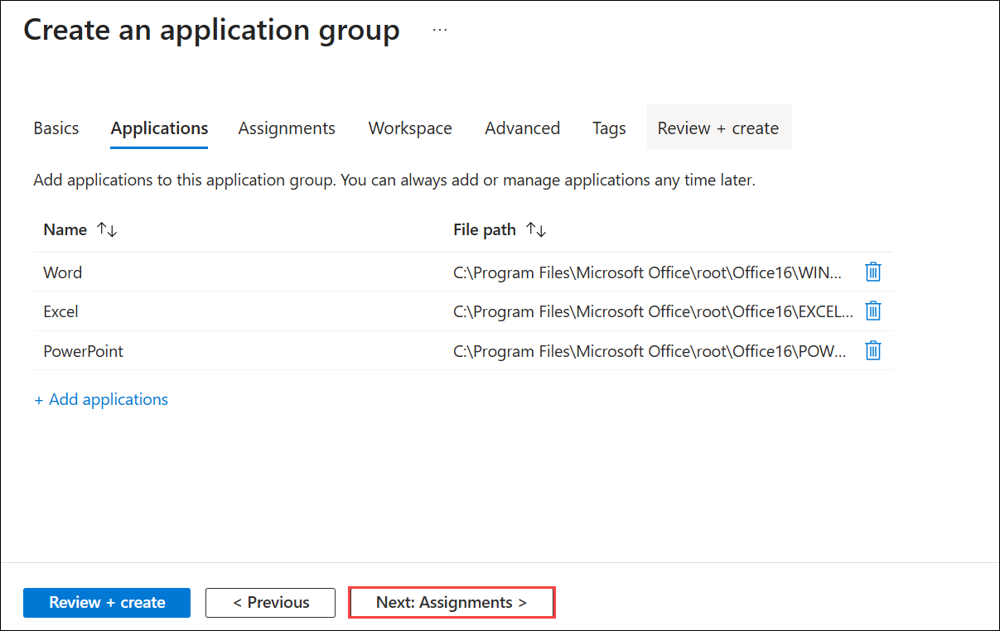

1. On the **Assignments** tab of the **Create an application group** page, select **+ Add Microsoft Entra users or user groups**.

    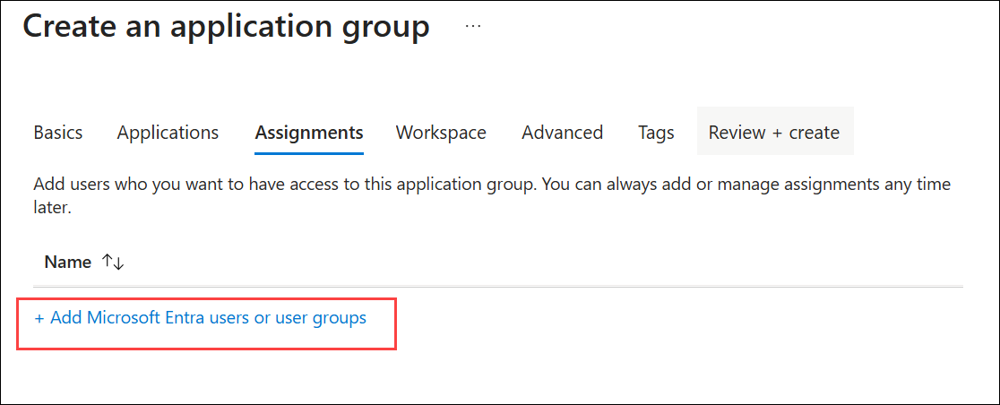

1. On the **Select Microsoft Entra users or user groups** page, select **Groups (1)**, type the full name of the **AVD-RemoteApp (2)** group you identified in the first task of this exercise, select the checkbox next to the group name, and click **Select (3)**.

    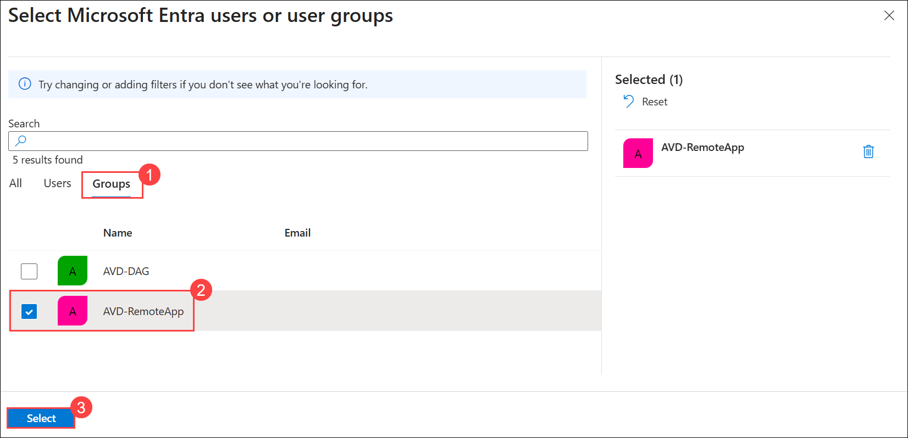

1. Back on the **Assignments** tab of the **Create an application group** page, select **Next : Workspace >**.

    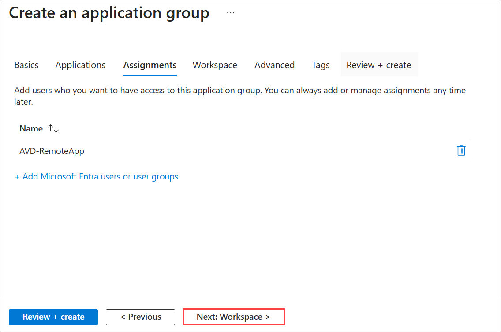

1. On the **Workspace** tab of the **Create a workspace** page, specify the following setting and select **Review + create (2)**:

    |Setting|Value|
    |---|---|
    |Register application group|**No (1)**|

    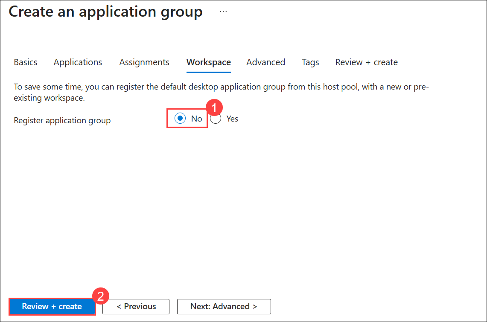

1. On the **Review + create** tab of the **Create an application group** page, select **Create**.

    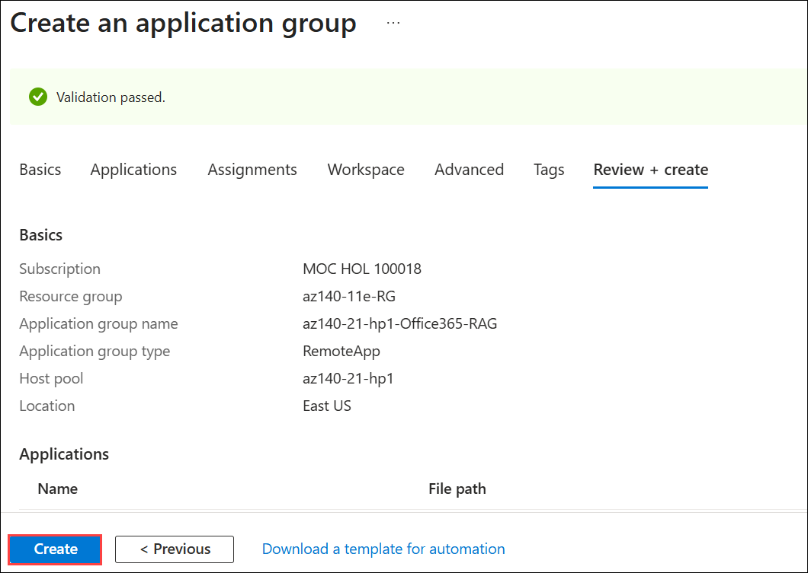

    > **Note:** Wait for the Application Group to be created. This should take less than 1 minute. 

    > **Note:** Next, you will create an application group based on the file path as the application source.

1. In the Azure portal, search for and select **Azure Virtual Desktop** and, on the **Azure Virtual Desktop** page, select **Application groups** under the **Manage** section from the left-side menu.

1. On the **Azure Virtual Desktop \| Application groups** page, select **+ Create**. 

1. On the **Basics** tab of the **Create an application group** page, specify the following settings and select **Next : Applications > (6)**:

    |Setting|Value|
    |---|---|
    |Subscription|Choose the default subscription **(1)**|
    |Resource group|**az140-11e-RG (2)**|
    |Host pool|**az140-21-hp1 (3)**|
    |Application group type|**RemoteApp (4)**|
    |Application group name|**az140-21-hp1-Utilities-RAG (5)**|

    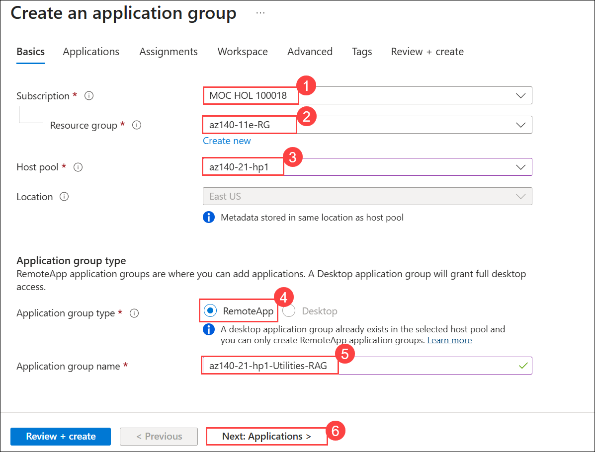

1. On the **Applications** tab of the **Create an application group** page, select **+ Add applications**.

1. On the **Add application** page, on the **Basics** tab, specify the following settings and select **Next (7)**:

    |Setting|Value|
    |---|---|
    |Application source|**File path (1)**|
    |Application path|**C:\Windows\system32\cmd.exe (2)**|
    |Application identifier|**Command Prompt (3)**|
    |Display name|**Command Prompt (4)**|
    |Description|**Windows Command Prompt (5)**|
    |Require command line|**No (6)**|

     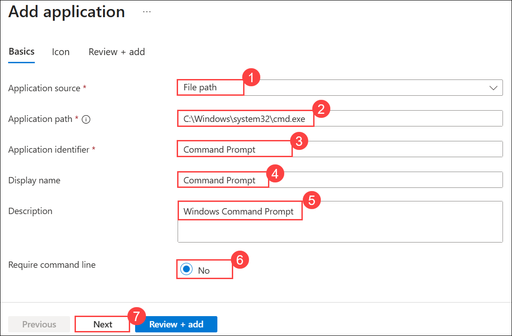

1. On the **Icon** tab, specify the following settings and select **Review + add (3)**, then select **Add**:

    |Setting|Value|
    |---|---|
    |Icon path|**C:\Windows\system32\cmd.exe (1)**|
    |Icon index|0 **(2)**|

     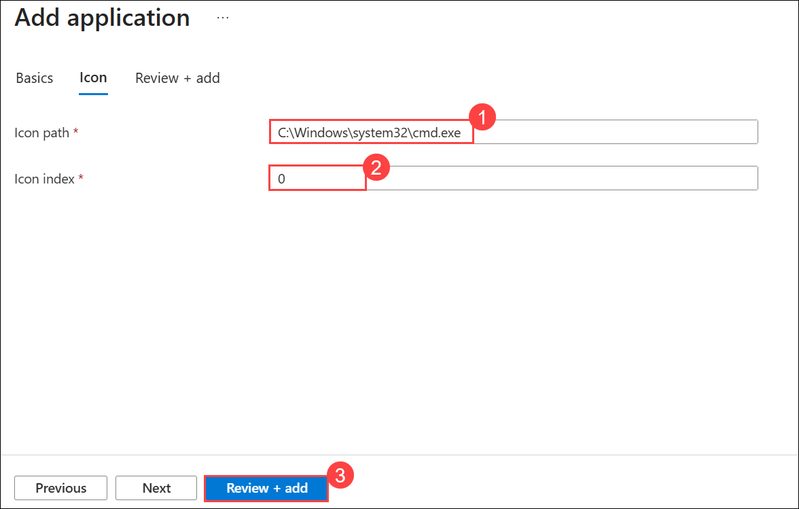
     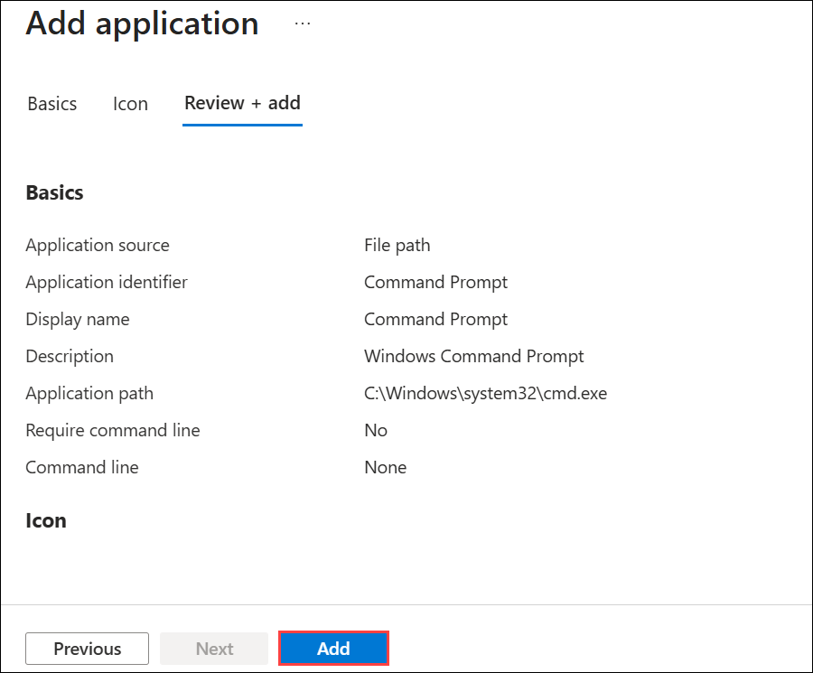

1. Back on the **Applications** tab of the **Create an application group** page, select **Next : Assignments >**.

    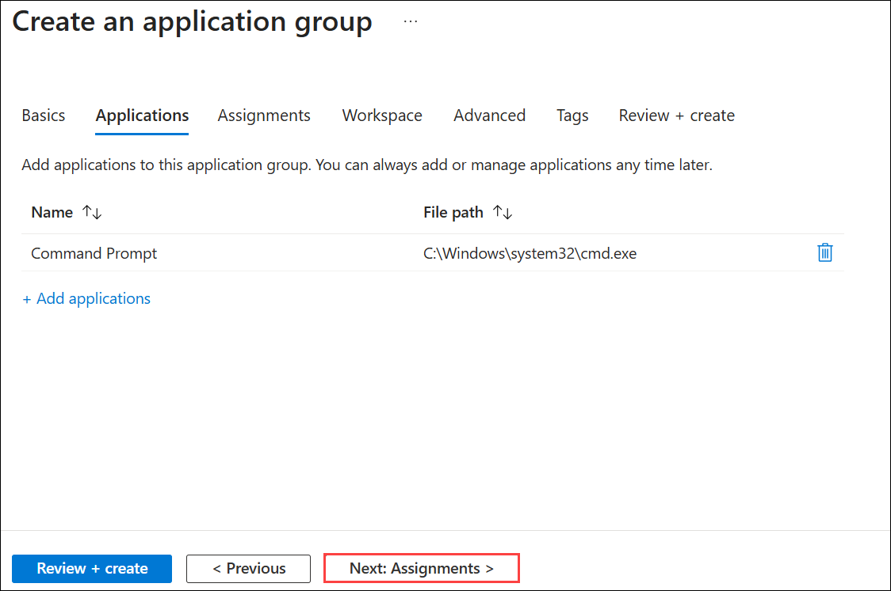

1. On the **Assignments** tab of the **Create an application group** page, select **+ Add Microsoft Entra users or user groups**.

1. On the **Select Microsoft Entra users or user groups** page, select **Groups (1)**, type the full name of the **AVD-RemoteApp (2)** group you identified in the first task of this exercise, select the checkbox next to the group name, and click **Select (3)**.

    

1. Back on the **Assignments** tab of the **Create an application group** page, select **Next : Workspace >**.

    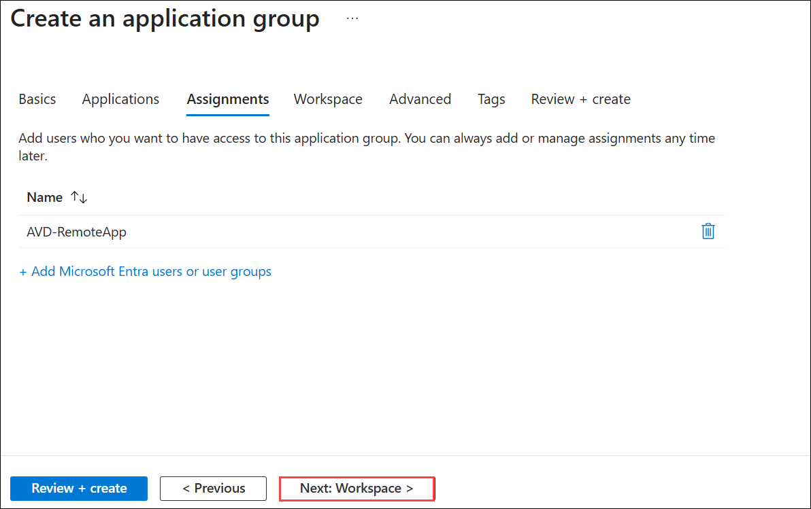

1. On the **Workspace** tab of the **Create a workspace** page, specify the following setting and select **Review + create (2)**:

    |Setting|Value|
    |---|---|
    |Register application group|**No (1)**|

     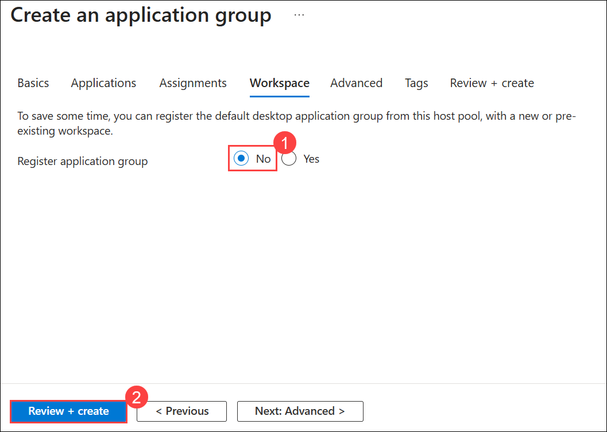

1. On the **Review + create** tab of the **Create an application group** page, select **Create**.

    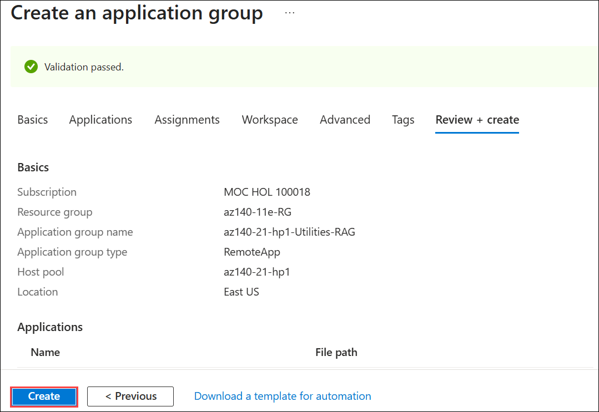

    > **Note:** Wait for the Application Group to be created. This should take less than 1 minute. 

> **Congratulations** on completing the task! Now, it's time to validate it. Here are the steps:
>
> - Hit the Validate button for the corresponding task. If you receive a success message, you can proceed to the next task.
> - If not, carefully read the error message and retry the step, following the instructions in the lab guide.
> - If you need any assistance, please contact us at cloudlabs-support@spektrasystems.com. We are available 24/7 to help.
<validation step="8fe92a7c-5807-4253-bfaf-774a70edd2d3" />

### Task 4: Create an Azure Virtual Desktop workspace

In this task, you will create an Azure Virtual Desktop workspace and register the required application groups to make them available to users.

1. In the Azure portal, search for and select **Azure Virtual Desktop** and, on the **Azure Virtual Desktop** page, select **Workspaces (1)**.

1. On the **Azure Virtual Desktop \| Workspaces** page, select **+ Create (2)**. 

    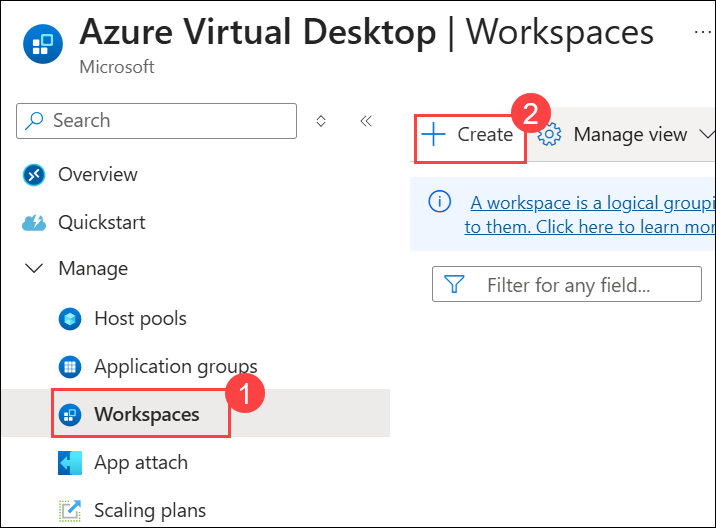

1. On the **Basics** tab of the **Create a workspace** page, specify the following settings and select **Next : Application groups > (6)**:

    |Setting|Value|
    |---|---|
    |Subscription|Choose the default subscription **(1)**|
    |Resource group|**az140-11e-RG (2)**|
    |Workspace name|**az140-21-ws1 (3)**|
    |Friendly name|**az140-21-ws1 (4)**|
    |Location|**<inject key="Region" enableCopy="false" /> (5)**|

    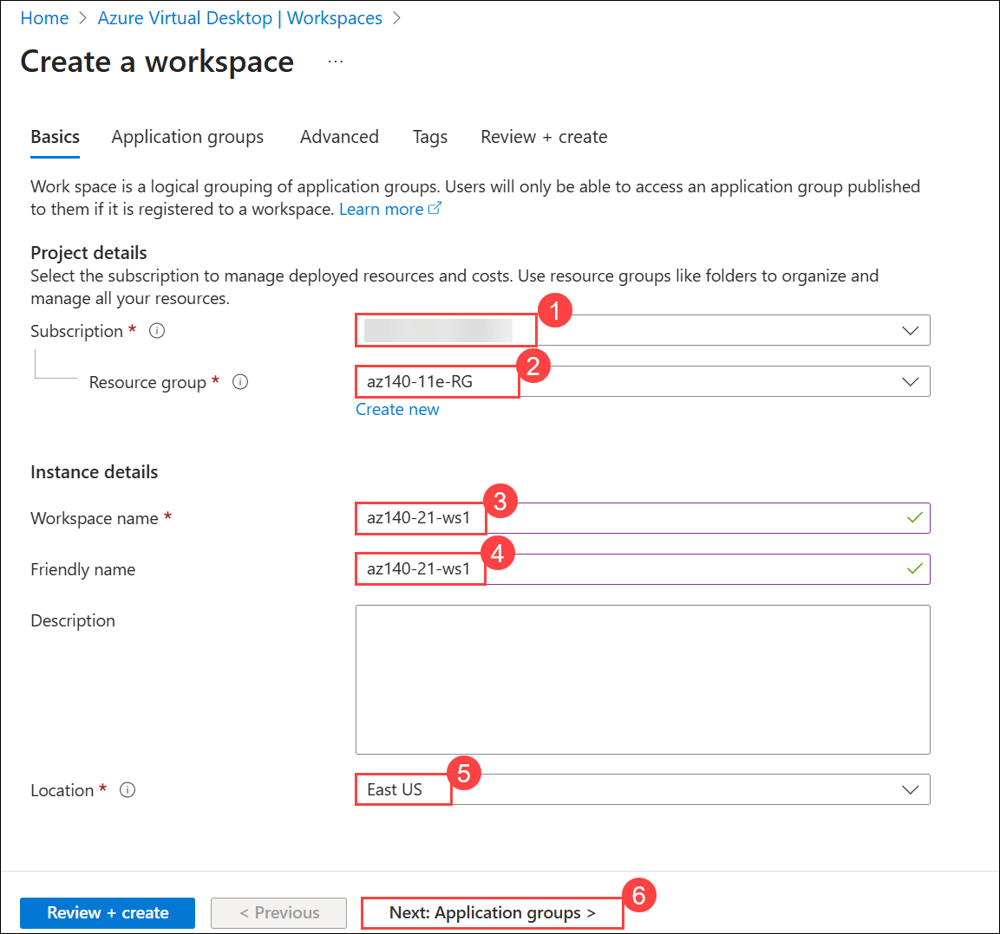

1. On the **Application groups** tab of the **Create a workspace** page, specify the following settings:

    |Setting|Value|
    |---|---|
    |Register application groups|**Yes (1)**|

1. On the **Workspace** tab of the **Create a workspace** page, select **+ Register application groups (2)**.

    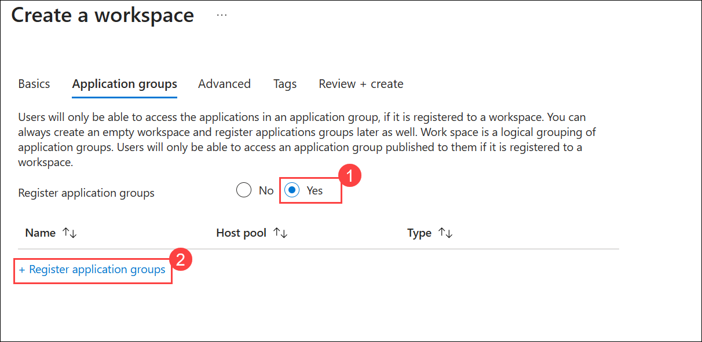

1. On the **Add application groups** page, select the **plus sign (1)** next to the **az140-21-hp1-DAG**, **az140-21-hp1-Office365-RAG**, and **az140-21-hp1-Utilities-RAG** entries and click **Select (2)**. 

    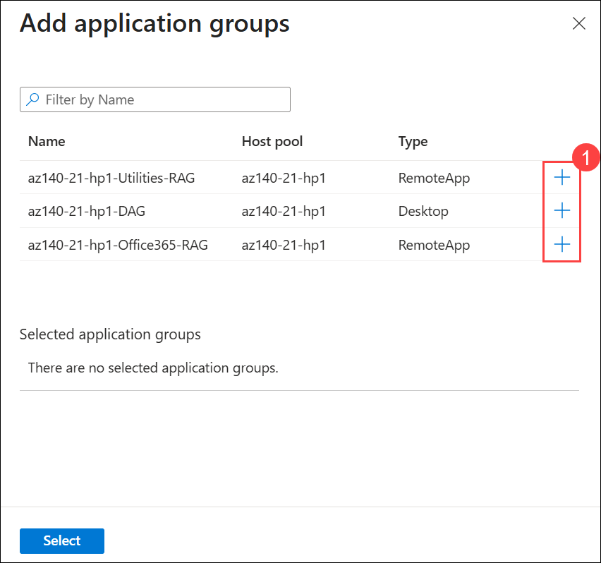

    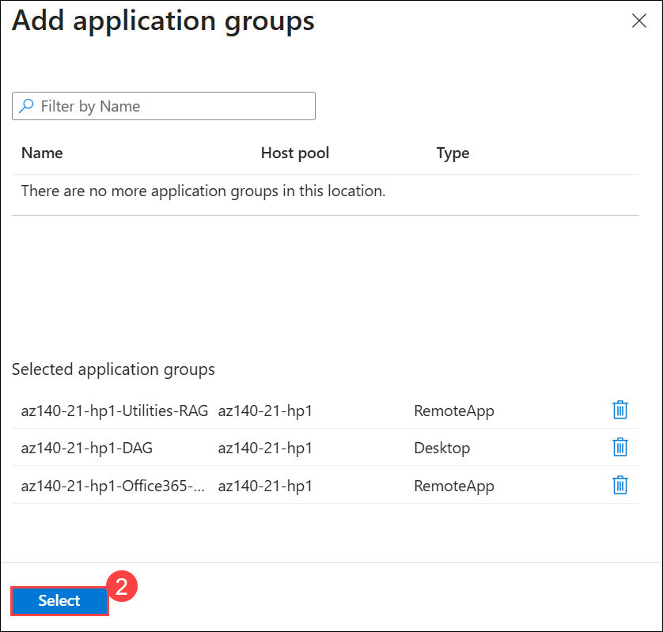

1. Back on the **Application groups** tab of the **Create a workspace** page, select **Review + create**.

    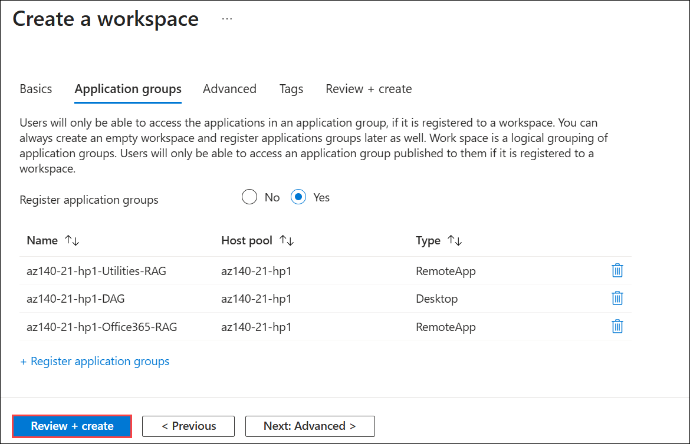

1. On the **Review + create** tab of the **Create a workspace** page, select **Create**.

    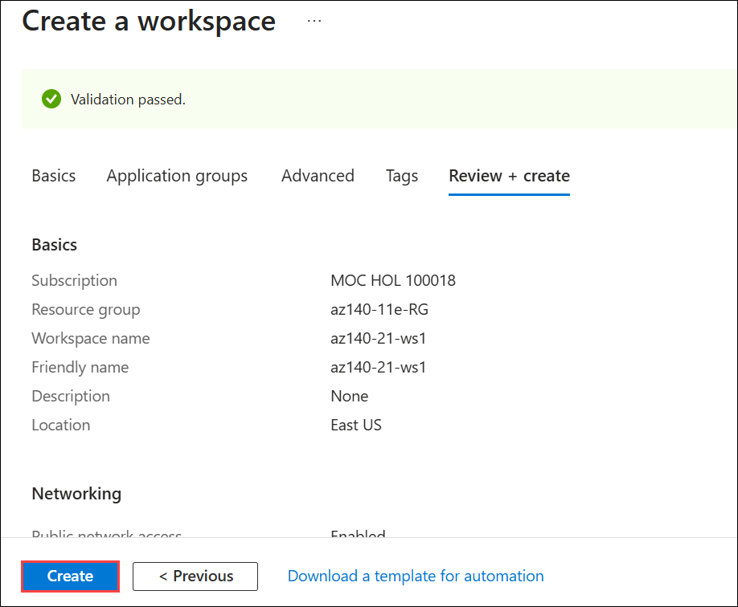

> **Congratulations** on completing the task! Now, it's time to validate it. Here are the steps:
>
> - Hit the Validate button for the corresponding task. If you receive a success message, you can proceed to the next task.
> - If not, carefully read the error message and retry the step, following the instructions in the lab guide.
> - If you need any assistance, please contact us at cloudlabs-support@spektrasystems.com. We are available 24/7 to help.
<validation step="b7787cb6-f259-41b1-a47f-52c92ffcc43b" />

### Task 5: Grant access to Azure Virtual Desktop host pools

In this task, you will assign the required RBAC roles to user groups to enable sign-in and provide the appropriate access to Azure Virtual Desktop session hosts.

> **Note:** When using Microsoft Entra joined session hosts, you need to assign to Azure Virtual Desktop users and administrators appropriate Azure role-based access control (RBAC) roles. In particular, the *Virtual Machine User Login* role is required to sign in to session hosts, and the *Virtual Machine Administrator Login* role is required for the local administrative privileges. 

1. In the Azure portal, search for and select **Resource groups** and, on the **Resource groups** page, select **az140-11e-RG**.

    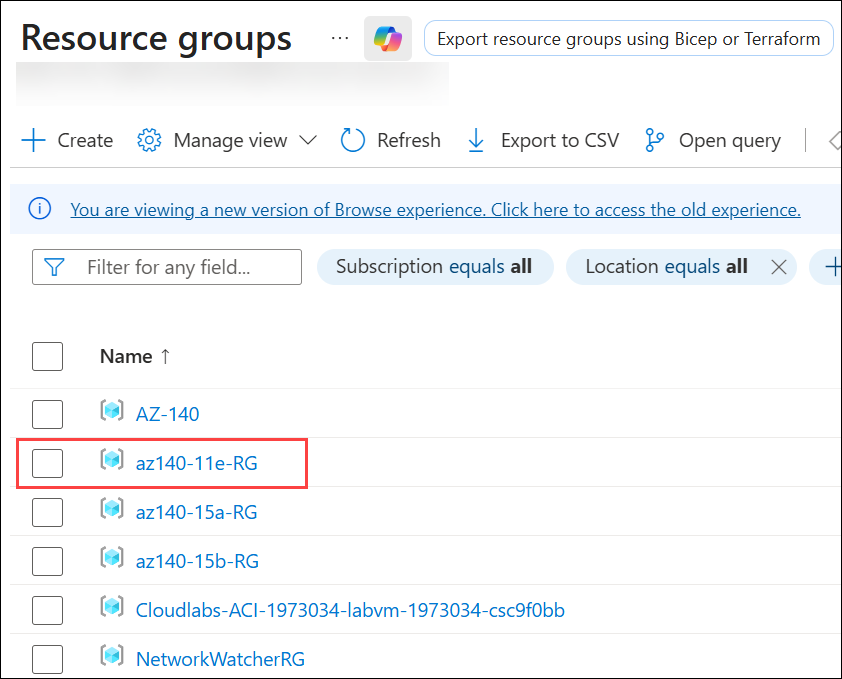
   
1. On the **az140-11e-RG** page, in the vertical navigation menu, select **Access control (IAM) (1)**.

1. On the **az140-11e-RGG\|Access control (IAM)** page, select **+ Add (2)** and, in the drop-down menu, select **Add role assignment (3)**.

    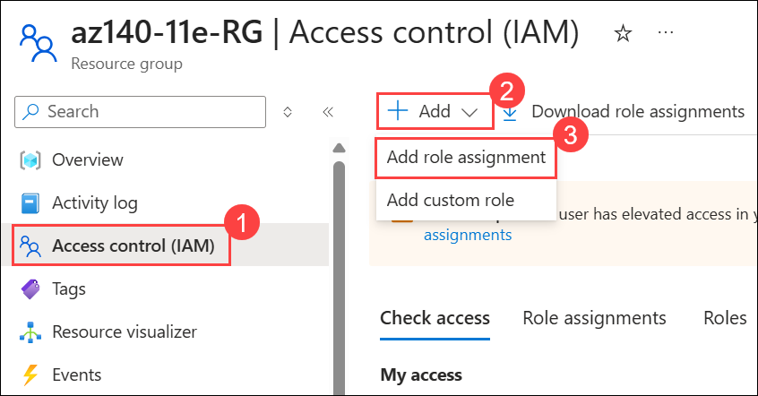
   
1. On the **Role** tab of the **Add role assignment** page, ensure that the **Job function roles** tab is selected, in the search textbox, enter **Virtual Machine User Login (1)**, in the list of results, select **Virtual Machine User Login (2)**, and then select **Next (3)**.

    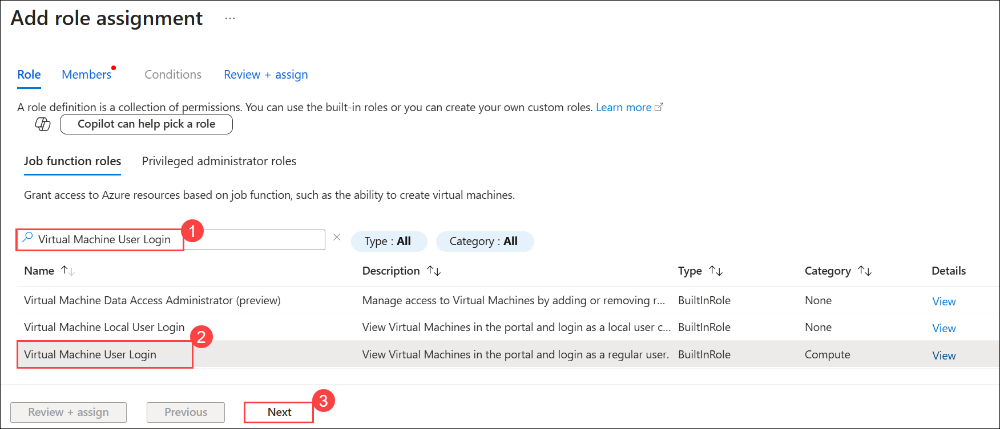

1. On the **Members** tab of the **Add role assignment** page, ensure the **User, group, or service principal (1)** option is selected, then choose **+ Select members (2)**. In the **Select members** pane, search for **AVD-RemoteApp (3)**, select **AVD-RemoteApp (4)** from the results, and then choose **Select (5)**.

    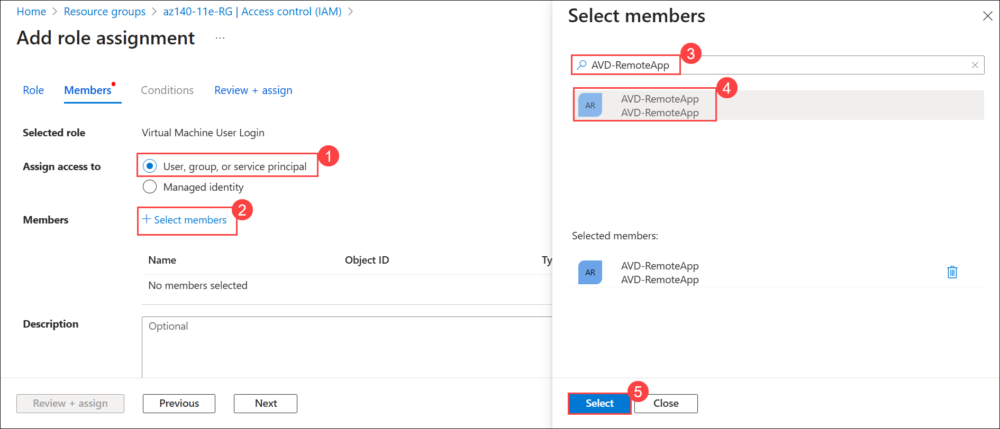

1. Back on the **Members** tab of the **Add role assignment** page, select **Next**.

     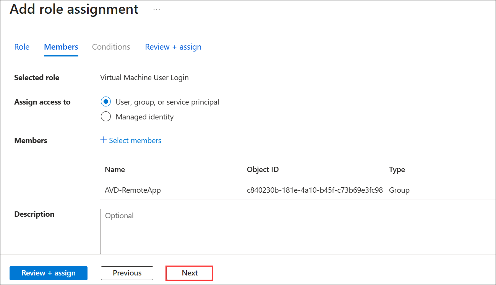

1. On the **Review + assign** tab of the **Add role assignment** page, select **Review + assign**. 

    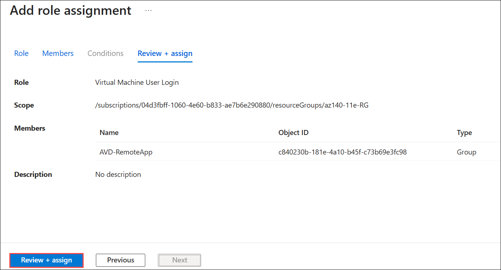

1. Back on the **az140-11e-RG\|Access control (IAM)** page, select **+ Add** and, in the drop-down menu, select **Add role assignment**.

1. On the **Role** tab of the **Add role assignment** page, ensure that the **Job function roles** tab is selected, in the search textbox, enter **Virtual Machine Administrator Login (1)**, in the list of results, select **Virtual Machine Administrator Login (2)**, and then select **Next (3)**.

    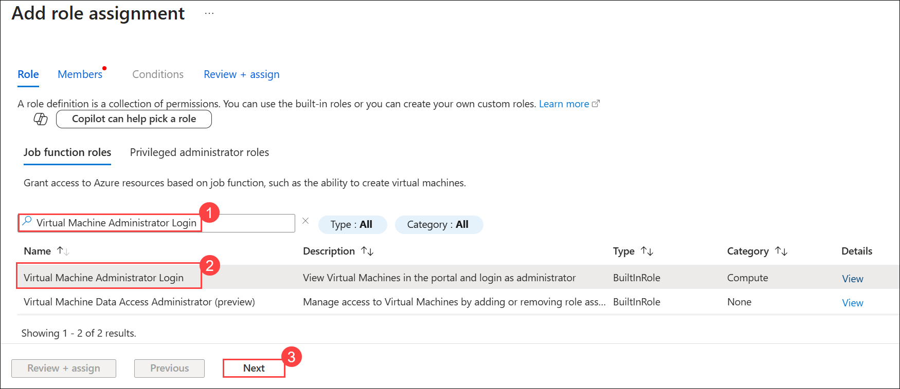

1. On the **Members** tab of the **Add role assignment** page, ensure the **User, group, or service principal (1)** option is selected, then choose **+ Select members (2)**. In the **Select members** pane, search for **AVD-DAG (3)**, select **AVD-DAG (4)** from the results, and then choose **Select (5)**. 

    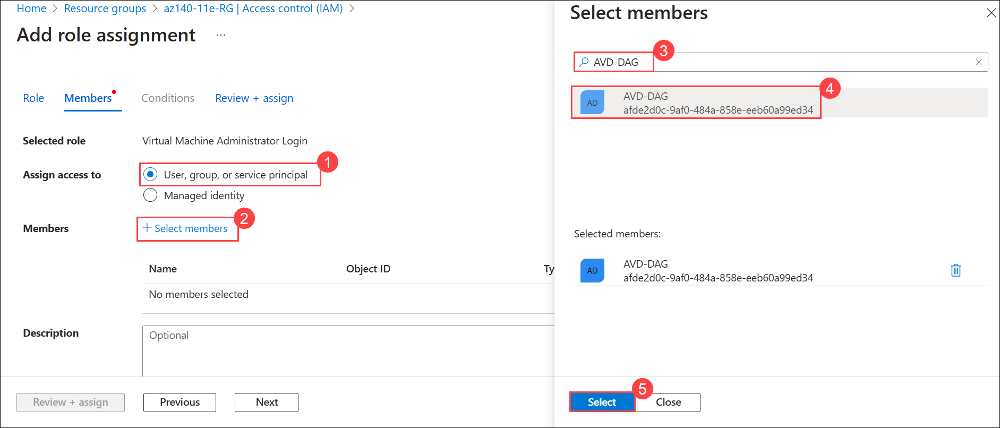

1. Back on the **Members** tab of the **Add role assignment** page, select **Next** and on **Review + assign** tab select **Review + assign**.

    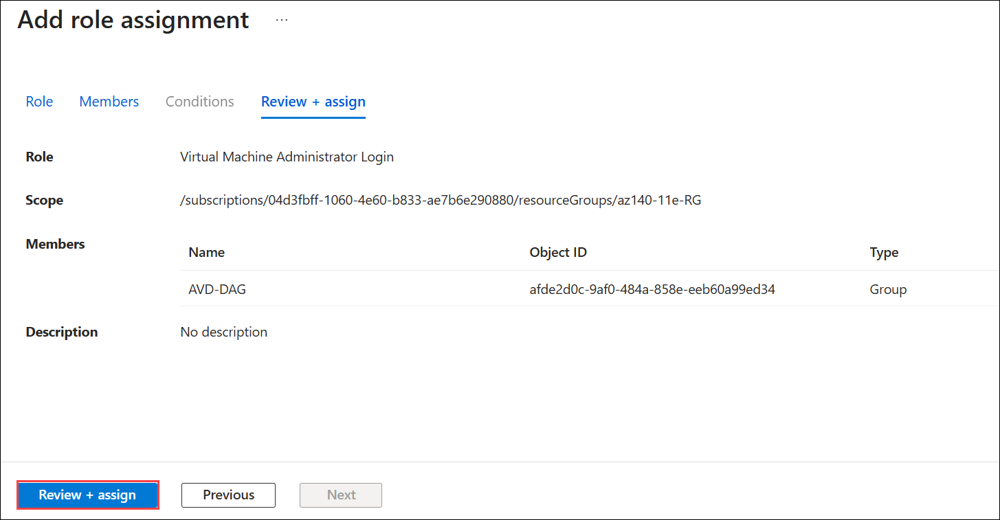

### Summary

In this lab, you deployed a complete Azure Virtual Desktop environment by creating the required network resources, host pool, and session hosts. You configured multiple application groups using both Start Menu and file path sources and assigned the appropriate Microsoft Entra groups for access. You then created a workspace and registered the application groups for user availability. Finally, you applied the necessary RBAC roles to ensure proper sign-in and permissions for the AVD session hosts.

**You have successfully completed the lab. Click on Next >>**


