# Lab 02- Manage host pools and session hosts by using the Azure portal (Entra ID)

## Estimated Duration: 50 Minutes

## Overview

In this lab, you will manage and scale an Azure Virtual Desktop host pool by adding additional session hosts and updating core configuration settings. You’ll review and adjust host pool properties, assign the required RBAC roles, configure scheduled agent updates, and customize RDP connection properties.

## Lab Objectives

In this lab, you will complete the following tasks:

- **Task 1:** Deploy additional Azure Virtual Desktop host pool session hosts

- **Task 2:** Review and configure the host pool properties

- **Task 3:** Assign the required RBAC role to an Azure Virtual Desktop service principal

- **Task 4:** Configure scheduled agent updates

- **Task 5:** Configure RDP properties of the host pool

### Task 1: Deploy additional Azure Virtual Desktop host pool session hosts

In this task, you will deploy an additional session host to the existing Azure Virtual Desktop host pool. You’ll review the preconfigured settings, adjust the VM configuration, and submit the deployment to scale out the host pool.

1. In the Azure portal, search for and select **Azure Virtual Desktop** and, on the **Azure Virtual Desktop** page, in the vertical menu bar, in the **Manage** section, select **Host pools (1)**.

1. On the **Azure Virtual Desktop \| Host pools** page, in the list of host pools, select **az140-21-hp1 (2)**.

     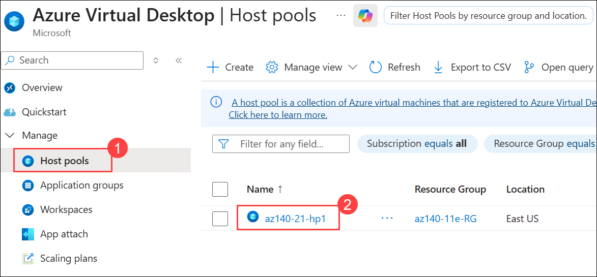

1. On the **az140-21-hp1** page, in the in the vertical menu bar, in the **Manage (1)** section, select **Session hosts (2)** and verify that the pool consists of two hosts **(3)**. 

     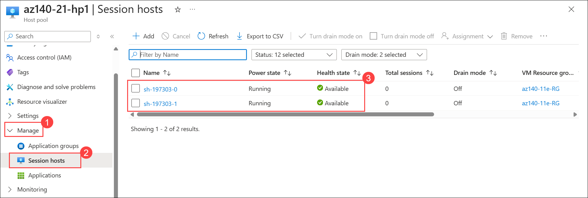

1. On the **az140-21-hp1 \| Session hosts** page, select **+ Add**.

    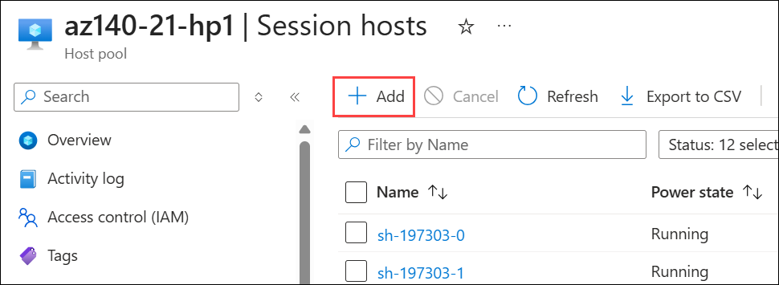

1. On the **Basics** tab of the **Add virtual machines to a host pool** page, review the preconfigured settings and select **Next : Virtual Machines**.

     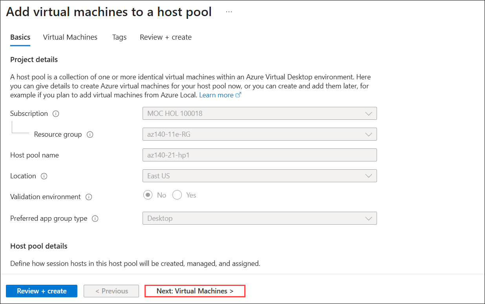

1. On the **Virtual Machines** tab of the **Add virtual machines to a host pool** page, specify the following settings and select **Review + create (21)** (leave others with their default settings):

    |Setting|Value|
    |---|---|
    |Resource group|**az140-11e-RG (1)**|
    |Name prefix|**sh-<inject key="DeploymentID" enableCopy="false"/> (2)**|
    |Virtual machine location|**<inject key="Region" enableCopy="false" /> (3)**|
    |Availability options|**No infrastructure redundancy required (4)**|
    |Security type|**Trusted launch virtual machines (5)**|

    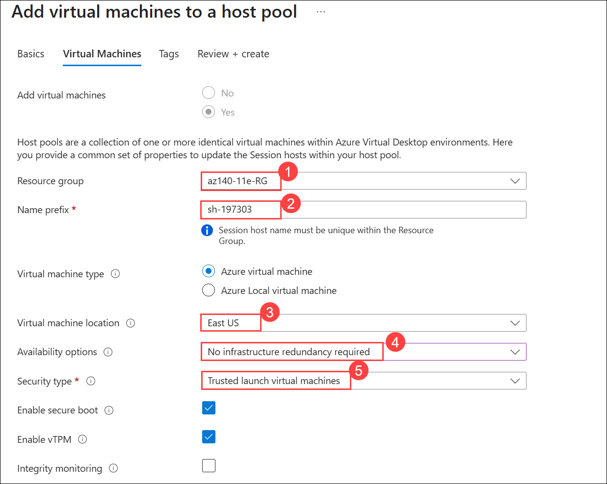

    |Setting|Value|
    |---|---|
    |Image|**Windows 11 Enterprise multi-session, Version 23H2 + Microsoft 365 Apps (6)**|
    |Virtual machine size|Click on **Change Size** select **Standard DC2s_v3 (7)**|
    |Number of VMs|**1 (8)**|
    |OS disk type|**Standard SSD (9)**|
    |OS disk size|**Default size (128GB) (10)**|
    |Boot Diagnostics|**Enable with managed storage account (recommended) (11)**|
    |Virtual network|**az140-vnet11e (12)**|
    |Subnet|**hp1-Subnet (13)**|
    |Network security group|**Basic (14)**|
    |Public inbound ports|**No (15)**|
    
    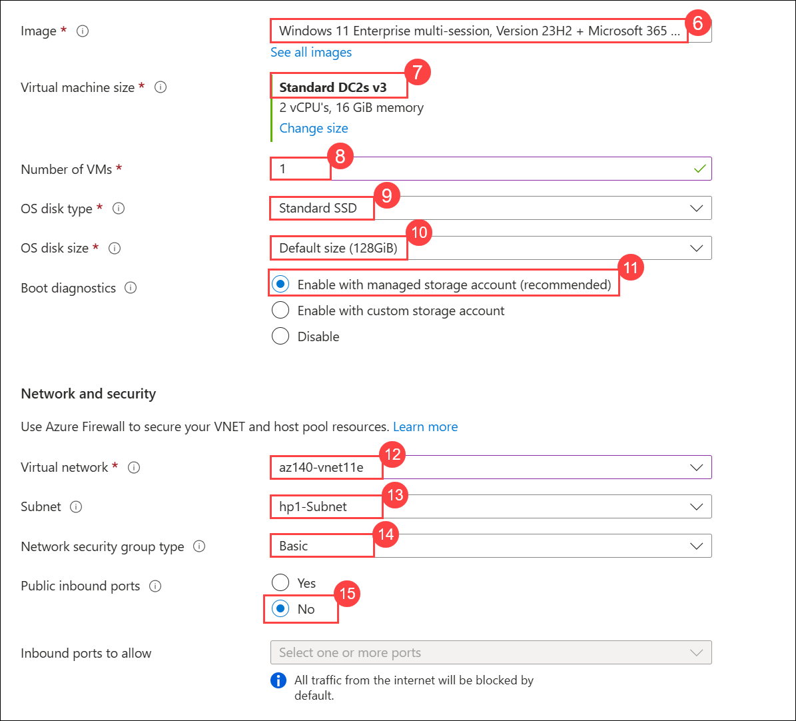

    >**Note:** In the Images section, click **See all images**, scroll down, click **Select (1)** under the Windows multi-session image tile, and choose **Windows 11 Enterprise multi-session, Version 23H2 + Microsoft 365 Apps (2)**.

     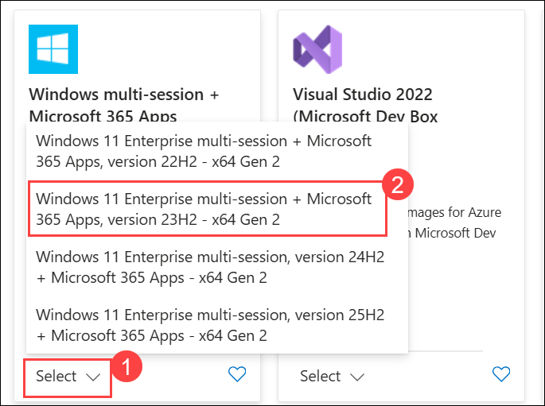
    
    |Setting|Value|
    |---|---|
    |Select which directory you would like to join|**Microsoft Entra ID (16)**|
    |Enroll VM with Intune|**No (17)**|
    |User name|**Student (18)**|
    |Password|**Password.1!! (19)**|
    |Confirm password|**Password.1!! (20)**|

    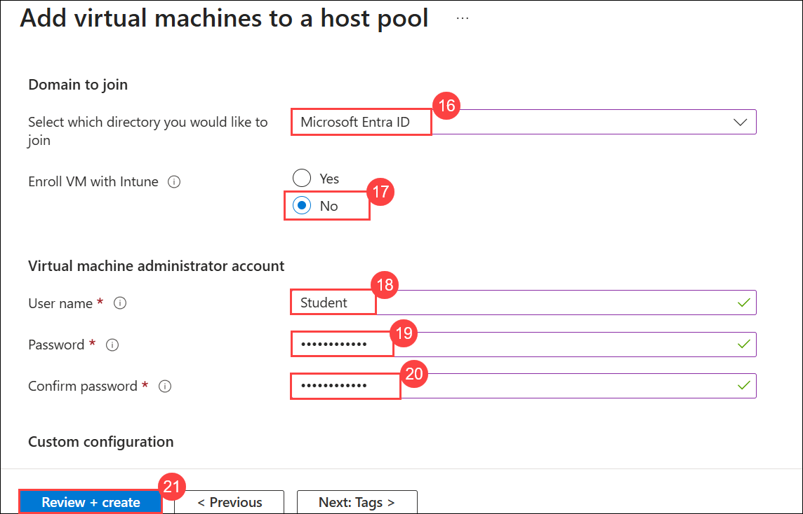

    > **Note:** The password should be at least 12 characters in length and consist of a combination of lower-case characters, upper-case characters, digits, and special characters. For details, refer to the information about [the password requirements when creating an Azure VM](https://learn.microsoft.com/en-us/azure/virtual-machines/windows/faq#what-are-the-password-requirements-when-creating-a-vm-).

    > **Note:** As you likely noticed, it's possible to change the image and prefix of the VMs as you add session hosts to the existing pool. In general, this is not recommended unless you plan to replace all VMs in the pool. 

1. On the **Review + create** tab of the **Add virtual machines to a host pool** page, select **Create**

     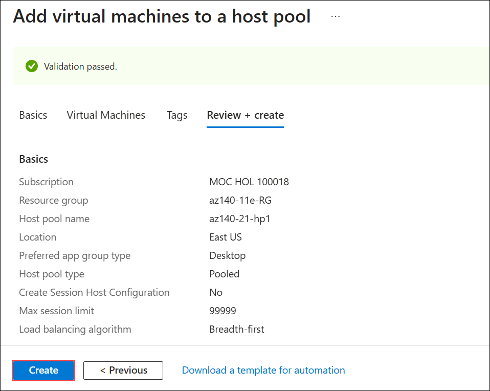

     > **Note:** Do not wait for the provisioning process to complete but instead proceed to the next task. The provisioning process might take about 20 minutes. 

### Task 2: Review and configure the host pool properties

In this task, you will review and update key properties of the host pool, including load balancing behavior, session limits, and startup settings. You’ll adjust these configurations to optimize how session hosts are allocated and powered on.

1. In the Azure portal, search for and select **Azure Virtual Desktop**, on the **Azure Virtual Desktop** page, in the **Manage** section of the vertical navigation menu, select **Host pools (1)** and, on the **Azure Virtual Desktop \| Host pools** page, select **az140-21-hp1 (2)**.

    

1. On the **az140-21-hp1** page, in the **Settings (1)** section, select **Properties (2)**.

    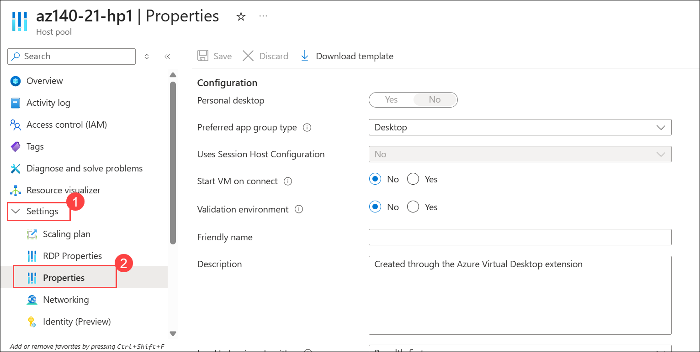

1. On the **az140-21-hp1\|Properties** page, review the available configuration options including:

    - **Preferred app group type:** This option sets the preferred app group type for the host pool to either **Desktop** or **RemoteApp**. If end users have both RemoteApp and Desktop apps published to them in the host pool, they will only see the selected app type in their feed.
    - **Start VM on connect:** Enabling this option allows users to start individual virtual machines in the host pool from the deallocated state.
    - **Validation environment:** Validation host pool is intended for testing service changes before they are deployed to production.
    - **Load balancing algorithm:** This option provides the choice between the breadth-first and depth-first load balancing. The breadth-first load balancing distributes new user sessions across all available session hosts in the host pool. Depth-first load balancing distributes new user sessions to an available session host with the highest number of connections which has not reached the maximum session limit threshold.

1. On the **az140-21-hp1\|Properties** page, in the **Load balancing algorithm** drop-down list, select **Depth-first (1)**.

1. In the **Max session limit** text box, enter **8 (2)**.

1. On the **az140-21-hp1\|Properties** page, set **Start VM on connect** to **Yes (3)**.

    > **Note:** *Start VM on Connect* lets you reduce costs by enabling end users to power on the virtual machines (VMs) used as session hosts only when they're needed. For personal host pools, *Start VM on Connect* only powers on an existing session host VM that is already assigned or can be assigned to a user. For pooled host pools, *Start VM on Connect* only powers on a session host VM when none are turned on and more VMs are only be turned on when the first VM reaches the session limit.

1. On the **az140-21-hp1\|Properties** page, select **Save (4)**.

    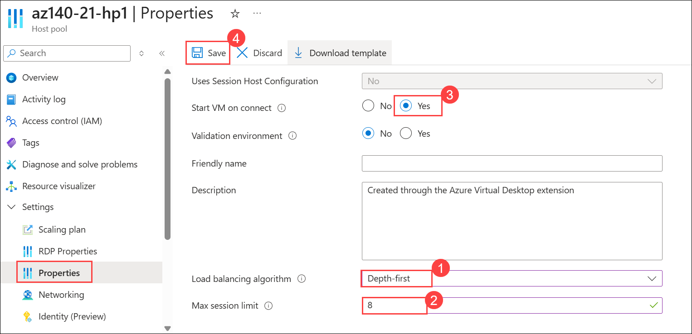

    > **Note:** Using *Start VM on Connect* requires assigning the *Desktop Virtualization Power On Contributor* role-based access control (RBAC) role to the *Azure Virtual Desktop* service principal at the Azure subscription scope. 

### Task 3: Assign the required RBAC role to an Azure Virtual Desktop service principal

In this task, you will assign the required RBAC role to the Azure Virtual Desktop service principal using Azure Cloud Shell.

1. In the Azure portal, select the **Cloud Shell** icon from the top menu to start a PowerShell session.

    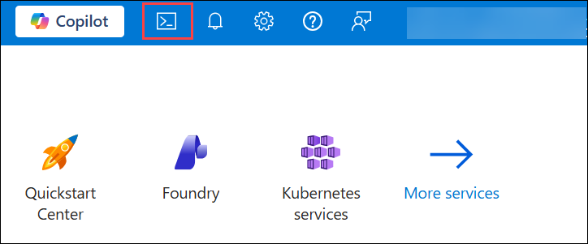

1. In the PowerShell session in the Azure Cloud Shell pane, run the following command to retrieve the value of the Id property of the Azure subscription you are using in this lab and store it in a variable `$subId`:

    ```powershell
    $subId = (Get-AzSubscription).Id
    ```

1. Run the following command to create a $parameters variable, which stores a hash table that contains the values of the RBAC role definition name, Microsoft Entra application representing the **Azure Virtual Desktop** service principal, and the subscription scope:

    ```powershell
    $parameters = @{
        RoleDefinitionName = "Desktop Virtualization Power On Contributor"
        ApplicationId = "9cdead84-a844-4324-93f2-b2e6bb768d07"
        Scope = "/subscriptions/$subId"
    }
    ```

1. Run the following command to create the RBAC role assignment:

    ```powershell
    New-AzRoleAssignment @parameters
    ```

    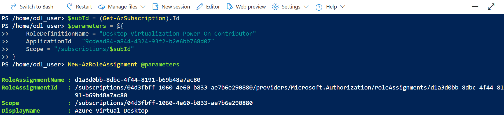

1. Close the Cloud Shell pane.

### Task 4: Configure scheduled agent updates

In this task, you will configure a scheduled maintenance window for Azure Virtual Desktop agent updates to ensure updates occur outside business hours.

> **Note:** The Scheduled Agent Updates feature lets you create up to two maintenance windows for the updates of the Azure Virtual Desktop agent, side-by-side stack, and Geneva Monitoring agent, so these updates take place outside of business hours. 

1. In the Azure portal, navigate back to the **az140-21-hp1** host pool page.

1. On the **az140-21-hp1** page, in the in the vertical menu bar, in the **Settings (1)** section, select the **Scheduled agent updates (2)** entry and, on the **az140-21-hp1\|Scheduled agent updates** page, select the **Scheduled agent updates** checkbox **(3)**.

1. In the **Schedule** section, select the **Use local session host time zone (4)** checkbox.

1. In the **Maintenance window** section, in the **Day** drop-down list, select **Saturday (5)** and, in the **Time** drop-down list, select **11:00 PM (6)**.

1. Select **Apply (7)**.

    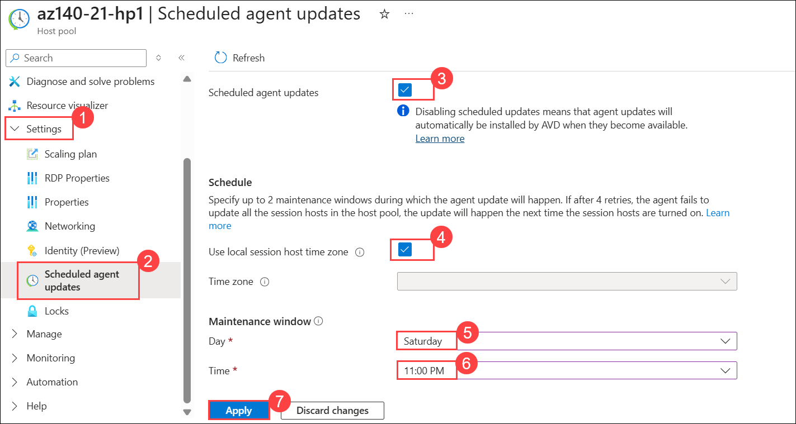

### Task 5: Configure RDP properties of the host pool

In this task, you will review and update the RDP properties of the host pool to configure connection, session behavior, device redirection, and display settings.

1. In the Azure portal, on the **az140-21-hp1** page, in the in the vertical menu bar, in the **Settings** section, select the **RDP Properties** entry.

    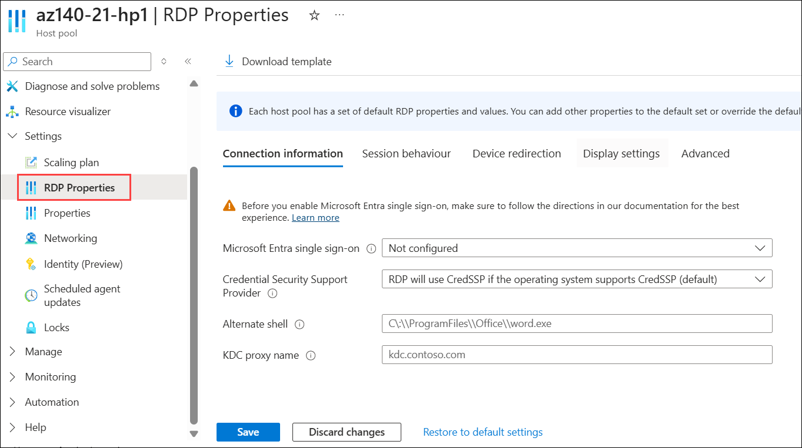

1. On the **Connection information** tab of the **az140-21-hp1\|RDP Properties** page, review the available configuration options, including:

    - **Microsoft Entra single sign-on:** This option determines if connections will attempt to leverage Microsoft Entra authentication to sign in to Microsoft Entra-joined session hosts and, effectively, provide a single sign-on experience. Note that it's not required for the client computer to be Microsoft Entra-joined. 
    - **Credential Security Support Provider:** This option controls the use of CredSSP for authentication. CredSSP provides the ability to securely forward user credentials from the client device to the remote desktop session host. However, its capabilities do not include support for Entra ID authentication.
    - **Alternate shell:** This option allows you to specify an executable to start whenever a new connection to a session host is established. This setting applies only to session hosts running Windows Server.
    - **KDC proxy name:** This option provide the ability to proxy Kerberos authentication traffic to Active Directory domain controllers.

    > **Note:** Considering that three of these options are not applicable in our scenario (which involves Microsft Entra-joined session hosts without any presence of Active Directory Domain Services), you will configure only the first one. This option corresponds to the `enablerdsaadauth:i:value` RDP property.

1. In the **Microsoft Entra single sign-on** drop-down list, select the option **Connections will use Microsoft Entra authentication to provide single sign-on (1)** and then select **Save (2)**.

    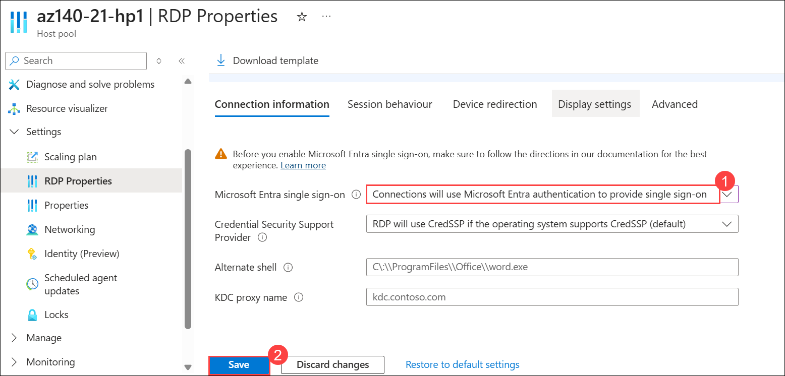

    > **Important:** It is essential to keep in mind that enabling this specific RDP property is just one of several steps required to implement single sign-on functionality. Other actions applicable to this scenario include enabling Microsoft Entra authentication for RDP in the Entra tenant and configuring device groups, which are not supported in the current version of the lab environment, hence are not included in the instructions. For the full listing of actions necessary to implement single sign-on for Microsoft Entra ID, refer to [Configure single sign-on for Azure Virtual Desktop using Microsoft Entra ID authentication](https://learn.microsoft.com/en-us/azure/virtual-desktop/configure-single-sign-on).

1. On the **az140-21-hp1\|RDP Properties** page, select the **Session behavior** tab and review the available configuration options, including:

    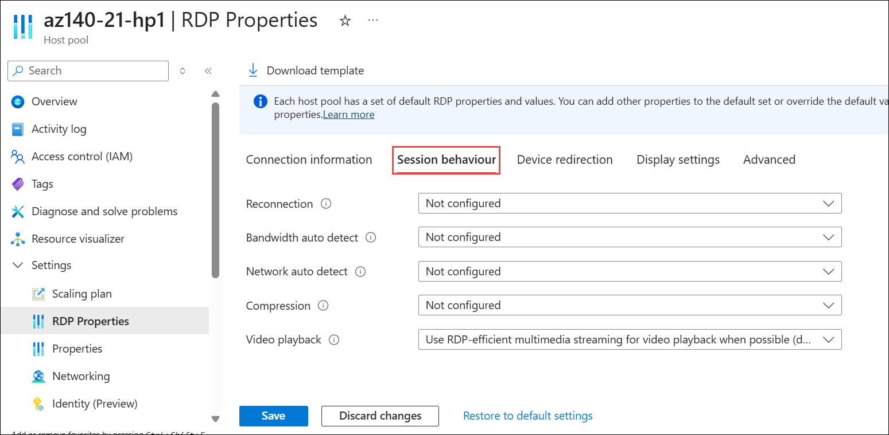

     - **Reconnection:** This option determines whether the client computer will automatically try to reconnect to the remote computer if the connection is dropped.
     - **Bandwidth auto detect:** This option determines whether to use automatic network bandwidth detection or not.
     - **Network auto detect:** This option allows you to enable automatic detection of the network type. It is used in conjunction with **Bandwidth auto detect**. 
     - **Compression:** This option determines whether the connection should use bulk compression.
     - **Video playback:** This option enables the use of RDP efficient multimedia streaming for video playback.

1. On the **Session behavior** tab, in the **Reconnection** drop-down list, select **Client automatically tries to reconnect (1)** and then select **Save (2)**.

    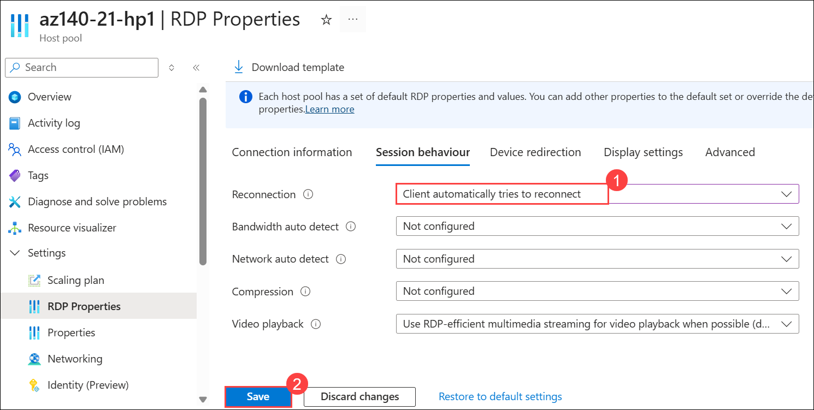

1. On the **az140-21-hp1\|RDP Properties** page, select the **Device redirection** tab and review the available configuration options, including two main categories:

    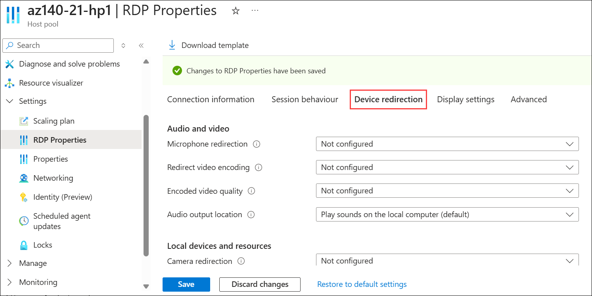

     - **Audio and video**
     - **Local devices and resources**

     > **Note:** By default, redirection applies to all disk drives, including the ones which are mounted after the initial connection is established.

1. On the **az140-21-hp1\|RDP Properties** page, select the **Display settings** tab and review the available configuration options, including support for multiple displays, smart sizing, and specific desktop sizes (in pixels). 

    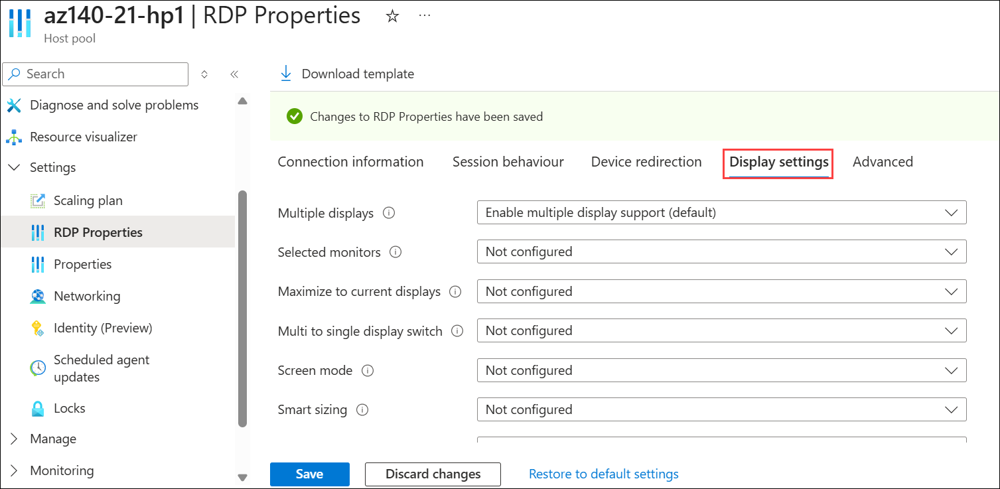

1. On the **az140-21-hp1\|RDP Properties** page, select the **Advanced** tab and review the existing configuration settings. Note that these settings reflect the changes you made earlier in this task.

    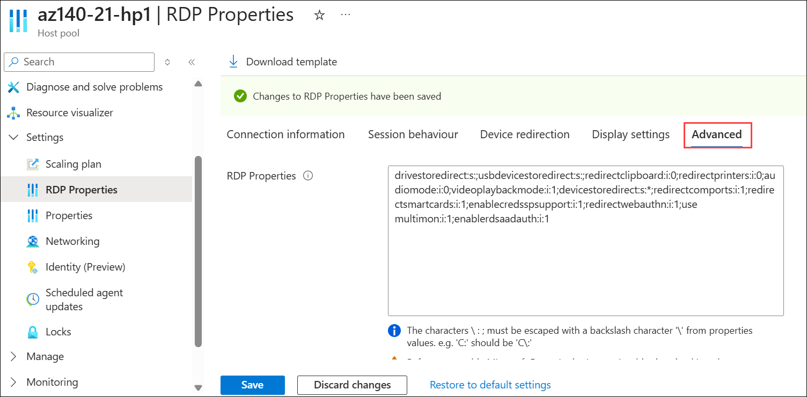

### Summary

In this lab, you expanded and configured an existing Azure Virtual Desktop host pool by deploying an additional session host and adjusting key host pool settings. You assigned the required RBAC role to support power-on functionality and configured scheduled agent updates for controlled maintenance. Finally, you reviewed and customized the host pool’s RDP properties to refine connection and session behavior.

**You have successfully completed the lab. Click on Next >>**

