# Lab 03- Implement monitoring by using Azure Virtual Desktop Insights

## Estimated Duration: 25 Minutes

## Overview

In this lab, you will enable monitoring for your Azure Virtual Desktop environment by setting up Log Analytics and configuring AVD Insights. You’ll register the required resource provider, create a workspace, and connect your host pool and workspace to send diagnostic and performance data to Insights. Finally, you'll complete the setup so AVD can display session host performance, connection details, and overall environment health.

## Lab Objectives
  
In this lab, you will complete the following tasks:

- **Task 1:** Register the Azure subscription with the Microsoft.Insights resource provider

- **Task 2:** Create an Azure Log Analytics workspace

- **Task 3:** Set up the Virtual Desktop Insights configuration workbook
  
### Task 1: Register the Azure subscription with the Microsoft.Insights resource provider

In this task, you will register the Microsoft.Insights resource provider to enable monitoring features required by Azure Virtual Desktop Insights.

> **Note:** Azure Virtual Desktop Insights rely on the Microsoft.Insights resource provider, so you need to first register it within the Azure subscription you are using for this lab. In the *Deploy host pools and session hosts by using the Azure portal (Entra ID)* lab, you performed this task by using Azure PowerShell. In this lab, you will accomplish it by using the Azure portal (either method is supported and available).

1. In the Azure portal, search for and select **Subscriptions**, on the **Subscriptions** page, select the Azure subscription you are using in this lab, and, in the vertical navigation menu, in the **Settings (1)** section, select **Resource providers (2)**.

1. On the **Resource providers** tab, in the search text box, enter **Microsoft.Insights (3)**, in the list of results, select the small circle to the left of the **Microsoft.Insights** entry, and then select **Register**.

    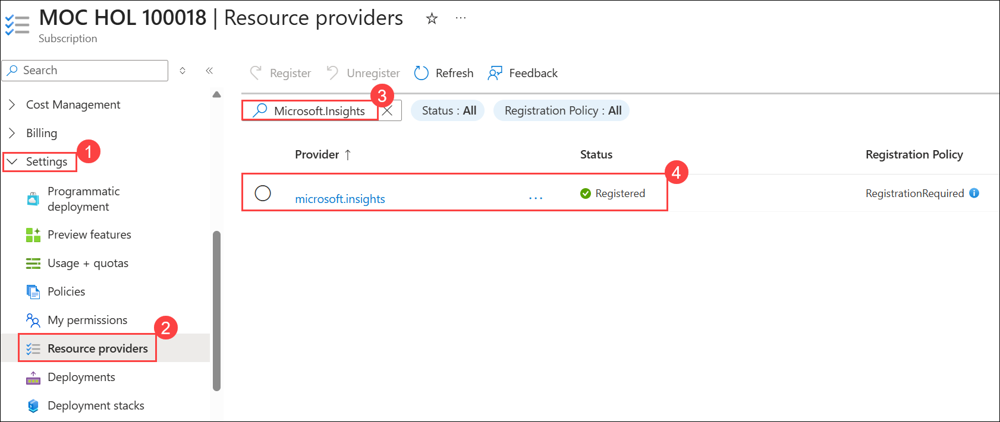

    > **Note:** If the **Microsoft.Insights** provider is already **Registered**, you can skip this step and proceed to the next task.

    > **Note:** Wait for the registration process to complete. This typically takes about 1 minute. Use the **Refresh** toolbar button to display the up-to-date value of the registration status.

### Task 2: Create an Azure Log Analytics workspace

In this task, you will create a Log Analytics workspace that will store diagnostics, performance data, and event logs required for Azure Virtual Desktop Insights.

> **Note:** Azure Virtual Desktop Insights is a dashboard built on Azure Monitor Workbooks that facilitates monitoring of Azure Virtual Desktop environments. 

> **Note:** You can only monitor Autoscale operations with Insights with pooled host pools. 

1. In the Azure portal, search for **Log Analytics workspaces (1)** and select **Log Analytics workspaces (2)** from the list. 

    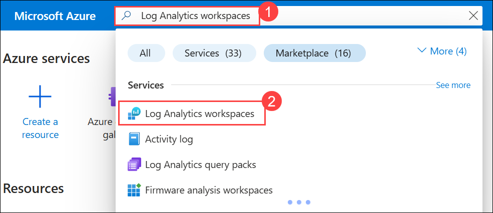

1. On the **Log Analytics workspaces** page, select **+ Create**.

    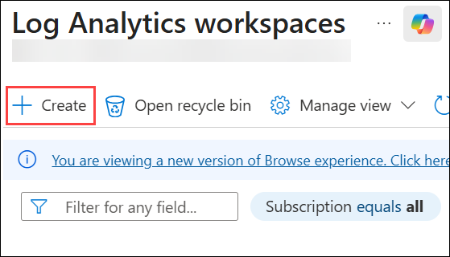

1. On the **Basics** tab of the **Create Log Analytics workspace** page, specify the following settings and select **Review + create (5)**:

    |Setting|Value|
    |---|---|
    |Subscription|Choose the default subscription **(1)**|
    |Resource group|**az140-11e-RG (2)**|
    |Name|**az140-laworkspace41e (3)**|
    |Region|**<inject key="Region" enableCopy="false" /> (4)**|

     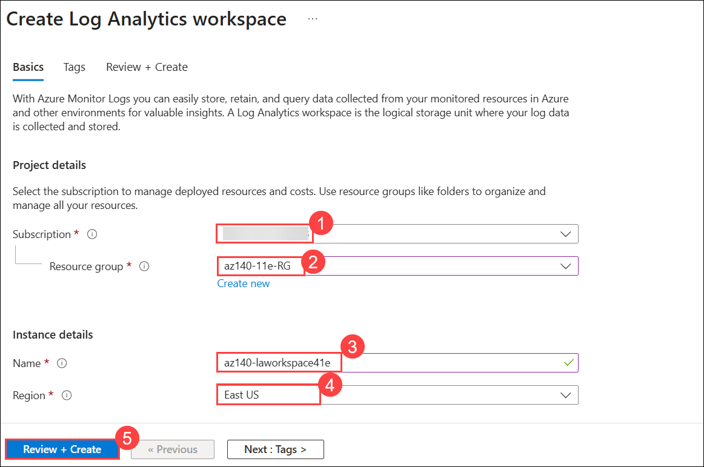

1. On the **Review + Create** page, select **Create**.

    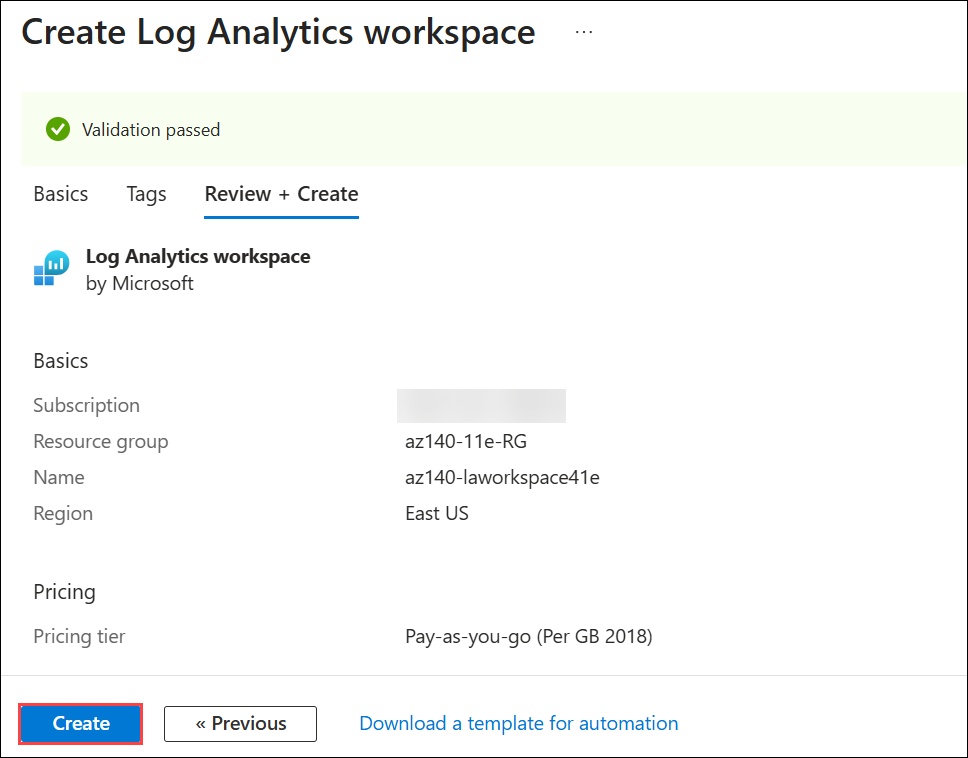

     > **Note:** Wait for the provisioning process to complete. This typically takes about 1 minute.

     > **Note:** Next, you need to enable data collection in the newly provisioned Log Analytics workspace of diagnostics from the Azure Virtual Desktop environment, performance counters from the session hosts, and Windows Event Logs from the Azure Virtual Desktop session hosts.

### Task 3: Set up the Virtual Desktop Insights configuration workbook

In this task, you will configure the Virtual Desktop Insights workbook by enabling diagnostic settings, creating a data collection rule, and applying it to your host pool and workspace. You’ll also install the Azure Monitor extension so AVD can start sending monitoring data into Log Analytics.

> **Note:** When opening Azure Virtual Desktop Insights for the first time, you need to set up Azure Virtual Desktop Insights to target your Azure Virtual Desktop environment.

1. In the Azure portal, search for and select **Azure Virtual Desktop** and, on the **Azure Virtual Desktop** page, in the vertical navigation menu, in the **Monitoring (1)** section, select **Workbooks (2)**.

1. In the list of **Windows Virtual Desktop** workbooks, in the **Windows Virtual Desktop** section, select the **Insights (3)** workbook.

     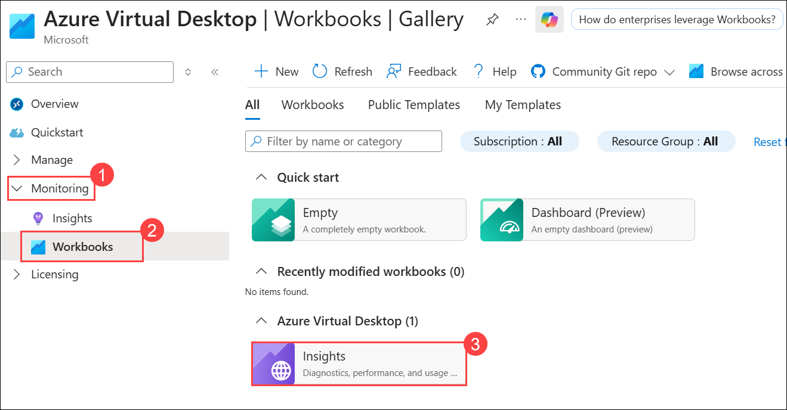

1. On the **Azure Virtual Desktop \| Workbooks \| Insights** page, review the warning messages indicating that the workspace and session hosts are not sending data to the workspace and then select the **Configuration workbook (2)** link to repair the issue.

     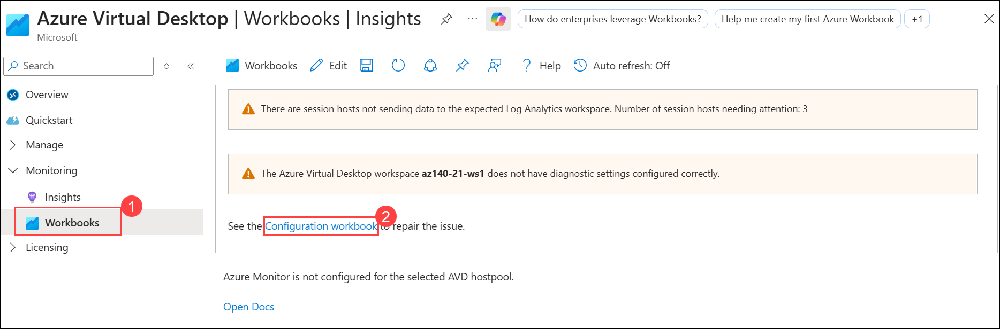

1. On the **CheckAMAConfiguration** page, on the **Resource diagnostics settings (1)** tab, in the **Log Analytics workspace** drop-down list, select **az140-laworkspace41e (2)**.

     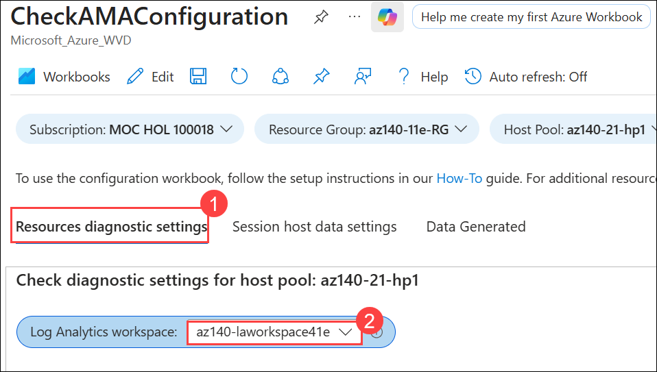

1. On the **CheckAMAConfiguration** page, on the **Resource diagnostics settings** tab, in the **Host pool az140-21-hp1** section, review the warning message indicating that `No existing diagnostic configuration was found for the selected host pool` and then select **Configure host pool (1)**.

1. In the **Deploy Template** pane, select **Deploy (2)**.

     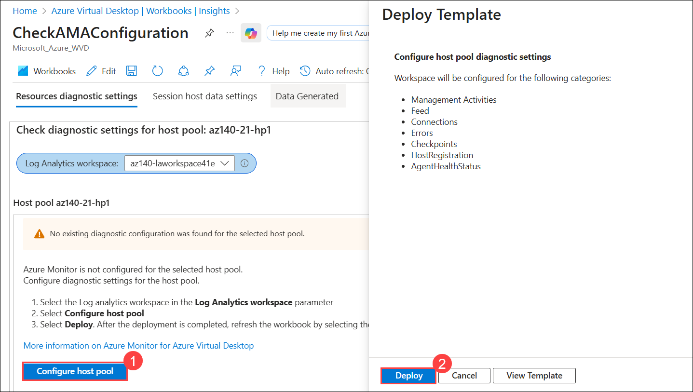

     > **Note:** This effectively enables the following diagnostics tables in the target Log Analytics workspace:
     - Management Activities
     - Feed
     - Connections
     - Errors
     - Checkpoints
     - HostRegistration
     - AgentHealthStatus

     > **Note:** Wait for the deployment to complete. This typically takes less than 1 minute.

1. On the **CheckAMAConfiguration** page, on the **Resource diagnostics settings** tab, select the **Refresh (1)** icon (a circular arrow) in the toolbar.

1. Review the **Host pool az140-21-hp1** section and verify that the diagnostic settings are enabled for **allLogs (2)**.

     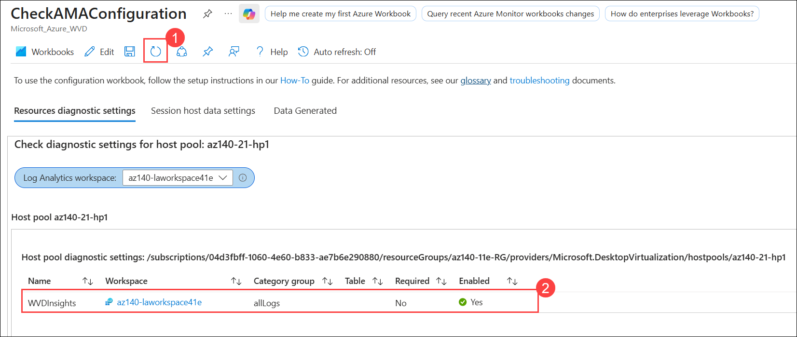

1. While on the **Resource diagnostics settings** tab, scroll down to the **Workspace az140-21-ws1** section and then select **Configure workspace (1)**.

1. In the **Deploy Template** pane, select **Deploy (2)**.

    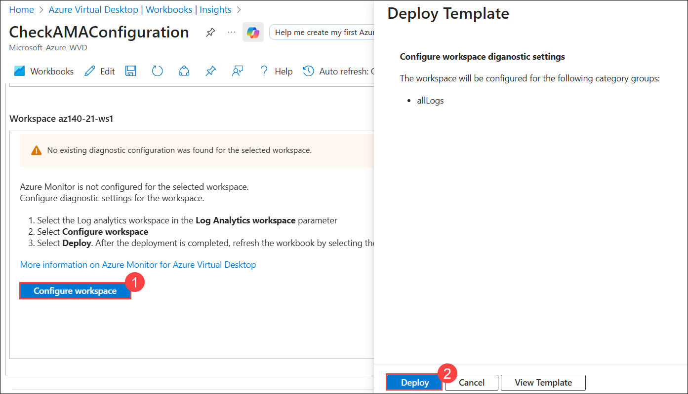

    > **Note:** This effectively configures the workspace for **allLogs**.

    > **Note:** Wait for the deployment to complete. This typically takes less than 1 minute.

1. On the **CheckAMAConfiguration** page, on the **Resource diagnostics settings** tab, select the **Refresh** icon (a circular arrow) in the toolbar.

1. Review the **Workspace az140-21-ws1** section and verify that the diagnostic settings are enabled for **allLogs** and that thre are no remaining warning messages.

1. Navigate to the top of the **CheckAMAConfiguration** page and switch to the **Session host data settings (1)** tab.

1. On the **Session host data settings** tab, in the **Create DCR** section, in the **Workspace destination** drop-down list, select **az140-laworkspace41e (2)** and then select **Create data collection rule (3)**.

     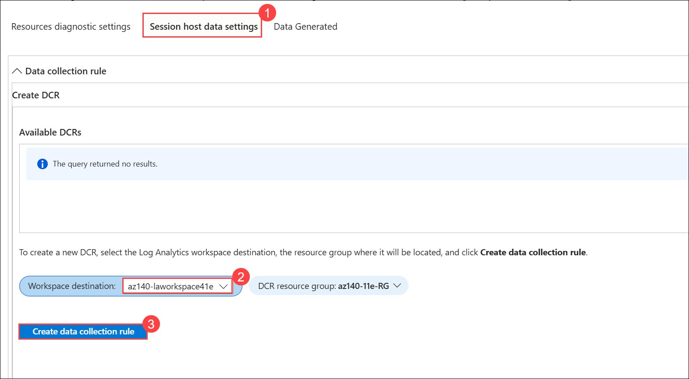

1. In the **Deploy Template** pane, select **Deploy**.

    > **Note:** Wait for the deployment to complete. This typically takes less than 1 minute.

1. On the **CheckAMAConfiguration** page, on the **Session host data settings** tab, select the **Refresh** icon (a circular arrow) in the toolbar.

    > **Note:** Before you proceed, make sure that the newly created DCR is listed in the **Available DCRs** subsection of the **Create DCR** section. If that is not the case, wait for another minute and refresh the page again.

1. On the **Session host data settings** tab, in the **Selected DCR** drop-down list, select the entry starting with **microsoft-avdi-** prefix.

1. On the **Session host data settings** tab, in the **DCR associations** section, select **Deploy Association (1)** and, in the **Deploy Template** pane, select **Deploy (2)**.

    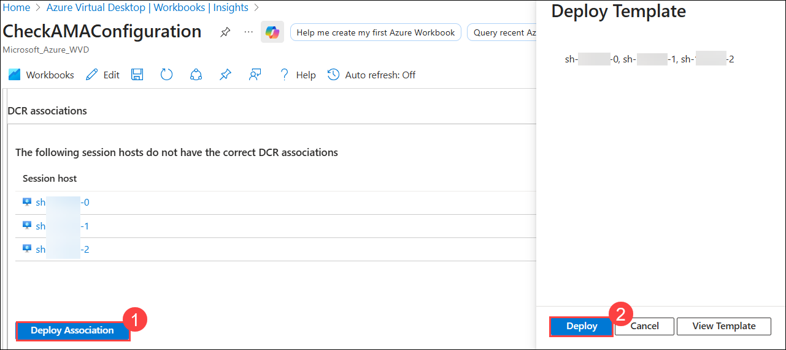

    > **Note:** This effectively associates the newly created DCR with the session hosts in the **az140-21-hp1** host pool.

    > **Note:** Wait for the deployment to complete. This typically takes less than 1 minute.

1. On the **CheckAMAConfiguration** page, on the **Session host data settings** tab, select the **Refresh** icon (a circular arrow) in the toolbar.

1. On the **Session host data settings** tab, in the **Session hosts missing Azure Monitor extension** section, select **Add extension (1)**.

1. In the **Deploy Template** pane, select **Deploy (2)**.

    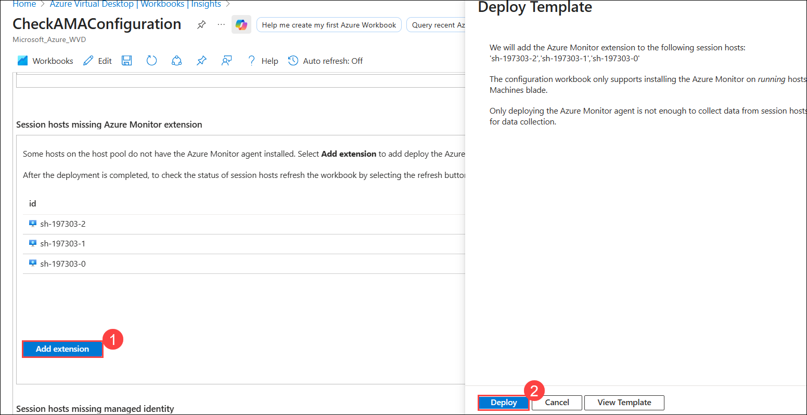

    > **Note:** This effectively installs the Azure Monitor extension on the session hosts in the **az140-21-hp1** host pool.

    > **Note:** Wait for the deployment to complete. This might take about 1 minute.

1. On the **CheckAMAConfiguration** page, on the **Session host data settings** tab, select the **Refresh** icon (a circular arrow) in the toolbar.

1. Verify that there are no error or warning messages displayed. 

     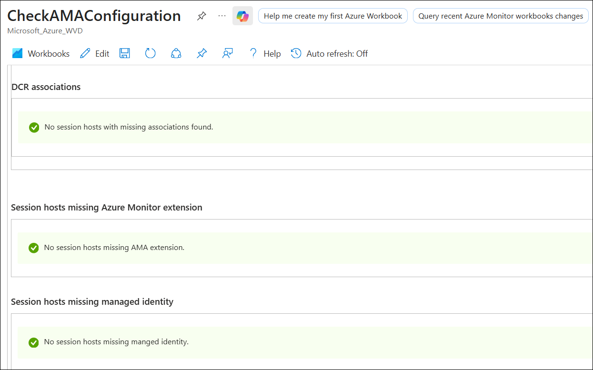

1. Navigate to the top of the **CheckAMAConfiguration** page, select the **Data generated** tab, and then select the **Refresh** icon (a circular arrow) in the toolbar.

     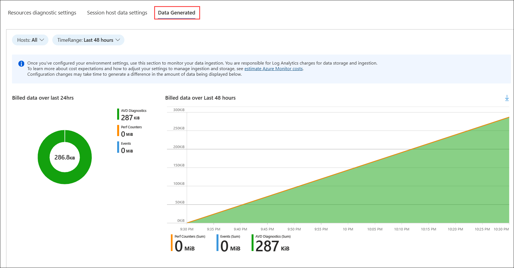

1. Review the sections displaying graphs representing collected data, including **Billed data over last 24hrs**, **Performance Counters**, and **Events**.

    > **Note:** Use the **Billed data over last 24hrs** section to monitor data ingestion. You are responsible for Log Analytics charges for data storage and ingestion.

1. In the Azure portal, navigate back to the **Azure Virtual Desktop** page and, in the **Monitoring (1)** section of the vertical navigation menu, select **Insights (2)**.

     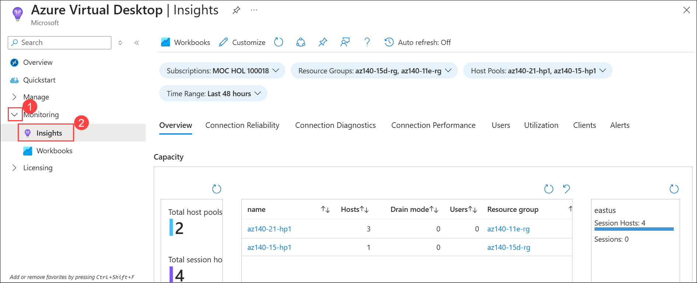

1. On the **Azure Virtual Desktop \| Insights** page, review the content of the **Overview** tab, including the **Capacity** section, **Connection diagnostics: % of users able to connect**, **Connection performance: Time to connect (new sessions)**, and **Utilization** telemetry. 

1. Next, review all the remaining tabs on the **Azure Virtual Desktop \| Insights** page, including **Connection Reliability**, **Connection Diagnostics**, **Connection Performance**, **Users**, **Utilization**, **Clients**, and **Alerts**.

    > **Note:** Consider revisiting these tabs of the Insights page once you complete the subsequent labs to review the charts representing collected telemetry.

### Summary

In this lab, you set up monitoring for Azure Virtual Desktop using Azure Virtual Desktop Insights. You registered the required resource provider, created a Log Analytics workspace, and configured diagnostic settings and data collection rules. You finished by enabling monitoring extensions so AVD session hosts could send performance and usage data to Insights.

**You have successfully completed the lab. Click on Next >>**

