# Lab - Connect to session hosts (Entra ID)

## Estimated Duration: 20 Minutes

## Lab Objectives
  
In this lab, you will complete the following tasks:

- **Task 1:** Adjust RDP properties of the Azure Virtual Desktop host pool

- **Task 2:** Install Microsoft Remote Desktop client on a Windows 11 computer

- **Task 3:** Subscribe to a Azure Virtual Desktop workspace

- **Task 4:** Test Azure Virtual Desktop apps

### Exercise 1: Validate the functionality of Microsoft Entra joined Azure Virtual Desktop session hosts by connecting to them from a Windows 11 client

### Task 1: Adjust RDP properties of the Azure Virtual Desktop host pool

> **Note:** The RDP settings you implemented in the previous lab provide the optimal user experience (via support for single sign-on), however, this requires additional changes described in [Configure single sign-on for Azure Virtual Desktop using Microsoft Entra ID authentication](https://learn.microsoft.com/en-us/azure/virtual-desktop/configure-single-sign-on). Without these changes, by default, authentication is supported providing that the client computer satisfies one of the following criteria:

- It is Microsoft Entra joined to the same Microsoft Entra tenant as the session host
- It is Microsoft Entra hybrid joined to the same Microsoft Entra tenant as the session host
- It is Microsoft Entra registered to the same Microsoft Entra tenant as the session host

Since none of these criteria apply to the lab computer, it is necessary to add `targetisaadjoined:i:1` as a custom RDP property to the host pool.

1. In the Azure portal, on the **az140-21-hp1** Azure Virtual Desktop host pool page, in the in the vertical menu bar, in the **Settings (1)** section, select the **RDP Properties (2)** entry.

1. On the **az140-21-hp1 \| RDP Properties** page, select the **Advanced (3)** tab. 

    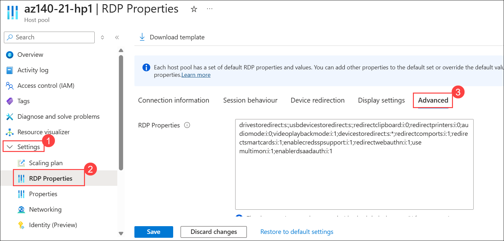

1. On the **Advanced** tab of the **az140-21-hp1 \| RDP Properties** page, in the **RDP Properties** text box, append the following string to the existing content **(1)** make sure to add a leading semicolon character (`;`) if needed to separate this string from the one which preceeds it:

    ```txt
    targetisaadjoined:i:1
    ```

1. In the **RDP Properties** text box, remove the following string (if present) from the existing content (with its trailing semicolon character):

    ```txt
    enablerdsaadauth:i:value
    ```

1. On the **az140-21-hp1 \| RDP Properties** page, select **Save (2)**.

   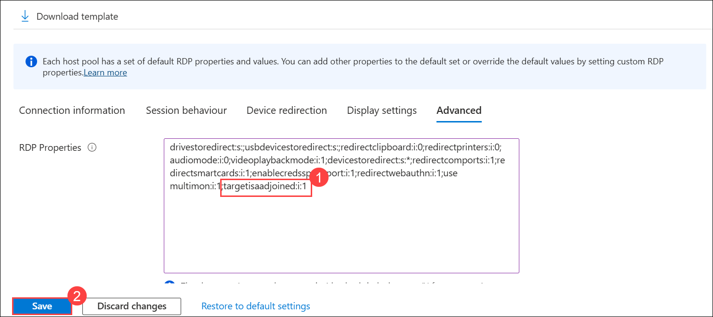

### Task 2: Install Microsoft Remote Desktop client on a Windows 11 computer

1. In the web browser, navigate to the [Connect to Azure Virtual Desktop with the Remote Desktop client for Windows](https://learn.microsoft.com/en-us/azure/virtual-desktop/users/connect-windows) page, scroll down to the section **Download and install the Remote Desktop client (MSI)**, and select the [Windows 64-bit](https://go.microsoft.com/fwlink/?linkid=2139369) link. 

    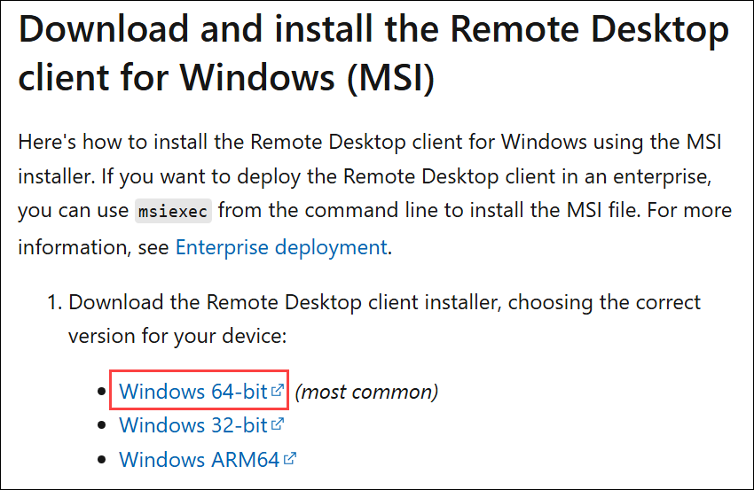

1. In the lab vm **Open File Explorer**, navigate to the **Downloads (1)** folder, and launch (Double-click) the installation of the newly downloaded MSI file **(2)**. 

    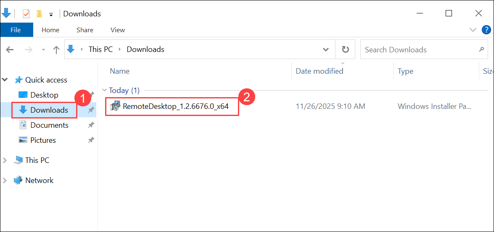

1. In the **Remote Desktop Setup** window, the **Welcome to the Remote Desktop Setup Wizard** screen appears. Select **Next** to continue.

    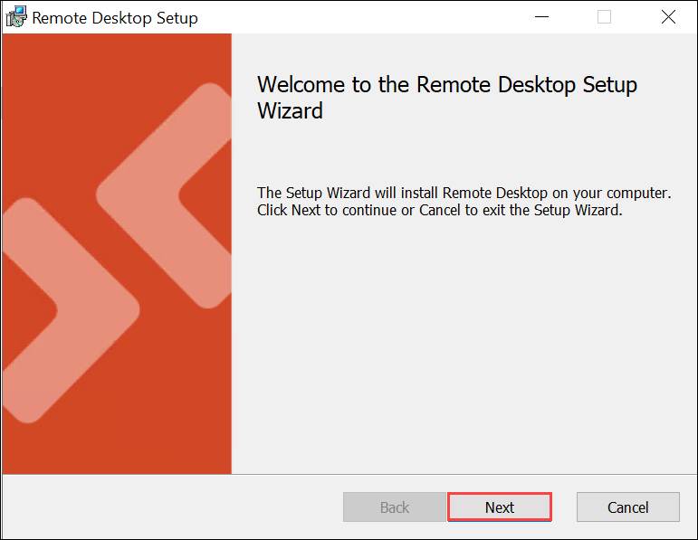

1. On the **End-User License Agreement** screen, select the **I accept the terms in the License Agreement** checkbox **(1)**, and then choose **Next (2)**.

    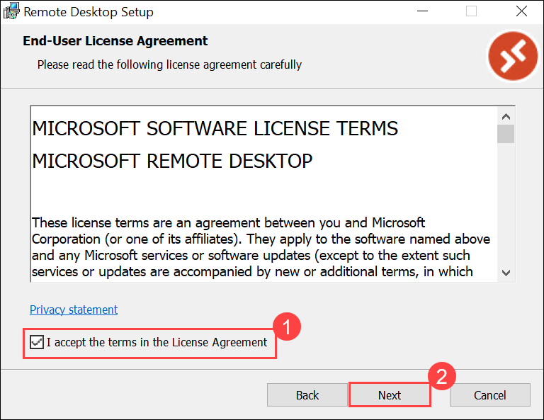

1. On the **Installation Scope** screen, select **Install for all users of this machine (1)**, and then choose **Install (2)**. If prompted, accept the User Account Control prompt to proceed with the installation.

    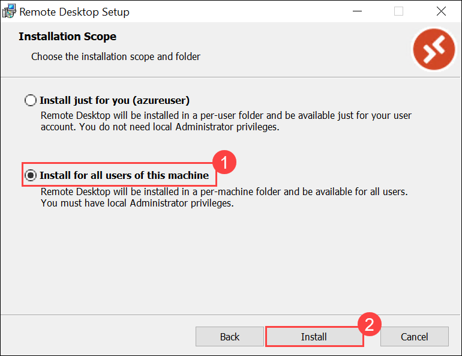

1. Once the installation completes, ensure that the **Launch Remote Desktop when setup exits (1)** checkbox is selected and select **Finish (2)** to start the Microsoft Remote Desktop client.

   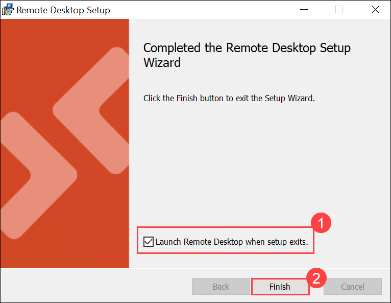

   > **Note:** The [Remote Desktop Store app](https://learn.microsoft.com/en-us/azure/virtual-desktop/users/connect-windows?pivots=rd-store) for Windows doesn't support connecting to Microsoft Entra-joined session hosts.

### Task 3: Subscribe to a Azure Virtual Desktop workspace

1. On the lab vm, switch to the **Remote Desktop** client window, select **Subscribe** and, when prompted, sign in with the credentials.

   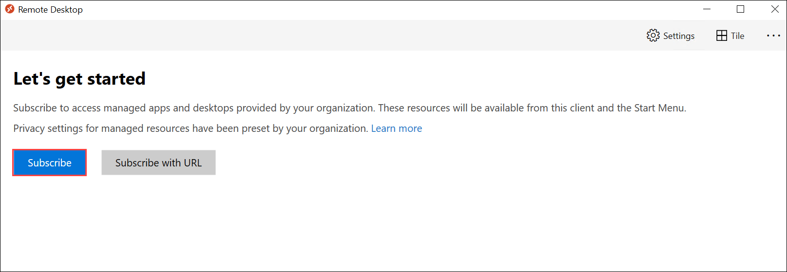

   - **Email/Username:** <inject key="AzureAdUserEmail"></inject>

   - **Temporary Access Pass:** <inject key="AzureAdUserPassword"></inject>

     > **Note:** Select the user account which is the member of the Entra group with the **AVD-DAG** prefix.

     > **Note:** Alternatively, in the **Remote Desktop** client window, select **Subscribe with URL**, in the **Subscribe to a Workspace** pane, in the **Email or Workspace URL**, type **https://client.wvd.microsoft.com/api/arm/feeddiscovery**, select **Next**, and, once prompted, sign in with the Microsoft Entra credentials.

1. Ensure that the **Remote Desktop** page displays only the **SessionDesktop** icon.

   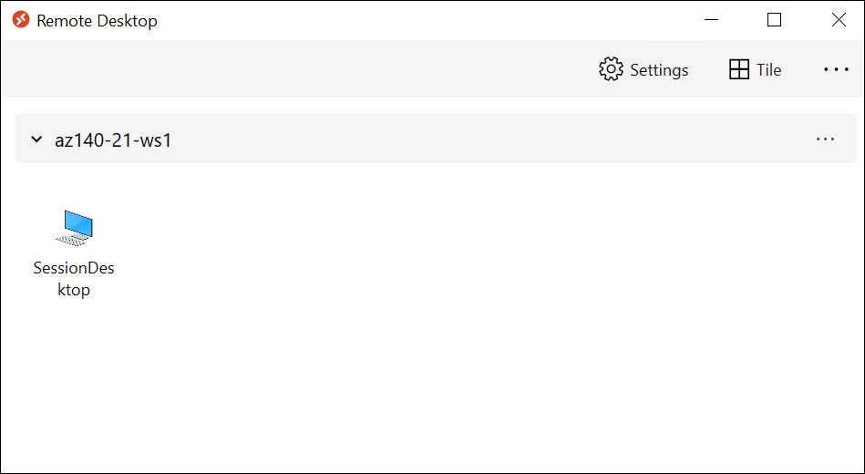

   > **Note:** This is expected, because the Microsoft Entra user account you selected was assigned in the first lab *Deploy host pools and session hosts by using the Azure portal (Entra ID)* to the auto-generated **az140-21-hp1-DAG** desktop application group.

1. On the **Remote Desktop** page, right-click the **SessionDesktop (1)** icon and, in the pop-up menu, select **Settings (2)**.

    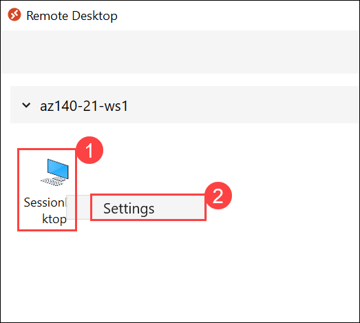

1. In the **SessionDesktop** pane, turn off the **Use default settings (1)** switch.

1. In the **Display settings** section, in the drop-down menu, select the entry **Select displays (2)** and choose the displays you want to use for the session.

    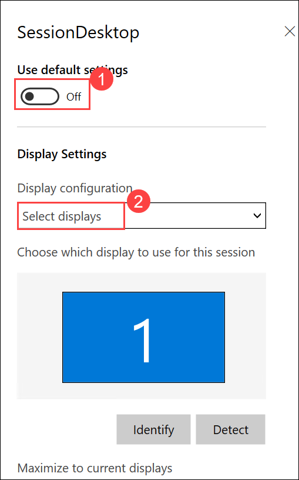

1. In the **SessionDesktop** pane, review the remaining options, including **Maximize to current displays**, **Single display when in windowed mode** and **Fit session to window**, without making any changes. 

    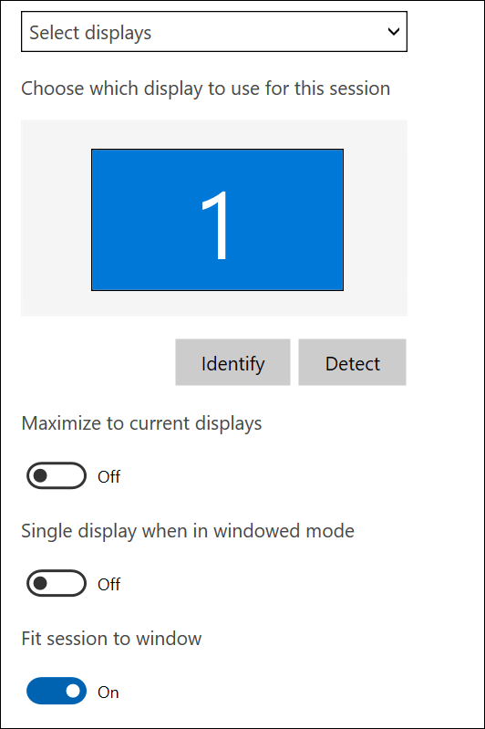

1. Close the **SessionDesktop** pane. 

    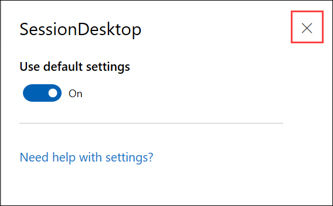

1. On the **Remote Desktop** page, double-click the **SessionDesktop** icon.

    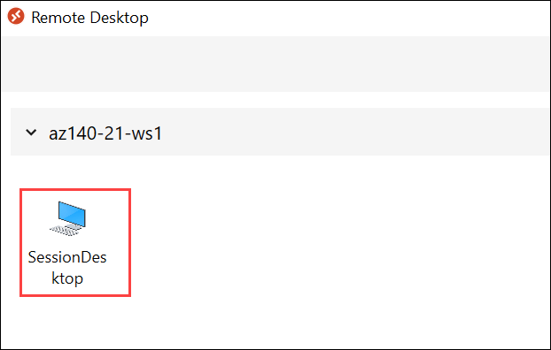

1. On the lab VM desktop, open the **AzureCreds** file to view the credentials. 

   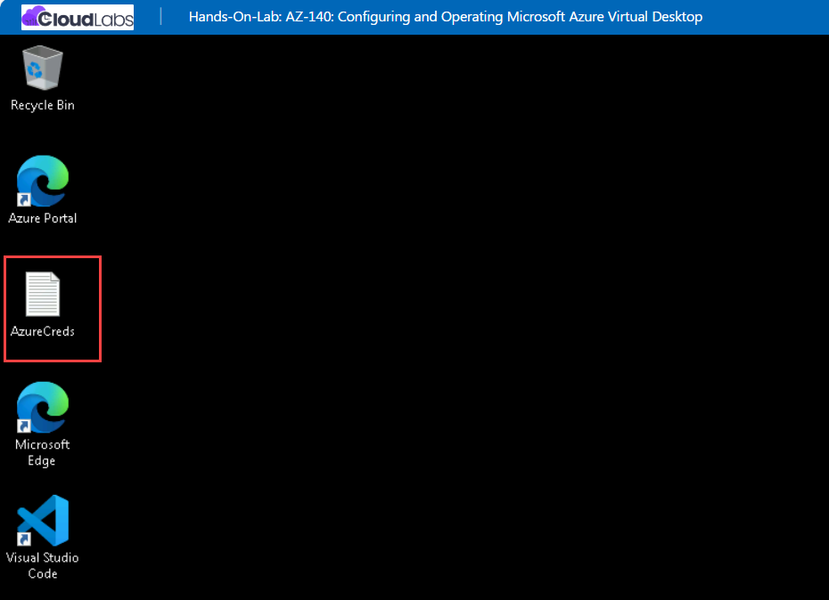

1. Copy the **AzurePassword** value from the file. You will use this password when prompted to authenticate.

    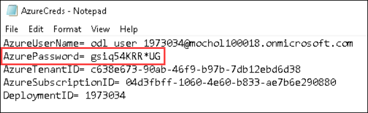

1. When prompted to sign in, in the **Windows Security** dialog box, enter the password and click **Ok**.

   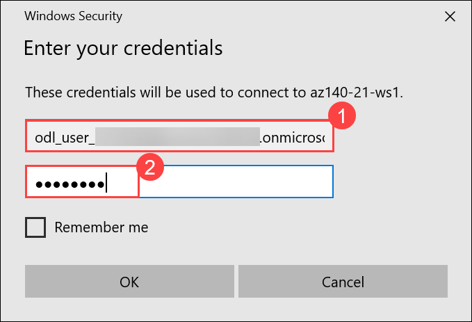

   > **Note:** Azure Virtual Desktop doesn't support signing in to Microsoft Entra ID with one user account, then signing in to Windows with a separate user account. Signing in with two different accounts at the same time can lead to users reconnecting to the wrong session host, incorrect or missing information in the Azure portal, and error messages appearing while using app attach or MSIX app attach.

   > **Note:** You will be automatically presented with the **SessionDesktop** window.

1. In the Remote Desktop session window, verify that you have full administrative access within the session (for example, select the **Windows (1)** logo icon in the taskbar and then select the **Windows PowerShell(Admin) (2)** item from the pop-up menu.

    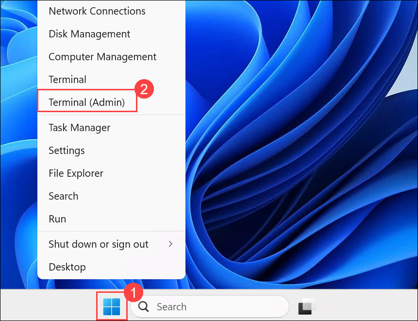

1. Within the Remote Desktop session window, select the **Windows logo (1)** icon in the taskbar, choose the **ODL_User (2)** account shown in the menu and, in the pop-up menu, select **Sign out (3)**.

   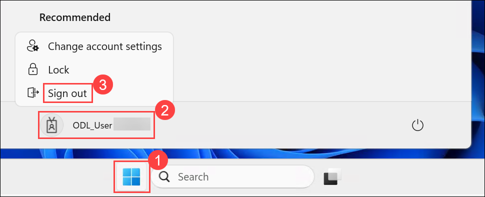

   > **Note:** This will automatically terminate the Remote Desktop session. 

1. Back in the **Remote Desktop** window, select the ellipsis (`...`) icon to the right of the **az140-21-ws1 (1)** workspace entry, select **Unsubscribe (2)**.

    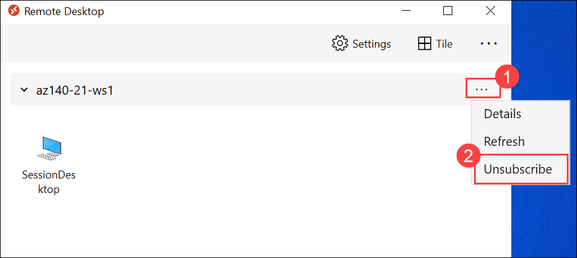

1. On the **Are you sure you want to unsubscribe?** confirmation dialog, select **Continue** to proceed.  

    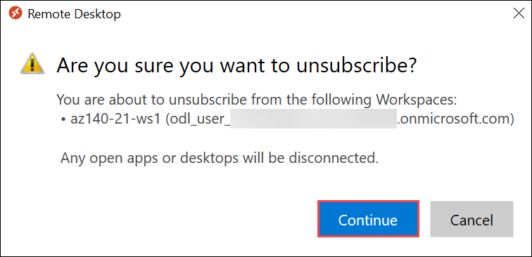

1. In the **Remote Desktop** client window, select **Subscribe** and, when prompted, sign in with the credentials of the second Entra ID user account which you can locate on the **Resources** tab in the right pane of the lab interface window.

   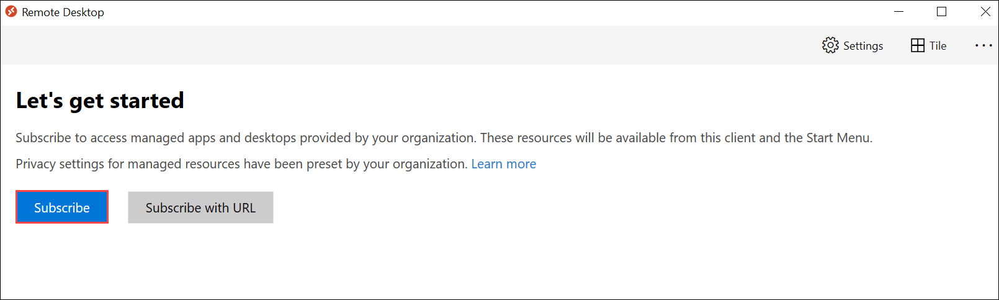

   > **Note:** If the **Update your password** prompt appears, create a new password, record it in a Notepad file for later use, and then select **Sign in** to continue.  

   > **Note:** Select the user account which is the member of the Entra group with the **AVD-RemoteApp** prefix.

1. Ensure that the **Remote Desktop** page displays four icons, including `Command Prompt, Microsoft Word, Microsoft Excel, Microsoft PowerPoint`. 

   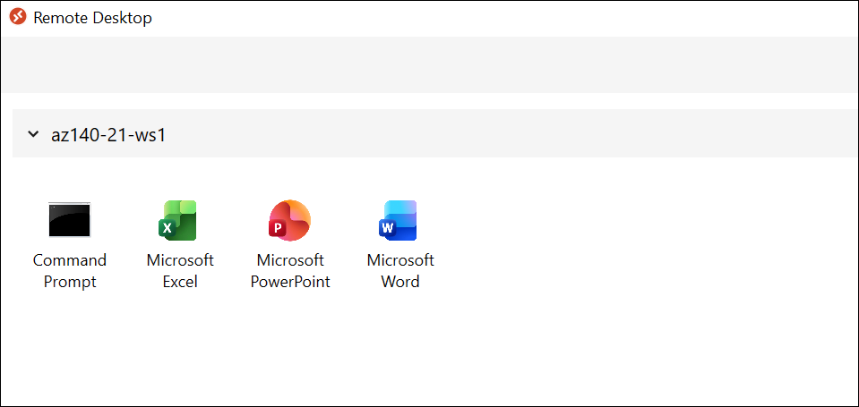

   > **Note:** This is expected, because the Microsoft Entra user account you selected was assigned in the first lab *Deploy host pools and session hosts by using the Azure portal (Entra ID)* to the **az140-21-hp1-Office365-RAG** and **az140-21-hp1-Utilities-RAG** application groups.

1. Double-click the **Command Prompt** icon. 

    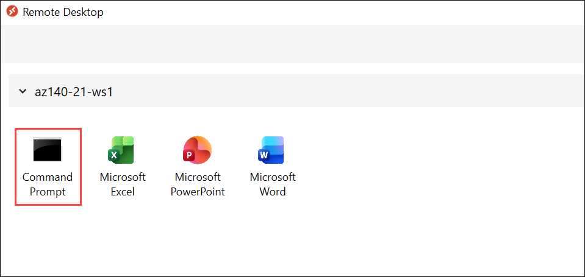

1. When prompted to sign in, in the **Windows Security** dialog box, enter the password of the second Microsoft Entra user account (User2) you used to connect to the target Azure Virtual Desktop environment and click **OK**.

    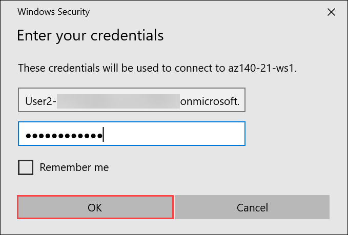

    > **Note:** If you updated the password in the earlier **Update your password** prompt, use the new password here.

1. Verify that a **Command Prompt** window appears shortly afterwards. 

1. In the Command Prompt window, type **hostname** and press the **Enter** key to display the name of the computer on which the Command Prompt is running.

   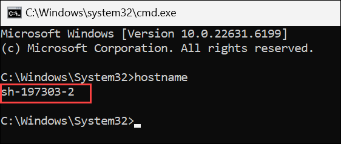

   > **Note:** Verify that the displayed name starts with the **sh-<inject key="DeploymentID" enableCopy="false"/>** prefix.

1. At the Command Prompt, type **logoff** and press the **Enter** key to log off from the current Remote App session.

   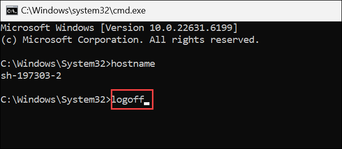

**You have successfully completed the lab. Click on Next >>**

