# Lab 05- Implement and monitor autoscaling of session hosts

## Estimated Duration: 45 Minutes

## Overview

In this lab, you’ll set up and validate autoscaling for an Azure Virtual Desktop pooled host pool. You’ll assign the required RBAC role, adjust host pool settings, and build a scaling plan with custom schedules. Finally, you’ll test how autoscale reacts to user load and shut down extra hosts before disabling the scaling plan.

## Lab Objectives
  
In this lab, you will complete the following tasks:

- **Task 1:** Assign the required RBAC role to an Azure Virtual Desktop service principal

- **Task 2:** Stop and deallocate all session hosts

- **Task 3:** Adjust the host pool settings

- **Task 4:** Create a scaling plan

- **Task 5:** Evaluate the autoscaling functionality

- **Task 6:** Disable host pool autoscaling

### Task 1: Assign the required RBAC role to an Azure Virtual Desktop service principal

In this task, you assign the required subscription-level RBAC role so Azure Virtual Desktop can power on and off session host VMs for autoscaling.

> **Note:** For autoscale plans to work, you need to grant the Azure Virtual Desktop service principal the permissions to manage the power state of the session host VMs. These permissions can be granted by using the built-in **Desktop Virtualization Power On Off Contributor** RBAC role. It is important to keep in mind that the role assignment must be performed at the subscription scope. Assigning this role at any level lower than your subscription, such as the resource group, host pool, or VM, will prevent autoscale from working properly. 

> **Note:** This role is different from the one (**Desktop Virtualization Power On Contributor**) used in the lab *Manage host pools and session hosts by using the Azure portal (Entra ID)*, which was required to support the *Start VM on Connect* functionality.

1. In the Azure portal, select the **Cloud Shell** icon from the top menu to start a PowerShell session.

    

1. In the PowerShell session in the Azure Cloud Shell pane, run the following command to retrieve the value of the Id property of the Azure subscription you are using in this lab and store it in a variable `$subId`:

    ```powershell
    $subId = (Get-AzSubscription).Id
    ```

1. Run the following command to create a $parameters variable, which stores a hash table that contains the values of the RBAC role definition name, Microsoft Entra application representing the **Azure Virtual Desktop** service principal, and the subscription scope:

    ```powershell
    $parameters = @{
        RoleDefinitionName = "Desktop Virtualization Power On Off Contributor"
        ApplicationId = "9cdead84-a844-4324-93f2-b2e6bb768d07"
        Scope = "/subscriptions/$subId"
    }
    ```

1. Run the following command to create the RBAC role assignment:

    ```powershell
    New-AzRoleAssignment @parameters
    ```

    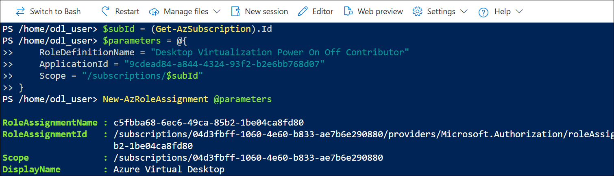

1. Close the Cloud Shell pane.

### Task 2: Stop and deallocate all session hosts

In this task, you stop and deallocate every session host in the pool.

> **Note:** To evaluate the autoscaling functionality, you will stop and deallocate all of the session hosts in the Azure Virtual Desktop environment. 

1. In the Azure portal, search for and select **Azure Virtual Desktop** and, on the **Azure Virtual Desktop** page, in the vertical menu bar, in the **Manage** section, select **Host pools (1)**.

1. On the **Azure Virtual Desktop \| Host pools** page, in the list of host pools, select **az140-21-hp1 (2)**.

     

1. On the **az140-21-hp1** page, in the in the vertical menu bar, in the **Manage (1)** section, select **Session hosts (2)**.

1. On the **az140-21-hp1 \| Session hosts** page, select the checkbox next to each session host **(3)**, select the ellipsis (**…**) menu **(4)**, and then choose **Stop (5)**.  

     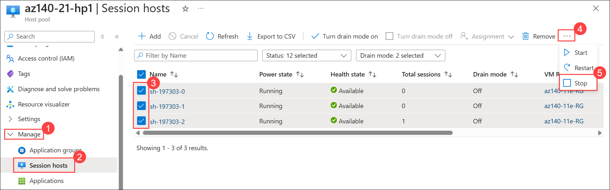

1. When prompted to confirm, in the **Stop session hosts** pop-up window, select **Stop**.

    

    > **Note:** Do not wait until the session hosts are stopped and deallocated, but instead proceed to the next task. Stopping and deallocating session hosts might take about 2 minutes.

### Task 3: Adjust the host pool settings

In this task, you lower the host pool’s MaxSessionLimit to 1 to support autoscale testing.

> **Note:** When using autoscale for pooled host pools, you must have a configured MaxSessionLimit parameter for that host pool. In this lab, you will set it artificially low in order to facilitate illustrating the autoscaling functionality.

1. In the Azure portal, on the **az140-21-hp1** page, in the **Settings (1)** section, select **Properties (2)**.

1. On the **az140-21-hp1\|Properties** page, in the **Max session limit** text box, enter **1 (3)**.

1. On the **az140-21-hp1\|Properties** page, select **Save (4)**.

    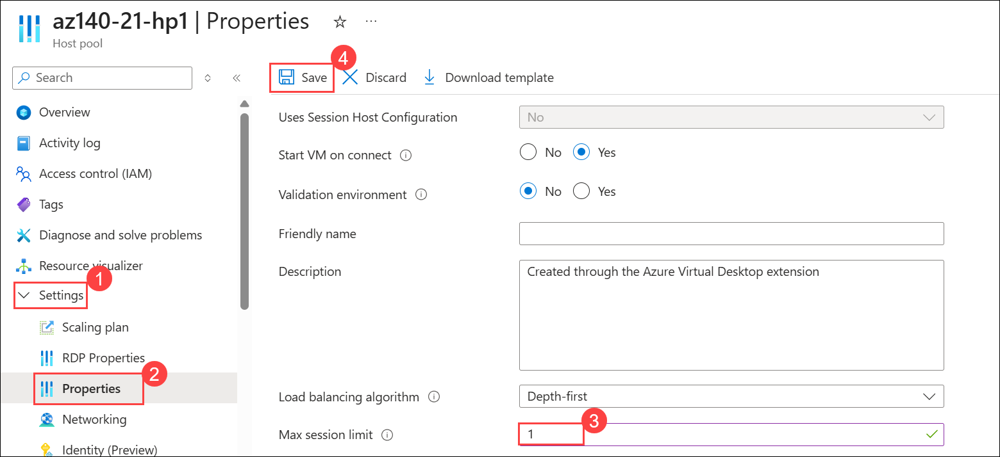

### Task 4: Create a scaling plan

In this task, you build a scaling plan with schedules and assign it to the host pool to control automatic VM power management.

1. In the Azure portal, navigate back to **Azure Virtual Desktop**, and in the **Manage (1)** section of the vertical menu, select **Scaling plans (2)**.

1. On the **Azure Virtual Desktop \| Scaling plans** page, select **+ Create (3)**.

    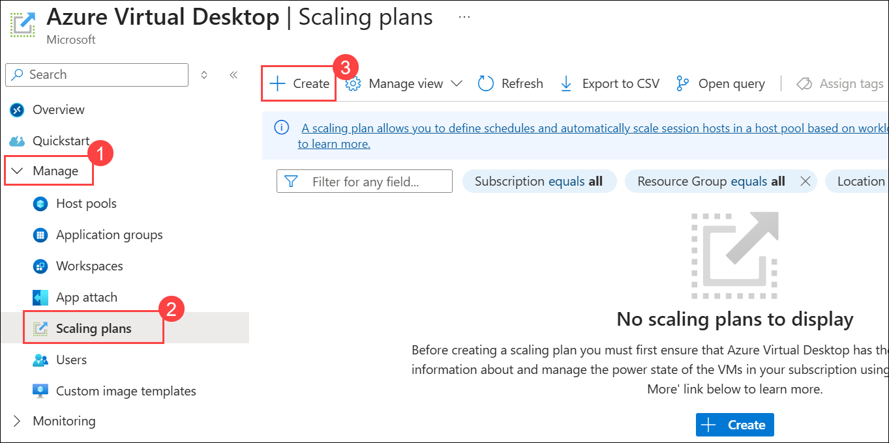

1. On the **Basics** tab of the **Create a scaling plan** page, specify the following settings and select **Next : Schedules (9):**

    |Setting|Value|
    |---|---|
    |Subscription|Choose the default subscription **(1)**|
    |Resource group|Select **az140-11e-RG (2)**|
    |Scaling plan name|**az140-scalingplan412e (3)**|
    |Region|**<inject key="Region" enableCopy="false" /> (4)**|
    |Friendly name|**az140-scalingplan412e (5)**|
    |Time zone|The local time zone of the Azure region where you deployed the Azure Virtual Desktop environment **(6)**|
    |Host pool type|**Pooled (7)**|
    |Scaling method|**Power management autoscaling (8)**|

    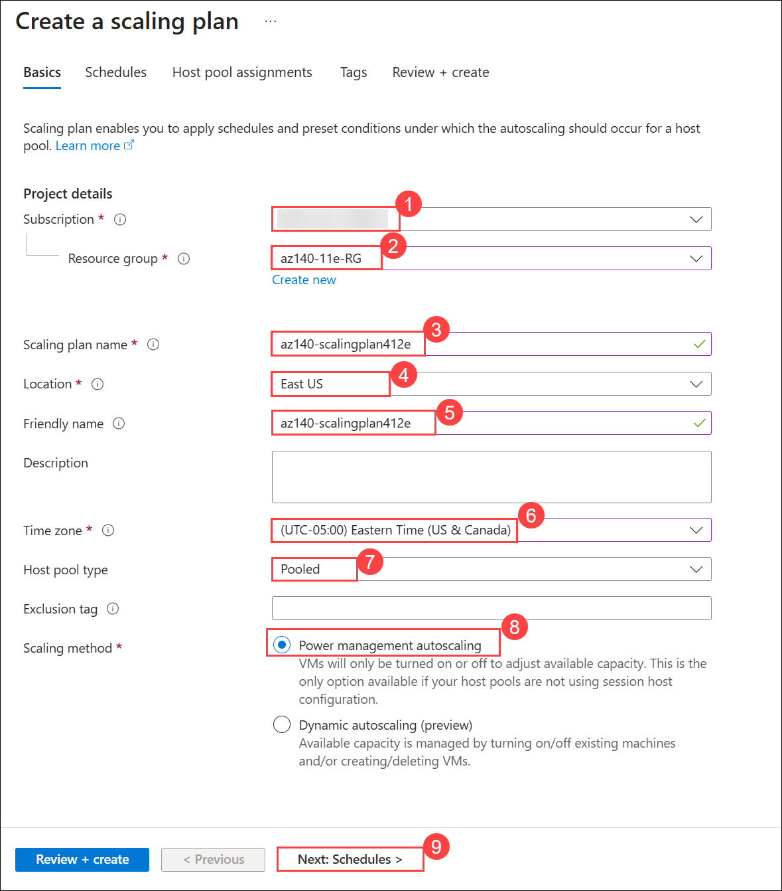

    > **Note:** Leave the **Exclusion tag** property not set. In general, you can use this feature to exclude Azure VMs with arbitrarily set tags from autoscaling.

1. On the **Schedule** tab, select **+ Add schedule**.

    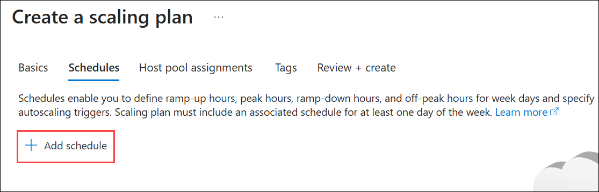

    > **Note:** Schedules allow you to define ramp-up hours, peak hours, ramp-down hours, and off-peak hours for week days and specify autoscaling triggers. Scaling plan must include an associated schedule for at least one day of the week. 

1. On the **General** tab of the **Add a schedule** pane, adjust the default configuration to match the following settings and then select **Next (3)**:

    |Setting|Value|
    |---|---|
    |Time zone|The local time zone of your Azure Virtual Desktop environment (based on the region you selected earlier in this task)|
    |Schedule name|**week_schedule (1)**|
    |Repeat on|**7 selected (2)** (select all days of the week)|

    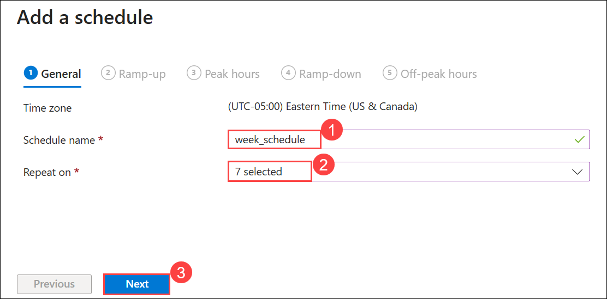

    > **Note:** The schedule effectively covers every day of the week, which will facilitate evaluating outcome of autoscaling.

1. On the **Ramp-up** tab of the **Add a schedule** pane, adjust the default configuration to match the following settings and then select **Next (5)**:

    |Setting|Value|
    |---|---|
    |Start time (12 hour system)|Your current time minus 1 hour **(1)**|
    |Load balancing algorithm|**Breadth-first (2)**|
    |Minimum percentage of hosts (%)|**30 (3)**|
    |Capacity threshold (%)|**60 (4)**|

    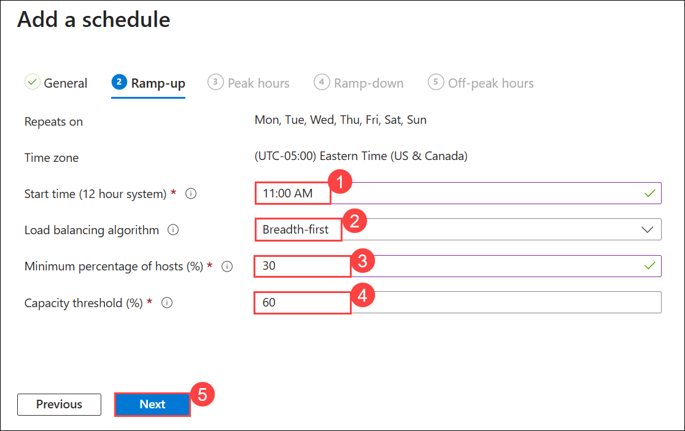

    > **Note:** For pooled host pools, autoscale ignores existing load-balancing algorithms in your host pool settings, and instead applies load balancing based on your schedule configuration.

    > **Note:** The **Minimum percentage of hosts** setting designates the minimum percentage of session host virtual machines to start for ramp-up and peak hours. For example, if **Minimum percentage of hosts** is specified as 30% and total number of session hosts in your host pool is 3, autoscale will ensure a minimum of 1 session host is available to accept user connections.

    > **Note:** Autoscale rounds up to the nearest whole number.

    > **Note:** The **Capacity threshold** setting is the percentage of used host pool capacity that will be considered to evaluate whether to turn on/off virtual machines during the ramp-up and peak hours. For example, if capacity threshold is specified as 60% and your host pool capacity is 1 session (with one host running), autoscale will turn on additional session hosts once the load of the host pool exceeds 60% (it's 100% in this case).

1. On the **Peak hours** tab of the **Add a schedule** pane, adjust the default configuration to match the following settings and then select **Next (3)**:

    |Setting|Value|
    |---|---|
    |Start time (12 hour system)|Your current time plus 1 hour **(1)**|
    |Load balancing algorithm|**Depth-first (2)**|
    |Capacity threshold (%)|**60**|

    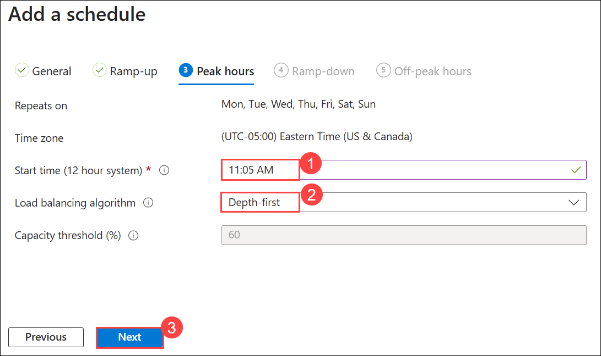

    > **Note:** The **Capacity threshold (%)** setting is shared between the **Ramp-up** and **Peak hours** settings.

1. On the **Ramp-down** tab of the **Add a schedule** pane, adjust the default configuration to match the following settings and then select **Next (7)**:

    |Setting|Value|
    |---|---|
    |Start time (12 hour system)|Your current time plus 2 hours **(1)**|
    |Load balancing algorithm|**Depth-first (2)**|
    |Minimum percentage of active hosts (%)|**10 (3)**|
    |Capacity threshold (%)|**80 (4)**|
    |Force sign out users|**No (5)**|
    |Stop VMs when|**VMs have no active or disconnected sessions (6)**|

    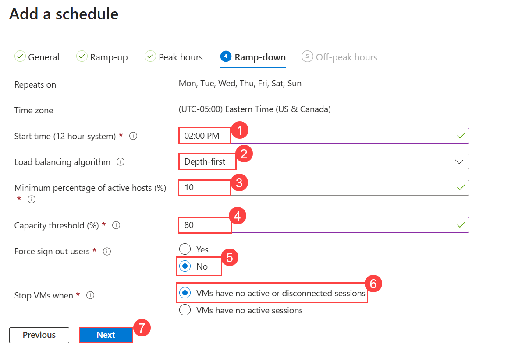

    > **Note:** The **Minimum percentage of active hosts (%)** setting designates the minimum percentage of session host virtual machines that you would like to get to for ramp-down and off-peak hours. For example, if **Minimum percentage of active hosts (%)** is set to 10% and total number of session hosts in your host pool is 3, autoscale will ensure a minimum of 1 session host is available to take user connections.

    > **Note:** The **Capacity threshold (%)** setting designates the percentage of used host pool capacity that will be considered to evaluate whether to turn off virtual machines during the ramp-down and off-peak hours. For example, with 1 user connection and 3 hosts running, if capacity threshold is specified as 80%, autoscale would turn off 1 host (resulting in 50% used host pool capacity).

    > **Note:** In general, autoscale will stop and deallocate session hosts according to the following rules:

    - The used host pool capacity is below the capacity threshold.
    - Turning off session hosts will not result in exceeding the capacity threshold.
    - Autoscale only turns off session hosts with no user sessions on them, unless the scaling plan is in ramp-down phase and you've enabled the setting to force user logoff. 
    - Pooled autoscale will not turn off session hosts in the ramp-up phase to ensure that user experience is not impacted.

1. On the **Off-peak hours** tab of the **Add a schedule** pane, adjust the default configuration to match the following settings and then select **Add (3)**:

    |Setting|Value|
    |---|---|
    |Start time (12 hour system)|Your current time plus 3 hours **(1)**|
    |Load balancing algorithm|**Depth-first (2)**|
    |Capacity threshold (%)|**80**|

    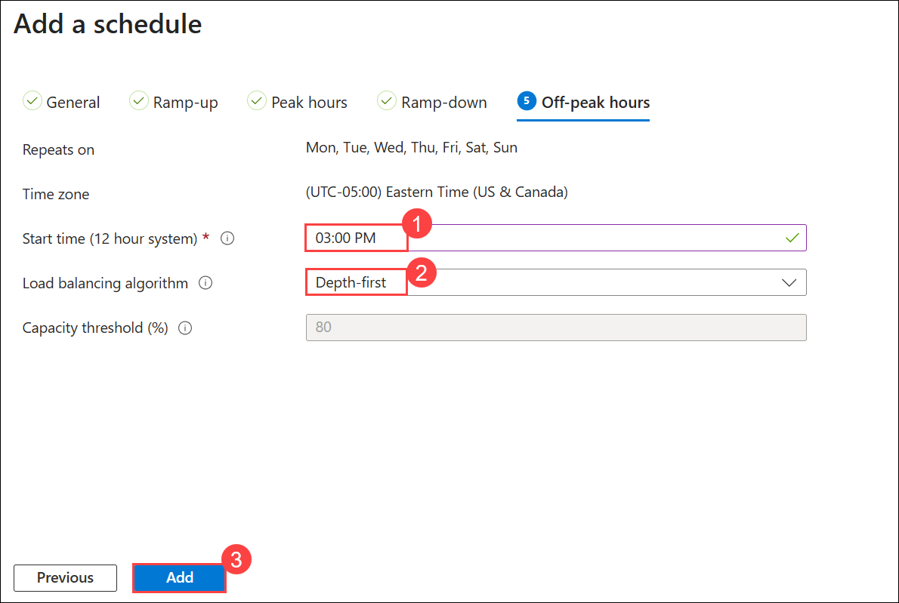

    > **Note:** The **Capacity threshold** setting is shared between the **Ramp-down** and **Off-peak hours** settings.

1. Back on the **Schedule** tab of the **Create a scaling plan** page, select **Next : Host pool assignments**.

    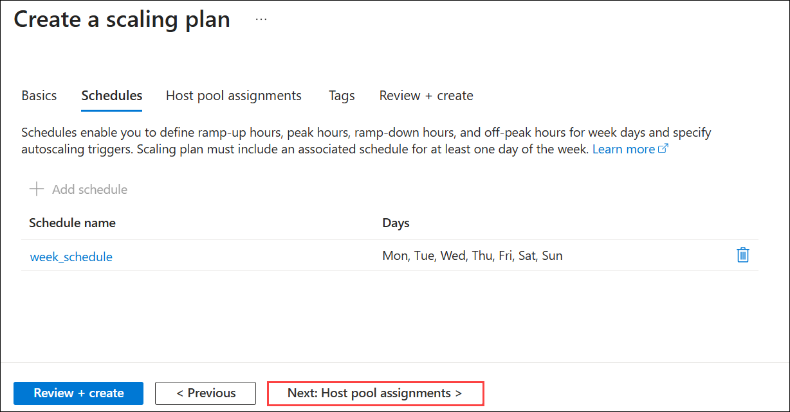

1. On the **Host pool assignments** tab, in the **Select host pool** drop-down list, select **az140-21-hp1 (1)**, ensure that **Enable autoscale** checkbox is selected **(2)**, and then select **Review + create (3)**.

     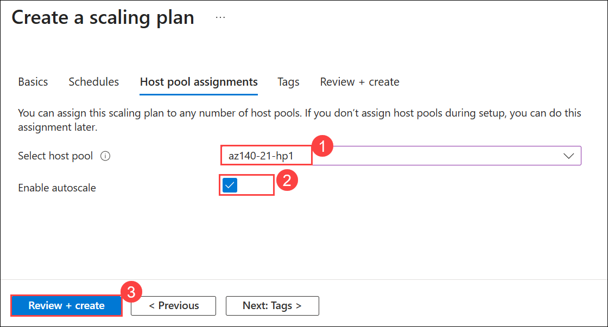

1. On the **Review + Create** page, select **Create**.

    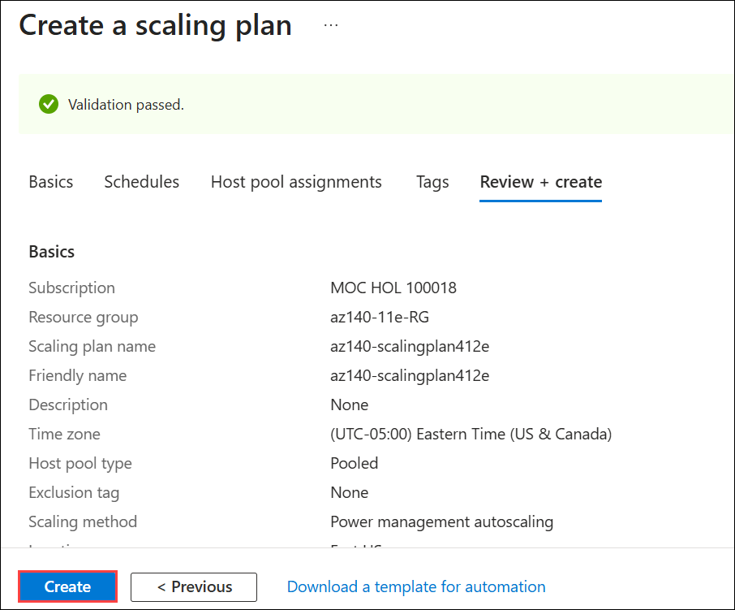

    > **Note:** Wait for autoscale configuration to complete. This typically takes just a few seconds.

> **Congratulations** on completing the task! Now, it's time to validate it. Here are the steps:
>
> - Hit the Validate button for the corresponding task. If you receive a success message, you can proceed to the next task.
> - If not, carefully read the error message and retry the step, following the instructions in the lab guide.
> - If you need any assistance, please contact us at cloudlabs-support@spektrasystems.com. We are available 24/7 to help.
<validation step="913c1668-aa24-42a5-8661-96f96fc0190f" />

### Task 5: Evaluate the autoscaling functionality

In this task, you simulate user load to observe how autoscale reacts scaling out additional session hosts when capacity is exceeded, then scaling them back in during ramp-down.

> **Note:** You will start by evaluating the **Ramp-up** settings.

1. In the Azure portal, on **Azure Virtual Desktop** page, in the vertical menu bar, in the **Manage** section, select **Host pools (1)**.

1. On the **Azure Virtual Desktop \| Host pools** page, in the list of host pools, select **az140-21-hp1 (2)**.

    

1. On the **az140-21-hp1** page, in the in the vertical menu bar, in the **Manage (1)** section, select **Session hosts (2)**.

1. On the **az140-21-hp1 \| Session hosts** page, select **Refresh (3)** and review the **Power state** column to verify that at least one session host is shown as **Running (4)**.  

    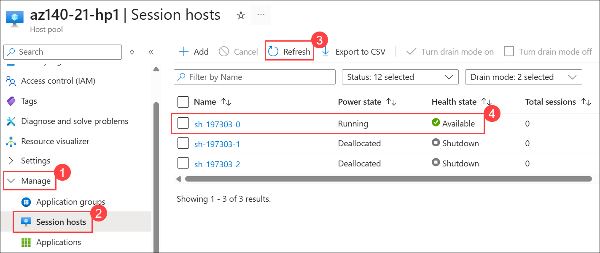

    > **Note:** You might need to wait a couple of minutes before the first session hosts reaches the **Running** state.

    > **Note:** This is expected, since according to the **Ramp-up** settings of the newly created scaling plan, at least one session host should be always online. At this point, the host pool capacity is 1 (since there is only 1 host running), but the used host pool capacity is 0%, since there are no user connections.

    > **Note:** Next, you will evaluate the **Ramp-up** and **Peek hours** capacity threshold setting by launching a single user session. We can evaluate this even outside of **Peek hours** window, since the two stages share the same capacity threshold.

1. On the lab VM, search for **Remote Desktop (1)** in the Start menu and select **Remote Desktop (2)** from the results to launch the client.  

     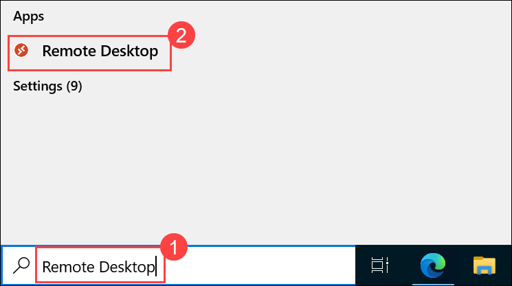

1. On the lab VM, in the **Remote Desktop** client window, select **Subscribe** and, when prompted, sign in with the credentials of the `user2_avd` Entra ID user account which you can locate on the **Resources** tab in the right pane of the lab interface window.

     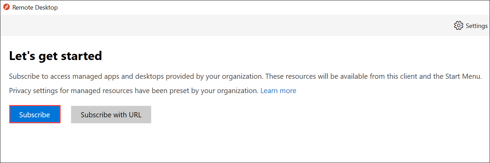

     - **Email/Username:** <inject key="User 01 UPN"></inject>

        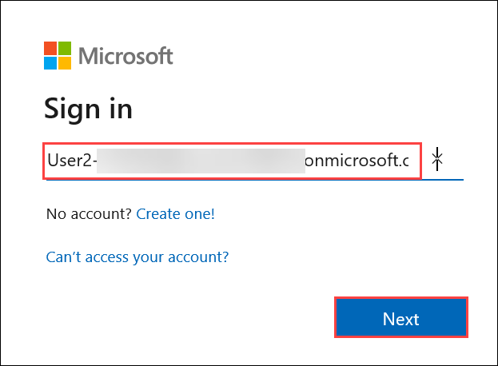

     - **Password:** <inject key="User 01 Password"></inject>

        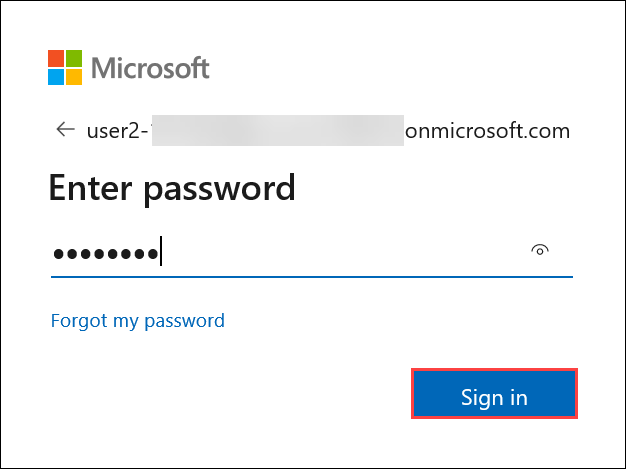

1. Ensure that the **Remote Desktop** page displays four icons, including Microsoft Word, Microsoft Excel, Microsoft PowerPoint, and Command Prompt. 

1. Double-click the Command Prompt icon. 

     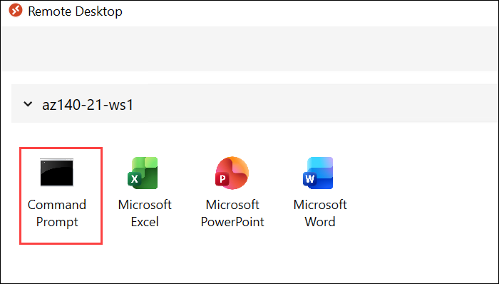

1. When prompted to sign in, in the **Windows Security** dialog box, enter the password of the Microsoft Entra user account (user2_avd) you used to connect to the target Azure Virtual Desktop environment.

    

     - **Email/Username:** <inject key="User 01 UPN"></inject>

     - **Password:** <inject key="User 01 Password"></inject>

       >**Note:** If you have updated password use that password

1. Verify that a **Command Prompt** window appears shortly afterwards. 

    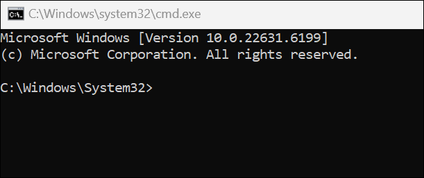

    > **Note:** At this point, the used host pool capacity is 100%, which is greater than the capacity threshold (60%). This should result in autoscaling turning on another host, which will bring the used host pool capacity to 50%. Since this is below the capacity threshold, the third host will remain stopped/deallocated. You will verify this next.

1. From the lab Vm, switch to the web browser displaying the Azure portal. 

1. On the **az140-21-hp1 \| Session hosts** page, select **Refresh (1)**, review the values of the **Power state** setting of session hosts, and verify that now two of them are listed as **Running (2)**.

    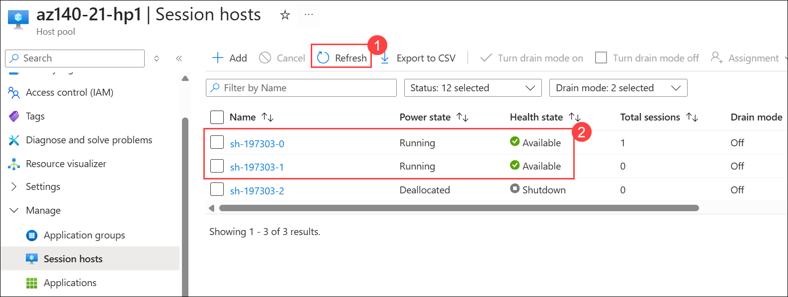

    > **Note:** Next, you will evaluate the **Ramp-down** capacity threshold setting by adjusting its time window. 

1. On the **az140-21-hp1** page, in the vertical navigation menu, in the **Settings (1)** section, select **Scaling plan (2)** and then, on the **Scaling plan** page, select **az140-scalingplan412e**.

     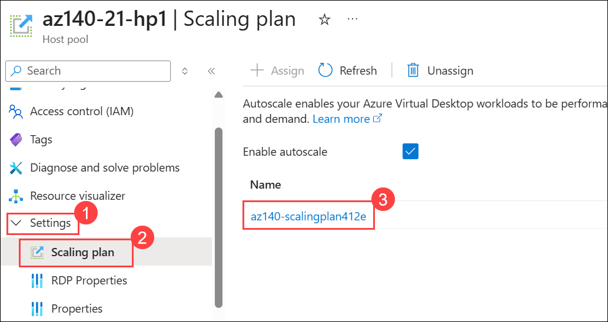

1. On the **az140-scalingplan412e** page, in the vertical navigation menu, in the **Manage** section, select **Schedules (1)** and then select **week_schedule (3)**.

     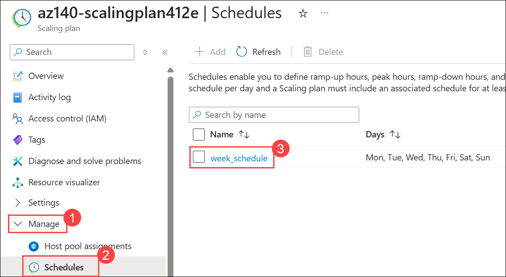

1. In the **week_schedule** pane, navigate to the **Ramp-down** tab, set the **Start time (12 hour system)** to a value between the **Peak hours** start time and your current time **(1)**, and then select **Next (2)**. 

     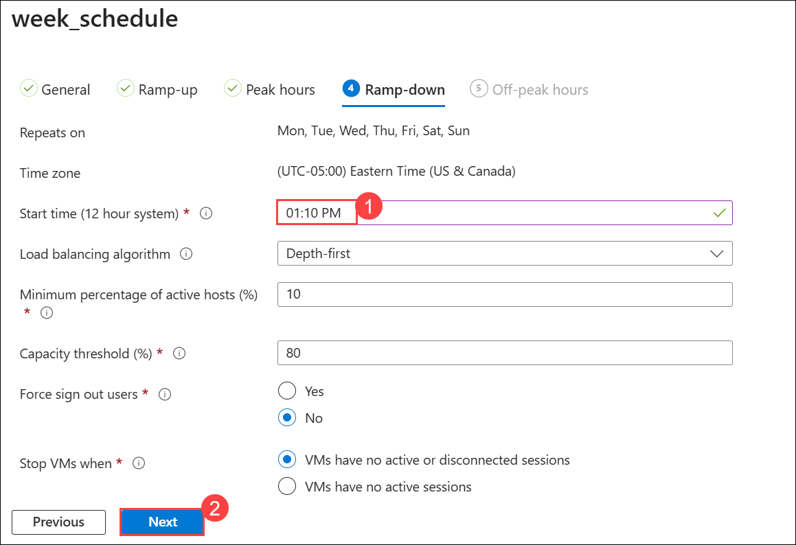

     > **Note:** You might need to adjust the value of **Start time (12 hour system)** of the **Peek hours** phase.

1. In the **week_schedule** pane, navigate to the **Off-peek hours** tab and select **Save**.

     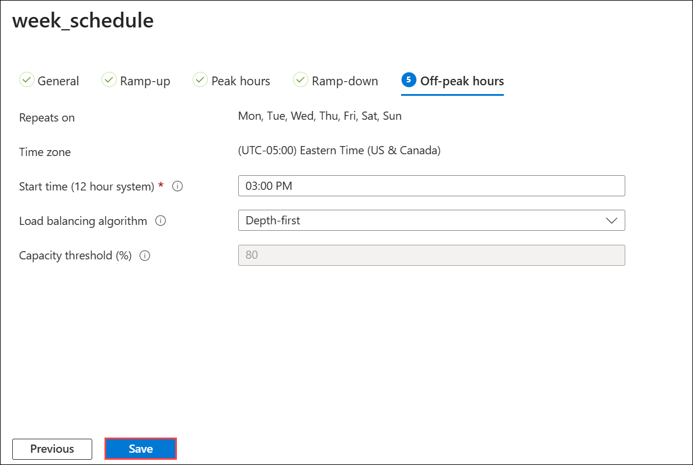

1. Switch to the **Command Prompt** window representing the only RDP session to the host pool and, at the Command Prompt, enter the following and press the **Enter** key:

    ```cmd
    logoff
    ```

1. Navigate to Azure portal, on the **Azure Virtual Desktop** page, in the vertical menu bar, in the **Manage** section, select **Host pools (1)**.

1. On the **Azure Virtual Desktop \| Host pools** page, in the list of host pools, select **az140-21-hp1 (2)**.

     

1. On the **az140-21-hp1** page, in the in the vertical menu bar, in the **Manage (1)** section, select **Session hosts (2)**.

1. On the **az140-21-hp1 \| Session hosts** page, review the values of the **Power state** setting of session hosts and verify that now only one of them is listed as **Running (1)**.

     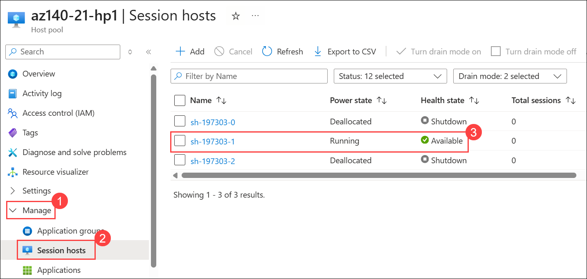

     > **Note:** It may take 1-2 minutes before the session host is shut down.

### Task 6: Disable host pool autoscaling

In this task, you’ll disable autoscaling by unassigning the scaling plan from the host pool.

> **Note:** To ensure that the autoscaling configuration will not affect other labs, you will remove the host pool assignment of the scaling plan you implemented in this lab.

1. Navigate to **Azure Virtual Desktop** page, in the **Manage (1)** section of the vertical navigation menu, select **Scaling plans (1)**, and then, on the **Scaling plans** page, select **az140-scalingplan412e (2)**.

     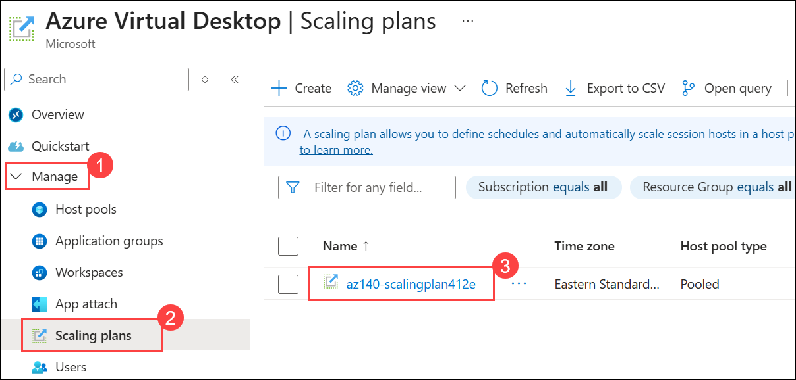

1. On the **az140-scalingplan412e** page, in the **Manage (1)** section, select **Host pool assignments (2)**.

1. On the **az140-scalingplan412e \| Host pool assignments** page, select **az140-21-hp1 (2)**, then select **Unassign (3)**.

     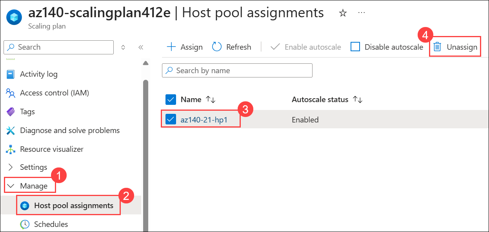

1. In the **Unassign host pool** confirmation dialog, select **Unassign** to complete the action.

     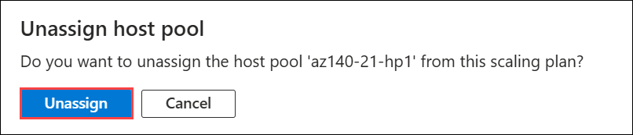

### Summary

In this lab, you configured autoscaling for your Azure Virtual Desktop host pool by assigning the necessary RBAC role and adjusting host pool limits. You built and applied a scaling plan to control how session hosts start and stop based on load. Finally, you validated the autoscale behavior in action and disabled the scaling plan.

**You have successfully completed the lab. Click on Next >>**

