# Lab 06- Implement Azure Private Link for Azure Virtual Desktop

## Estimated Duration: 60 Minutes

## Lab scenario

You have an existing Azure Virtual Desktop environment. You need to implement connection to the environment by using Azure Private Link. 

**Info**  
Azure Virtual Desktop includes three workflows that can be configured using Private Endpoints. Each workflow corresponds to a specific resource type:

- **Initial feed discovery** – Enables RDP clients to discover all workspaces assigned to a user.  
  To implement this workflow using Private Link, create **one** private endpoint to the *global* sub-resource in **any** workspace within your deployment.  
  **Note:** Only **one** private endpoint for initial feed discovery is allowed per Azure Virtual Desktop deployment.

- **Feed download** – Allows RDP clients to download connection details for workspaces containing the user’s application groups.  
  To implement this workflow using Private Link, create a private endpoint to the *feed* sub-resource for **each workspace** that should be accessible privately.

- **Connections to host pools** – Enables RDP clients and session hosts to connect to a host pool.  
  To implement this workflow using Private Link, create a private endpoint to the *connection* sub-resource for **each host pool** that needs private access.

**Info**  
These workflows can be combined using any of the following routing arrangements:

- All components (initial feed discovery, feed download, and session connections) use **private routes**.  
- Feed download and session connections use **private routes**, while initial feed discovery uses **public routes**.  
- Only session connections use **private routes**, with initial feed discovery and feed download using **public routes**.  
- All components use **public routes**, without using Private Link.

**Info**  
In this lab, you will implement **the first arrangement**, where all components—initial feed discovery, feed download, and remote session connections—are fully configured to use **private routes** via Private Link.

## Lab Objectives
  
In this lab, you will complete the following tasks:

- **Task 1:** Re-register the Azure Virtual Desktop resource provider

- **Task 2:** Create an Azure virtual network subnet

- **Task 3:** Implement a private endpoint for connections to a host pool

- **Task 4:** Implement a private endpoint for feed download

- **Task 5:** Implement a private endpoint for initial feed discovery

- **Task 6:** Validate the private endpoint functionality

- **Task 7:** Allow public network access to a host pool and workspace

### Task 1: Re-register the Azure Virtual Desktop resource provider

> **Note**: Before you can use Private Link with Azure Virtual Desktop, you should re-register the **Microsoft.DesktopVirtualization** resource provider. 

1. In the Azure portal, search for and select **Subscriptions**, on the **Subscriptions** page, select the Azure subscription you are using in this lab, and, in the vertical navigation menu, in the **Settings** section, select **Resource providers**.

1. On the **Resource providers** tab, in the search text box, enter **Microsoft.DesktopVirtualization**, in the list of results, select the small circle to the left of the **Microsoft.DesktopVirtualization** entry, and then select **Re-register**.

    > **Note**: Wait for the re-registration process to complete. This typically takes less than 1 minute.

#### Task 2: Create an Azure virtual network subnet

> **Note**: You could use an existing subnet of an Azure virtual network to implement private endpoints in the lab scenario, but it is a common practice to use a dedicated subnet for this purpose.

1. In the Azure portal, search for and select **Virtual networks** and, on the **Virtual networks** page, select **az140-vnet11e**.

1. On the **az140-vnet11e** page, in the **Settings (1)** section of the vertical navigation menu, select **Subnets (2)**.

    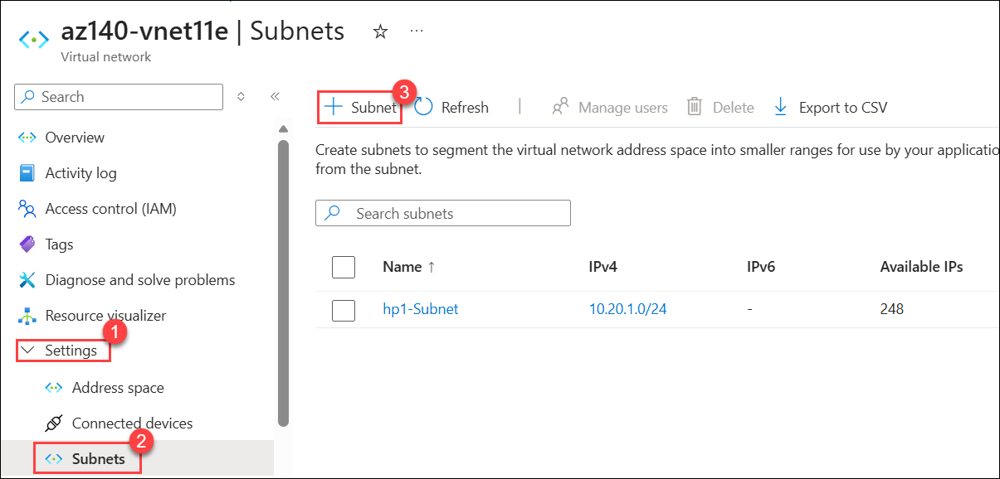

1. On the **az140-vnet11e \| Subnets** page, select **+ Subnet (3)**.

1. In the **Add a subnet** pane, specify the following settings and select **Add (4)** (leave other settings with their default values):

    |Setting|Value|
    |---|---|
    |Name|**pe-Subnet (1)**|
    |Starting address|**10.20.255.0** (2)|
    |Enable private subnet (no default outbound access)|Disabled (3)|

    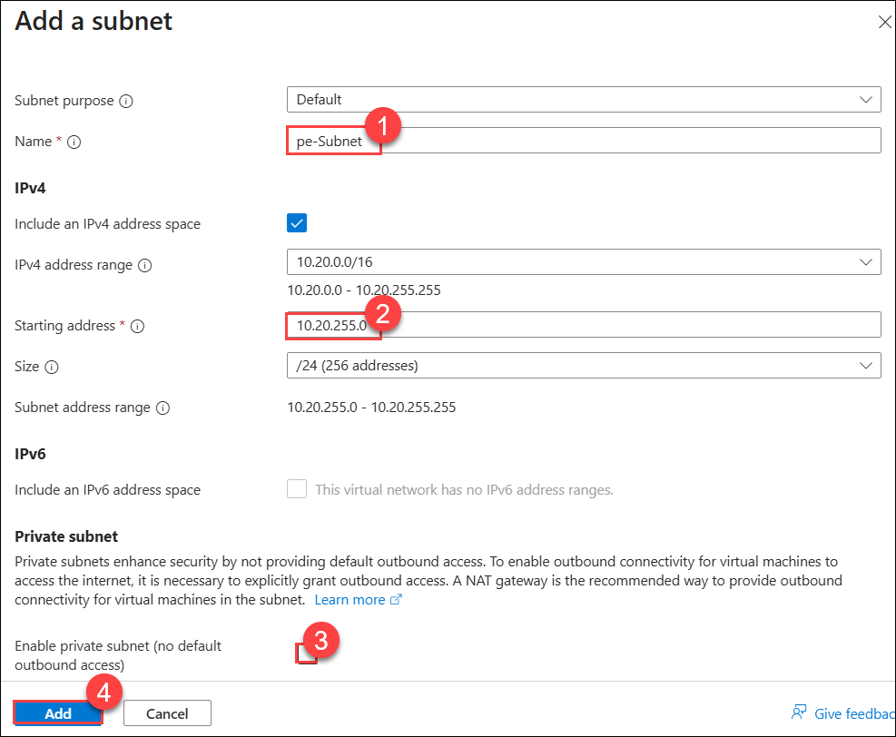

#### Task 3: Implement a private endpoint for connections to a host pool

1. From the lab computer, in the web browser displaying the Azure portal, search for and select **Azure Virtual Desktop**, on the **Azure Virtual Desktop** page, in the **Manage** section of the vertical navigation menu, select **Host pools** and, on the **Azure Virtual Desktop \| Host pools** page, select **az140-21-hp1**. 

1. On the **az140-21-hp1** page, in the vertical navigation menu, in the **Settings (1)** section, select **Networking (2)**.

    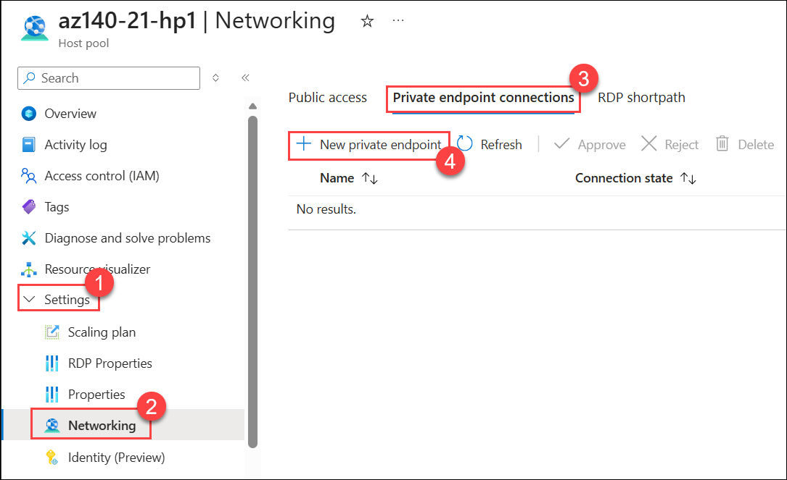

1. On the **az140-21-hp1 \| Networking** page, select the **Private endpoint connections (3)** tab and then, select **+ New private endpoint (4)**.

1. On the **Basics** tab of the **Create a private endpoint** page, specify the following settings and select **Next : Resource > (5)**:

    |Setting|Value|
    |---|---|
    |Subscription|Choose the default subscription|
    |Resource group|Select **az140-11e-RG** (1)|
    |Name|Specify **az140-11-pehp1** (2)|
    |Network Interface Name|**az140-11-pehp1-nic** (3)|
    |Region|**<inject key="Region" enableCopy="false" />** (4)|

    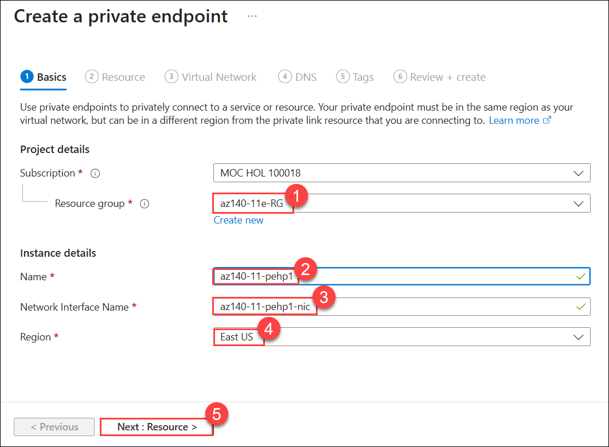

1. On the **Resource** tab of the **Create a private endpoint** page, specify the following settings and select **Next : Virtual network > (2)**:

    |Setting|Value|
    |---|---|
    |Target sub-resource|**connection** (1)|

    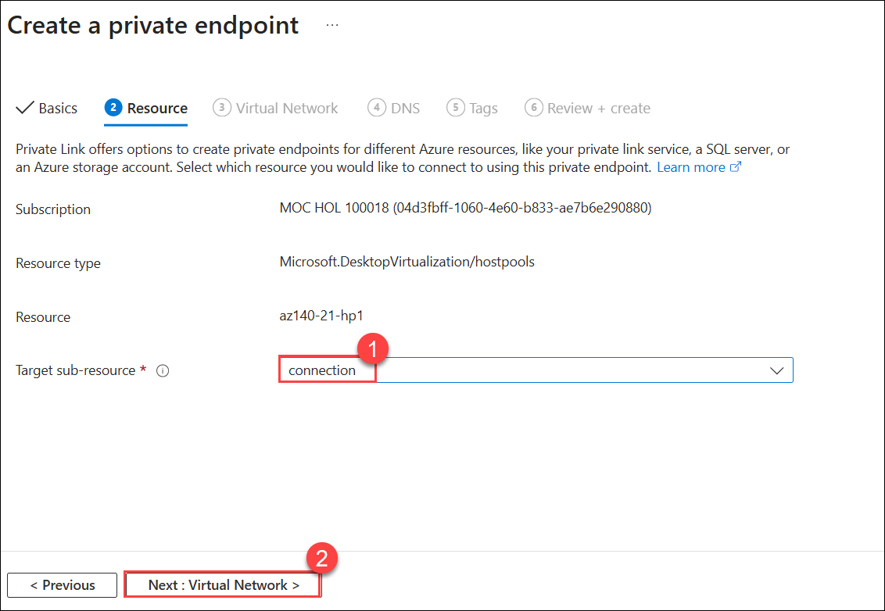

1. On the **Virtual network** tab of the **Create a private endpoint** page, specify the following settings and select **Next : DNS > (5)** (leave other settings with their default values):

    |Setting|Value|
    |---|---|
    |Virtual network|Select **az140-vnet11e (az140-11e-RG)** (1)|
    |Subnet|Select **pe-Subnet** (2)|
    |Network policy for private endpoints|**Disabled** (3)|
    |Private IP configuration|**Dynamically allocate IP address** (4)|

    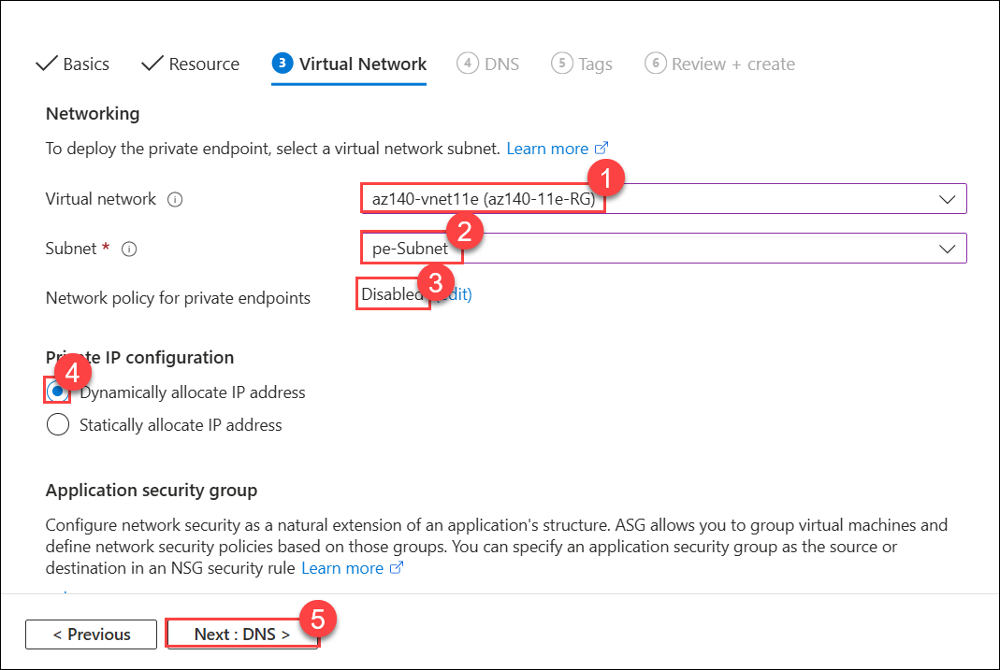

1. On the **DNS** tab of the **Create a private endpoint** page, specify the following settings and select **Next : Tags > (4)**:

    |Setting|Value|
    |---|---|
    |Integrate with private DNS zone|**Yes** (1)|
    |Subscription|Choose the default subscription (2)|
    |Resource group|Choose **az140-11e-RG** (3)|

    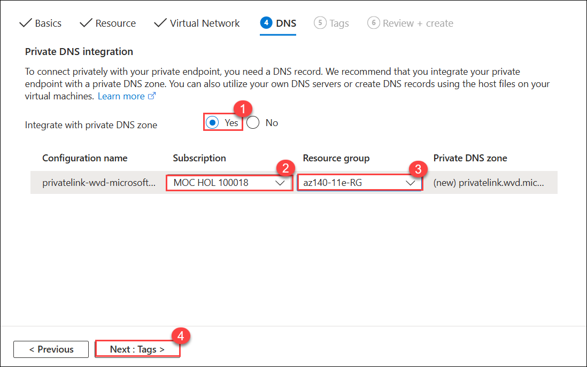

    > **Note**: This step will result in creation of a private DNS zone named **privatelink.wvd.microsoft.com**.

1. On the **Tags** tab of the **Create a private endpoint** page, select **Next : Review + create**.

    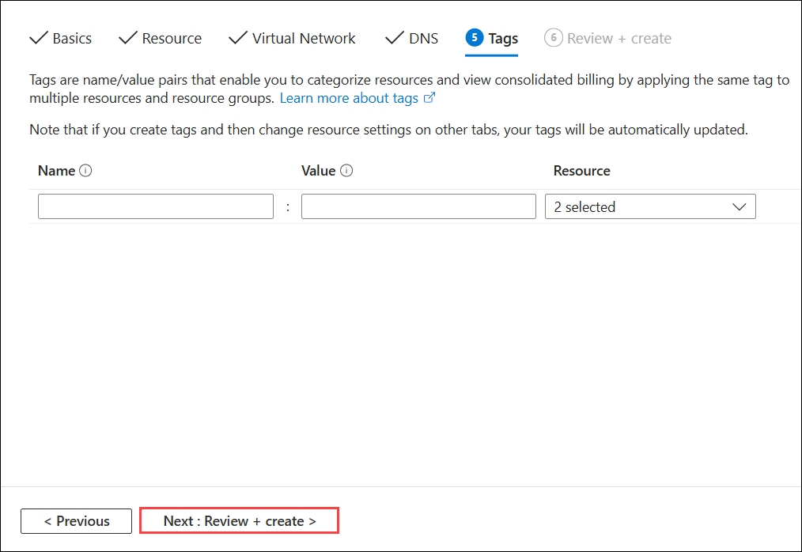

1. On the **Review + create** tab of the **Create a private endpoint** page, select **Create**.

    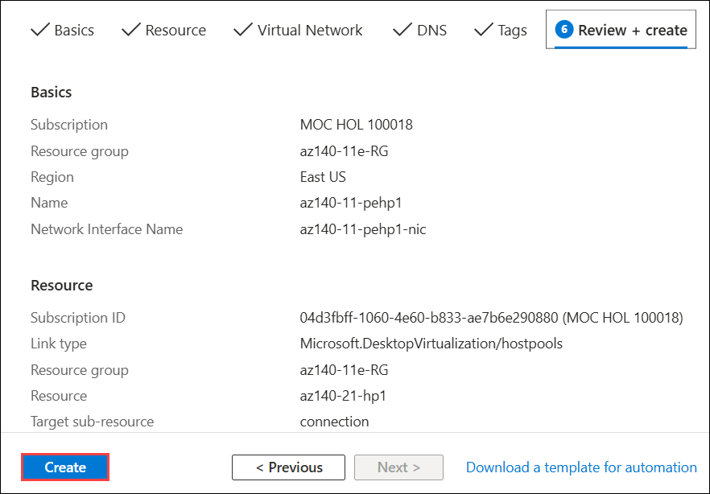

    > **Note**: Wait for the deployment to complete. The deployment might take about 3 minutes.

    > **Note**: You would need to create a private endpoint for the connection sub-resource for each host pool you want to use with Private Link.

### Task 4: Implement a private endpoint for feed download

1. In the Azure portal, search for and select **Azure Virtual Desktop** and, on the **Azure Virtual Desktop** page, select **Workspaces** under **Manage (1)** section.

    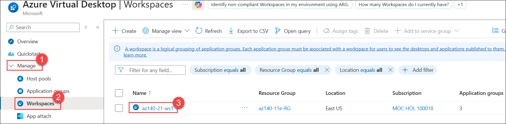

1. On the **Azure Virtual Desktop \| Workspaces (2)** page, select **az140-21-ws1 (3)**.

1. On the **az140-21-ws1** page, in the vertical navigation menu, in the **Settings (1)** section, select **Networking (2)**.

    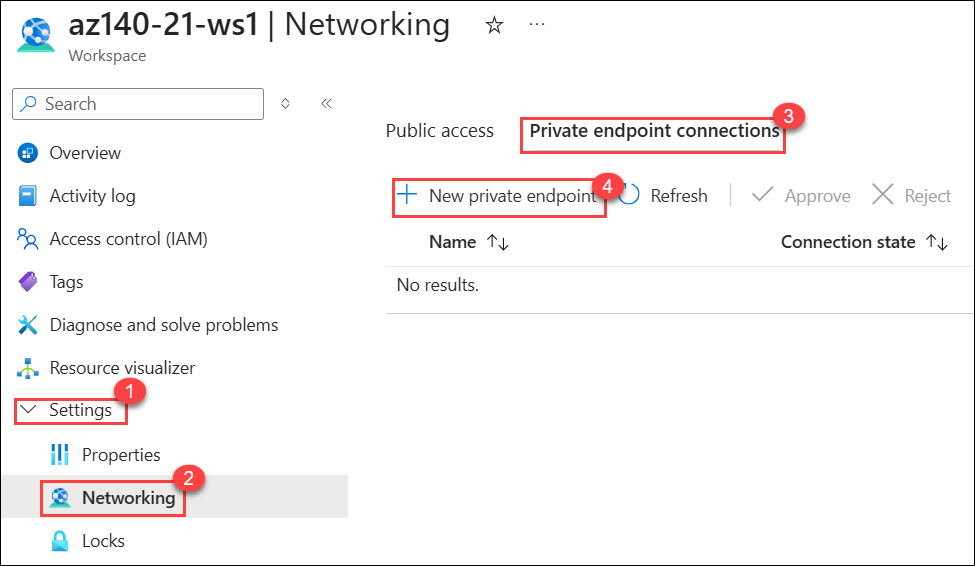

1. On the **az140-21-ws1 \| Networking** page, select the **Private endpoint connections (3)** tab and then, select **+ New private endpoint (4)**.

1. On the **Basics** tab of the **Create a private endpoint** page, specify the following settings and select **Next : Resource > (5)**:

    |Setting|Value|
    |---|---|
    |Subscription|Choose the default subscription|
    |Resource group|Select **az140-11e-RG** (1)|
    |Name|Specify **az140-11-pefeeddwnld** (2)|
    |Network Interface Name|**az140-11-pefeeddwnld-nic** (3)|
    |Region|**<inject key="Region" enableCopy="false" />** (4)|

    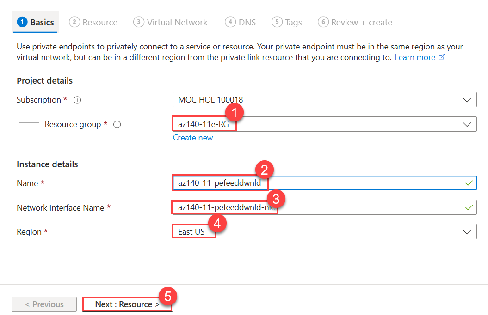

1. On the **Resource** tab of the **Create a private endpoint** page, specify the following settings and select **Next : Virtual network > (2)**:

    |Setting|Value|
    |---|---|
    |Target sub-resource|**feed** (1)|

    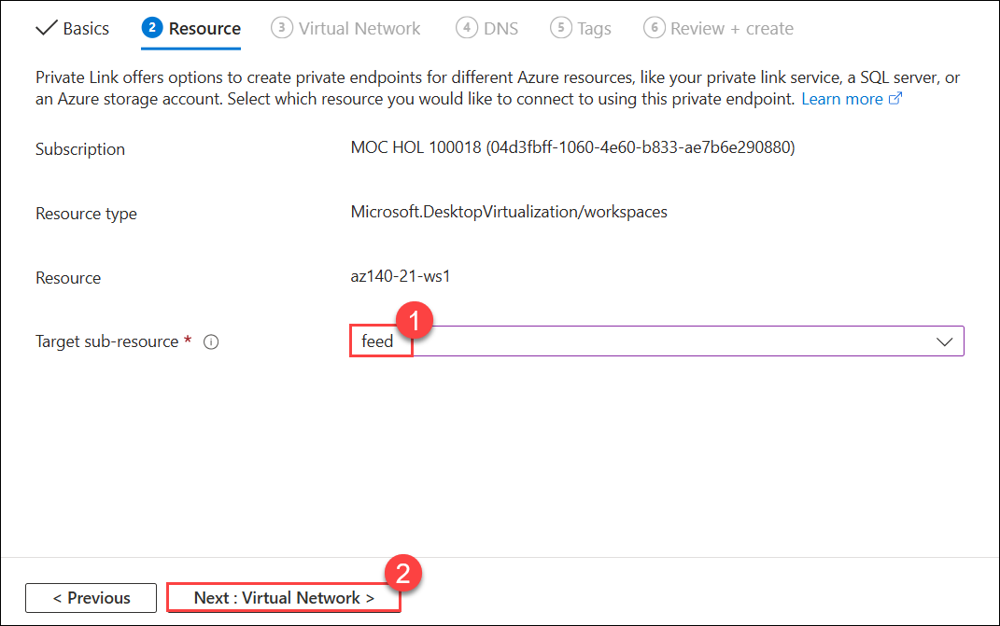

1. On the **Virtual network** tab of the **Create a private endpoint** page, specify the following settings and select **Next : DNS > (5)** (leave other settings with their default values):

    |Setting|Value|
    |---|---|
    |Virtual network|**az140-vnet11e (az140-11e-RG)** (1)|
    |Subnet|**pe-Subnet** (2)|
    |Network policy for private endpoints|**Disabled** (3)|
    |Private IP configuration|**Dynamically allocate IP address** (4)|

    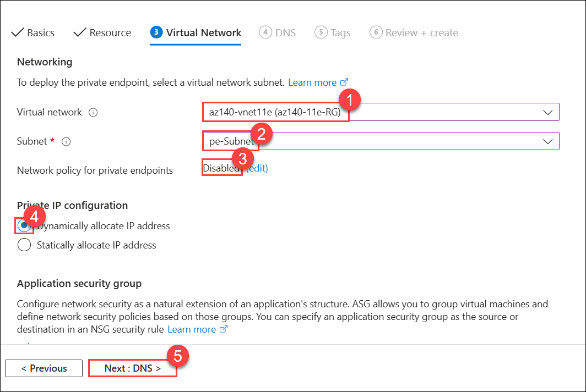

1. On the **DNS** tab of the **Create a private endpoint** page, specify the following settings and select **Next : Tags > (3)**:

    |Setting|Value|
    |---|---|
    |Integrate with private DNS zone|**Yes**|
    |Subscription|Choose the default subscription (1)|
    |Resource group|Select **az140-11e-RG** (2)|

    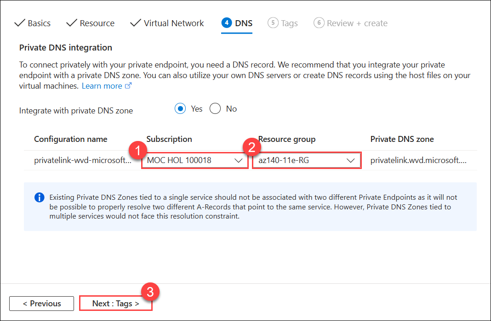

    > **Note**: This step will leverage the private DNS zone named **privatelink.wvd.microsoft.com** you created in the previous task.

1. On the **Tags** tab of the **Create a private endpoint** page, select **Next : Review + create**.

1. On the **Review + create** tab the **Create a private endpoint** page, select **Create**.

    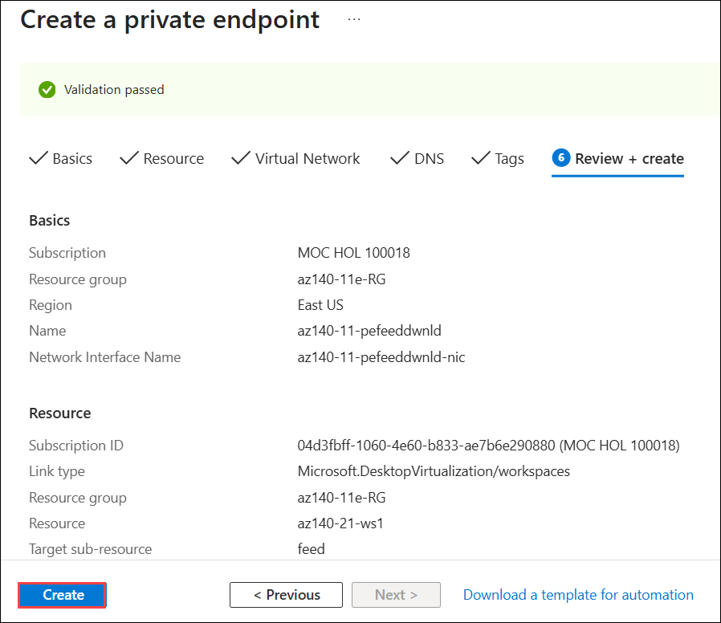

    > **Note**: Do not wait for the deployment to complete but instead proceed to the next task. The deployment might take about 1 minute.

    > **Note**: You would need to a create private endpoint for the feed sub-resource for each workspace you want to use with Private Link.

### Task 5: Implement a private endpoint for initial feed discovery

1. In the Azure portal, search for and select **Azure Virtual Desktop** and, on the **Azure Virtual Desktop** page, select **Workspaces**.

1. On the **Azure Virtual Desktop \| Workspaces** page, select **az140-21-ws1**.

1. On the **az140-21-ws1** page, in the vertical navigation menu, in the **Settings (1)** section, select **Networking (2)**.

    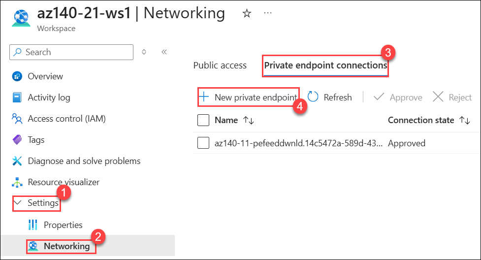

1. On the **az140-21-ws1 \| Networking** page, select the **Private endpoint connections (3)** tab and then, select **+ New private endpoint (4)**.
1. On the **Basics** tab of the **Create a private endpoint** page, specify the following settings and select **Next : Resource > (5)**:

    |Setting|Value|
    |---|---|
    |Subscription|Choose the default subscription|
    |Resource group|Select **az140-11e-RG** (1)|
    |Name|Specify **az140-11-pefeeddisc** (2)|
    |Network Interface Name|**az140-11-pefeeddisc-nic** (3)|
    |Region|**<inject key="Region" enableCopy="false" />** (4)|

    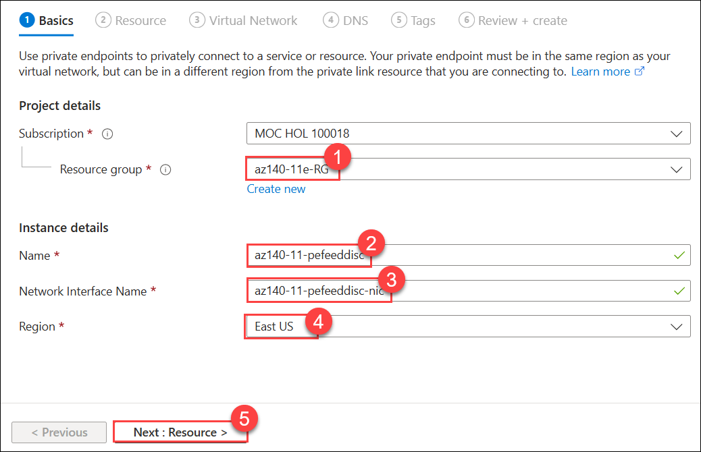

1. On the **Resource** tab of the **Create a private endpoint** page, specify the following settings and select **Next : Virtual network > (2)**:

    |Setting|Value|
    |---|---|
    |Target sub-resource|**global**(1)|

    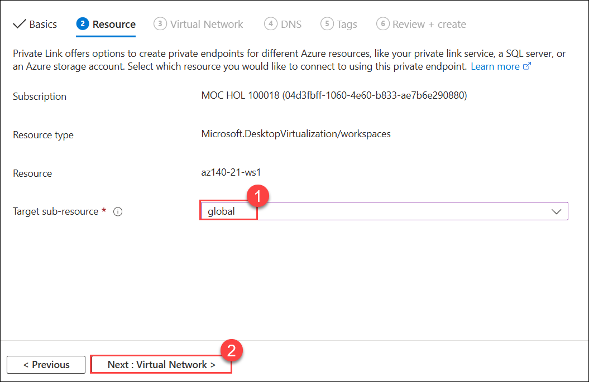

1. On the **Virtual network** tab of the **Create a private endpoint** page, specify the following settings and select **Next : DNS > (5)** (leave other settings with their default values):

    |Setting|Value|
    |---|---|
    |Virtual network|**az140-vnet11e (az140-11e-RG)** (1)|
    |Subnet|**pe-Subnet** (2)|
    |Network policy for private endpoints|**Disabled** (3)|
    |Private IP configuration|**Dynamically allocate IP address** (4)|

    

1. On the **DNS** tab of the **Create a private endpoint** page, specify the following settings and select **Next : Tags >(4)**:

    |Setting|Value|
    |---|---|
    |Integrate with private DNS zone|**Yes** (1)|
    |Subscription|Choose the default subscription (2)|
    |Resource group|**az140-11e-RG** (3)|

    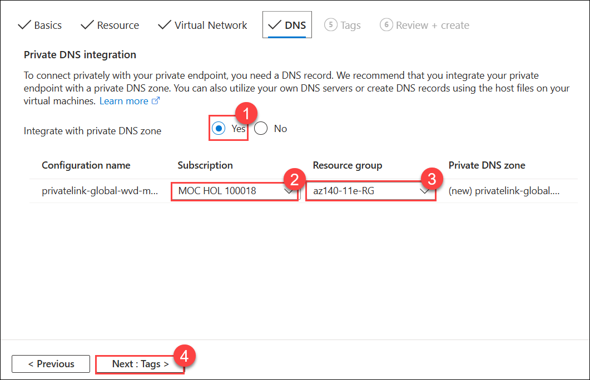

    > **Note**: This step will will result in creation of a private DNS zone named **privatelink-global.wvd.microsoft.com**.

1. On the **Tags** tab of the **Create a private endpoint** page, select **Next : Review + create**.
1. On the **Review + create** tab the **Create a private endpoint** page, select **Create**.

    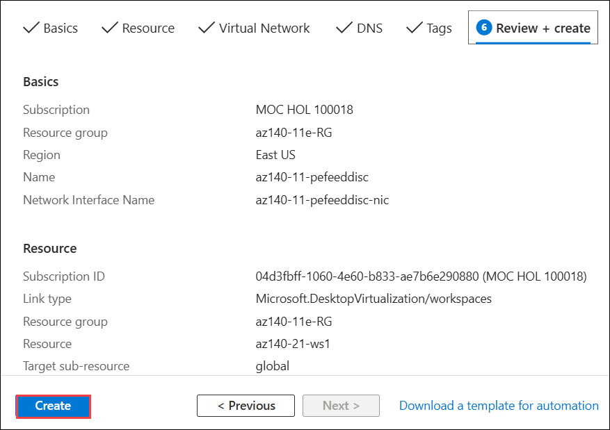

    > **Note**: Do not wait for the deployment to complete but instead proceed to the next task. The deployment might take about 1 minute.

    > **Note**: You would need to a create private endpoint for the global sub-resource for each workspace you want to use with Private Link.

    > **Note**: For the network changes to take effect, you need to restart the session hosts in the target host pool.

1. In the Azure portal, navigate to the **Azure Virtual Desktop** page, in the **Manage** section of the vertical navigation menu, select **Host pools** and, on the **Azure Virtual Desktop \| Host pools** page, select **az140-21-hp1**.

1. On the **az140-21-hp1** page, in the **Manage (1)** section of the vertical navigation menu, select **Session hosts (2)**. 

    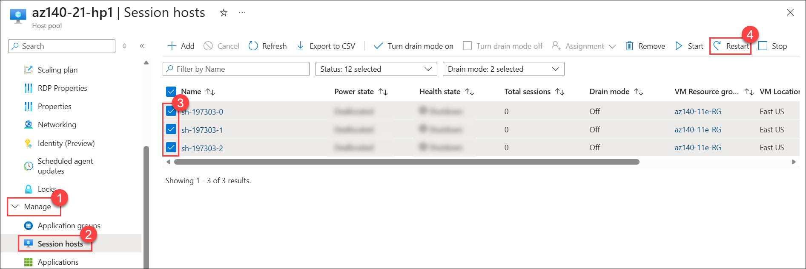

1. In the list of session hosts, ** (3)** to the left of each session host and then select **Restart (4)** in the toolbar.

    > **Note**: Wait until all session hosts are in the **Running** state. 

#### Task 6: Validate the private endpoint functionality

> **Note**: By default, connectivity to Azure Virtual Desktop workspaces and host pools is allowed from public networks. You will start by changing the default settings and enforcing private access.

1. From the lab computer, in the web browser displaying the Azure portal, search for and select **Azure Virtual Desktop** and, on the **Azure Virtual Desktop** page, select **Workspaces**.

    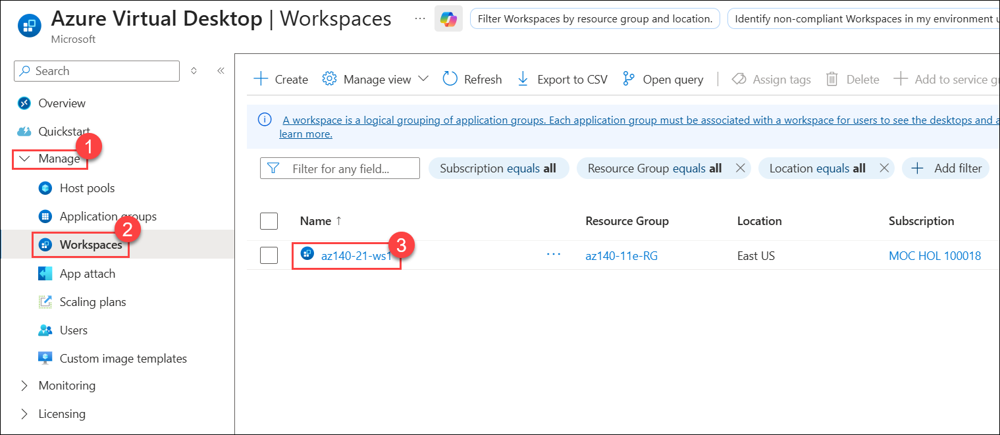

1. On the **Azure Virtual Desktop \| Workspaces (2)** page, select **az140-21-ws1 (3)**.

1. On the **az140-21-ws1** page, in the vertical navigation menu, in the **Settings (1)** section, select **Networking (2)**.

    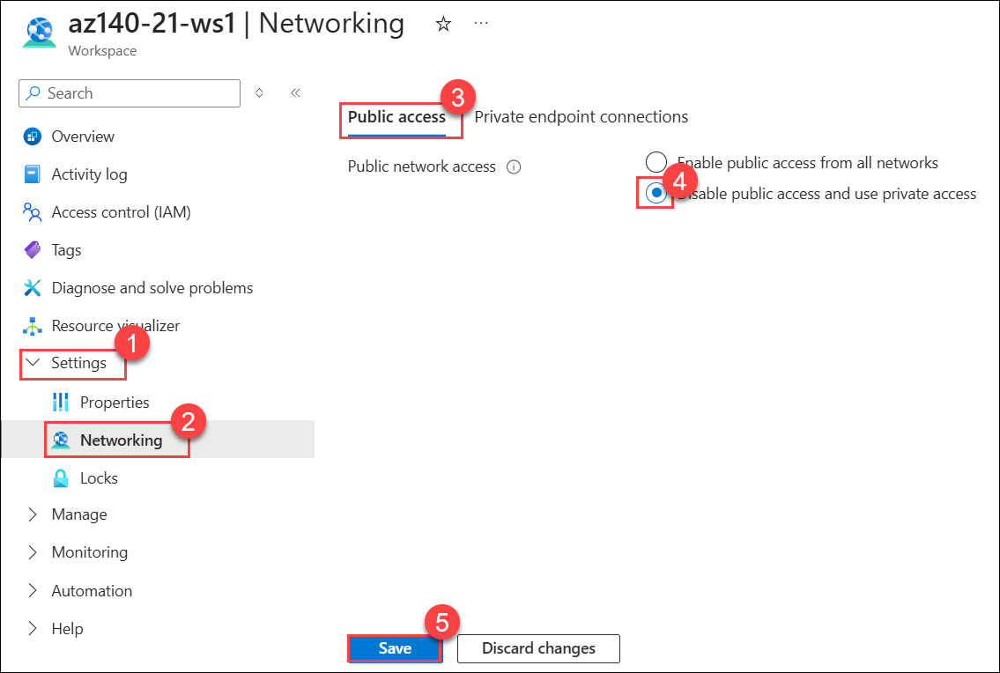

1. On the **az140-21-ws1 \| Networking** page, on the **Public access (3)** tab, select the option **Disable public access and use private access (4)**, and then select **Save (5)**.

1. From the lab computer, in the web browser displaying the Azure portal, search for and select **Azure Virtual Desktop**, on the **Azure Virtual Desktop** page, in the **Manage** section of the vertical navigation menu, select **Host pools** and, on the **Azure Virtual Desktop \| Host pools** page, select **az140-21-hp1**. 

1. On the **az140-21-hp1** page, in the vertical navigation menu, in the **Settings (1)** section, select **Networking (2)**.

    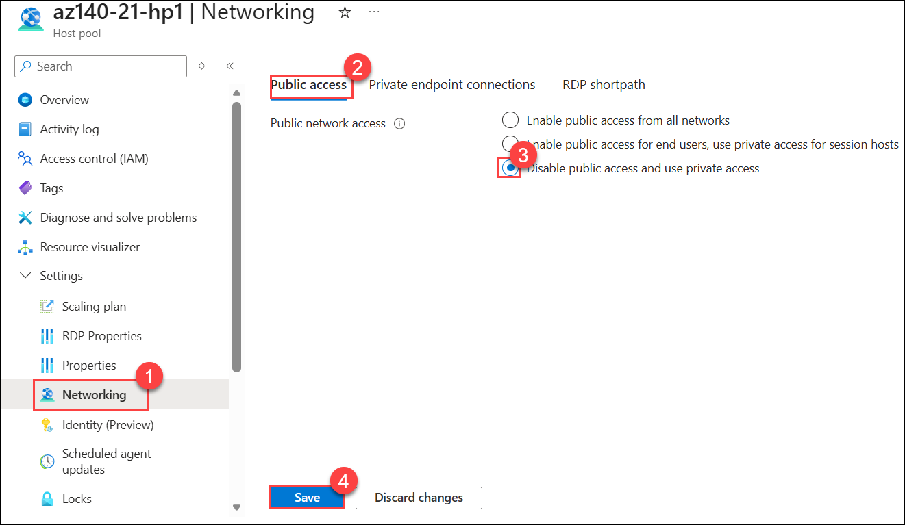

1. On the **az140-21-hp1 \| Networking** page, on the **Public access (3)** tab, select the option **Disable public access and use private access (4)**, and then select **Save (5)**.

    > **Note**: To validate the private endpoint functionality, an RDP client needs to be connected to a network that has private connectivity to the Azure virtual network containing subnet hosting the private endpoints you created earlier in this lab. To simulate this scenario, you will create another subnet in the same virtual network used to create private endpoints and deploy an Azure VM running Windows 11 into that subnet.

1. In the Azure portal, search for and select **Virtual networks** and, on the **Virtual networks** page, select **az140-vnet11e**.
1. On the **az140-vnet11e** page, in the **Settings** section of the vertical navigation menu, select **Subnets**.

1. On the **az140-vnet11e \| Subnets** page, select **+ Subnet**.

1. In the **Add a subnet** pane, specify the following settings and select **Add (4)** (leave other settings with their default values):

    |Setting|Value|
    |---|---|
    |Name|**client-Subnet** (1)|
    |Starting address|**10.20.2.0** (2)|
    |Enable private subnet (no default outbound access)|**Disabled (3)**|

    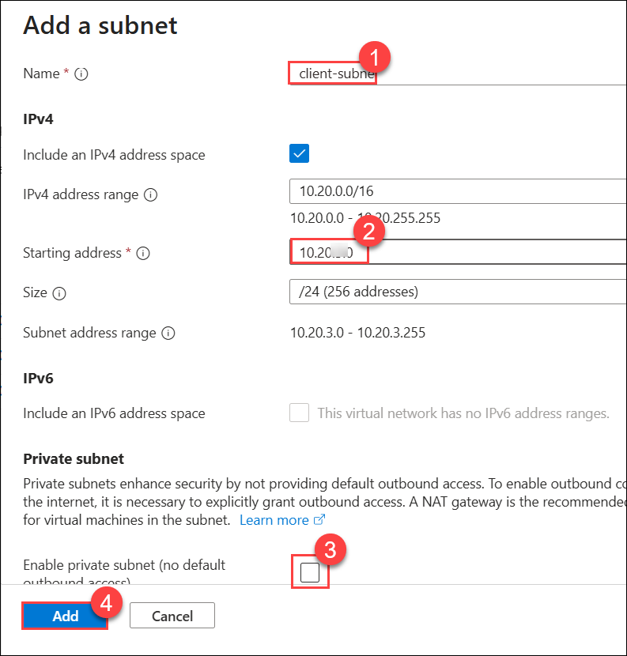

1. In the Azure portal, search for and select **Virtual machines**, on the **Virtual machines** page, select **+ Create (1)** and, in the drop-down list, select **Azure virtual machine (2)**.

    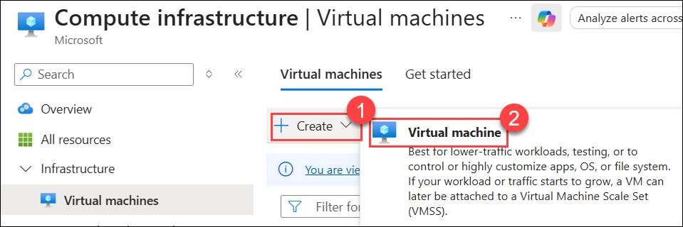

1. On the **Basics** tab of the **Create a virtual machine** page, specify the following settings (leave other settings with their default values) and select **Next : Disks > (15)**:

    |Setting|Value|
    |---|---|
    |Subscription|Choose the default subscription|
    |Resource group|Select **Create new (1)** and specify the resource group name as **az140-111e-RG (2)**|
    |Virtual machine name|Specify **az140-111e-vm0** (3)|
    |Region|**<inject key="Region" enableCopy="false" />** (4)|
    |Availability options|**No infrastructure redundancy required** (5)|
    |Security type|**Standard** (6)|
    |Image|Select **See all images** and select **Windows 11 Pro, version 24H2 - x64 Gen2** (7) from the list|
    |Size|Select **See all sizes (8)** and choose **Standard DC2s_v3** (9)|
    |Username|Student (10)|
    |Password|**Password.1!!** (11)|
    |Confirm Password|**Password.1!!** (12)|
    |Public inbound ports|**None** (13)|
    |Licensing|**Enable** the checkbox (14)|

    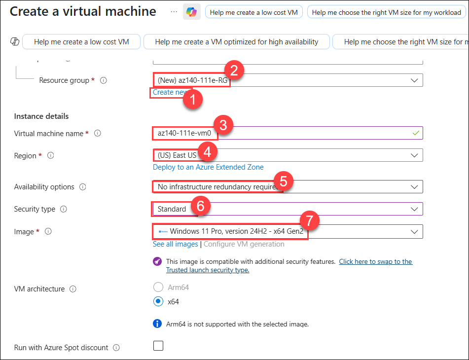    

    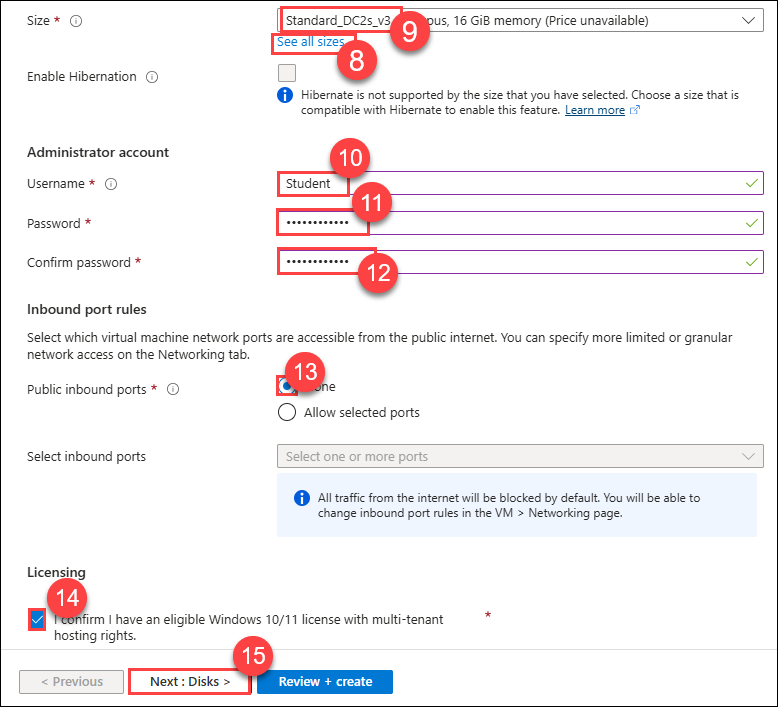    

    > **Note**: The password should be at least 12 characters in length and consist of a combination of lower-case characters, upper-case characters, digits, and special characters. For details, refer to the information about [the password requirements when creating an Azure VM](https://learn.microsoft.com/en-us/azure/virtual-machines/windows/faq#what-are-the-password-requirements-when-creating-a-vm-).

1. On the **Disks** tab of the **Create a virtual machine** page, set the **OS disk type** to **Standard HDD (locally-redundant storage) (1)** and select **Next : Networking > (2)**.

    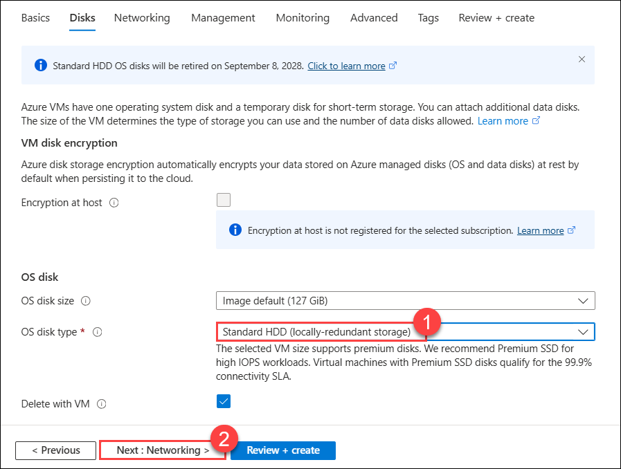  

1. On the **Networking** tab of the **Create a virtual machine** page, specify the following settings (leave other settings with their default values):

    |Setting|Value|
    |---|---|
    |Virtual network|**az140-vnet11e**|
    |Subnet|**client-Subnet**|
    |Public IP|**(new) az140-111e-vm0-ip**|
    |NIC network security group|**Advanced**|

1. On the **Networking** tab of the **Create a virtual machine** page, next to the **Configure network security group** drop-down list, select **Create new**.
1. On the **Create network security group** page, delete the pre-created inbound rule **1000: default-allow-rdp** and then select **+ Add an inbound rule**.
1. In the **Add inbound security rule** pane, in the **Source** drop-down list, select **My IP address** to identify the public IP address representing your connection to the internet.
1. In the **Add inbound security rule** pane, specify the following settings (leave other settings with their default values), and then select **Add**:

    |Setting|Value|
    |---|---|
    |Source|**My IP Address**|
    |Source IP addresses/CIDR ranges|Leave unchanged (this should still contain your public IP address)|
    |Source port ranges|*|
    |Destination|**Any**|
    |Service|**RDP**|
    |Action|**Allow**|
    |Priority|**300**|
    |Name|**AllowCidrBlockRDPInbound**|

1. Back on the **Create network security group** page, select **OK**.

1. Back on the **Networking** tab of the **Create a virtual machine** page, select **Next : Management >**:

1. On the **Management** tab of the **Create a virtual machine** page, specify the following settings (leave other settings with their default values), and then select **Next : Monitoring >(2)**:

    |Setting|Value|
    |---|---|
    |Patch orchestration options|**Manual updates (1)**|

    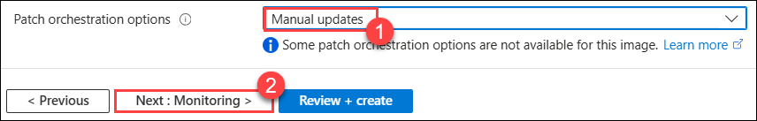    

1. On the **Monitoring** tab of the **Create a virtual machine** page, specify the following settings (leave other settings with their default values), and then select **Review + create (2)**:

    |Setting|Value|
    |---|---|
    |Boot diagnostics|**Disable** (1)|

    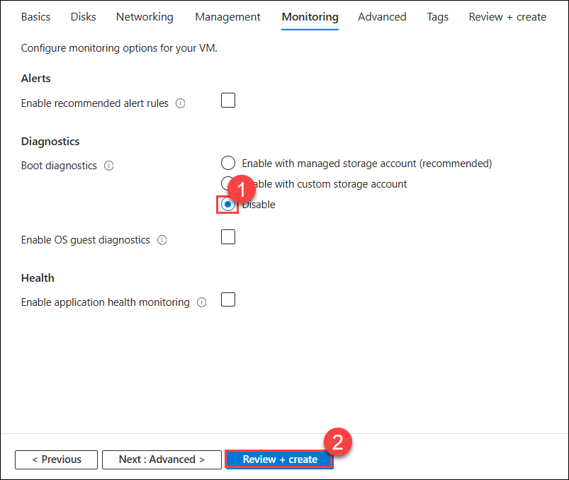 

1. On the **Review + create** tab of the **Create a virtual machine** page, select **Create**.

    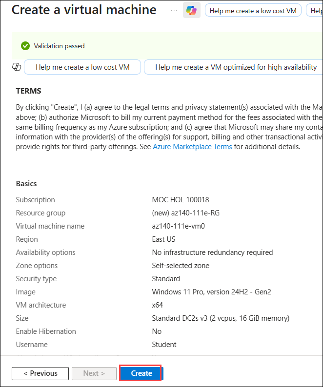 

    > **Note**: Wait for the deployment to complete. The deployment might take about 5 minutes.

1. In the Azure portal, search for and select **Virtual machines**, on the **Virtual machines** page, select **az140-111e-vm0**.

1. On the **az140-111e-vm0** page, select **Connect** and, in the drop-down menu, select **Connect**.

    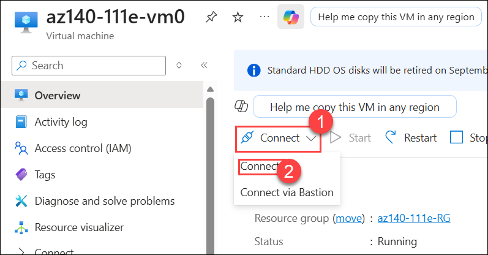 

1. On the **az140-111e-vm0 \| Connect** page, in the **Most common** section, select **Download RDP file (1)**.

    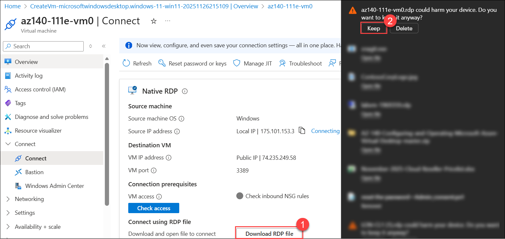 

1. In the **Download** pop-up window, select **Keep (2)** and then select **Open file**.

1. When prompted, select **Connect** and then, in the **Windows Security** dialog box, enter the user name and password you specified when deploying the Azure VM.

1. When prompted for confirmation, select **Connect** again.

1. Within the Remote Desktop session to **az140-111e-vm0**, choose and accept your preferred privacy settings.

1. Within the Remote Desktop session to **az140-111e-vm0**, start Microsoft Edge, navigate to the [Connect to Azure Virtual Desktop with the Remote Desktop client for Windows](https://learn.microsoft.com/en-us/azure/virtual-desktop/users/connect-windows) page, scroll down to the section **Download and install the Remote Desktop client (MSI)**, and select the [Windows 64-bit](https://go.microsoft.com/fwlink/?linkid=2139369) link. 

1. Open File Explorer, navigate to the **Downloads** folder, and launch the installation of the newly downloaded MSI file. 

1. When prompted, accept the terms of the licensing agreement and choose the option to **Install for all users of this machine**. If prompted, accept the User Account Control prompt to proceed with the installation. 

1. Once the installation completes, ensure that the **Launch Remote Desktop when setup exits** checkbox is selected and select **Finish** to start the Microsoft Remote Desktop client.

1. Within the Remote Desktop session to **az140-111e-vm0**, in the **Remote Desktop** client window, select **Subscribe** and, when prompted, sign in with the credentials of the `User2` Entra ID user account which you can locate on the **Resources** tab in the right pane of the lab interface window.

   > **Note**: Select the user account which is the member of the Entra group with the **AVD-RemoteApp** prefix.

1. Ensure that the **Remote Desktop** page displays four icons, including Command Prompt, Microsoft Word, Microsoft Excel, Microsoft PowerPoint. 
1. Double-click the Command Prompt icon. 
1. When prompted to sign in, in the **Windows Security** dialog box, enter the password of the same Microsoft Entra user account you used to connect to the target Azure Virtual Desktop environment.
1. Verify that a **Command Prompt** window appears shortly afterwards. 
1. At the Command Prompt, type **logoff** and press the **Enter** key to log off from the current Remote App session.

   > **Note**: Optionally, you might consider attempting to subscribe to the feed and connect to The Azure Virtual Desktop workspace from the lab computer to validate that this connection will fail. 

#### Task 7: Allow public network access to a host pool and workspace

1. From the lab computer, in the web browser displaying the Azure portal, search for and select **Azure Virtual Desktop** and, on the **Azure Virtual Desktop** page, select **Workspaces**.

1. On the **Azure Virtual Desktop \| Workspaces** page, select **az140-21-ws1**.

1. On the **az140-21-ws1** page, in the vertical navigation menu, in the **Settings** section, select **Networking**.

1. On the **az140-21-ws1 \| Networking** page, on the **Public access** tab, select the option **Enable public access from all networks**, and then select **Save**.

1. From the lab computer, in the web browser displaying the Azure portal, search for and select **Azure Virtual Desktop**, on the **Azure Virtual Desktop** page, in the **Manage** section of the vertical navigation menu, select **Host pools** and, on the **Azure Virtual Desktop \| Host pools** page, select **az140-21-hp1**. 

1. On the **az140-21-hp1** page, in the vertical navigation menu, in the **Settings** section, select **Networking**.

1. On the **az140-21-hp1 \| Networking** page, on the **Public access** tab, select the option **Enable public access from all networks**, and then select **Save**.

### Summary

**You have successfully completed the lab. Click on Next >>**

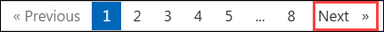