# Lab 07- Create custom session host images by using image templates

## Estimated Duration: 105 Minutes

## Overview

In this lab, you’ll build custom Azure Virtual Desktop session host images using Azure Image Builder and Azure Compute Gallery. You’ll create a managed identity, assign custom RBAC permissions, define an image template, and run an automated build to generate a reusable image version. Finally, you’ll validate the process by deploying session hosts from your newly created custom image

## Lab Objectives
  
In this lab, you will complete the following tasks:

- **Task 1:** Register required resource providers

- **Task 2:** Create a user-assigned managed identity

- **Task 3:** Create a custom Azure role-based access control (RBAC) role

- **Task 4:** Set permissions on the host image provisioning-related resources

- **Task 5:** Create an Azure Compute Gallery instance and an image definition

- **Task 6:** Create a custom image template

- **Task 7:** Build a custom image

- **Task 8:** Deploy session hosts by using a custom image

### Task 1: Register required resource providers

In this task, you register all required Azure resource providers to enable image creation and customization features for Azure Virtual Desktop.

1. In the Azure portal, start a PowerShell session in the Azure Cloud Shell.

1. In the PowerShell session in the Azure Cloud Shell pane, run the following command to register the **Microsoft.DesktopVirtualization** resource provider:

    ```powershell
    Register-AzResourceProvider -ProviderNamespace Microsoft.DesktopVirtualization
    Register-AzResourceProvider -ProviderNamespace Microsoft.VirtualMachineImages
    Register-AzResourceProvider -ProviderNamespace Microsoft.Storage
    Register-AzResourceProvider -ProviderNamespace Microsoft.Compute
    Register-AzResourceProvider -ProviderNamespace Microsoft.Network
    Register-AzResourceProvider -ProviderNamespace Microsoft.KeyVault
    Register-AzResourceProvider -ProviderNamespace Microsoft.ContainerInstance
    ```

    > **Note:** Do not wait for the registration to complete. This might take about 5 minutes.

1. Close the Azure Cloud Shell pane.

### Task 2: Create a user-assigned managed identity

In this task, you create a user-assigned managed identity that will be used to authenticate and run the image build process securely.

1. In the Azure portal, search for **Managed Identities (1)** and select **Managed Identities** from result.

    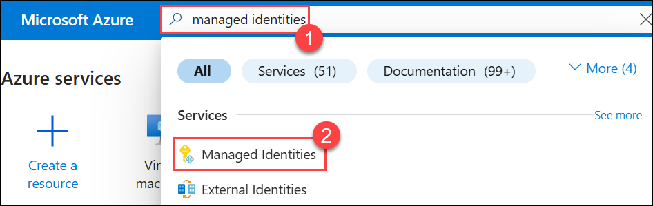

1. On the **Managed Identities** page, select **+ Create**.

    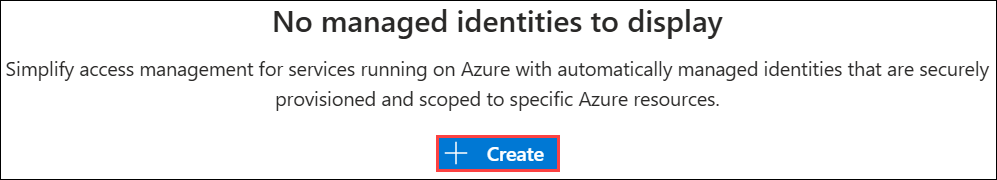

1. On the **Basics** tab of the **Create User Assigned Managed Identity** page, specify the following settings and then select **Review + create (5)**:

    |Setting|Value|
    |---|---|
    |Subscription|Choose the default subscription|
    |Resource group|Select **Create new (1)** and specify the resource group name as **az140-15a-RG****(2)**|
    |Region|**<inject key="Region" enableCopy="false" /> (3)**|
    |Name|**az140**-<inject key="DeploymentID" enableCopy="false"/>-**uami (4)**|

    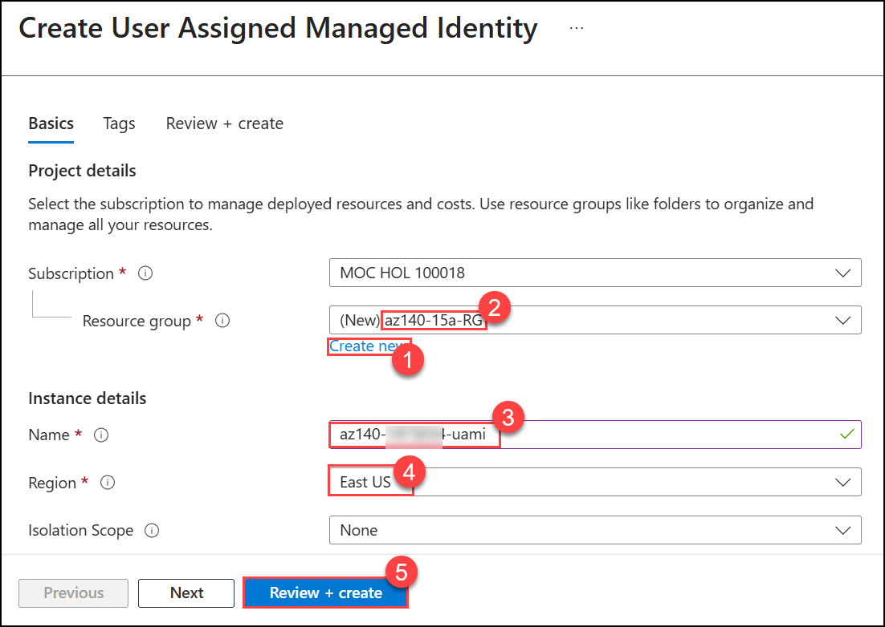

1. On the **Review + create** tab, select **Create**.

    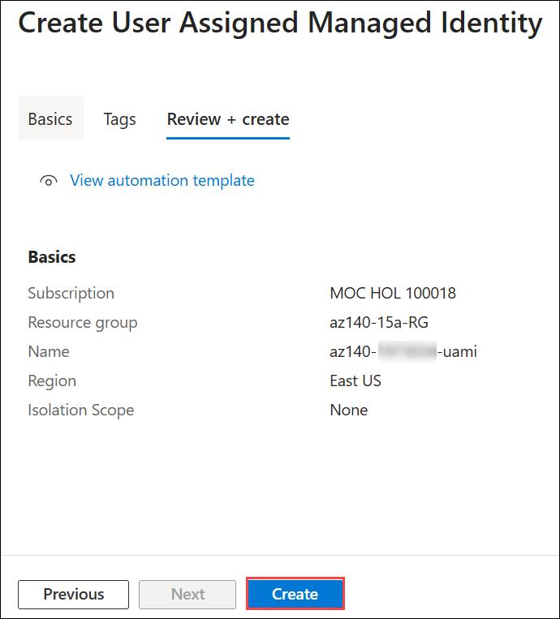

    >**Note:** Do not wait for the provisioning of the user assigned managed identity to complete. This should take just a few seconds.

> **Congratulations** on completing the task! Now, it's time to validate it. Here are the steps:
>
> - Hit the Validate button for the corresponding task. If you receive a success message, you can proceed to the next task.
> - If not, carefully read the error message and retry the step, following the instructions in the lab guide.
> - If you need any assistance, please contact us at cloudlabs-support@spektrasystems.com. We are available 24/7 to help.
<validation step="88e18ef4-a866-4dcb-8199-ef44fc278aa7" />

### Task 3: Create a custom Azure role-based access control (RBAC) role

In this task, you create a custom RBAC role that grants the exact permissions needed for building and managing custom Azure Virtual Desktop images.

>**Note:** The custom Azure role-based access control (RBAC) role will be used to assign appropriate permissions to the user-assigned managed identity created in the previous task.

1. In the Azure portal, start a PowerShell session in the Azure Cloud Shell.

1. In the PowerShell session in the Azure Cloud Shell pane, run the following command to identify the value of the **Id** property of the Azure subscription used for this lab and store it in the **$subscriptionId** variable:

    ```powershell
    $subscriptionId = (Get-AzSubscription).Id
    ```

1. Run the following command to create the role definition of the new custom role including its assignable scope value and store it in the **$jsonContent** variable.

    ```powershell
    $jsonContent = @"
    {
      "Name": "Desktop Virtualization Image Creator<inject key="DeploymentID" enableCopy="false"/>",
      "IsCustom": true,
      "Description": "Create custom image templates for Azure Virtual Desktop images.",
      "Actions": [
        "Microsoft.Compute/galleries/read",
        "Microsoft.Compute/galleries/images/read",
        "Microsoft.Compute/galleries/images/versions/read",
        "Microsoft.Compute/galleries/images/versions/write",
        "Microsoft.Compute/images/write",
        "Microsoft.Compute/images/read",
        "Microsoft.Compute/images/delete"
      ],
      "NotActions": [],
      "DataActions": [],
      "NotDataActions": [],
      "AssignableScopes": [
        "/subscriptions/$subscriptionId",
        "/subscriptions/$subscriptionId/resourceGroups/az140-15b-RG"
      ]
    }
    "@
    ```

1. Run the following command to store the content of the **$jsonContent** variable in a file named **CustomRole.json**:

    ```powershell
    $jsonContent | Out-File -FilePath 'CustomRole.json'
    ```

1. Run the following command to create the custom role:

    ```powershell
    New-AzRoleDefinition -InputFile ./CustomRole.json
    ```

1. Close the Azure Cloud Shell pane.

> **Congratulations** on completing the task! Now, it's time to validate it. Here are the steps:
>
> - Hit the Validate button for the corresponding task. If you receive a success message, you can proceed to the next task.
> - If not, carefully read the error message and retry the step, following the instructions in the lab guide.
> - If you need any assistance, please contact us at cloudlabs-support@spektrasystems.com. We are available 24/7 to help.
<validation step="3361e37e-14e1-4dc4-a028-19d37fd5efa1" />

### Task 4: Set permissions on the host image provisioning-related resources

In this task, you assign the custom RBAC role to the managed identity so it has the necessary permissions to build and manage session host images.

1. In the Azure portal, search for **Resource groups (1)** and select **Resource groups (2)** and, on the **Resource groups** page, select **+ Create**.

    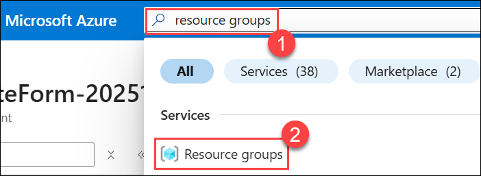

1. On the **Basics** tab of the **Create a resource group** page, specify the following settings and then select **Review + create (2)**:

    |Setting|Value|
    |---|---|
    |Subscription|Choose the default subscription|
    |Resource group|The name of a new resource group **az140-15b-RG (1)**|
    |Region|**<inject key="Region" enableCopy="false" />**|

    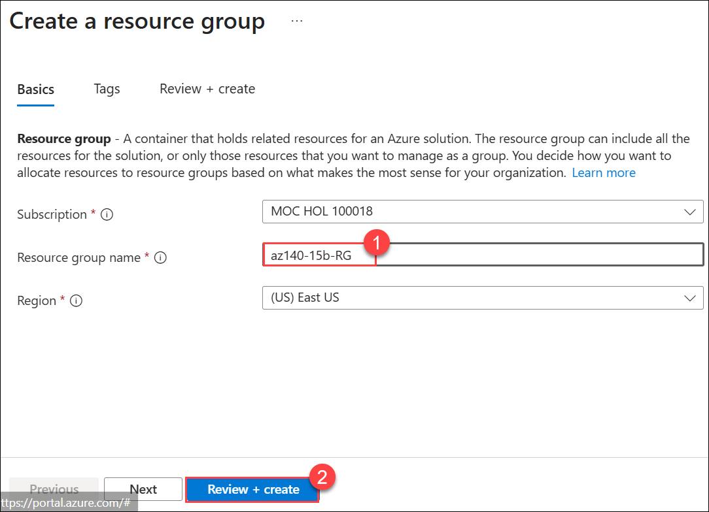

1. On the **Review + create** tab, select **Create**.

1. Refresh the **Resource groups** page and, in the list of resource groups, select **az140-15b-RG**.

1. On the **az140-15b-RG** page, in the vertical navigation menu, select **Access control (IAM) (1)**.

1. On the **az140-15b-RG\|Access control (IAM)** page, select **+ Add (2)** and, in the drop-down menu, select **Add role assignment (3)**.

    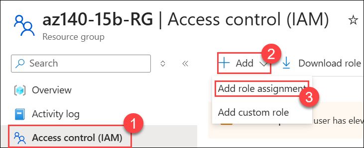

1. On the **Role** tab of the **Add role assignment** page, ensure that the **Job function roles** tab is selected, in the search textbox, Specify **Desktop Virtualization Image Creator <inject key="DeploymentID" enableCopy="false"/> (1)** , in the list of results, select **Desktop Virtualization Image Creator<inject key="DeploymentID" enableCopy="false"/> (2)**, and then select **Next (3)**.

    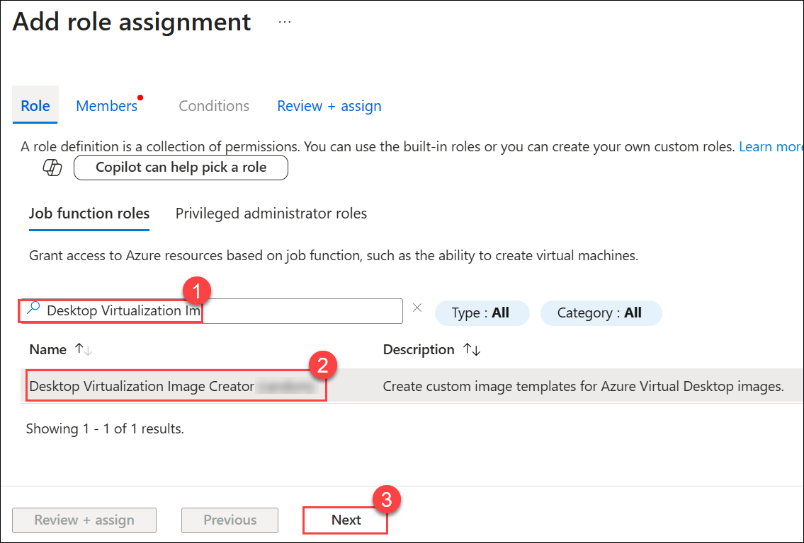

1. On the **Members** tab of the **Add role assignment** page, select the **Managed identity (1)** option, click **+ Select members (2)**, in the **Select managed identities** pane, in the **Managed identity** drop-down list, select **User-assigned managed identity**, in the list of user-assigned managed identities, select **az140-<inject key="DeploymentID" enableCopy="false"/>-uami (3)**  and then click **Select (5)**.

    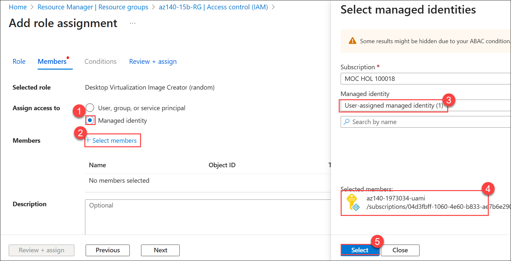

1. Back on the **Members** tab of the **Add role assignment** page, select **Review + assign**.

    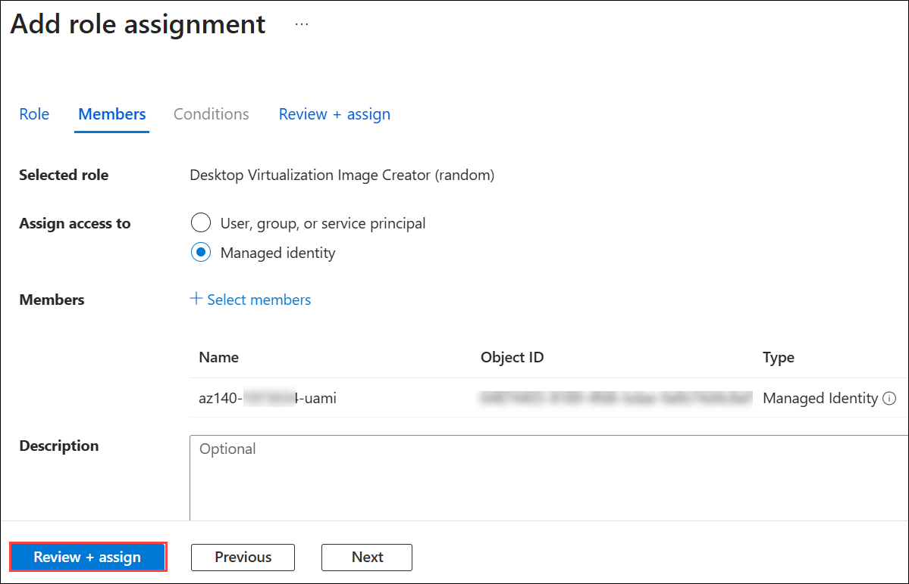

1. On the **Review + assign** tab, select **Review + assign**. 

    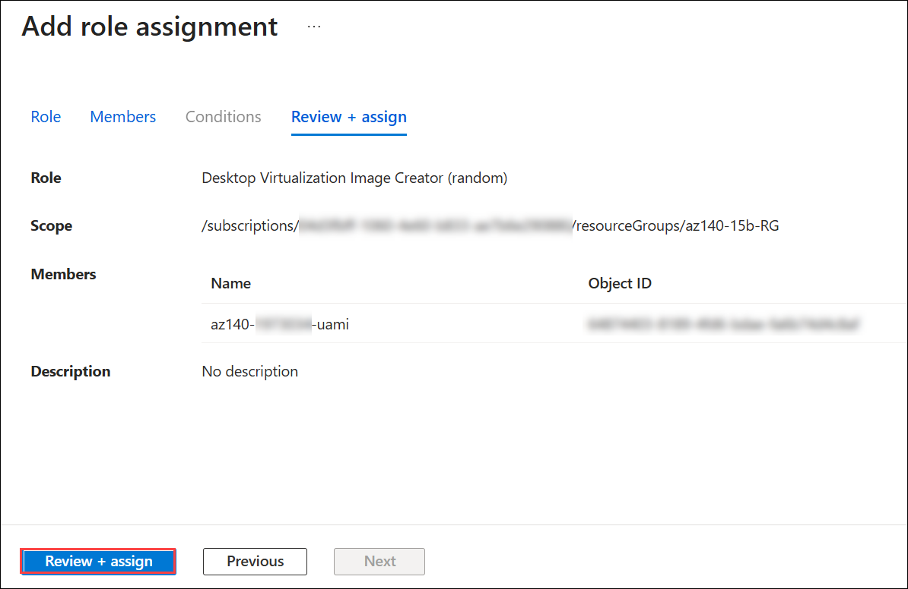

### Task 5: Create an Azure Compute Gallery instance and an image definition

In this task, you set up an Azure Compute Gallery and create an image definition to store and version your custom AVD images.

1. In the Azure portal, search for **compute gallery (1)** and select **Azure compute galleries (2)** and, on the **Azure compute galleries** page, select **+ Create**.

    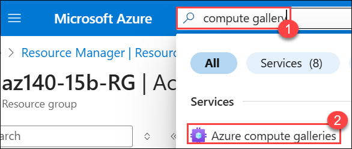

    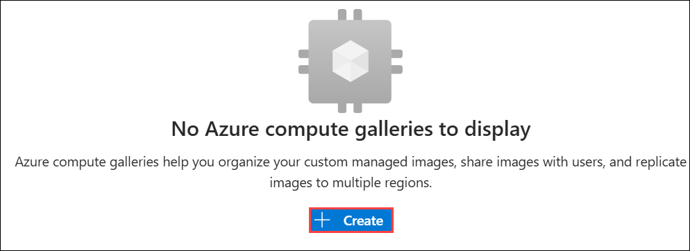

1. On the **Basics** tab of the **Create Azure compute gallery** page, specify the following settings and then select **Next : Sharing method (3)**:

    |Setting|Value|
    |---|---|
    |Subscription|Choose the default subscription|
    |Resource group|Select **az140-15b-RG (1)** from the drop-down|
    |Name|Specify **az14015computegallery (2)**|
    |Region|**<inject key="Region" enableCopy="false" />**|

    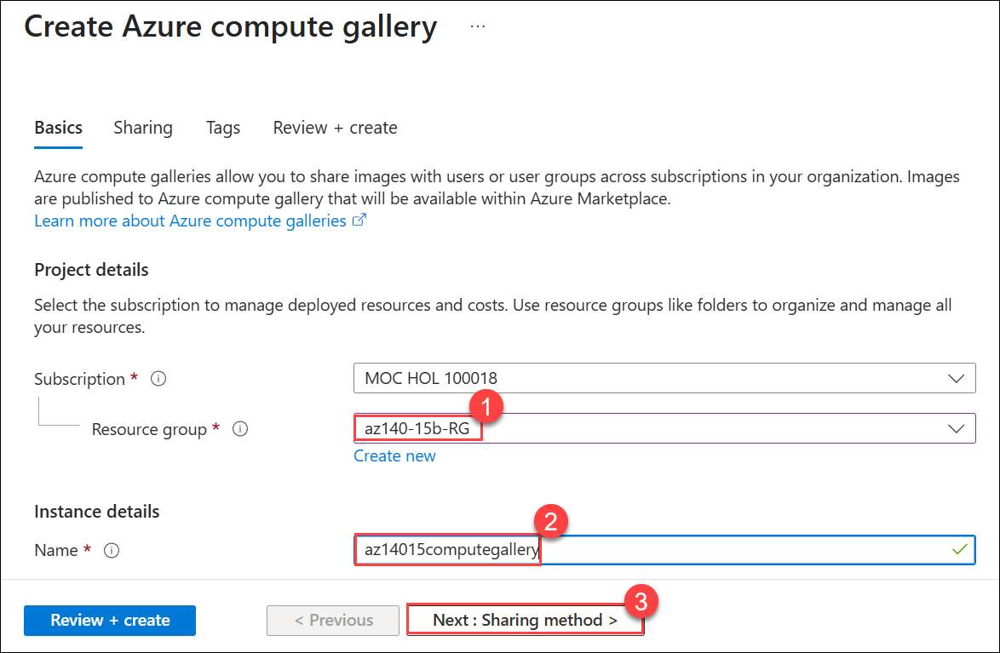

1. On the **Sharing** tab of the **Create Azure compute gallery** page, leave the default option **Role based access control (RBAC) (1)** selected and then select **Review + create (2)**.

    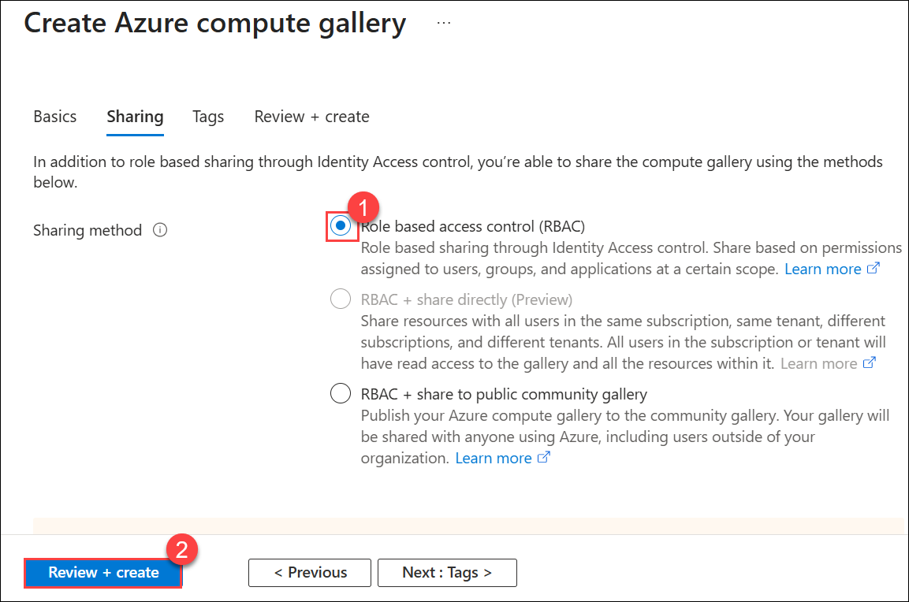

1. On the **Review + create** tab, select **Create**.

    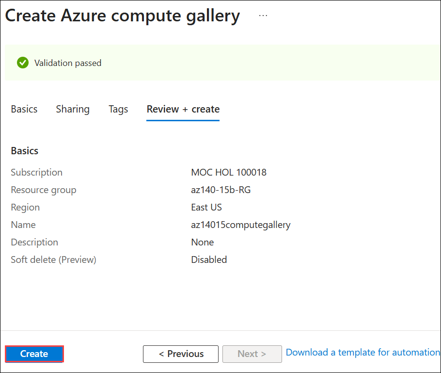

    >**Note:** Wait for the provisioning process to complete. This should take less than 1 minute.

1. In the Azure portal, search for and select **Azure compute galleries** and, on the **Azure compute galleries** page, select **az14015computegallery**. 

1. On the **az14015computegallery** page, select **+ Add (1)** and, in the drop-down menu, select **+ VM image definition (2)**. 

    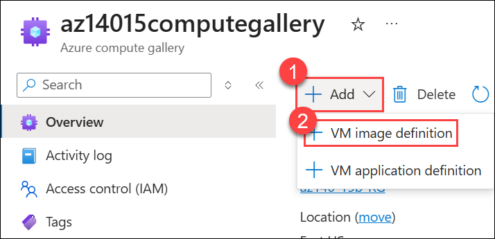

1. On the **Basics** tab of the **Create VM image definition** page, specify the following settings (leave other settings with their default values) and then select **Next : Version (8)**:

    |Setting|Value|
    |---|---|
    |Region|**<inject key="Region" enableCopy="false" />**|
    |VM image definition name|Specify **az14015imagedefinition (1)**|
    |OS type|**Windows (2)**|
    |Security type|**Trusted launch supported (3)**|
    |OS state|**Generalized (4)**|
    |Publisher|Specify **MicrosoftWindowsDesktop (5)**|
    |Offer|Specify **Windows-11 (6)**|
    |SKU|Specify **win11-23h2-avd-m365 (7)**|

    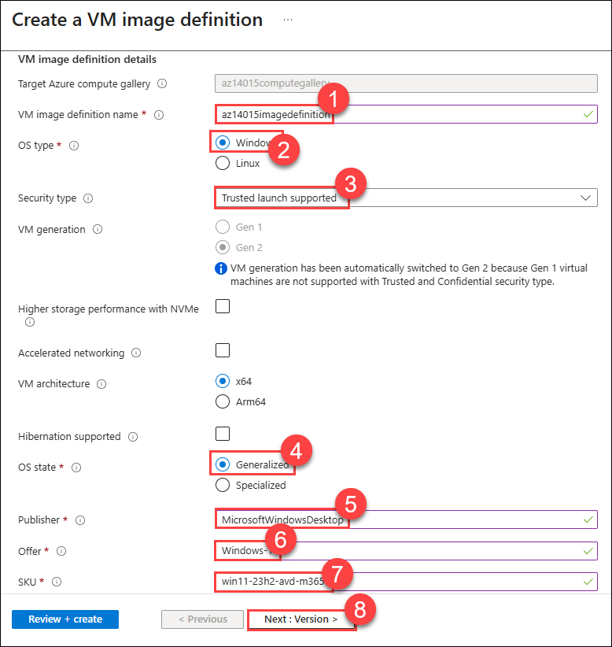

    > **Note:** VM generation is automatically set to Gen2, because Gen 1 virtual machines are not supported with Trusted and Confidential security type.

1. On the **Version** tab of the **Create VM image definition** page, leave the settings unchanged and select **Next : Publishing options**.

    > **Note:** You should not create the VM image version at this stage. This will be done by Azure Virtual Desktop.

1. On the **Publishing options** tab of the **Create VM image definition** page, leave the settings unchanged and select **Review + create**.

1. On the **Review + create** tab the **Create VM image definition** page, select **Create**.

    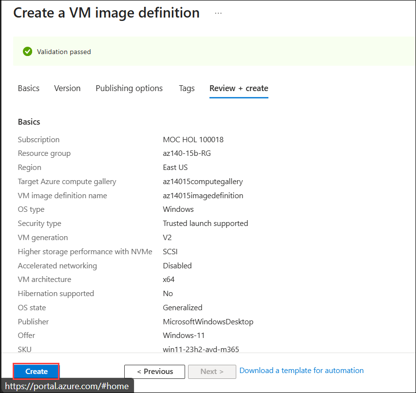

    > **Note:** Wait for the provisioning process to complete. This typically takes less than 1 minute.

> **Congratulations** on completing the task! Now, it's time to validate it. Here are the steps:
>
> - Hit the Validate button for the corresponding task. If you receive a success message, you can proceed to the next task.
> - If not, carefully read the error message and retry the step, following the instructions in the lab guide.
> - If you need any assistance, please contact us at cloudlabs-support@spektrasystems.com. We are available 24/7 to help.
<validation step="e7c1bc50-bd52-435b-9d8d-aa90d86159c4" />

### Task 6: Create a custom image template

In this task, you create a custom image template that defines the source image, configuration scripts, build settings, and distribution targets for your AVD custom image.

1. In the Azure portal, search for and select **Azure Virtual Desktop**, on the **Azure Virtual Desktop** page, in the **Manage** section of the vertical navigation menu, select **Custom image templates (1)** and, on the **Azure Virtual Desktop \| Custom image templates** page, select **+ Add custom image template (2)**. 

    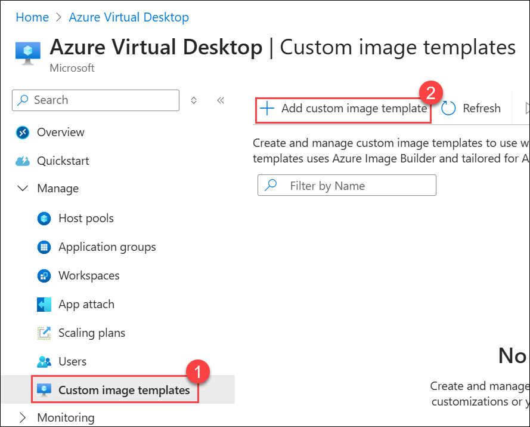

1. On the **Basics** tab of the **Create custom image template** page, specify the following settings and select **Next (6)**:

    |Setting|Value|
    |---|---|
    |Template name|Specify **az140-15b-imagetemplate (1)**|
    |Import from existing template|**No (2)**|
    |Subscription|Choose the default subscription|
    |Resource group|Select **az140-15b-RG (2)**|
    |Location|**<inject key="Region" enableCopy="false" /> (3)**|
    |Managed identity|**az140-<inject key="DeploymentID" enableCopy="false"/>-**uami (4)**|

    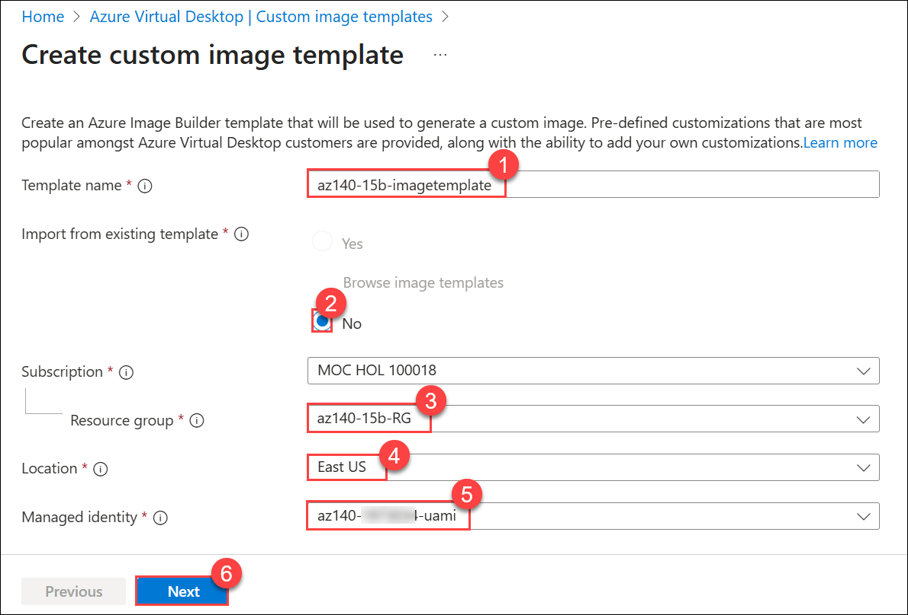    

1. On the **Source image** tab of the **Create custom image template** page, specify the following settings and select **Next (3)**:

    |Setting|Value|
    |---|---|
    |Source type|**Platform image (marketplace) (1)**|
    |Select image|**Windows 11 Specifyprise multi-session, Version 23H2 + Microsoft 365 Apps (2)**|

    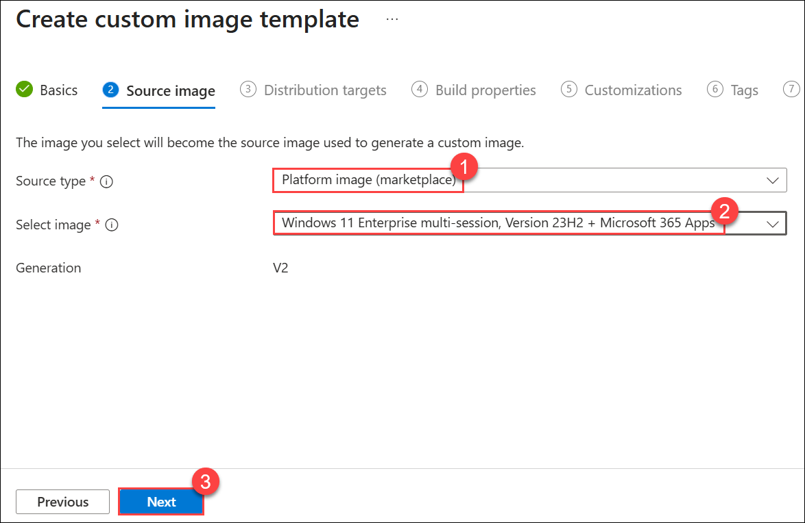  

1. On the **Distribution targets** tab of the **Create custom image template** page, specify the following settings (leave other settings with their default values) and select **Next**:

    |Setting|Value|
    |---|---|
    |Azure Compute Gallery|enabled **(1)**|
    |Gallery name|**az14015computegallery (2)**|
    |Gallery image definition|**az14015imagedefinition (3)**|
    |Gallery image version|Specify **1.0.0 (4)**|
    |Run output name|Specify **az140-15-image-1.0.0 (5)**|
    |Replication regions|**<inject key="Region" enableCopy="false" /> (6)**|
    |Exclude from latest|**No (7)**|
    |Storage account type|**Standard_LRS (8)**|

    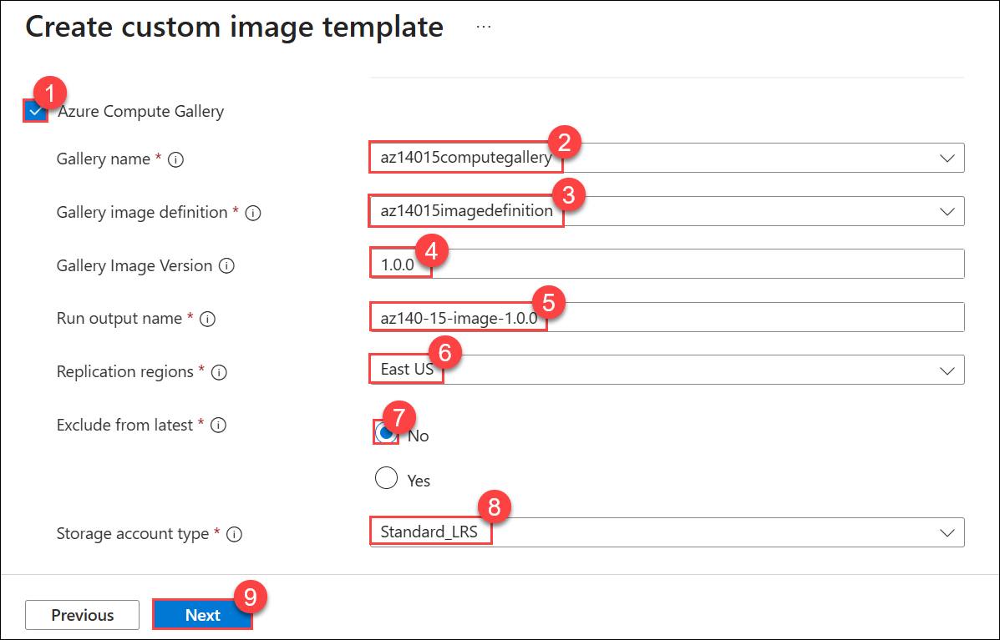  

    > **Note:** You can use the **Replication regions** property to accommodate multi-region builds. Setting **Exclude from latest** to **Yes** would prevent this image version from being used when **latest** is specified as the version of the **ImageReference** element during VM creation.

1. On the **Build properties** tab of the **Create custom image template** page, specify the following settings (leave other settings with their default values) and select **Next (6)**:

    |Setting|Value|
    |---|---|
    |Build timeout|**120 (1)**|
    |Build VM size|Click on **See all sizes (2)** option and select **Standard_DC2s_v3 (3)** from the list|
    |OS disk size (GB)|**127 (4)**|
    |Staging group|**az140-15c-RG (5)**|

    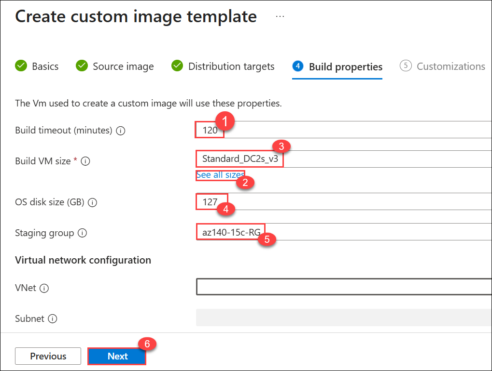
  
    > **Note:** **Staging group** is the resource group used to stage resources to build the image and store logs. If you don't provide its name, it will be automatically generated. If the **VNet** name is not set, a temporary one is created, along with a public IP address for the VM used to create the build.

    > **Important:** Ensure that you have sufficient number of available vCPUs for the Build VM size you specified. If not, either choose a different size or request quota increase.

1. On the **Customization** tab of the **Create custom image template** page, select **+ Add built-in script (1)**.

    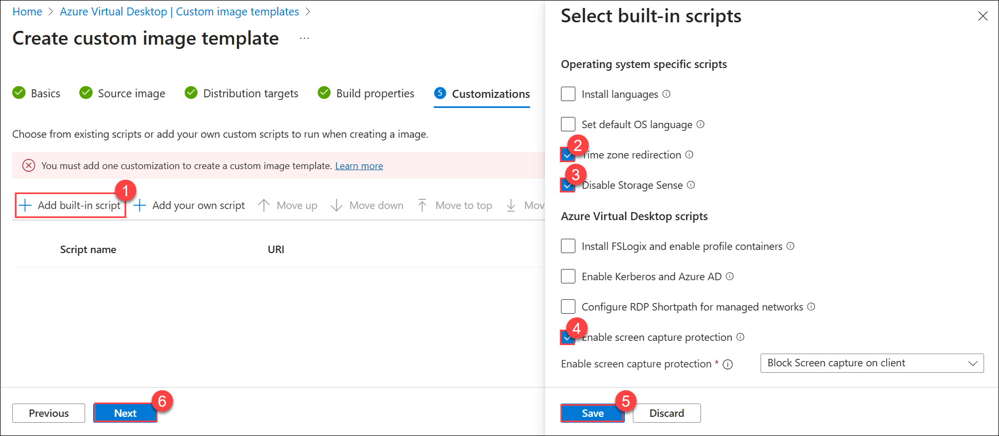

1. In the **Select built-in scripts** pane, review the available options grouped into operating system specific scripts, Azure Virtual Desktop scripts, MSIX App Attach scripts, Application scripts, and Windows Updates-related scripts, and then select the following entries:

   - **Time zone redirection (2)**: allows the client to use its time zone within a session on session hosts
   - **Disable Storage Sense (3)**: prevents Storage Sense from negatively affecting session hosts by falsely detecting low free disk space conditions
   - **Enable screen capture protection (4)** with **Block Screen capture on client and server**: blocks or hides remote content in screenshots and screen sharing

1. In the **Select built-in scripts** pane, select **Save (5)**.

    > **Note:** You have the option of adding your own scripts. For examples, consider referencing the built-in scripts, such as [Time zone redirection](https://raw.githubusercontent.com/Azure/RDS-Templates/master/CustomImageTemplateScripts/CustomImageTemplateScripts_2024-03-27/TimezoneRedirection.ps1), [Disable Storage Sense](https://raw.githubusercontent.com/Azure/RDS-Templates/master/CustomImageTemplateScripts/CustomImageTemplateScripts_2024-03-27/DisableStorageSense.ps1), or [Enable screen capture protection](https://raw.githubusercontent.com/Azure/RDS-Templates/master/CustomImageTemplateScripts/CustomImageTemplateScripts_2024-03-27/ScreenCaptureProtection.ps1).

1. Back on the **Customization** tab of the **Create custom image template** page, select **Next (6)**.
1. On the **Tags** tab of the **Create custom image template** page, select **Next**.

1. On the **Review + create** tab of the **Create custom image template** page, select **Create**.

    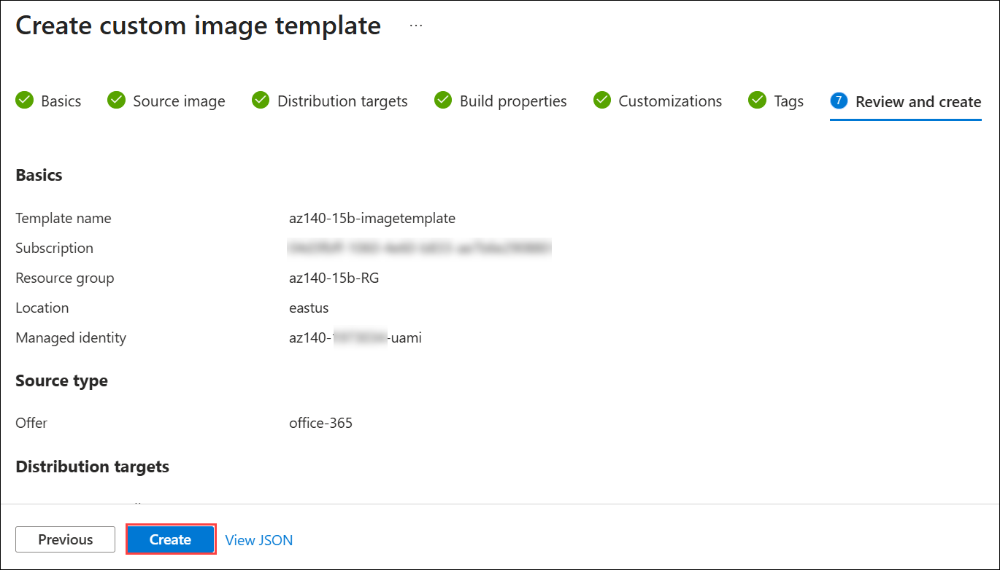

    > **Note:** Wait for the template to be created. This might take a few minutes. Refresh the **Azure Virtual Desktop \| Custom image templates** page to review the template status.

> **Congratulations** on completing the task! Now, it's time to validate it. Here are the steps:
>
> - Hit the Validate button for the corresponding task. If you receive a success message, you can proceed to the next task.
> - If not, carefully read the error message and retry the step, following the instructions in the lab guide.
> - If you need any assistance, please contact us at cloudlabs-support@spektrasystems.com. We are available 24/7 to help.
<validation step="381db74c-9895-43ac-b853-a756fac1a8ab" />

### Task 7: Build a custom image

In this task, you run the image build process, monitor its progress, and verify that the finalized custom image is published to the Azure Compute Gallery.

> **Note:** The remaining tasks of this lab are optional since they involve a fairly extensive wait time. 

1. In the Azure portal, on the **Azure Virtual Desktop \| Custom image template** page, select **az140-15b-imagetemplate**.

1. On the **az140-15b-imagetemplate** page, select **Start build**.

    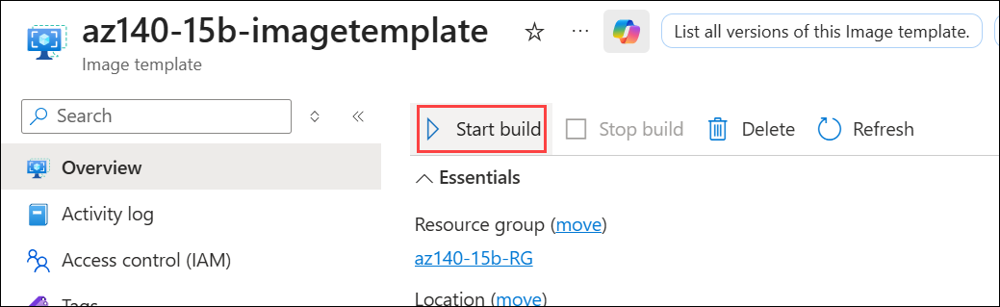

    > **Note:** Wait for the build to be created. The actual time to complete the build process might vary, but with the settings provided in the lab instructions, it should complete within 45 minutes. Refresh the page every few minutes and monitor the **Build run state** value in the **Essentials** section of the **az140-15b-imagetemplate** page. 

    > **Note:** The build run state should change at some point from **Running - Building** to **Running - Distributing** and finally to **Succeeded**.

    > **Note:** While waiting for the build to complete, review the content of the staging resource group **az140-15c-RG**, where the build resources, including the bulid virtual machine, a virtual network, network security group, key vault, snapshot, container instance, and storage account are automatically provisioned. 

1. In the Azure portal, search for and select **Resource groups** and, on the **Resource groups** page, select **az140-15c-RG**.

1. On the **az140-15c-RG** page, in the **Resources** section, note the auto-provisoned resources.

1. Return to the **az140-15b-imagetemplate** page and monitor the build progress. 

    > **Note**: Alternatively, you can use **Activity Log** to keep track of the completion of the build process. The action you should focus on is **Execute a VM image template to produce its output**. Its status should change at some point from **Accepted** to **Succeeded**.

1. Once the build completes, In the Azure portal, search for and select **Azure compute galleries** and, on the **Azure compute galleries** page, select **az14015computegallery**. 

1. On the **az14015computegallery**, on the **Definitions** tab, select **az14015imagedefinition**.

1. On the **az14015imagedefinition** page, on the **Versions** tab, review the information about the **1.0.0 (latest version)** image.

### Task 8: Deploy session hosts by using a custom image

In this task, you deploy new Azure Virtual Desktop session hosts using your custom image, validating that the image is functional.

> **Note:** Optionally, consider stepping through the initial stages of deploying Azure Virtual Desktop session hosts by using the custom image you created. 

1. In the Azure portal, search for and select **Virtual networks** and, on the **Virtual networks** page, select **Create +**

    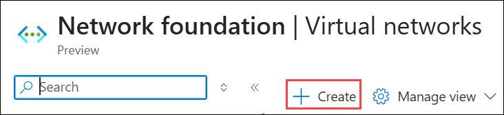

1. On the **Basics** tab of the **Create virtual network** page, specify the following settings and select **Next (4)**:

    |Setting|Value|
    |---|---|
    |Subscription|Choose the default subscription|
    |Resource group|Select **Create new (1)** and specify the resource group name as **az140-15d-RG (2)**|
    |Virtual network name|Specify **az140-vnet15d (3)**|
    |Region|**<inject key="Region" enableCopy="false" />**|

    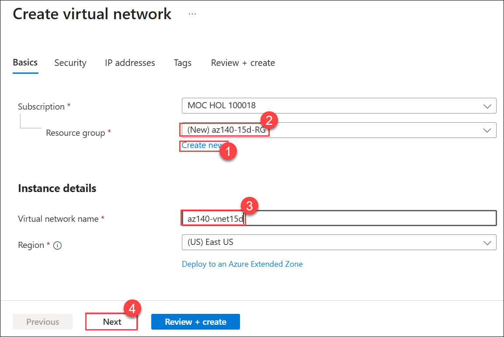

1. On the **Security** tab, accept the default settings and select **Next**.

1. On the **IP addresses** tab, specify the following settings:

    |Setting|Value|
    |---|---|
    |IP address space |**10.30.0.0/16**|

    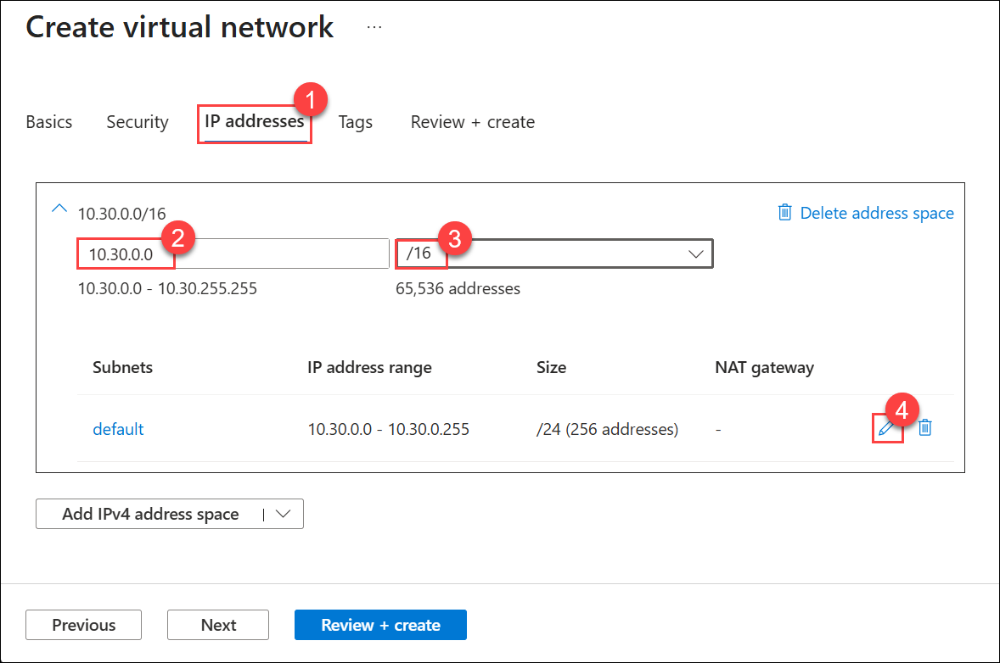

1. Select the edit (pencil) icon next to the **default** subnet entry, in the **Edit** pane, specify the following settings (leave others with their existing values) and select **Save (3)**:

    |Setting|Value|
    |---|---|
    |Name|**hp1-Subnet (1)**|
    |Starting address|**10.30.1.0 (2)**|
    |Enable private subnet (no default outbound access)|Disabled|

    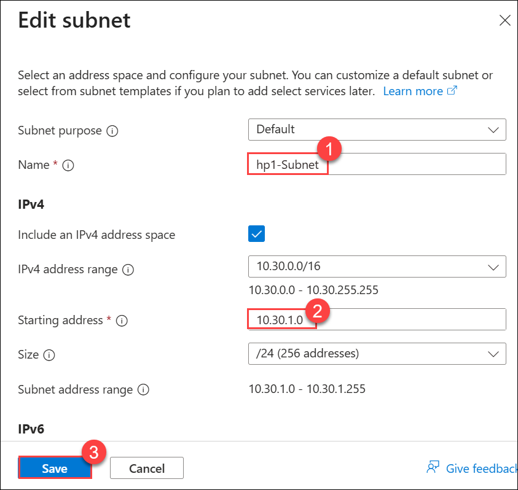

1. Back on the **IP addresses** tab, select **Review + create** and then select **Create**.

    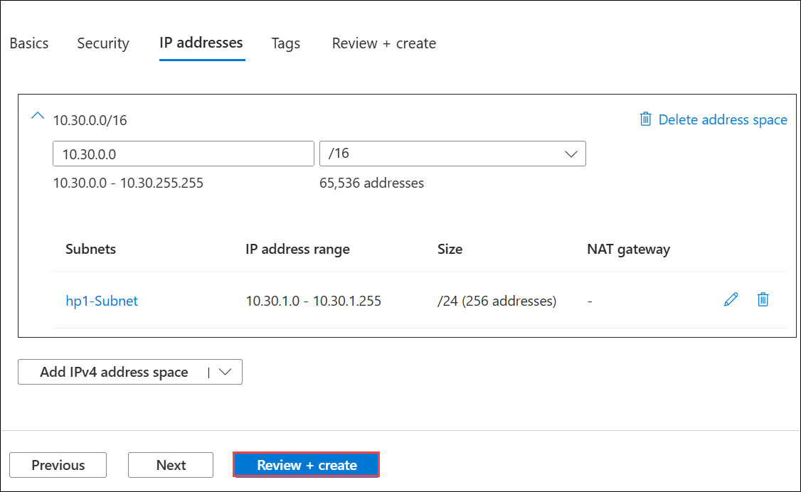

    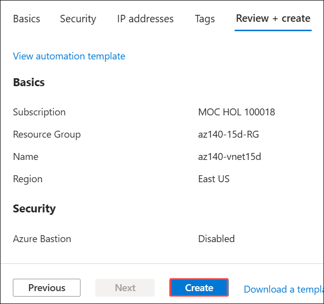

    > **Note:** Wait for the provisioning process to complete. This typically takes less than 1 minute.

1. In the Azure portal, search for and select **Azure Virtual Desktop**, on the **Azure Virtual Desktop** page, in the **Manage (1)** section of the vertical navigation menu, select **Host pools (2)** and, on the **Azure Virtual Desktop \| Host pools** page, select **+ Create (3)**. 

    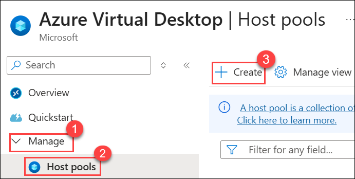

1. On the **Basics** tab of the **Create a host pool** page, specify the following settings and select **Next : Session hosts > (9)** (leave other settings with their default values):

    |Setting|Value|
    |---|---|
    |Subscription|Choose the default subscription|
    |Resource group|Select **az140-15d-RG (1)**|
    |Host pool name|Specify **az140-15-hp1 (2)**|
    |Location|**<inject key="Region" enableCopy="false" /> (3)**|
    |Validation environment|**No (4)**|
    |Preferred app group type|**Desktop (5)**|
    |Host pool type|**Pooled (6)**|
    |Create Session Host Configuration|**No (7)**|
    |Load balancing algorithm|**Breadth-first (8)**|

    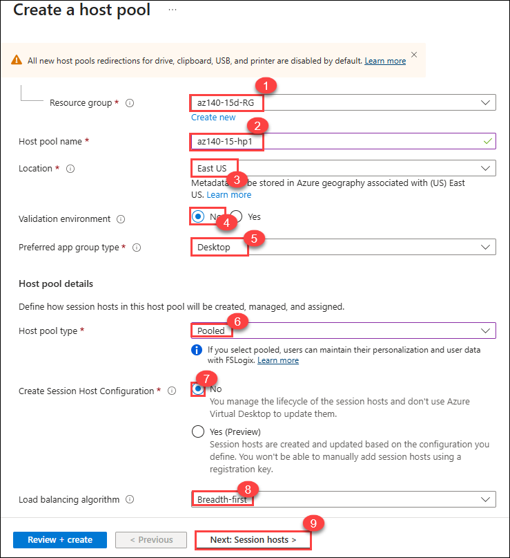

    > **Note:** When using the Breadth-first load balancing algorithm, the max session limit parameter is optional.

1. On the **Session hosts** tab of the **Create a host pool** page, specify the following settings (leave other settings with their default values):

    |Setting|Value|
    |---|---|
    |Add virtual machines|**Yes (1)**|
    |Resource group|**Defaulted to same as host pool (2)**|
    |Name prefix|**sh0<inject key="DeploymentID" enableCopy="false"/> (3)**|
    |Virtual machine type|**Azure virtual machine (4)**|
    |Virtual machine location|**<inject key="Region" enableCopy="false" /> (5)**|
    |Availability options|**No infrastructure redundancy required (6)**|
    |Security type|**Trusted launch virtual machines (7)**|

    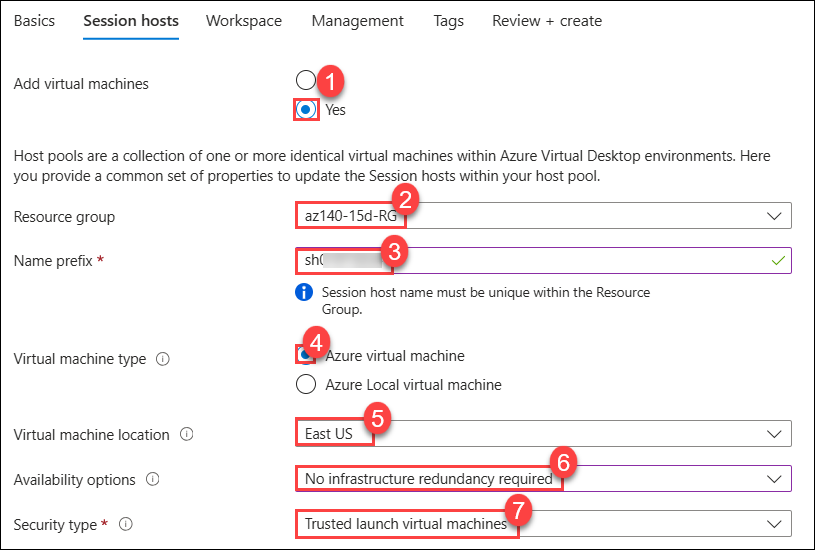

1. On the **Virtual machines** tab of the **Create a host pool** page, below the **Image** drop-down list, select **See all images (8)**.

1. On the **Select an image** page, select **Shared images** and, in the list of images, select **az14015imagedefinition (9)**. 

    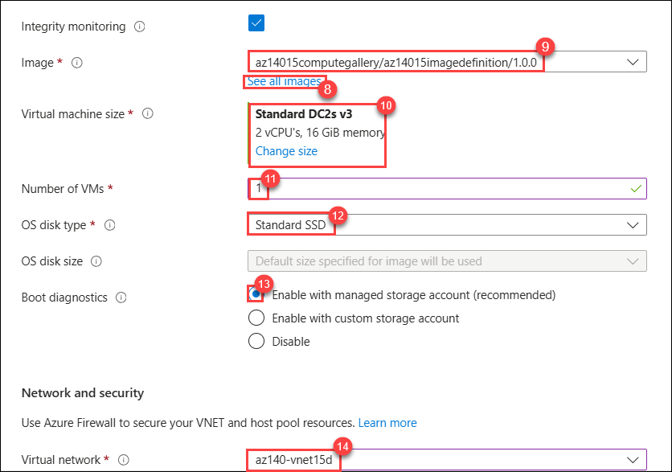

1. Back on the **Virtual machines** tab of the **Create a host pool** page, specify the following settings and select **Next : Workspace > (24)** (leave other settings with their default values):

    |Setting|Value|
    |---|---|
    |Virtual machine size|**Standard DC2s_v3 (10)**|
    |Number of VMs|**1 (11)**|
    |OS disk type|**Standard SSD (12)**|
    |OS disk size|**Default size**|
    |Boot Diagnostics|**Enable with managed storage account (recommended) (13)**|
    |Virtual network|Select **az140-vnet15d (15)**|
    |Subnet|**hp1-Subnet (16)**|
    |Network security group|**Basic (17)**|
    |Public inbound ports|**No (18)**|
    |Select which directory you would like to join|**Microsoft Entra ID (19)**|
    |Enroll VM with Intune|**No (20)**|
    |User name|**Student (21)**|
    |Password|**Password.1!! (22)**|
    |Confirm password|**Password.1!! (23)**|

    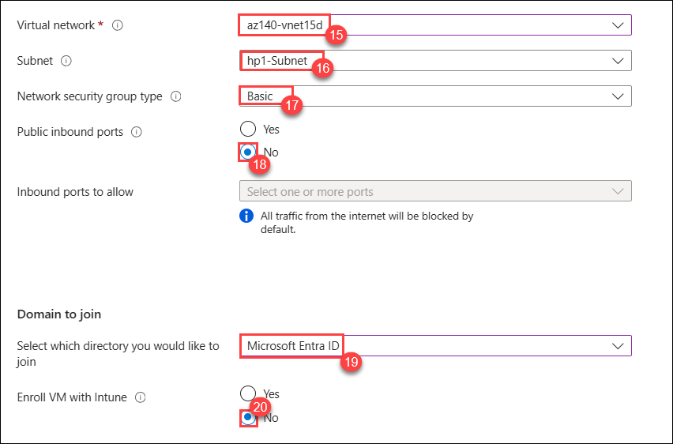

    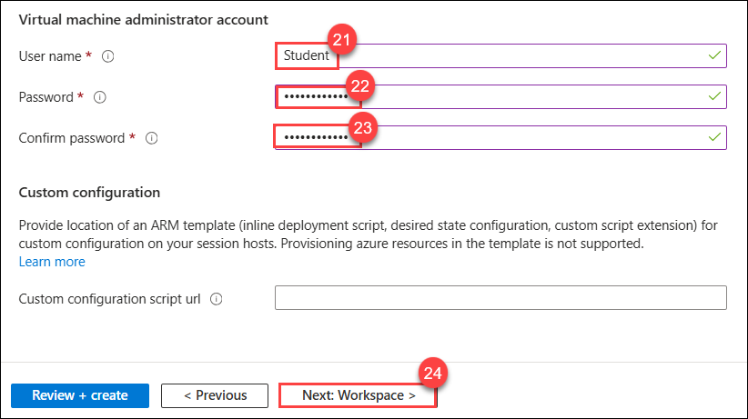

    > **Note:** The password should be at least 12 characters in length and consist of a combination of lower-case characters, upper-case characters, digits, and special characters. For details, refer to the information about [the password requirements when creating an Azure VM](https://learn.microsoft.com/en-us/azure/virtual-machines/windows/faq#what-are-the-password-requirements-when-creating-a-vm-).

1. On the **Workspace** tab of the **Create a host pool** page, confirm the following setting and select **Review + create (2)**:

    |Setting|Value|
    |---|---|
    |Register desktop app group|**No (1)**|

    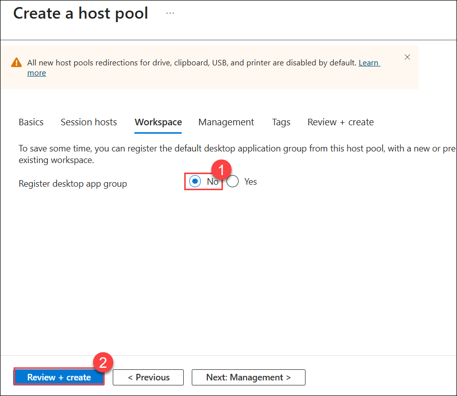

1. On the **Review + create** tab of the **Create a host pool** page, select **Create**.

    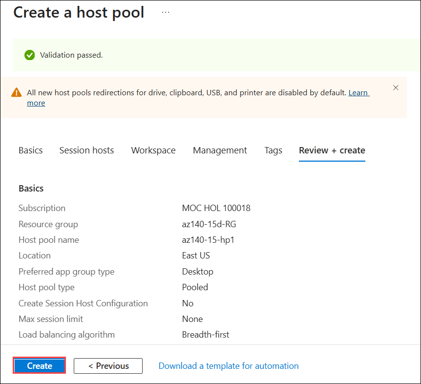

    > **Note:** Wait for the deployment to complete. This might take about 10-15 minutes.

> **Congratulations** on completing the task! Now, it's time to validate it. Here are the steps:
>
> - Hit the Validate button for the corresponding task. If you receive a success message, you can proceed to the next task.
> - If not, carefully read the error message and retry the step, following the instructions in the lab guide.
> - If you need any assistance, please contact us at cloudlabs-support@spektrasystems.com. We are available 24/7 to help.
<validation step="d0e8fe70-f56c-45cc-92ea-289b93274e28" />

### Summary

In this lab, you created a full custom image pipeline for Azure Virtual Desktop using Azure Image Builder and Azure Compute Gallery. You configured identities, permissions, image definitions, and customization scripts to automate image creation. Finally, you built the image and deployed new session hosts using the custom image to validate the end-to-end process.

**You have successfully completed the lab.**